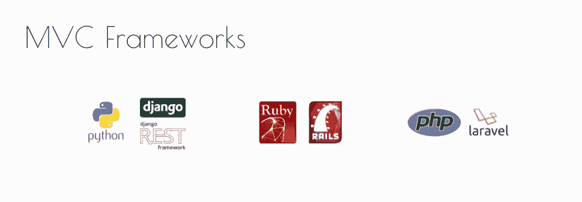
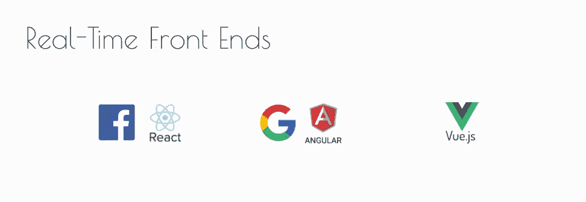

# 反应式网络开发简史

> 原文：<https://levelup.gitconnected.com/brief-history-of-reactive-web-dev-5dde7270cdf7>

## 在 MVC 应用程序开发和数据科学的背景下

(图片来源:[pexels . com/photo/gray-Newton-s-cradle-in-close-up-photogaphy-60582](https://www.pexels.com/photo/gray-newton-s-cradle-in-close-up-photogaphy-60582/))

> 这个帖子是 [**仪表盘比**](https://aiqc.medium.com/dash-is-deeper-than-dashboards-5ab7414f121e) 仪表盘更深的序幕。

当 [*Node.js*](https://en.wikipedia.org/wiki/Node.js) 在 2009 年发布时，人们普遍猜测——考虑到 JavaScript 先前存在的前端优势和 Node 新的后端功能——我们都成为 *fullstack* JS 开发人员只是时间问题。然而，这一未来从未实现。

# ☯️后端/前端鸿沟

(图片由作者提供)

像脸书和 Twitter 这样的主要 Web 2.0 玩家正忙于构建其他语言，如*PHP*(Web 后端的守旧派)和 *Ruby —* ，在这些语言中，模型-视图-控制器(MVC)框架，如 PHP-Laravel、Rails-Ruby 和 Python-Django(当时并不突出)极大地简化了应用程序开发过程。

(图片由作者提供)

大约就在这个时候，网络开始从静态内容向实时内容转变。聊天、点赞、评论、&深度滚动提要等社交功能需要更具互动性的体验，这将 jQuery & AJAX 等工具推向了极限。仅仅为了检查任何潜在的新数据而必须对网页进行完整的 F5 状态刷新，这种做法不再被接受。这是一个高度不确定的时代，每周都有新的 JS 框架出来，非常时髦。它最终引发了谷歌 Angular 和脸书 React 之间争夺单页面应用统治地位的大战，后者最终占据了上风。Vue 也成为更轻量级的两全其美的产品。也为那些害怕在方沙盒里玩被晃的人提供了一个替代选择。

# 😵‍💫石油和水

在故事的这一点上，我们已经有了很棒的后端工具&很棒的前端工具。唯一的问题是让他们一起工作完全是一件麻烦事。

学会了在 Laravel 上编程，在 Rails 上建立了我的第一个创业公司，并使用不同的数据存储和 REST API 框架一起开发了许多 Django 应用程序——我开发的应用程序变得越来越先进，我对一次性 AJAX 查询和 Jinja 手柄的局限性感到沮丧。然而，每当我试图将 React、Vue 或 Angular 集成到我的 Django 应用程序中时，我都会感到沮丧。在我看来，这些后端和前端框架只是*没有被设计成一起工作*，最好等待一个让它更直观的框架。

# 📊云分析颠覆了一切

与此同时，*分析空间*正在动摇应用开发的基础:

*   像 AWS S3 这样的行星级对象存储库的兴起导致了传统 SQL 数据库的重大转变。这实质上取消了 MVC 模式中关系模型组件的作用。
*   *无服务器*和分布式容器化技术不鼓励*单片*应用程序，而支持*微服务*架构。
*   *D3.js* 授权数据科学家构建*交互式可视化*。Plotly 图表简化了这一过程。
*   Python 生态系统激增到最前沿，并开始主导似乎每个编程用例，尤其是机器学习。为其他编程语言寻找人才变得更加困难。

# ✨ R 闪亮

(图片由作者提供)

> 霍比特人真的是令人惊奇的生物…你可以在一个月内学会所有关于他们生活方式的知识，然而一百年后，他们仍然会在紧要关头给你惊喜。”—甘道夫/托尔金

从长远来看，也许是最低调、最出人意料的球员最有可能改变游戏规则。 *R* 被称为传统统计学家的编程语言。据我所知，它没有 web 框架。他们说“需要是发明之母”，在研发 [**R 闪亮**](https://shiny.rstudio.com/) 的过程中确实如此。

随着像 *RStudio* 、 *iPython* / *Jupyter、& Spyder* 这样的数据科学 IDEs 开始显示越来越高级的可视化效果，研究人员显然需要一种与仪表板进行交互的方式，以便快速向团队传达见解。幸运的是，RStudio 背后的企业部门拥有支持这一努力的资源，他们在 2012 年发布了 Shiny。闪亮 app 的结构如下:

*   在`server.R`文件中定义逻辑(回调函数)。
*   在`app.R`中定义仪表板布局

> *📚如果想了解更多，我推荐这本书，* [*Web 应用开发用闪亮*](https://www.amazon.com/Application-Development-Using-Shiny-visualizations/dp/1788993128/ref=sr_1_1?crid=32KKOB61MNNT0&keywords=packt+shiny&qid=1648922134&sprefix=packt+shiny%2Caps%2C116&sr=8-1) *(Beeley，Sukhdeve)。*

**的商业臂 Plotly** 直到 [2017](https://medium.com/plotly/introducing-dash-5ecf7191b503#:~:text=Plotly%20is%20a%20VC%2Dbacked,MATLAB%20that%20interface%20with%20plotly) 才释放 **Dash** 。因此，Dash 只是一个执行得非常好的闪亮克隆，并添加了:

*   不仅支持 Python，还支持 R 和后来的 Julia。
*   做包装的艰苦工作反应。

**更新:** RStudio 正在更名为“Posit”，更加关注多语言能力，据传将为 Python 发布 *Shiny。我想我们也会看到朱莉娅闪闪发光。*

继续阅读: [**仪表盘比仪表盘更深**](https://aiqc.medium.com/dash-is-deeper-than-dashboards-5ab7414f121e) 。