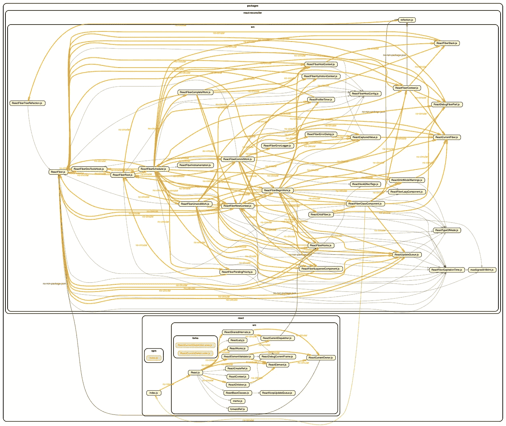
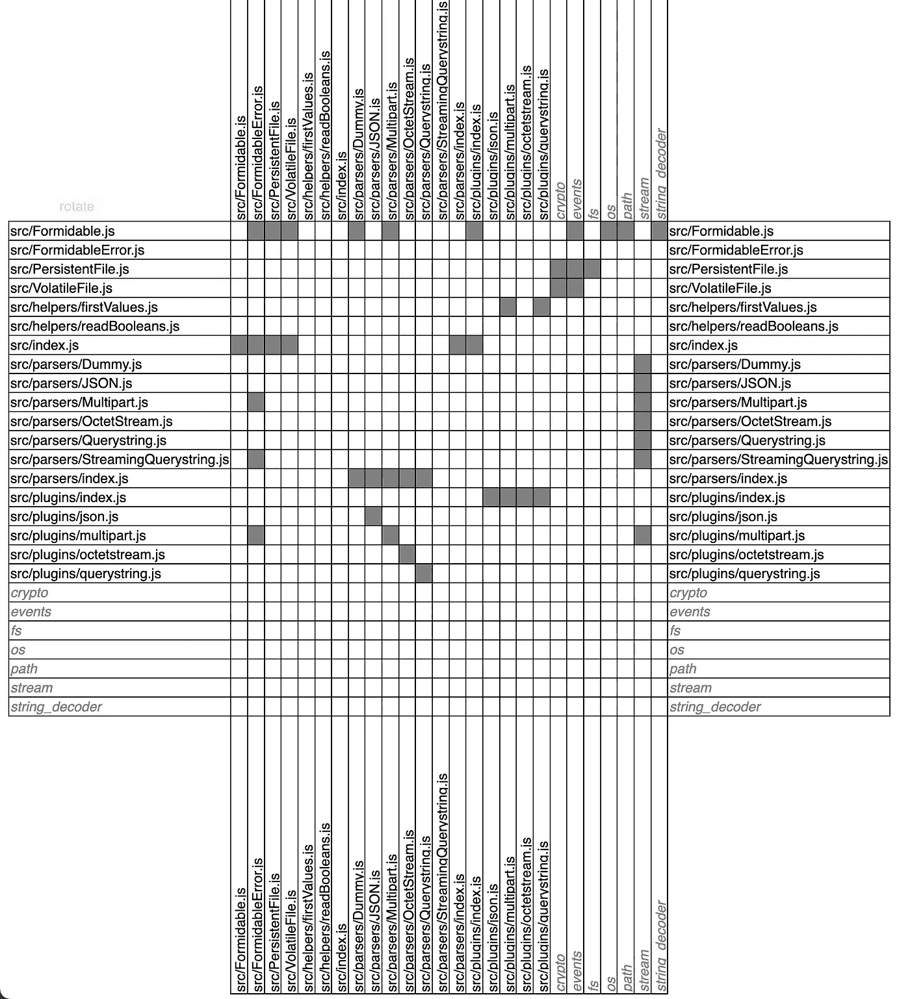
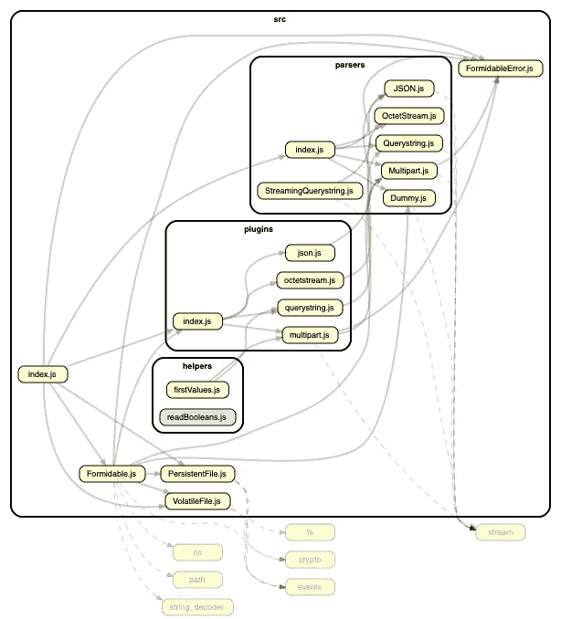
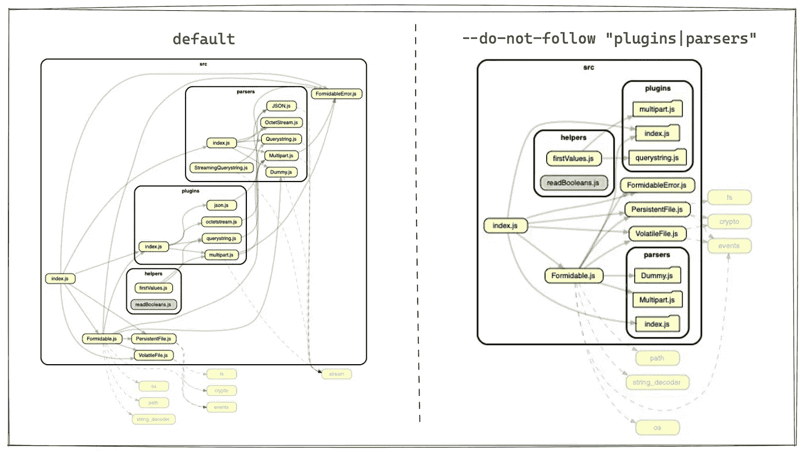
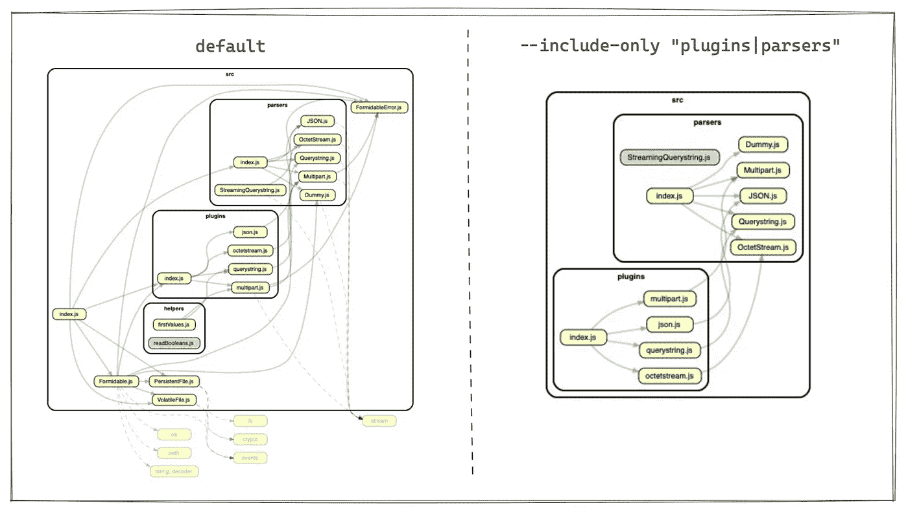
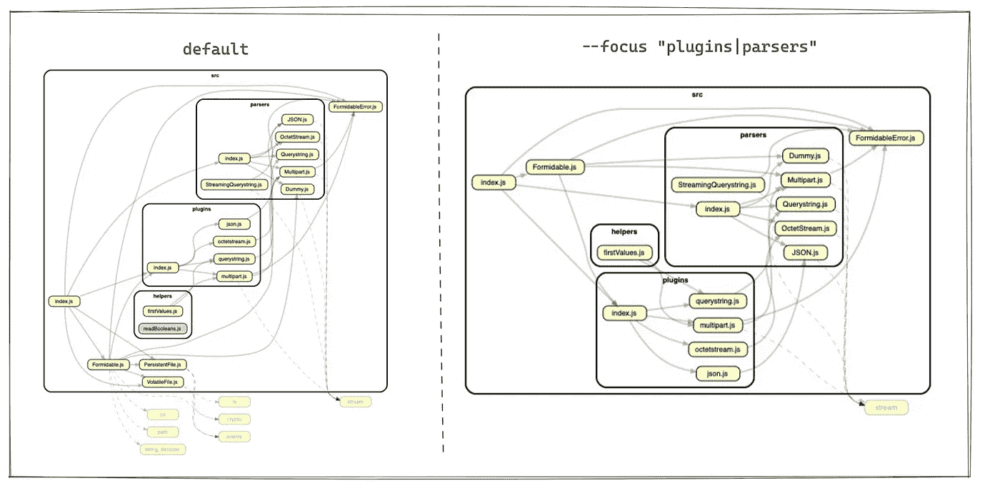
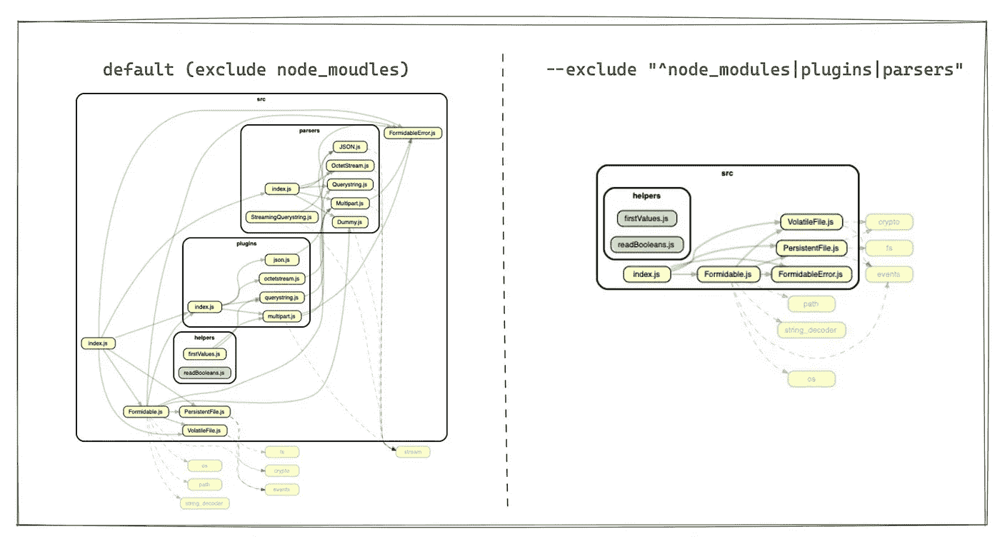

# 从属巡洋舰简介

> 原文：<https://levelup.gitconnected.com/brief-introduction-of-dependency-cruiser-7e38a41afa4f>

## 验证和可视化代码的依赖性



反应的依赖者

## 前言

如果我们想知道代码是否是多余的，或者依赖项是否没有被安装等等。我们可以使用[依赖浏览器](https://www.npmjs.com/package/dependency-cruiser)来分析目录或文件的依赖关系，这些依赖关系可以通过 [graphviz](https://www.graphviz.org/about/) 可视化。

在这篇文章中，我们将看看如何使用依赖巡洋舰。

## 如何使用依赖巡洋舰

我们可以用`npm i -g dependency-cruiser`在全球范围内安装[依赖巡洋舰](https://www.npmjs.com/package/dependency-cruiser)(建议在本地安装)。然后进入我们想要分析的项目的文件夹，作为一个例子，我们可以在[强大的](https://www.npmjs.com/package/formidable)中运行下面的命令:

```
depcruise --exclude "^node_modules" --output-type html src > dependencies.html
```

这将生成一个 html 文件`dependencies.html`,如下所示



[依赖巡洋舰](https://www.npmjs.com/package/dependency-cruiser)支持多种类型的输出，如`html`、`json`、`dot`、`text`等。你可以参考这篇[文章](https://github.com/sverweij/dependency-cruiser/blob/HEAD/doc/cli.md#--output-type-specify-the-output-format)来了解其他支持的类型。

## concert dependency-cruiser with graphviz

作为输出类型的`dot`将使 dependency-cruiser 编写一个 [graphviz](https://www.graphviz.org/about/) 点格式的有向图。我们可以用 [graphviz](https://www.graphviz.org/about/) 到把它形象化。但是我们必须额外安装 graphviz。

在 MacOS 中，我们可以使用`brew`来安装它:

```
brew install graphviz
```

然后我们可以输出图形可视化:

```
depcruise --exclude "^node_modules" --output-type dot src | dot -T jpg > dependencies.jpg
```



dependencies.jpg

如果我们想输出其他格式的图形，替换`dot -T [format]`的格式类型，例如我们生成一个 pdf 文件:

```
depcruise --exclude "^node_modules" --output-type dot src | dot -T pdf > dependencies.pdf
```

graphviz 支持的所有输出类型都可以引用[https://www.graphviz.org/docs/outputs/](https://www.graphviz.org/docs/outputs/)。

## 从属巡洋舰的主要选择

有时，我们可能不关心一些目录，并希望排除它们。有 4 个选项可以做到:

1.  `[--do-not-follow](https://github.com/sverweij/dependency-cruiser/blob/HEAD/doc/cli.md#--do-not-follow-dont-cruise-modules-adhering-to-this-pattern-any-further)` [:不要再巡航坚持这种模式的模块](https://github.com/sverweij/dependency-cruiser/blob/HEAD/doc/cli.md#--do-not-follow-dont-cruise-modules-adhering-to-this-pattern-any-further)
2.  `[--include-only](https://github.com/sverweij/dependency-cruiser/blob/HEAD/doc/cli.md#--include-only-only-include-modules-satisfying-a-pattern)` [:仅包含满足模式](https://github.com/sverweij/dependency-cruiser/blob/HEAD/doc/cli.md#--include-only-only-include-modules-satisfying-a-pattern)的模块
3.  `[--focus](https://github.com/sverweij/dependency-cruiser/blob/HEAD/doc/cli.md#--focus-show-modules-and-their-neighbours)` [:显示模块及其邻居](https://github.com/sverweij/dependency-cruiser/blob/HEAD/doc/cli.md#--focus-show-modules-and-their-neighbours)
4.  `[--exclude](https://github.com/sverweij/dependency-cruiser/blob/HEAD/doc/cli.md#--exclude-exclude-dependencies-from-being-cruised)` [:排除被巡览的依赖关系](https://github.com/sverweij/dependency-cruiser/blob/HEAD/doc/cli.md#--exclude-exclude-dependencies-from-being-cruised)

我将制作一些图片来帮助理解这种不同。

1.  `[--do-not-follow](https://github.com/sverweij/dependency-cruiser/blob/HEAD/doc/cli.md#--do-not-follow-dont-cruise-modules-adhering-to-this-pattern-any-further)`如果匹配此模式，将停止巡航子模块。



2.`[--include-onl](https://github.com/sverweij/dependency-cruiser/blob/HEAD/doc/cli.md#--include-only-only-include-modules-satisfying-a-pattern)y`只包含满足模式的模块，在这个演示中是插件和解析器目录。



3.`[--focus](https://github.com/sverweij/dependency-cruiser/blob/HEAD/doc/cli.md#--focus-show-modules-and-their-neighbours)`将包含模块和依赖或依赖关系。



4.`[--exclude](https://github.com/sverweij/dependency-cruiser/blob/HEAD/doc/cli.md#--exclude-exclude-dependencies-from-being-cruised)`将删除匹配模式模块及其子模块。



## 结论

在本文中，我们将学习如何使用[依赖浏览器](https://www.npmjs.com/package/dependency-cruiser)来分析项目的依赖关系，并且我们可以使用 [graphviz](https://www.graphviz.org/about/) 来进行依赖关系的图形可视化。dependency-cruiser 支持许多有用的选项来帮助我们关注我们关心的模块。如果我们想重构代码，这个工具会很有帮助。