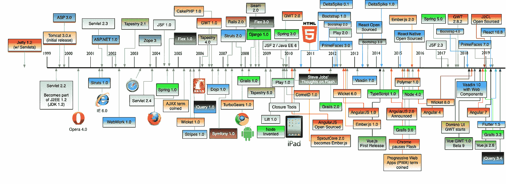

# 微前端架构介绍

> 原文：<https://levelup.gitconnected.com/brief-introduction-to-micro-frontends-architecture-ec928c587727>



[https://github . com/mraible/history-of-web-frameworks-timeline](https://github.com/mraible/history-of-web-frameworks-timeline)

随着前端世界的发展，其架构解决方案也应该发展。微前端背后的主要思想是前端应用程序的独立部分可以由独立的团队来维护。

> “一种架构风格，其中可独立交付的前端应用程序被组合成一个更大的整体”

# 传统建筑


# 微服务优势

*   去耦代码库
*   自主团队
*   与技术和框架无关
*   独立部署
*   可量测性
*   复用性

# 也在前端上尝试一下

与微服务具有相同的优势，但如果与后端微服务相结合，则是端到端团队。


> ***因为你可以使用不同的框架和技术，但这并不意味着你必须这样做。***

# 何时使用微前端

*   巨大的代码库，不同的团队都参与其中
*   代码所有权变得混乱
*   由于应用程序的其他部分，部署被延迟
*   你喜欢使用不同的有限元框架

# 管弦乐编曲

通过编排，应该可以将不同的微前端组合成一个功能应用程序。这既可以在服务器端完成，也可以在客户端完成。为了获得最佳性能，我们应该将这些方法结合起来。

还有一个解决方案叫做**构建时集成**。

## 构建时间集成

*   每个微前端应用代表一个 npm 包
*   主应用程序(orchestrator/container)将自己构建成一个包含所有依赖项(微前端)的最终包

这似乎有道理，但不推荐**使用**，因为它有一个很大的缺点。每当一个微前端应用程序发生变化时，整个 orchestrator 及其所有依赖项都应该重新构建并创建一个新版本。这可能会导致每个微前端的延迟、回滚或错误，这是我们希望避免的。另外，每个团队都应该依赖于相同的包版本，这使得创建新版本变得更加困难。

# 1.客户端编排

*   客户端路由
*   状态共享
*   注册所有应用程序
*   解决共享依赖关系(如果有)
*   初始化主应用程序
*   从不同的微前端应用程序合成片段

您可以通过使用不同的库来完成此列表，例如:

*   单 spa[https://single-spa.js.org/](https://single-spa.js.org/)(顶级路由器)
*   http://mnot.github.io/hinclude/(包括 HTML 片段)
*   h-include[https://github.com/gustafnk/h-include](https://github.com/gustafnk/h-include)(包括使用 Web 组件的 HTML 片段)

片段组合可以通过对不同 API 的简单 Ajax 调用来完成，这些 API 可以返回预先呈现的 HTML，这些 HTML 可以在前端进行水合，或者只返回所需的脚本标签和带有 ID 的特定 HTML 标签，其中加载的片段可以呈现自身。

也有可能使用普通的 JS 或者一些框架来实现你自己的编排。

# 1.1.按指定路线发送

1.  使用[历史 API](https://developer.mozilla.org/en-US/docs/Web/API/Window/history) 在应用路由器中初始化
2.  [自定义浏览器事件](https://developer.mozilla.org/en-US/docs/Web/API/CustomEvent/CustomEvent)或 [PubSub](https://github.com/mroderick/PubSubJS) 库
3.  将路由留在 Orchestrator 应用程序上

# 1.2.共享全局状态并在应用程序之间进行通信

1.  在这种情况下，具有每个微前端的导出公共状态的可观察模式— [RxJS](https://rxjs-dev.firebaseapp.com/) 很有用
2.  [自定义浏览器事件](https://developer.mozilla.org/en-US/docs/Web/API/CustomEvent/CustomEvent)
3.  Cookies、会话或本地存储

# 1.3.共享代码——主要是 UI 库

1.  在第三方库的情况下，你应该使用一个支持你的微前端中所有使用的框架的库
2.  如果你正在开发自己的库，你可以使用 [Web 组件](https://www.webcomponents.org)使它们通用
3.  开发和维护这个库的责任应该由每个团队承担，不要为此创建一个特定的团队

# 1.4.风格冲突

1.  为每个团队确定 CSS 类的特定前缀
2.  使用[边界元样式](http://getbem.com/)
3.  在 JS 库中使用 CSS 可以帮助你避免冲突——JSS[、](https://cssinjs.org)[风格化组件](https://www.styled-components.com/)等等。
4.  [阴影 DOM](https://developer.mozilla.org/en-US/docs/Web/Web_Components/Using_shadow_DOM) 来自 [Web 组件](https://www.webcomponents.org)

# 1.5.徐和 UX

1.  [框架 UI](https://uxdesign.cc/engaging-users-with-progressive-loading-in-skeleton-screen-335a4e287a55)——基本上是一个预定义的闪屏，用于显示尚未加载的内容
2.  借助 ESI 或 SSI 的服务器端呈现(在服务器端编排中描述)

# 1.6.拯救世界的 Web 组件

它们由 4 个规范定义。

## 1.6.1.自定义元素

*   [https://w3c.github.io/webcomponents/spec/custom/](https://w3c.github.io/webcomponents/spec/custom/)

[定制元素](https://developer.mozilla.org/en-US/docs/Web/API/Window/customElements) API 允许你用生命周期方法、属性改变处理程序、事件处理程序等创建全功能的定制 HTML 元素。

创建自定义元素的过程:

*   创建一个扩展 HTMLElement 类的类
*   定义您的生命周期方法、自定义属性等。
*   将新元素与 HTML 模板相关联(在 *connectedCallback()* 生命周期方法中)
*   使用[自定义元素 API](https://developer.mozilla.org/en-US/docs/Web/API/Window/customElements) 注册该元素
*   在你的 HTML 中使用这个元素

## 1.6.2.阴影 DOM

*   [https://w3c.github.io/webcomponents/spec/shadow/](https://w3c.github.io/webcomponents/spec/shadow/)
*   [https://developer . Mozilla . org/en-US/docs/Web/Web _ Components/Using _ shadow _ DOM](https://developer.mozilla.org/en-US/docs/Web/Web_Components/Using_shadow_DOM)

```
Element.attachShadow();
```

`attachShadow`方法只接受一个参数，该参数是具有一个属性*模式*的对象。它允许你用两种模式创建隔离的 DOM 树(作用域样式，自包含组件)，*打开*和*关闭*。

*Open* 意味着您可以使用在主页面上下文中编写的 JavaScript 访问影子 DOM。另一方面， *closed* 意味着只能通过自定义元素上下文中的 Javascript 访问影子 DOM。当你必须隔离你的 CSS 时，这真的很有用。

## 1.6.3.ES 模块

*   [https://html . spec . whatwg . org/multipage/web app APIs . html # integration-with-the-JavaScript-module-system](https://html.spec.whatwg.org/multipage/webappapis.html#integration-with-the-javascript-module-system)

导入/导出 JS 模块，仅此而已。

## 1.6.4.HTML 模板

*   [https://html . spec . whatwg . org/multipage/scripting . html # the-template-element/](https://html.spec.whatwg.org/multipage/scripting.html#the-template-element/)
*   [https://html . spec . whatwg . org/multipage/scripting . html # the-slot-element](https://html.spec.whatwg.org/multipage/scripting.html#the-slot-element)

使用 HTML 模板(`<template>`)，你可以创建不在加载时呈现的 HTML 片段，但是你可以在运行时通过 JavaScript 初始化它们。

另一个有用的元素是`<slot>`。它是 web 组件技术的一部分，用作 Web 组件中的占位符，您可以用自己的标记填充它。

结果是:


因此，定义的具有属性 *slot* 的 ***span*** 元素在具有属性 *name* 的 *slot* 元素中得到呈现，其值与我们的 ***span*** 元素上的 *slot* 属性值相匹配。

# 2.服务器端编排

*   具有代理请求的服务器路由
*   注册所有应用程序
*   解决共享依赖关系(如果有)
*   从不同的微前端应用程序提供和编写片段

# 2.2.引导应用程序

我们可以将服务器端编排的解决方案称为引导应用程序。它可以用不同的方法来完成，通常它更复杂，包含不止一个解决方案。我将描述大公司是如何做到这一点的。

## 2.2.1.扎兰多斯溶液


[https://www.zalando.com](https://www.zalando.com)

它被称为 https://www.mosaic9.org/马赛克项目。


用例就像你在图片上看到的一样简单。用户来到页面，浏览器点击路由器，路由器决定它是 API 调用还是布局调用。在 API 调用的情况下，路由器将请求代理给所需的 API。在层调用的情况下，路由器调用知道所有可能布局的布局服务，并从不同的端点加载它们。

正如您在下图中看到的，他们已经创建了开源项目来完成所有描述的步骤。


## 2.2.2.OpenTables 解决方案


[https://www.opentable.com/](https://www.opentable.com/)

他们称之为开放组件[https://opencomponents.github.io/](https://opencomponents.github.io/)。这个项目背后的想法是有一个组件注册表，其中包含公司中的所有组件，这些组件应该可用于 Node.js 呈现的服务器端。


## 2.2.3.Spotify 的解决方案


[https://www.spotify.com/](https://www.spotify.com/)

他们在一个单独的 iframe 中加载每个片段。为了通信和协调不同 iframes 之间的事件，他们使用事件总线。每个片段都有自己的依赖项和数据。这种解决方案的缺点是一些依赖项会被加载更多次。

## 2.2.4.达赞溶液


[https://dazn.com/](https://dazn.com/)

在前端，他们有自己的解决方案，非常类似于 https://single-spa.js.org/的单 spa [，在服务器端有一个引导层，它组成片段并处理不同路由的请求。](https://single-spa.js.org/)

## 2.2.5.脸书溶液


【https://www.facebook.com/ 

他们称之为 **BigPipe。**类似于 Zalandos solution 的 Tailor.js。实际上 Tailor.js 的灵感来自 facebook 的 BigPipe。你可以在这里阅读关于它如何工作的原始帖子[https://www . Facebook . com/notes/Facebook-engineering/big pipe-piping-web-pages-for-high-performance/389414033919/](https://www.facebook.com/notes/facebook-engineering/bigpipe-pipelining-web-pages-for-high-performance/389414033919/)。

# 2.3.碎片组合的可能性

现在谈谈服务器端片段组合的技术方面。有两种更老的技术，通过它们我们可以很容易地完成组合，**服务器端包括(SSI)** 和**边缘端包括** ( **ESI)。**它们用于将不同的 HTML 标记合并成一个。在这两种情况下，我们都需要维护一个对应于静态 HTML 文件的 URL 映射。

## 2.3.1.服务器端包含(SSI)

*   [http://www.alticore.eu/wasd_root/doc/env/env_0400.html](http://www.alticore.eu/wasd_root/doc/env/env_0400.html)
*   [https://www . owasp . org/index . PHP/Server-Side _ Includes _(SSI)_ Injection](https://www.owasp.org/index.php/Server-Side_Includes_(SSI)_Injection)
*   [https://www.w3.org/Jigsaw/Doc/User/SSI.html](https://www.w3.org/Jigsaw/Doc/User/SSI.html)
*   [http://httpd.apache.org/docs/current/howto/ssi.html#basic](http://httpd.apache.org/docs/current/howto/ssi.html#basic)
*   简单的解释型服务器端脚本语言
*   受 Apache、Nginx 等支持。

在主 html 文件中:

在 Nginx 配置中:

## 2.3.2.边缘侧包括(ESI)

*   [https://www.w3.org/TR/esi-lang](https://www.w3.org/TR/esi-lang)
*   小型标记语言
*   这只是一个从未成为标准的建议
*   由不同的技术或库支持(Nginx、Varnish 等。)
*   对于 NodeJS，有 [nodesi](https://www.npmjs.com/package/nodesi) npm 包

## 2.3.3.自己的实现

您可以在服务器端实现自己的解析器或某种标记助手。几乎每个模板库都有一些实现自定义标签解析的可能性。

# 3.微前端架构的缺点


https://twitter.com/TheLarkInn/status/1139281821810618369

*   更大的捆尺寸
*   较慢的加载时间
*   现有团队的团队组织变更
*   对小公司来说不必要的复杂

# 结论

通过分析问题来选择工具。不要试图用你最喜欢的工具来解决每个问题。

如果您选择微前端架构，您可以面向两个群体:

## **完全独立**

*   每个团队选择他们的**技术栈**——没有代码共享
*   每个片段都有自己的 API 调用
*   每个视图由**全功能片段**组成
*   每个微前端应用都有自己的 **CI/CD**

## **战略合作**

*   就技术堆栈达成一致，并且**共享公共**库
*   API 调用流经 **bootstrap** **app**
*   共享的 **UI 库**
*   共享的 **CI/CD**