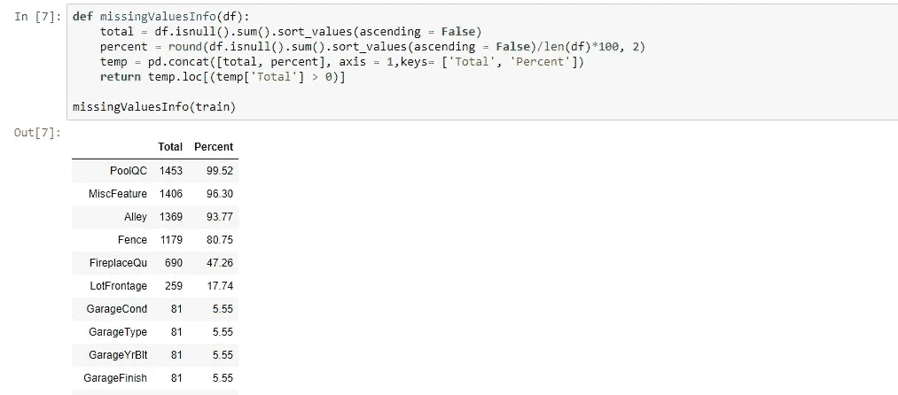
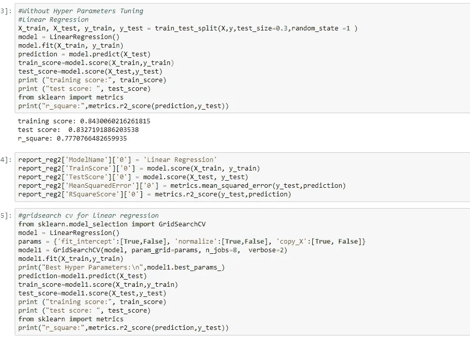
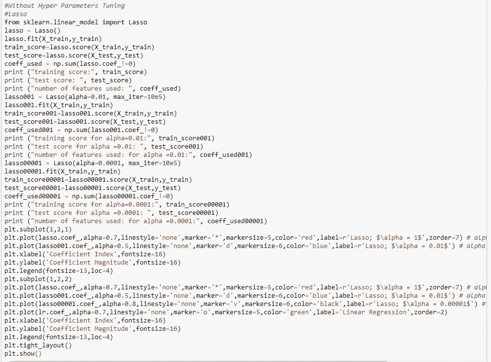
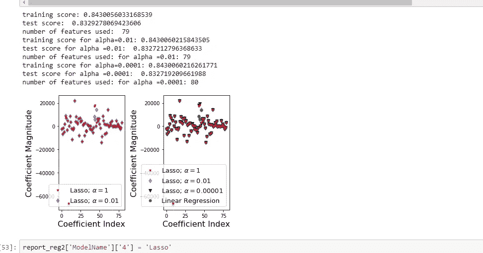
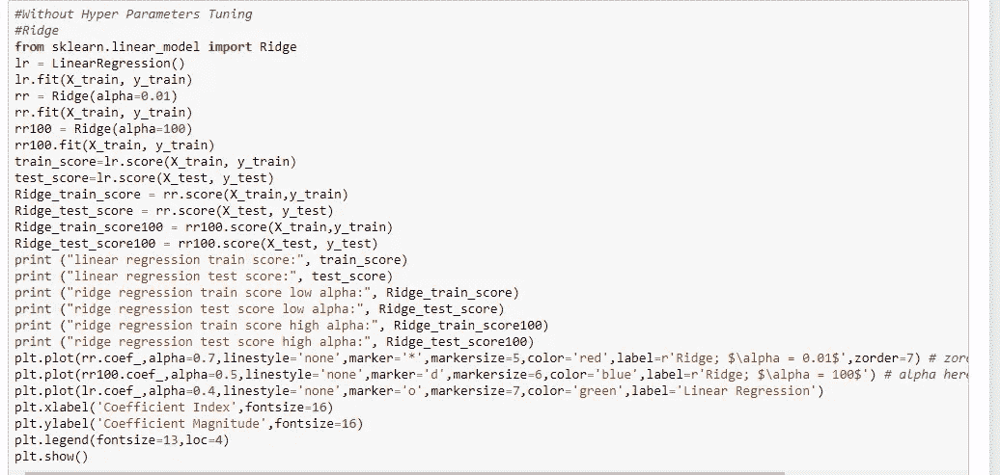
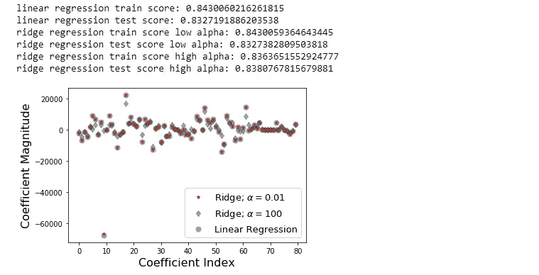
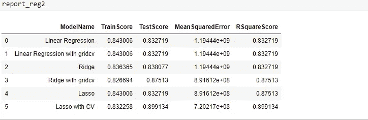

# 正则化简介:脊、套索和弹性网

> 原文：<https://levelup.gitconnected.com/brief-introduction-to-regularization-ridge-lasso-and-elastic-net-be62a7955dd>

监督机器学习是目前许多组织用来识别和解决业务问题的时髦词汇。常用的算法有两种—分类和回归。在本文中，我们将关注回归。回归分析是预测连续结果的模型。一些例子包括预测住房市场价格，零售商店的销售，天气预测等等！

# 什么是回归？

回归搜索变量之间的关系。

例如，你可以观察一个地方的几所房子，并试图了解它们的价格如何取决于**特征**，例如房子的面积、可用的公用设施类型、屋顶类型、角色、所在城市、卧室数量等等。

这是一个回归问题，每个房子的相关数据代表一个**观察值**。假设房子的面积、可用的公用设施类型、屋顶类型、角色、所在城市是独立的特征，而价格取决于它们。

一般来说，在**多元分析**中，你会希望找到一个函数，它将一些特征或变量充分地映射到其他特征或变量。
相关特征称为因变量、输出或响应。独立特征称为独立变量、输入或预测值。

回归问题通常有一个连续无界的**变量**。然而，**输入通常是**连续的、离散的、**或者可能是**分类数据**，如**性别、国籍、品牌等等。

标准的做法是用𝑦表示输出，用𝑥.表示输入如果有两个或更多的独立变量，**它们将被**表示为**，因为**向量𝐱 = (𝑥₁，…，𝑥ᵣ)，其中𝑟 **是输入的**数量。

# 什么时候需要回归？

通常，您希望回归来回答某个现象是否以及如何影响另一个现象，或者几个变量是如何相关的。例如，你可以用它来计算经验或性别是否会影响薪水，以及影响到什么程度。

当您想要使用一组新的预测因子来预测一个响应时，回归是非常有用的。例如，在给定室外温度、一天中的时间以及住户人数的情况下，您将尝试预测一个家庭接下来一个小时的用电量。回归被应用于各种领域:供应链规划、市场营销等等。

首先，我们需要了解回归的基础知识，以及在使用各种模型之前，方程的哪些参数发生了变化。简单线性回归，也称为普通最小二乘法(OLS)，试图最小化残差。在这种情况下，误差是实际值与其预测值之间的差异。

这个模型的等式被称为成本函数。

一个常见的问题是显示多重共线性的数据特征，这被解释为预测变量彼此相关并与响应变量相关。为了描述这一点，假设我们正在做一项研究，研究一个反应变量——患者体重，我们的预测变量是身高、性别和饮食。这里的问题是，身高和性别也是相关的，并且可以夸大其系数的标准误差，这可能使他们看起来在统计上无关紧要。

对此的一般解决方案是:**以引入一些偏差为代价减少方差**。这种方法称为正则化，几乎总是有利于模型的预测性能。为了让它深入人心，我们来看看下面的情节。

随着模型复杂性的增加，在线性回归的情况下可以认为是预测因子的数量，估计的方差也增加，但偏差减少。不带偏见的 OLS 会把我们放在画面的右边，这远非最佳。这就是我们调整的原因:以一些偏差为代价降低方差，从而在图上向左移动，向最优方向移动。

这张图说明了什么是偏差和方差。想象靶心是我们正在估计的真实总体参数， *β* ，它的射击点是我们从四个不同的估计器得到的估计值——低偏差和方差，高偏差和方差，以及它们的组合。

希望偏差和方差都较低，因为较大的值会导致模型的预测较差。事实上，该模型的误差可以分解为三部分:由较大方差产生的误差，由显著偏差产生的误差，以及剩余部分——无法解释的部分。

为了产生更精确的复杂数据模型，我们在 OLS 方程中加入了一个惩罚项。一个罚分加一个**偏向某个值。这些被称为 L1 正则化(拉索回归)和 L2 正则化(岭回归)。**

# **里脊回归**

**岭回归使用 L2 正则化，它将以下惩罚项添加到 OLS 方程中。**

**L2 项等于系数大小的平方。在这种情况下，如果 lambda(λ)为零，则该方程是基本的 OLS，但是如果它大于零，则我们向系数添加一个约束。该约束导致λ的值越大，最小化系数(又名收缩率)趋向于零。缩小系数导致更低的方差，并相继导致更低的误差值。因此，岭回归降低了模型的复杂性，但并没有减少变量的数量，而是缩小了它们的影响。**

# **岭回归中偏差-方差的权衡**

**在偏差和方差的公式中加入正则化系数，我们得到**

**从这里可以看到**随着 *λ* 变大，方差减小，偏差增大**。这就提出了一个问题:为了减少方差，我们愿意接受多大的偏差？或者说: *λ* 的最佳值是多少？有两种方法可以解决这个问题。一种更传统的方法将是确定λ这样的某种信息准则，例如 AIC 或 BIC，是那个最小。**

# **套索回归**

**套索回归使用 L1 罚项，代表最小绝对收缩和选择算子。应用于 L2 的罚值绝对等于系数大小的值:**

**与岭回归相似，λ值为 0 时，基本的 OLS 方程**消失，但是给定适当的**λ值，拉索回归可以将一些系数驱动为零。λ的值越大，越多的特征被缩小到零。这将完全消除一些特征，并为我们提供预测值子集，帮助减轻多重共线性和模型复杂性。没有向零收缩的预测值表示它们重要，因此 L1 正则化允许特征选择(稀疏选择)。因此，对于λ的顶值，许多系数在 lasso 下正好为零，这与岭回归中的不同。******

# ****弹性网****

****第三种常用的回归模型是弹性网，它包括来自 L1 和 L2 正则化的罚值:****

****除了设置和选择一个λ值，弹性网还允许我们调整阿尔法参数，其中𝞪 = 0 对应山脊，𝞪 = 1 对应套索。简而言之，如果你把α设为 0，罚函数就变成了 L1(山脊)项，如果我们把α设为 1，就得到 L2(套索)项。因此，我们将选择一个介于 0 和 1 之间的 alpha 值来优化弹性网络。实际上，这可能会收缩一些系数，并将一些系数设置为 0 以进行稀疏选择。****

# ****在数据集上实现线性、脊形和套索****

****因此，现在让我们通过将两种算法应用于一个[房屋数据集](https://www.kaggle.com/c/house-prices-advanced-regression-techniques)来研究 Lasso 和 Ridge，然后比较它们的性能。****

********

****加载数据。****

****加载数据后，我们会进行探索性的数据分析，清理数据并应用不同的预处理技术。****

********

****检查缺少的值****

****在对上述数据集运行线性回归和带有超参数调整的线性回归之后。代码和结果如下:****

********

****上面的输出显示了两个评估指标之一的 RMSE。运行基本线性回归和从网格搜索 cv 和评估指标中获得最佳参数后运行回归。****

****运行套索和套索与超参数调整以上数据集。代码和结果如下:****

********

****套索代码****

****套索回归也可用于要素选择，因为不太重要的要素的 coefficients 会减少到零。****

********

****以上输出显示了 Lasso 回归模型的 RMSE 值分别对应于训练和测试数据上的不同 alpha 值。****

****在上述数据集上运行岭和带有超参数调谐的岭之后。代码和结果如下:****

********

****山脉****

********

****以上输出显示了岭回归模型的 RMSE 值，分别对应于训练数据和测试数据上的不同α值。****

********

****所有模型的比较****

****正如你从上面的比较图表中看到的，我们可以看到，在 OLS 方程中加入一个惩罚项。复杂数据上的模型精度更高。****

# ******弹力网******

****弹性网最早出现是由于对 lasso 的批评，其变量选择可能过于依赖数据，因此不稳定。解决方案是结合岭回归和套索的惩罚，以获得两全其美。弹性网络旨在最小化以下损失函数:****

****其中α是脊(α = 0)和套索(α = 1)之间的混合参数。****

# ****结束注释****

****总而言之，套索、脊和弹性网之间有一些显著的区别:****

> *****套索做稀疏选择，而山脊不做。当您有高度相关的变量时，岭回归会使两个系数相互缩小。
> Lasso 有些冷漠，通常会挑一个而不是对面。弹性网可能是试图收缩和同时进行稀疏选择的两者之间的折衷。
> 里奇惩罚较大的错误，就像惩罚较小的错误一样(因为它们在惩罚期限内被平方)。
> 套索对他们的惩罚更均匀。这可能重要，也可能不重要。在使用强预测器的预测问题中，与套索相比，脊会降低预测器的有效性。*****

****您可以在我的 GitHub 资源库中找到完整的代码。****

**** [## nikhileshorg/基本分类回归模型

### 基本分类和回归模型。为 Nikhileshorg/基本分类和回归模型做出贡献…

github.com](https://github.com/Nikhileshorg/Basic-classification-and-Regression-models) 

你对这篇文章有什么疑问吗？留下评论，提出你的问题，我会尽力回答。

感谢阅读！❤****