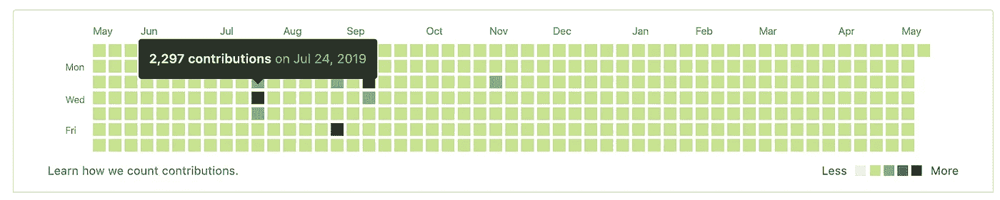

# 亮点 GitHub 贡献日历—将 Gitlab 贡献迁移到 GitHub

> 原文：<https://levelup.gitconnected.com/brightening-github-contributions-calendar-migrating-gitlab-contributions-to-github-ce65ca6f04a7>

前几天我在更新我的个人 GitHub 页面时，在推出一些代码时，我偶然发现了 GitHub 贡献图表。你可能见过这个图表，GitHub 称之为“贡献日历”


来自 GitHub 帮助网站的投稿日历图片

GitHub 贡献图表跟踪每天的贡献数量，但是什么是贡献呢？GitHub 的帮助页面将贡献定义为“提交到存储库的默认分支或`gh-pages`分支，打开一个问题，提出一个拉请求，或者提交一个拉请求。”

贡献图表显示了你在网站上的活跃程度。虽然意义不大，是个奇怪的程序员 flex 但是谁**不**喜欢 flex 呢？

> …这是一个奇怪的程序员 flex，但是谁**不喜欢**flex 呢？

我看着自己的投稿日历，它看起来是如此的光秃秃和空虚，这是怎么回事呢？我每天为私人的工作或个人项目编码和使用 git。我没有亮绿色贡献图表的原因是因为我们在工作中使用私人服务器上的 GitLab。这让我开始思考，GitLab 的贡献可以轻松地迁移到 GitHub 上，而不需要复制或迁移项目本身吗？

这意味着两件事:

1.  承诺与其他项目中相同数量的贡献，并回溯这些贡献。
2.  从 GitLab 轻松加载贡献的计数和日期。

让我们从任务一开始，创建回溯提交。Git 围绕着两个时间戳，GIT_AUTHOR_DATE 和 GIT_COMMITER_DATE 变量。如果我们修改这些日期，git 提交会看起来像是在那时创建的吗？

```
mkdir “Test Git Backdated”
cd Test\ Git\ Backdated/
git init
echo "first commit on my birthday" >> commit.md 
export GIT_COMMITTER_DATE=“10-02-1996 12:00:00"
export GIT_AUTHOR_DATE="10-02-1996 12:00:00"
git add --all
git commit --date="96-10-02 12:00:00" -m "commited on my bday"
echo "commited today" >> commit.md
unset GIT_AUTHOR_DATE
unset GIT_COMMITTER_DATE
git commit -am "committed today"
```

在上面的代码中，我创建了一个测试目录，并用 git 初始化它。在我提交了一个带有过去某个日期(也就是我的生日)的文件，并检查了 git 日志以查看回溯提交是否有效之后。然后，我想添加到提交文件中，取消日期设置，将其改回当前日期，并查看新的提交日期是否更新为今天。


显示提交结果的屏幕截图

在上图中，我们可以看到第一次提交的时间戳显示它是在 23 年前提交的！现在我们可以回溯 git 提交，让我们开始第二步，从 GitLab 加载提交。所有的网站都是 HTML 页面，这对我们来说非常有利！我们可以简单地找到图表 HTML，解析它，然后在当天提交多次，以匹配贡献计数。

gitlab-contrib-migrator.py —用于迁移 GitLab contribs 的脚本

点击查看完整文件和代码[。](https://github.com/ssk1002/gitlab-contribution-migration-tool/blob/master/gitlab-contrib-migrator.py)

运行时间——我想显示 contribs 图表的强烈着色，所以我决定选择 [gitlab-bot](https://gitlab.com/gitlab-bot) 来迁移贡献。只要看看下面的贡献图，就知道这个 bot 的作用有多大了！


Gitlab Bot 贡献图

我下载了这个页面的 HTML 文件，启动了脚本，决定去吃点东西。我回来后发现脚本**在 2 小时内只执行了 46%。我发现我不小心把这个例子看得太极端了，为了让这个运行更快，我决定把提交限制在每天最多 30 次。**

```
# Code Modificationdef createNumOfCommitsOnDate(numOfCommits, date):
    if numOfCommits > 30:
        numOfCommits = 30
    ...
```

在这个改变之后，剩下的 52%只花了大约 10 分钟，这更合理，因为正常人每天最多只有 30 次提交。

现在是推的时候了，在检查 GitHub 时，我注意到没有提交添加到我的贡献图表中，但是带有提交的 repo 有 64，797 个提交！在更多的调查之后，GitHub help 说，“在提交了一个满足计算贡献要求的请求之后，你可能需要等待 24 小时才能看到这个贡献出现在你的贡献图上。”

然而，我一天也不想等——我想看到立竿见影的效果。我试图看看我是否去了我创建的存储库，并检查了提交的见解。我看到一个“处理这些信息”的屏幕，我想我必须开始一些工作来更新这些数据。当页面加载时，我看到了我全年的提交时间表！下面是我所看到的，包括 47%的下降，我把提交限制在 30/天。


随着时间的推移提交，速率限制下降 47%

是时候看看我的贡献表了！万岁，它成功了，我一天都不用等。我的投稿图表也更新了，如下图所示。



使用 Gitlab Bot 迁移运行脚本后的贡献日历

注意:要从你的日历中删除这些贡献，只需删除回购或将其设为私有。

祝你好运迁移！