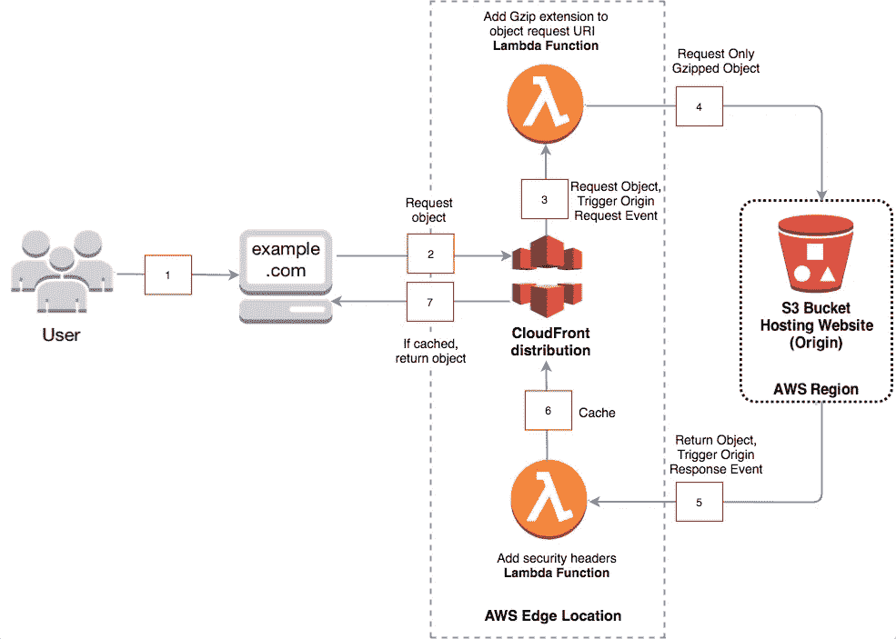

# 借助 Lambda@Edge、CloudFront 和 S3，快速安全地将您的代码带到边缘

> 原文：<https://levelup.gitconnected.com/bring-your-code-to-the-edge-fast-and-securely-5112a76bead9>


詹妮弗·卡佩尔在 [Unsplash](https://unsplash.com/search/photos/edge?utm_source=unsplash&utm_medium=referral&utm_content=creditCopyText) 上的照片

在你开始阅读这篇文章之前，我建议你先熟悉一下 [Lambda@Edge](https://docs.aws.amazon.com/lambda/latest/dg/lambda-edge.html) 、 [CloudFront](https://docs.aws.amazon.com/AmazonCloudFront/latest/DeveloperGuide/Introduction.html) 和 [S3](https://aws.amazon.com/s3/) 。

最近，我的团队决定将其前端架构从使用 [Nginx](https://www.nginx.com/) 改为 AWS Lambda@Edge。我们使用 Nginx 的目的是为了给我们的文件添加安全头，但是现在 [AWS Lambda@Edge 是 SOC2](https://aws.amazon.com/compliance/services-in-scope) complaint，没有理由再使用 Nginx 了。此外，我们可以借此机会构建一个无服务器应用程序。


在这篇文章中，我们将展示如何在一个使用亚马逊 S3 托管文件的应用程序中实现额外的安全响应头。我们还将回顾如何使用 Lambda@Edge 来提供来自 S3 的压缩文件**，而不使用 CloudFront 中的[自动压缩功能](https://docs.aws.amazon.com/AmazonCloudFront/latest/DeveloperGuide/ServingCompressedFiles.html)。**

在我们开始之前，让我们快速了解一下 Lambda@Edge:

**λ@边缘概述**

Lambda@Edge 提供了在 Amazon CloudFront Edge 位置执行 Lambda 函数的能力。此功能支持在靠近客户的位置智能处理 HTTP 请求(就延迟而言)。为什么这很重要？例如，我们应用的 Nginx 位置在美国，而我们客户的边缘位置在中国，正如你所想象的，这可能会对延迟产生负面影响。此外，另一个优势是我们不必一直维护服务器，我们可以让 AWS 为我们扩展。

> Lambda@Edge 是 AWS Lambda 的扩展，它允许您在全局 AWS 位置运行 Node.js 代码
> 
> 将您自己的代码带到边缘，并定制非常贴近您的用户的内容，从而改善最终用户体验

当使用 CloudFront 和 Lambda@Edge 时，可以使用 CloudFront 的事件来调用 Lambda@Edge 函数。您可以运行 Lambda@Edge 函数来响应四个不同的 CloudFront 事件:查看器请求、源请求、源响应和查看器响应。


在我们的例子中，lambda 函数由以下两个事件调用:

**原点请求** —该事件在 CloudFront 向原点(S3)请求对象后触发。它可以访问来自 CloudFront 的请求。

**原点响应** —原点(S3)对请求返回响应后触发此事件。它可以访问来自源的响应。

请记住，您希望尽可能避免**查看器请求**事件，因为它会在每次客户端发送请求时运行，并且会增加延迟和使用 Lambda@Edge 的月费用。

下图说明了触发 Lambda@Edge 功能的事件顺序:



**流程是这样的:**

1.  观众请求网站[www.example.com。](http://www.example.com.)
2.  如果该对象已经被缓存，则转到步骤 7，否则转到步骤 3。
3.  CloudFront 从起点请求对象，在本例中是一个 S3 桶，这又导致 CloudFront 触发起点请求事件。
4.  我们需要触发一个“原始请求”Lambda 函数，它将请求转发给 S3 bucket，只请求一个 gzipped 对象。
5.  S3 返回对象，这又导致 CloudFront 触发源响应事件。
6.  “源响应”Lambda 函数被触发，它添加安全响应头，结果输出由 CloudFront 缓存和提供。
7.  CloudFront 将对象从缓存返回给查看器。

**下面是压缩过程的工作原理:**

1.  使用 Gzip 算法压缩文件。
2.  上传压缩文件到 S3。
3.  将“Content-Length”报头作为允许的报头添加到您的 S3 存储桶的 [CORS 配置](https://docs.aws.amazon.com/AmazonS3/latest/dev/cors.html)中，浏览器使用该报头来确定何时可以重用连接。
4.  禁用 CloudFront 中的自动压缩功能。
5.  使用 Lambda@Edge 将请求 URI 更改为仅请求 gzipped 文件，并在响应中返回“content-encoding”标头。

**这里是 lambda 函数的一个例子:**

**原点请求**λ函数:

```
*/**
 * Function registered on 'Origin Request' CloudFront Event
 */* exports.handler = (event, context, callback) => {
  **const** request = event.Records[0].cf.request;
  **try** {
    **if** (request.uri) {
      // Change URI to always use gzipped resources.
      request.uri = request.uri + '.gz';
    }
  } **catch** (e) {
    console.log('origin request handler - an error occurred: ', e);
  } **finally** {
    callback(**null**, request);
  }
};
```

**原点响应**λ函数:

```
*/**
 * Function registered on 'Origin Response' CloudFront Event
 */* exports.handler = (event, context, callback) => {
  **const** response = event.Records[0].cf.response;
  **try** {
    **const** requestUri = event.Records[0].cf.request.uri;

    // Check if the request uri has extension of a compressed file,
    // if so - add the corresponding header
    // The keys in the headers object are lowercase versions of the
    // header names in the HTTP request.
    **if** (requestUri.endsWith('.gz')) {
      response.headers['content-encoding'] = [{
        key: 'Content-Encoding',
        value: 'gzip'
      }];
    } // here you can add the security headers you wish to add the
    // response
    response.headers['strict-transport-security'] = [{
      key: 'Strict-Transport-Security',
      value: 'max-age=31536000; includeSubdomains'
    }];
    response.headers['x-content-type-options'] = [{
      key: 'X-Content-Type-Options',
      value: 'nosniff'
    }];
    response.headers['x-frame-options'] = [{
      key: 'X-Frame-Options',
      value: "SAMEORIGIN"
    }];
    response.headers['referrer-policy'] = [{
      key: 'Referrer-Policy',
      value: "same-origin"
    }];
    response.headers['x-xss-protection'] = [{
      key: 'X-XSS-Protection',
      value: "1; mode=block"
    }];
    response.headers['accept-ranges'] = [{
      key: 'Accept-Ranges',
      value: "bytes"
    }];
    response.headers['content-security-policy'] = [{
      key: 'Content-Security-Policy',
      value: "frame-ancestors 'self'"
    }];
  } **catch** (e) {
    console.log('origin response handler - an error occurred: ', e);
  } **finally** {
    callback(**null**, response);
  }
};
```

你可以在这里阅读更多关于安全标题的信息。

现在，你可能会问为什么不在 CloudFront 中使用自动压缩特性？

让我们看看你不这样做能得到什么:

1.  在您的 S3 文件中的每次更改之后，对这些文件的第一个 web 请求将会导致网络延迟，因为 CloudFront 必须将它们从源位置提取到缓存中。通过启用自动压缩，我们在缓存文件之前压缩文件会增加额外的延迟。因此，如果您提前压缩文件，您的用户就不会经历这种延迟。尽管它只会发生在第一个请求这些文件的用户身上，但它仍然会发生在每个 CloudFront Edge 位置。因此，每次您部署时，都会有一群用户体验到延迟，这不是您希望您的用户体验到的。
2.  你也可以使用另一种算法进行压缩，比如[布罗特利](https://github.com/google/brotli)。用 Brotli 压缩的 Javascript 文件比用 Gzip 压缩的小 14%**。因为不是所有的浏览器都支持 Brotli，所以您可以将 Gzip 和 Brotli 文件上传到 S3，并使用[白名单头](https://docs.aws.amazon.com/AmazonCloudFront/latest/DeveloperGuide/distribution-web-values-specify.html#DownloadDistValuesForwardHeaders)选择`Accept-Encoding`请求头作为您希望 CloudFront[基于](https://docs.aws.amazon.com/AmazonCloudFront/latest/DeveloperGuide/header-caching.html#header-caching-web-compressed)进行缓存的头。**
3.  **你在 S3 上使用的空间更少，这意味着花的钱更少。**

**总而言之，我们看到了如何使用 Lambda@Edge、CloudFront 和 S3 来定制我们的响应头并提供压缩文件，我们获得了改善延迟和添加安全头的强大优势。**

**使用 Lambda@Edge，自定义标题和更改 URIs 并不是唯一可以做的事情。你也可以实现[无服务器授权](https://aws.amazon.com/blogs/networking-and-content-delivery/authorizationedge-how-to-use-lambdaedge-and-json-web-tokens-to-enhance-web-application-security/)，运行 A/B 测试等等，你可以在这里查看一些例子[。](https://docs.aws.amazon.com/AmazonCloudFront/latest/DeveloperGuide/lambda-examples.html)**

**有用的链接:**

1.  **[用 lambda@edge 构建无服务器网站](https://www.slideshare.net/AmazonWebServices/building-serverless-websites-with-lambdaedge-aws-online-tech-talks)**
2.  **[AWS Lambda@Edge 车间](https://github.com/aws-samples/aws-lambda-edge-workshops)**
3.  **[在 AWS CloudFront 上使用 Lambda@Edge 进行 A/B 测试](https://medium.com/buildit/a-b-testing-on-aws-cloudfront-with-lambda-edge-a22dd82e9d12)**

**[](https://levelup.gitconnected.com)****[](https://gitconnected.com/learn/amazon-web-services-aws) [## 学习 AWS -最佳 AWS 教程(2019) | gitconnected

### 16 大 AWS 教程。课程由开发人员提交并投票，使您能够找到最好的 AWS 课程…

gitconnected.com](https://gitconnected.com/learn/amazon-web-services-aws)**