# 通过 Unity 的后期处理将你的游戏提升到 AAA 级！

> 原文：<https://levelup.gitconnected.com/bring-your-game-to-aaa-status-through-post-processing-9ac78ad167b0>

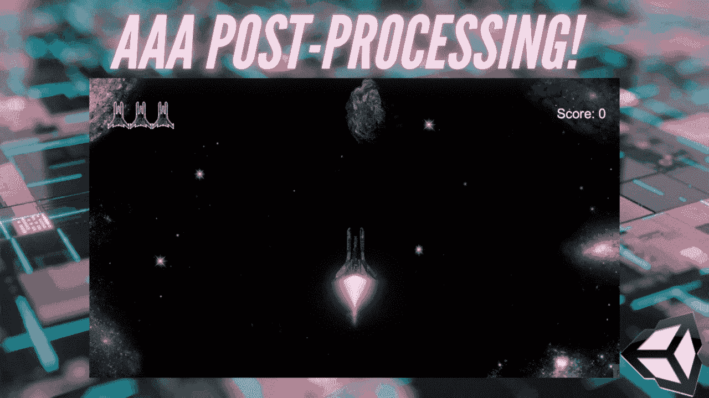

之前讲过[后期处理，以及如何在 Unity](https://dennisse-pd.medium.com/how-to-use-post-processing-in-unity-2de1b7b9d44d) 中使用。在今天的文章中，我将介绍如何添加后期处理效果。在这个例子中，我将添加布卢姆和颜色渐变到我的复古 2D 空间射手-一些最引人注目的效果！3

# 创建配置文件

1.  我们需要先设置一个后处理配置文件。创建一个空的游戏对象，并将其重命名为后处理卷。

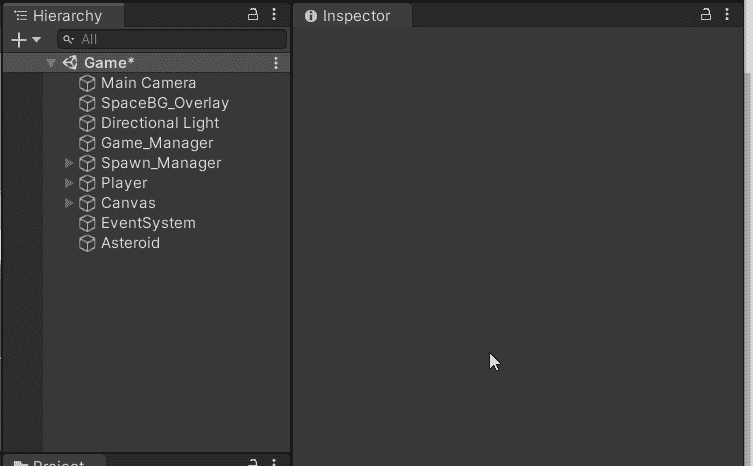

2.添加后处理卷组件。这将控制我们添加的所有效果和图像。

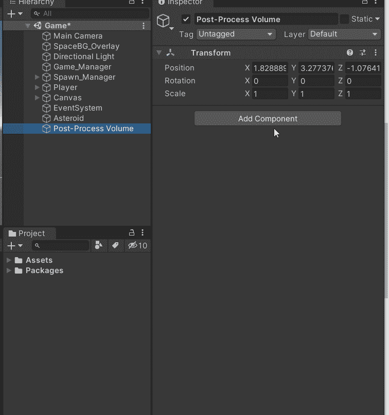

3.确保*是全局的*被选中，这样所有可见的东西都会受到后期处理效果的影响。

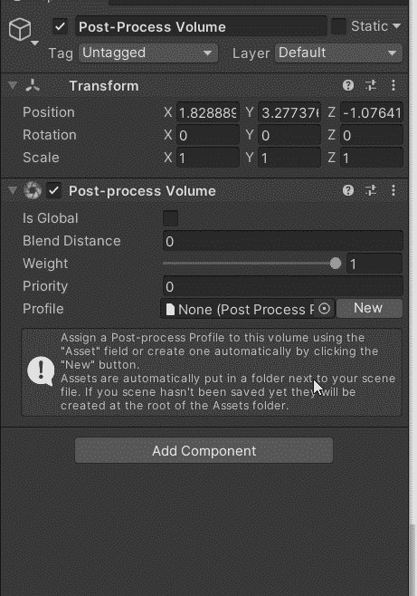

**重量**是指体积的总重量。0 表示它处于非活动状态/无任何反应。1 表示完全有效，您应该会注意到不同之处。

**优先级**在您有不同的卷时使用，以便您可以对它们进行优先级排序。

> **注**:或者，您可以为不同的区域设置全局和本地。例如:当你有一个开放的(全局的)区域有自己的后期处理，然后你进入一个洞穴或一个地下城(局部的)区域有自己的视觉效果。

4.现在，我们可以添加配置文件。点击*新建*按钮。这将自动创建一个概要文件，并将我们现有的概要文件对象附加到它上面。

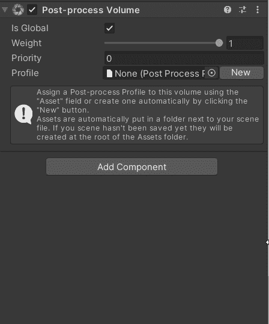

# 添加光晕效果并使其可见

1.  在层次中选择后处理体积对象，然后点击添加效果→统一→绽放

> **注意** : Bloom 从你场景中的材质获取所有的发射数据并增强它们。

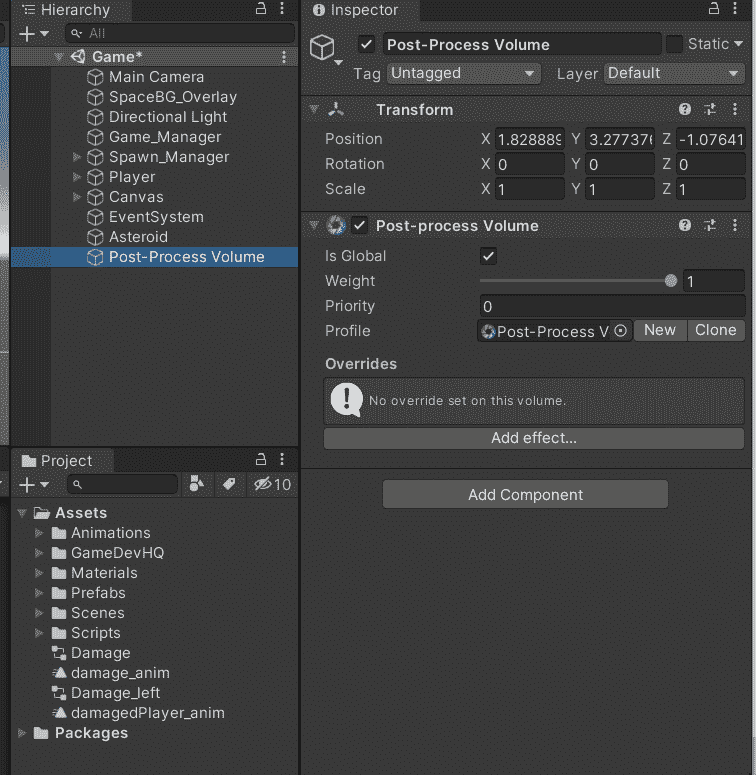

2.创建后处理层。这是必要的，这样它可以被添加到主摄像头，并实际上有我们的效果在屏幕上可见。

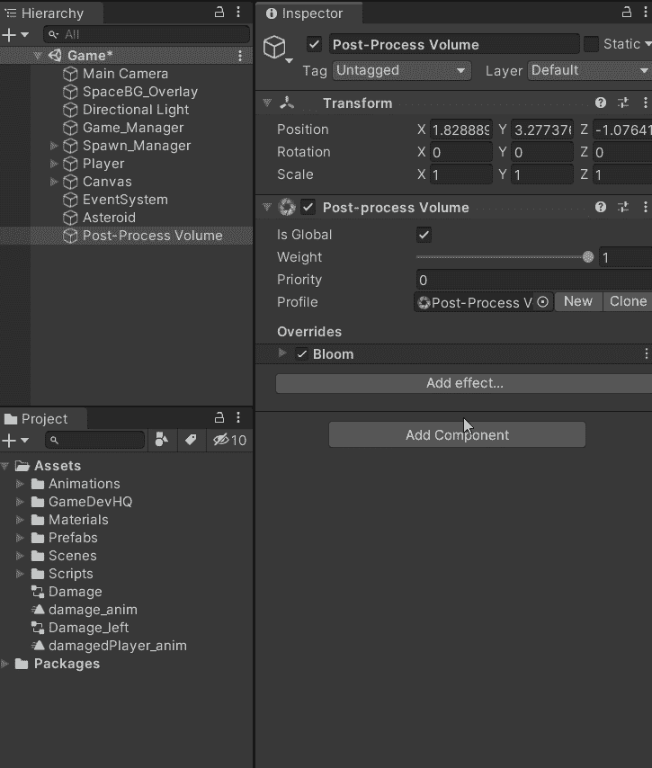

3.选择主相机，然后添加一个后处理层组件。您可以在那里添加新创建的层。

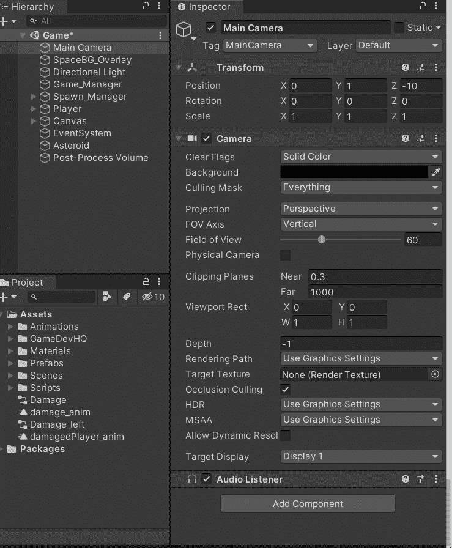

4.将后处理体积对象的默认层更改为后处理层。

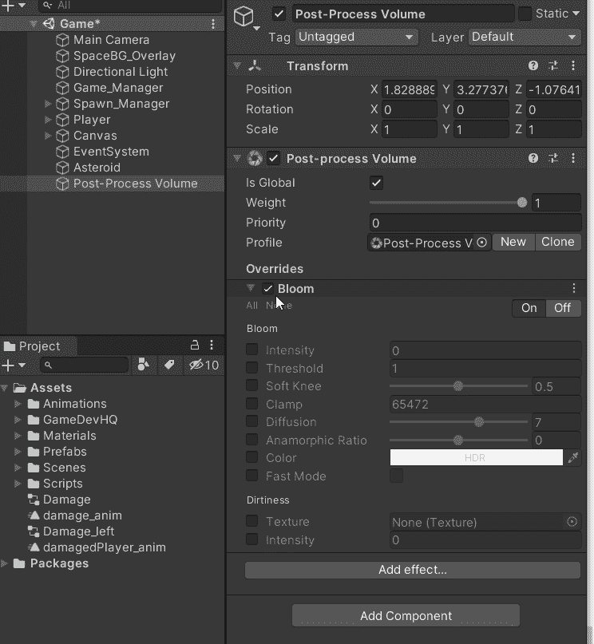

准备好之后，如果你激活高光效果的*和*并调整强度，你会看到变化现在是可见的。

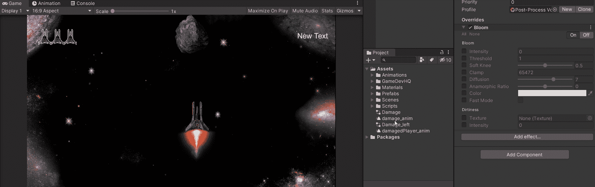

5.调整设置，直到你满意为止。在我的 2D 空间射击游戏中，我只调整了强度设置，仅此一点就改变了质量。

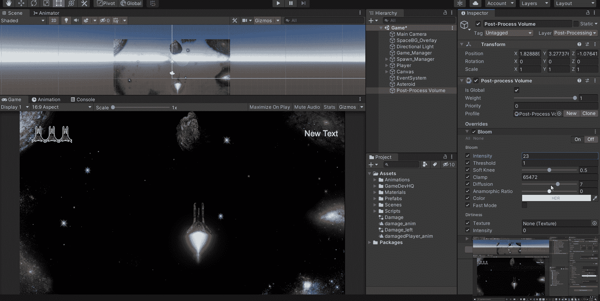

# 添加颜色分级

1.  选择后处理体积对象并添加颜色分级效果。

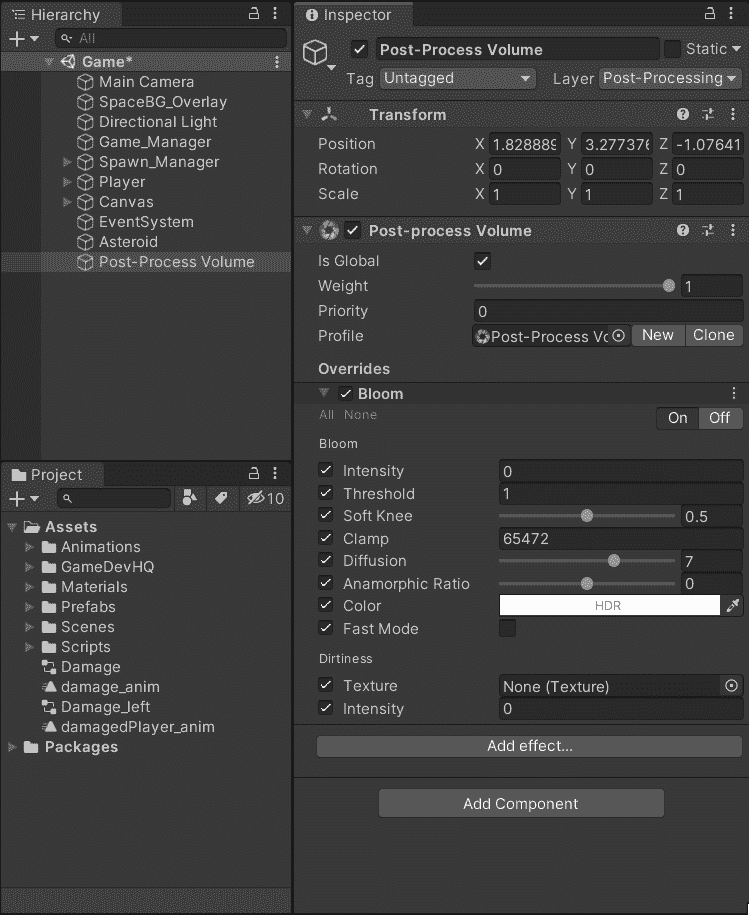

2.我们希望能够使用 HDR，但一旦你添加了颜色渐变，你会看到这个:

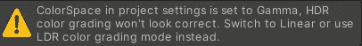

为了切换到线性，进入构建设置→播放器设置→付款人→其他设置→色彩空间这将重新编译您的项目，并允许我们使用色调映射

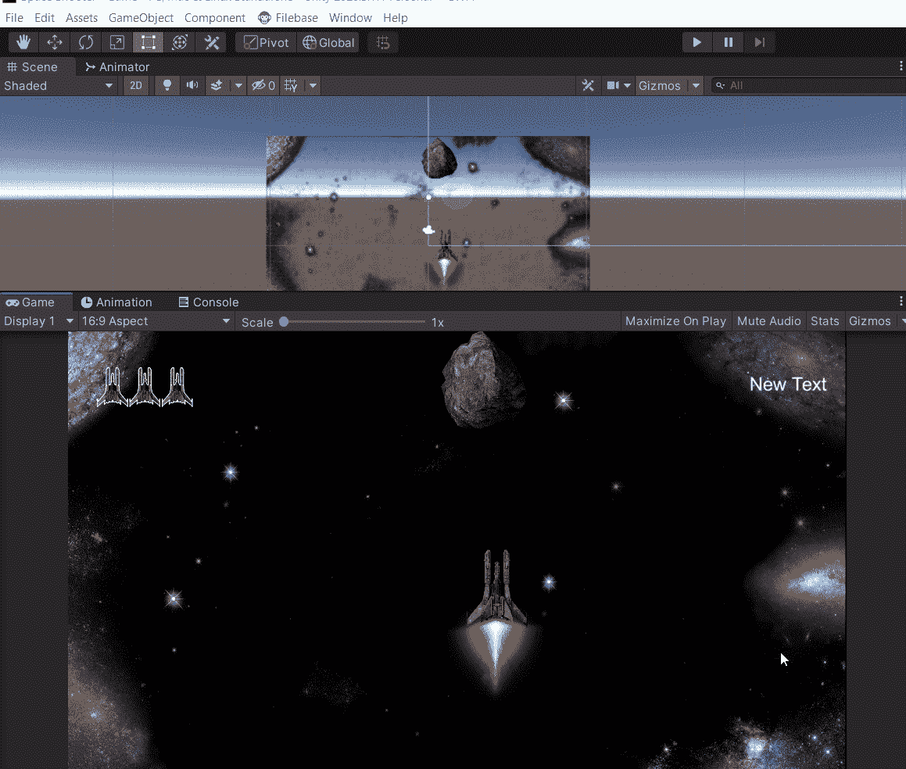

3.有了这个，我们现在可以使用高清晰度范围(HDR)。选择颜色分级的模式。我使用 ACES 来获得更电影化的外观。

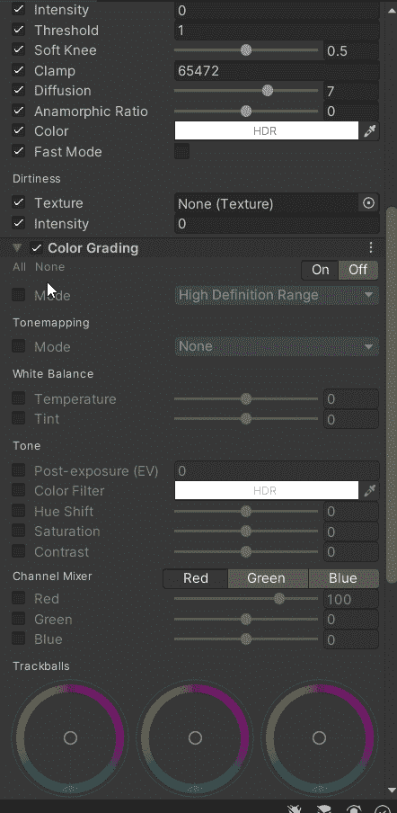

> [**电影(ACES)**](https://docs.unity3d.com/560/Documentation/Manual/PostProcessing-ColorGrading.html#:~:text=Color%20Grading%20is%20the%20process,luminance%20of%20the%20final%20image.&text=The%20Color%20Grading%20tools%20included,Scene%20with%20Color%20Grading.) 色调映射器基于参考 ACES 色调映射器的近似。因此，它具有比中性更高的对比度，并影响色调和饱和度。这个色调映射器是最容易使用的，因为它不需要任何用户反馈来给你的场景一个电影般的外观。

4.调整设置，直到你满意为止。我调整了温度，让它看起来更紫一些。

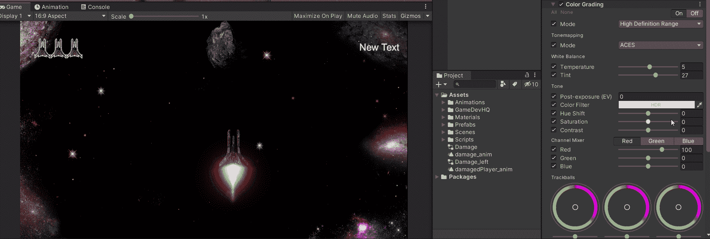

## **后处理前:**

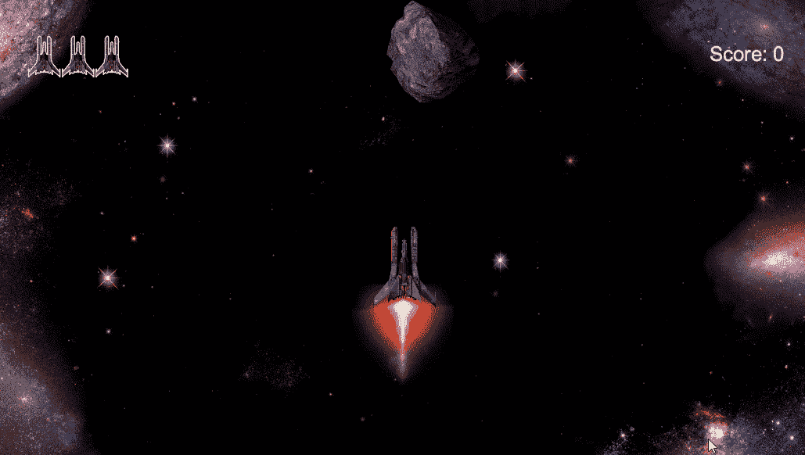

## 后处理后:

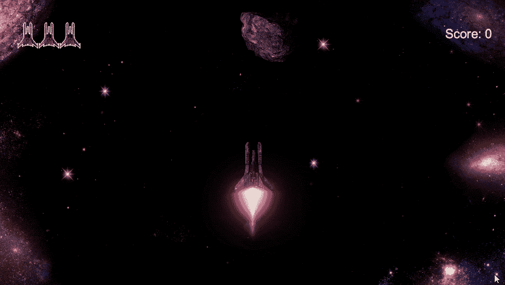

在下一篇文章中，我将看看如何添加背景音乐！