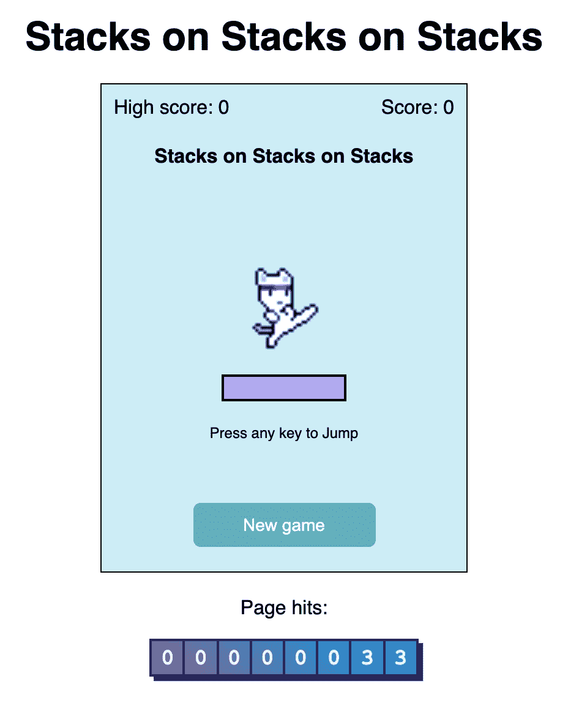
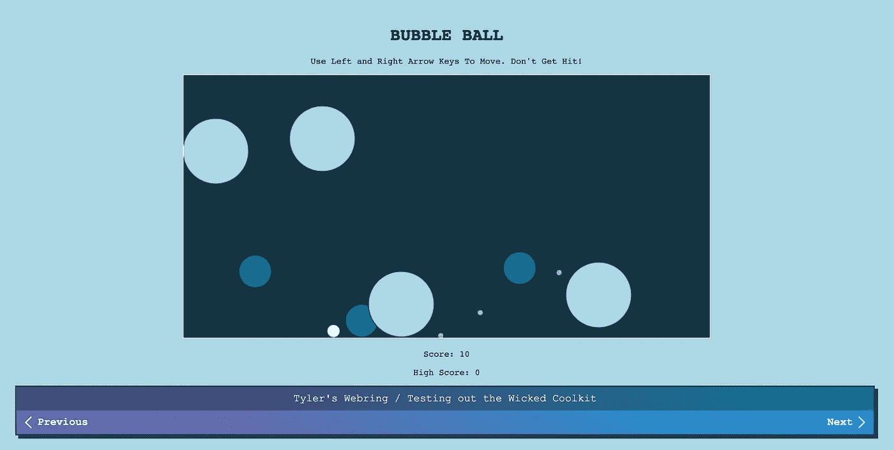
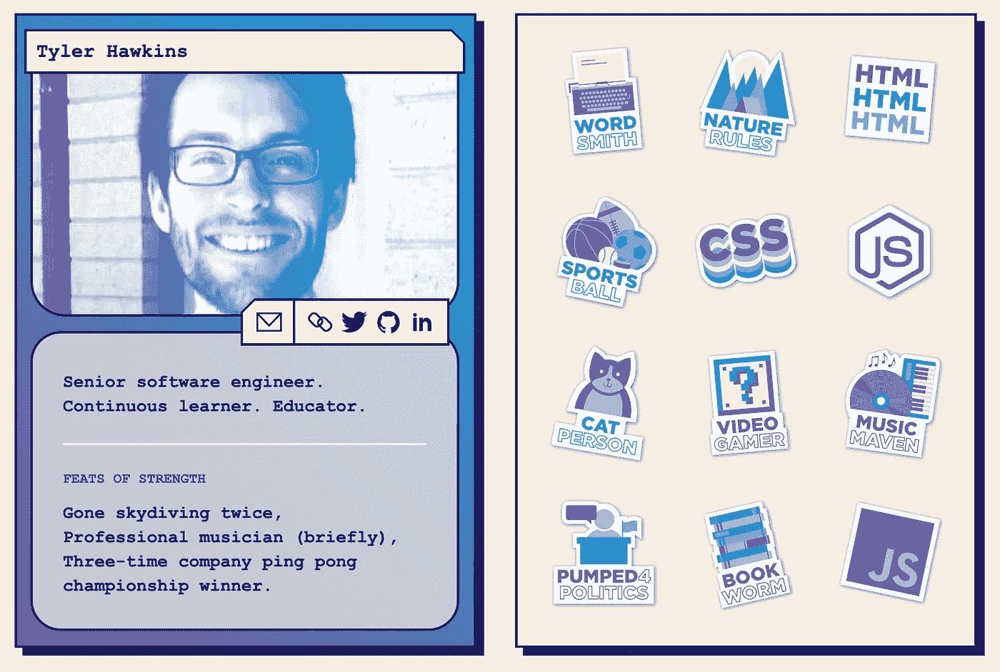

# 用邪恶的酷酷装备带回 90 年代

> 原文：<https://levelup.gitconnected.com/bringing-back-the-90s-with-the-wicked-coolkit-d2e869a7bc3a>


[莫里茨·门格斯](https://unsplash.com/@mphotographym?utm_source=medium&utm_medium=referral)在 [Unsplash](https://unsplash.com?utm_source=medium&utm_medium=referral) 上的照片

还记得 90 年代吗？神奇宝贝、豆豆娃、狂骨、超级任天堂、Pogs 和霓虹风衣……那些都是美好的旧时光。网络也是一个更简单的地方，准系统网站主要由文本和超链接组成。我记得就像是昨天一样。或者，等等——30 年前？

我最近发现了[Wicked cool kit](https://wickedcoolkit.com/)——一个漂亮的复古主题工具包——我认为用它来短暂重温那些岁月会很有趣。该工具包包括一个点击计数器、网络环和开发者交易卡。

如果你也感到怀旧，让我们通过探索 Wicked Coolkit 来探索一些 90 年代以来的网络发展趋势，只是为了寻求刺激。

# 点击计数器

在谷歌分析这样的软件出现之前，[点击数](https://en.wikipedia.org/wiki/Web_counter)是一种追踪你网站受欢迎程度的有趣方式，同时也向每个访问过你网站的人炫耀你的成功(或失败)。点击率计数器通常是笨重的小部件，每次页面加载后都会显示一个递增的数字。现在，网站分析软件已经很容易买到，也很便宜，点击率几乎完全从现代网络中消失了。但这并不意味着我们不能做一个只是为了好玩！

点击计数器的 [Wicked Coolkit](https://wickedcoolkit.com/) 设置需要您部署一个 Heroku 应用程序并创建一个 Salesforce 开发人员帐户，这两个帐户都有我使用的免费层。一旦应用程序启动并运行，它就会处理后端服务器，跟踪你网站的点击量。之后，就像在你的站点上包含一个代码片段一样简单，该代码片段包含一个`script`标签和一个用于点击计数器的定制 web 组件。

代码片段如下所示，尽管您的应用程序的`host`属性会有所不同:

```
<script type="module" async src="https://unpkg.com/wicked-coolkit@^1.1.2/dist/hitCounter.js"></script>
<wck-hit-counter host="tyler-wicked-coolkit.herokuapp.com"></wck-hit-counter>
```

这是我添加到一个 HTML5 游戏中的计数器，这个游戏名为[Stacks on Stacks](http://tylerhawkins.info/stacks-on-stacks-on-stacks-2/):



堆栈上的堆栈 HTML5 游戏，现在有一个点击计数器

# 韦伯林

现在我们已经有了一个点击计数器，让我们做一个网环！ [Webrings](https://en.wikipedia.org/wiki/Webring) 是 90 年代流行的另一个概念，它将一组网站连接在一起。这些网站将形成一个由精选内容组成的链或环，并允许用户探索他们自己可能永远也不会发现的很酷的新网站。在推荐引擎、社交媒体和定制新闻源出现之前，Webrings 是偶然发现新页面的一种巧妙方式。

Wicked Coolkit 为我们提供了另一个方便的代码片段，可以包含在任何想要参与 webring 的网站上。它看起来是这样的，同样带有一个`script`标签和一个 web 组件，带有对我的应用程序唯一的`host`属性:

```
<script type="module" async src="https://unpkg.com/wicked-coolkit@^1.1.2/dist/webring.js"></script>
<wck-webring host="tyler-wicked-coolkit.herokuapp.com"></wck-webring>
```

站点列表在 Salesforce 中进行管理，以增加安全性并防止任何旧站点包含在网络环中。这使管理员可以完全控制要在 webring 中展示的站点。

我创建了自己的 webring，并招募了几个朋友参加。对于一些有趣的应用程序，你可以[在这里](http://tylerhawkins.info/BubbleBall2/)找到我们的 webring！



泡泡球 HTML5 游戏，现在是 webring 的一部分

# 开发商交易卡

最后，如果我们不谈 90 年代的交易卡阶段，那将是我们的失职。我们当中谁没有心爱的神奇宝贝，数码宝贝，游戏王！、魔术:聚会，还是运动牌？你不想自己也在交易卡上吗？现在你可以用 Wicked Coolkit 的开发者交易卡了。您可以构建自己的应用程序，并使用您用于 hit counter 和 webring 的 Heroku 和 Salesforce 应用程序管理内容。

下面是我的开发者交易卡的样子:



个性化开发商交易卡

点击各种标签会将您带到另一个人的交易卡，让您有一个独特的机会与其他有类似兴趣的开发人员联系。

# 结论

好了，暂时就这样了。90 年代是很久以前的事了，但回忆起来很有趣。历史往往会重演，所以谁知道呢？也许有一天这些复古潮流会卷土重来。