# 用人工智能让旧图像重现生机

> 原文：<https://levelup.gitconnected.com/bringing-old-images-back-to-life-with-ai-4f33d11bd151>

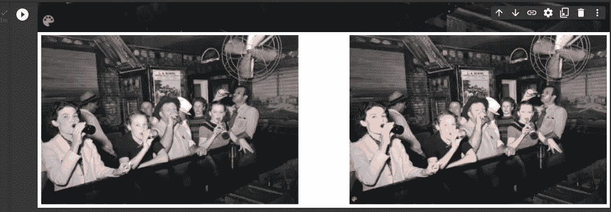

他们说一张图胜过千言万语，这应该包括老照片。所以我们需要让这些恢复生机，我们有我们的人工智能朋友来帮助我们。

在本文中，我们将使用一个名为 DEOLDIFY 的人工智能模型，将我继父、我叔叔、我奶奶和一个家庭朋友的旧图像带回生活。

# 模型是如何工作的？

整个过程的第一步是拍摄一张黑白图像(作为我们的输入)。然后，我们将这张黑白图像传递给 DEOLDIFY 模型，该模型将对图像重新着色，我们的输出将是一张彩色图像。

使用诺干训练来训练模型，诺干训练仍然是一种甘训练。大多数 GANS 有两个部分，一个是生成器(生成图像的部分)和一个鉴别器(从真实图像中识别出赝品)。假的重新着色的图像和真的重新着色的图像。所以性别和歧视者是被隔离训练的，他们称之为 NOGAN。

因此，我们将一个黑色和哪个图像传递给生成器，我们就能够生成与我们的图像等价的颜色。因此，我们将再次训练微调，并找到一个微调颜色等效。

所以鉴别器有一个假的彩色图像和一个生成的彩色图像，鉴别器将学习预测它是假的还是真的彩色图像。因此，在大多数 GANS，我们并肩训练，但在诺根，我们单独训练。

现在，在诺干(单独)训练后，它们被集合在一起进行微调。

现在让我们开始吧；

我们将克隆来自[https://github.com/jantic/DeOldify](https://github.com/jantic/DeOldify)的模型，也是来自作者的一堆资源，详细解释模型的内部工作。

# 设置我们的开发环境

首先，我们打开终端，创建文件夹，然后克隆存储库

```
get clone [https://github.com/jantic/DeOldify](https://github.com/jantic/DeOldify)
```

我们可以用 cd 进入 DEOLDIFY 库和 dir，进行检查；

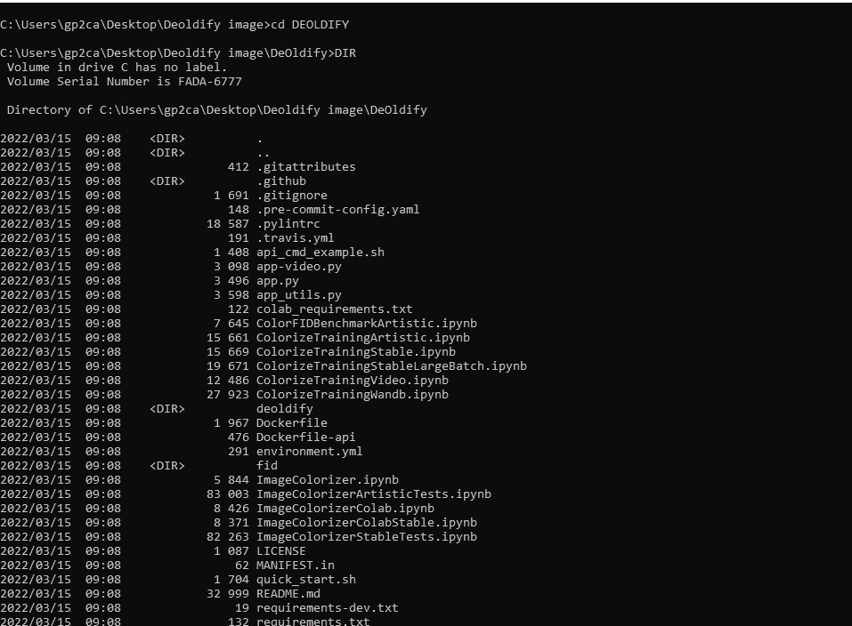

我们现在将使用以下命令安装 open CV

```
pip install opencv-python==4.4.0.42
```

一旦完成，我们需要使用命令安装我们的需求；

```
pip install -r requirements.txt 
```

然后，我们可以通过运行命令来检查我们的环境

```
pip list
```

现在我们想下载预训练的深度学习模型。我已经附上了链接；[https % 3A % 2F % 2f data . deepai . org % 2f deo ldify % 2f colorize artistic _ gen . PTH](https://www.youtube.com/redirect?event=video_description&redir_token=QUFFLUhqbHVIUHJQckZNR25VTXZlT3JUZW9qT2hjTWhJZ3xBQ3Jtc0tsR0hhNFN0cnoyc0pSY3Y1cXFZTXdwZVVVRkFTQXRRTWkxbnpuNWFJWGJXWmJkaGJGWkxWTXNaall2Y3BaRFJvTG5XSzc0dXN2alFBcjYyb0pid3VGNDBnaVJ5ZXNEZW1PbXlJcHlUTWkzNk9GZW9XYw&q=https%3A%2F%2Fdata.deepai.org%2Fdeoldify%2FColorizeArtistic_gen.pth)

一旦模型下载完成，我们需要把它放在一个名为 models 的文件夹中。

因此，在我们的文件夹中，我们将创建一个新的文件夹模型，并将我们的模型放在那里。

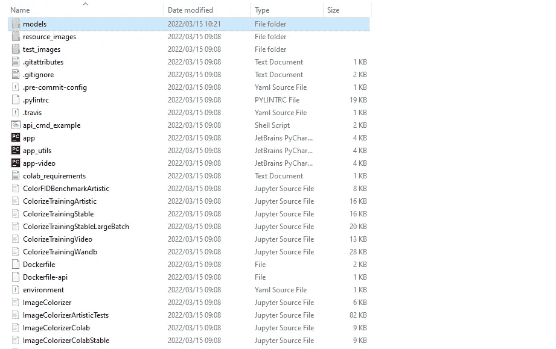

然后我们可以将下载的模型拖放到那里。

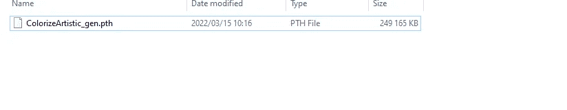

然后，它的领带火了我们的 Jupyter 笔记本电脑，并打开笔记本电脑图像彩色

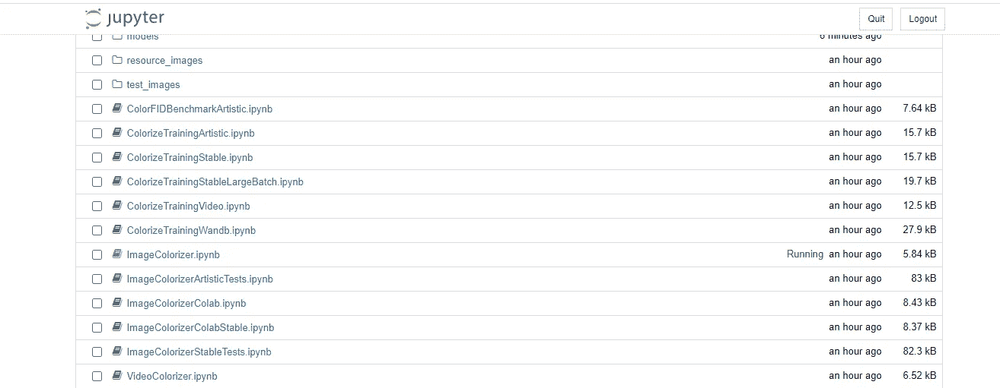

当我们打开笔记本时，我们将执行单元格。第一个单元注册我们的 GPU。

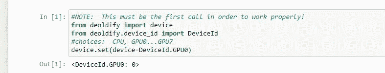

第二个单元导入一些 DEOLDIFY 库或模块，并设置我们的 torch 后端。

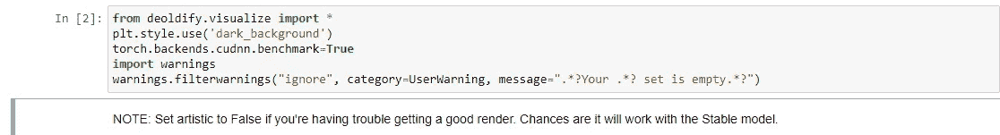

第三个单元格获取我们下载并放在 models 文件夹中的模型。

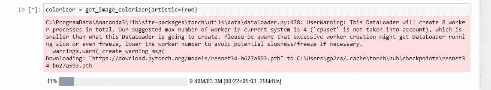

我将转移到谷歌实验室，以指导那些没有强大的 GPU 的。

然后，我们将提供一个源黑白图像，让它变成彩色。分配一个渲染因子，在图像上表演我们的魔术。

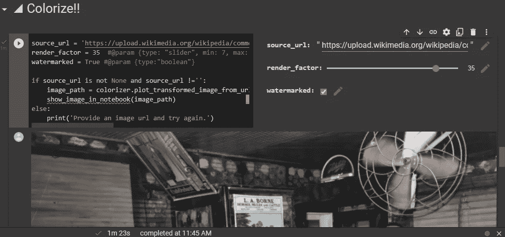

重要的是，我在 Jupyter notebook 和 Google Colab 上尝试了多个图像，并遇到了多个错误。图像必须清晰，分辨率好。

最后，我们要比较图像的渲染因子，我们将开始和结束进行比较。

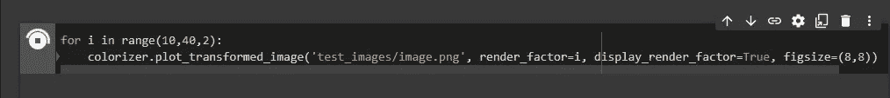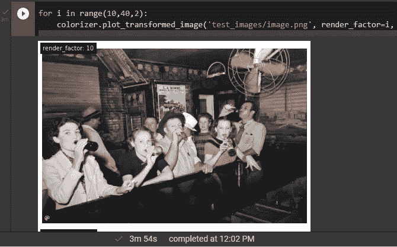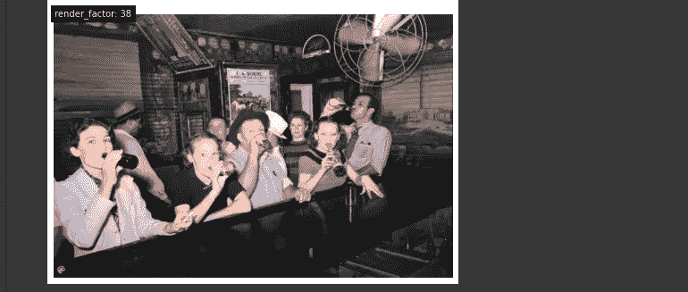

渲染因子为 10 的图像颜色为蓝色，渲染因子为 38 的图像颜色均匀，看起来更好。

# 额外资源

[](https://github.com/jantic/DeOldify) [## GitHub - jantic/DeOldify:一个基于深度学习的项目，用于着色和恢复旧图像…

### 快速入门:使用开源 DeOldify 给图像着色的最简单方法(免费！)在这里:DeOldify Image…

github.com](https://github.com/jantic/DeOldify) [](https://colab.research.google.com/github/jantic/DeOldify/blob/master/ImageColorizerColab.ipynb#scrollTo=GcsQPXrj6q4k) [## 谷歌联合实验室

### 编辑描述

colab.research.google.com](https://colab.research.google.com/github/jantic/DeOldify/blob/master/ImageColorizerColab.ipynb#scrollTo=GcsQPXrj6q4k)