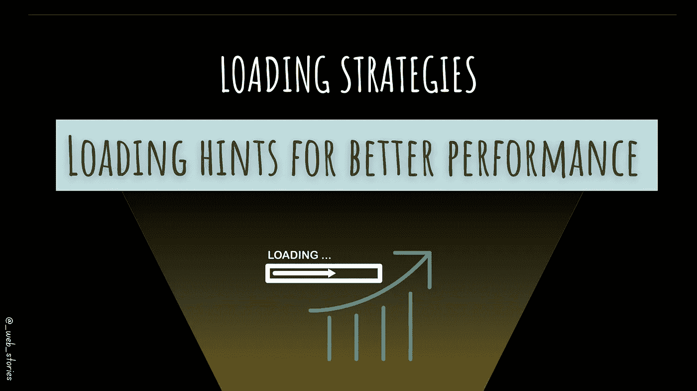

# 浏览器内置加载策略

> 原文：<https://levelup.gitconnected.com/browser-built-in-loading-strategies-f952873be53d>

## 为了更好的网站性能！

作者:FAM

## 你好👋

消耗 web 性能的是资源的加载时间。幸运的是，现代浏览器配备了内置的提示，可以高效地加载资源，从而创造更好的用户体验和网站性能。

你不需要安装任何东西，因为所有这些加载策略都已经内置在你的浏览器中了。这些提示看起来像这样:

让我们进一步了解它们。

# 每个人的工作

*   `[**preload**](https://developer.mozilla.org/en-US/docs/Web/HTML/Link_types/preload)`–当您希望在页面生命周期的早期，在[**dns-prefetch**](https://medium.com/geekculture/critical-rendering-path-92f1ddcf02e8#dns-prefetch):屏蔽 DNS 解析延迟。当你想指向你的站点或域名时，这种方法无效。
*   `[**prerender**](https://3perf.com/blog/link-rels/#prerender)`:因为资源已经加载，所以可以立即渲染，从而获得更好的用户体验。
*   `[**modulepreload**](https://developer.mozilla.org/en-US/docs/Web/HTML/Link_types/modulepreload)`:适合强制 JS 模块，让你的 app 更快。

> 参考:[https://developer.mozilla.org/](https://developer.mozilla.org/)

今天就到这里，看阿雅🙋

如果您有任何问题或反馈，请点击评论或通过 LinkedIn 联系我— **我洗耳恭听！**

[**想请我喝杯咖啡吗？☕️**](https://www.buymeacoffee.com/fatimaamzil)

> 让我们为 2022 年打造一个更好的‘我们’！

## 了解有关 2022 年网络快车计划的更多信息:

I- [通用网络知识](https://medium.com/geekculture/2022-web-program-chapter-n-1-is-done-499fb0707220?source=your_stories_page----------------------------------------)

[II-网页框架:HTML](https://famzil.medium.com/your-html-essentials-69d9b2349355?source=your_stories_page----------------------------------------)

[III-网页风格:CSS](https://medium.com/geekculture/recap-of-the-css-chapter-ae388d51e564?source=your_stories_page----------------------------------------)

[四网互动:JavaScript](/congrats-to-js-chapter-finishers-e38a3ca1612c)

[虚拟物料清单& DOM](http://8c48)

## VI-网络性能

*   [关键渲染路径(CRP 和 CSSOM)](https://medium.com/geekculture/critical-rendering-path-92f1ddcf02e8?source=your_stories_page-------------------------------------)
*   [回流](https://medium.com/geekculture/the-browser-reflow-whereabouts-c3d963eabe4a?source=your_stories_page-------------------------------------)

> **预加载、预连接、预取、预呈现、…**

*   渲染性能
*   工人
*   图像优化
*   …

 [## 2022 网络计划启动！

### 改变来自心态和习惯

medium.com](https://medium.com/geekculture/2022-web-program-is-launched-f38a3280af1a) 

与想成为 web 开发人员的人分享该程序！这将有助于保持进步，并在旅途中互相帮助。

> 如果你喜欢我的文章， [**订阅**](https://famzil.medium.com/subscribe) 获取我的最新。如果你自己喜欢体验媒介，可以考虑通过[**注册会员来支持我和其他成千上万的作家。它只需要每月 5 美元，它支持我们，作家，你也有机会用你的作品赚钱。当然，你可以随时取消会员资格。通过注册**](https://famzil.medium.com/membership)**[这个链接](https://famzil.medium.com/membership)，你将直接用你的一部分费用来支持我，不会花你更多的钱。如果你这样做了，万分感谢！**

让我们在 [**上**取得联系****](https://medium.com/@famzil/)**[**Linkedin**](https://www.linkedin.com/in/fatima-amzil-9031ba95/)**[**脸书**](https://www.facebook.com/The-Front-End-World)**[**insta gram**](https://www.instagram.com/the_frontend_world/)**[**YouTube**](https://www.youtube.com/channel/UCaxr-f9r6P1u7Y7SKFHi12g)**或**********

****** [## 通过我的推荐链接——FAM 加入 Medium

### 作为一个媒体会员，你的会员费的一部分会给你阅读的作家，你可以完全接触到每一个故事…

famzil.medium.com](https://famzil.medium.com/membership)****** 

# ******分级编码******

******感谢您成为我们社区的一员！更多内容见[升级编码出版物](https://levelup.gitconnected.com/)。
跟随:[推特](https://twitter.com/gitconnected)，[领英](https://www.linkedin.com/company/gitconnected)，[简讯](https://newsletter.levelup.dev/)
升一级就是改造科技招聘👉 [**加入我们的人才集体**](https://jobs.levelup.dev/talent/welcome?referral=true)******