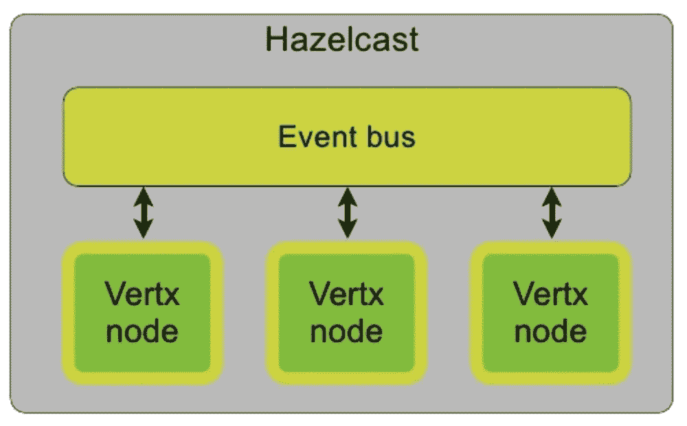
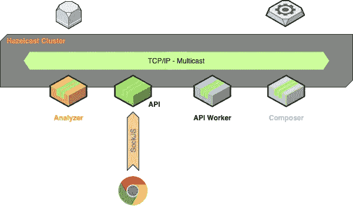
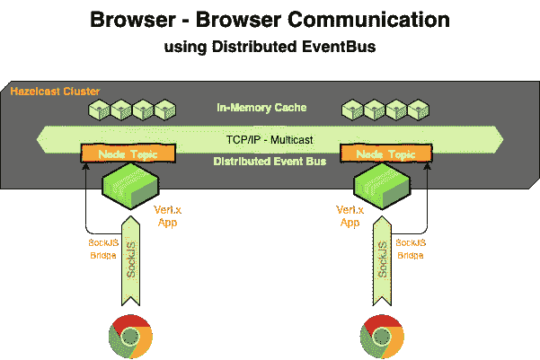
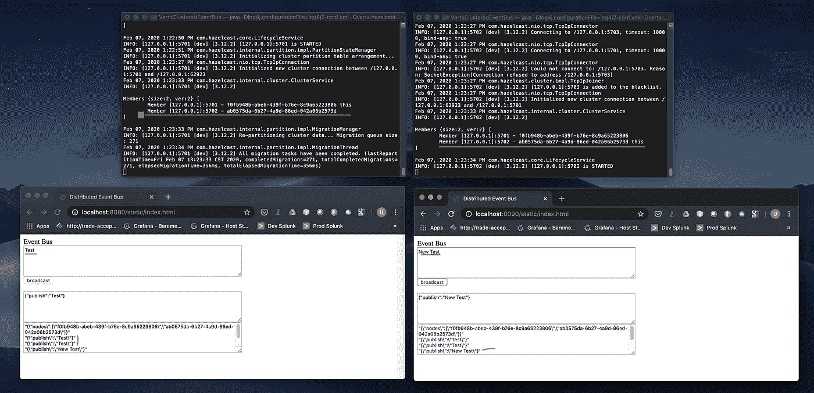

# 使用 Vert.x 和 Hazelcast 进行浏览器对浏览器通信

> 原文：<https://levelup.gitconnected.com/browser-to-browser-communication-with-vert-x-and-hazelcast-cluster-450b16903a55>

无需通过中央服务器就能在浏览器之间执行点对点消息传递的能力，将为游戏和协作应用等实时应用带来大量机会。

Vert.x 使应用程序能够使用 SockJS Bridge 将浏览器连接到后端的事件总线。桥的使用将连接的应用程序直接放在后端事件总线上，跳过了使用中介在后端重新发布消息的需要。通信的对等性质减少了通信的负载和延迟，因为中间没有服务器来处理和代理消息。

# 使用 Hazelcast 进行聚类

Vert.x 支持集群和现成的 HA。集群组管理在可插拔的集群管理器中实现。默认的集群管理器使用 Hazelcast，但是可以用另一个实现来代替，因为 Vert.x 集群管理器是可插拔的。



黑兹尔卡斯特星团

Vert.x 集群管理器用于各种功能，包括:

*   集群中 Vert.x 节点的发现和组成员身份
*   维护集群范围的主题订阅者列表(这样我们就知道哪些节点对哪些事件总线地址感兴趣)
*   分布式地图支持
*   分布式锁
*   分布式计数器

*注意:集群管理器不处理事件总线节点间的传输，这是由 Vert.x 通过 TCP 连接直接完成的。*



通过使用分布式事件总线，我们可以构建一个具有动态负载平衡的统一 API，具有多样化的后台任务和一个可以随着负载发展和扩展的异步 API。

让我们来看一个 Vert.x 应用程序的例子，它使用 Hazelcast 进行集群，以实现浏览器到浏览器的通信。



## 添加 Hazelcast 集群管理器

如果您想在 Vert.x Maven 或 Gradle 项目中使用 Hazelcast 集群管理器添加集群，那么只需在项目中添加一个对工件:`io.vertx:vertx-hazelcast:3.8.5`的依赖项。

如果 jar 在您的类路径中，那么 Vert.x 会自动检测到这一点，并将其用作集群管理器。请确保您的类路径中没有任何其他集群管理器，否则 Vert.x 可能会选择错误的管理器。

如果通过在创建 Vert.x 实例时在选项上指定来嵌入 Vert.x，也可以通过编程方式指定集群管理器。

```
ClusterManager mgr = new HazelcastClusterManager();
VertxOptions options = new VertxOptions().setClusterManager(mgr);  Vertx.clusteredVertx(options, res -> {   
    if (res.succeeded()) {
       Vertx vertx = res.result();
    } else {
        *// failed!*   
    }
});
```

## 配置集群管理器

通常集群管理器是由打包在 jar 中的文件`default-cluster.xml`配置的。如果您想覆盖这个配置，您可以在您的类路径上提供一个名为`cluster.xml`的文件，这个文件将被使用。如果要将`cluster.xml`文件嵌入到 fat jar 中，它必须位于 fat jar 的根目录。如果是外部文件，包含该文件的**目录**必须添加到类路径中。覆盖配置的另一种方法是为系统属性`vertx.hazelcast.config`提供一个位置。

```
*# Use a cluster configuration located in an external file* 
java -Dvertx.hazelcast.config=config/my-cluster-config.xml -jar ...
```

下面给出了基于 TCP/IP 的加入和发现的示例集群配置。如果您的网络支持多播，您可以使用多播；如果在 AWS 上部署应用程序，您可以使用 AWS。

```
<?xml version="1.0" encoding="UTF-8"?>
<hazelcast xsi:schemaLocation=
  "[http://www.hazelcast.com/schema/config](http://www.hazelcast.com/schema/config) hazelcast-config-3.7.xsd"
  ae nv" href="http://www.hazelcast.com/schema/config" rel="noopener ugc nofollow" target="_blank">http://www.hazelcast.com/schema/config"
  xmlns:xsi="[http://www.w3.org/2001/XMLSchema-instance](http://www.w3.org/2001/XMLSchema-instance)">
    <network>
        <port auto-increment="true" port-count="20">5701</port>
        <join>
            <multicast enabled="false">
                <multicast-group>224.2.2.3</multicast-group>
                <multicast-port>54327</multicast-port>
            </multicast>
            <tcp-ip enabled="true">
                <interface>127.0.0.1</interface>
            </tcp-ip>
            <aws enabled="false">
                <access-key>my-access-key</access-key>
                <secret-key>my-secret-key</secret-key>
                <!--optional, default is us-east-1 -->
                <region>us-west-1</region>
                <!--optional, default is ec2.amazonaws.com. If set, region shouldn't be set as it will override this property -->
                <host-header>ec2.amazonaws.com</host-header>
                <!-- optional, only instances belonging to this group will be discovered, default will try all running instances -->
                <security-group-name>hazelcast-sg</security-group-name>
                <tag-key>type</tag-key>
                <tag-value>hz-nodes</tag-value>
            </aws>
        </join>
    </network>
</hazelcast>
```

在嵌入了 Vert.x 的应用程序驱动程序类中，为集群创建一个 Vert.x 实例如下:

```
public void start() {
    ClusterManager mgr = new HazelcastClusterManager();
    VertxOptions vOptions = new VertxOptions().setBlockedThreadCheckInterval(1000)
                                              .setClusterManager(mgr);
    Vertx.clusteredVertx(vOptions, res -> {
        if (res.succeeded()) {
            m_vertx = res.result();
            m_vertx.deployVerticle(new ApiVerticle(), (result) -> {
                if (result.succeeded()) {
                } else {
                }
            });
        } else {
            // failed!
        }
    });
}
```

Verticle 可以在其 start()方法中检测它是否运行在集群应用程序上。

```
@Override
public void start() throws Exception {
    if (vertx != null && vertx.isClustered()) {
        m_clusterManager = ((VertxInternal)vertx).getClusterManager();
        m_node_id = m_clusterManager.getNodeID();
    } else {
        // No cluster
    }
}
```

一旦我们创建了一个部署了 Verticle 的集群 Vert.x 实例，我们就可以通过事件总线连接浏览器了。

```
// Create a router object.
m_router = Router.router(vertx);// set in and outbound permitted addresses
// Allow events for the designated addresses in/out of the event bus bridge
BridgeOptions opts = new BridgeOptions()
  .addInboundPermitted(new PermittedOptions().setAddress("to.api"))
  .addInboundPermitted(new PermittedOptions().setAddress("to.api."+m_node_id))
  .addOutboundPermitted(new PermittedOptions().setAddress("to.client"))
  .addOutboundPermitted(new PermittedOptions().setAddress(m_node_id+".to.client"));SockJSHandler sockJSHandler = SockJSHandler.create(vertx);
sockJSHandler.bridge(opts, event -> {
  // This signals that it's ok to process the event
  event.complete(true);
});
m_router.route("/eventbus/*").handler(sockJSHandler);
```

我们现在可以在事件总线主题上连接消息处理程序，以处理和响应事件总线上的各种消息。这种方法的美妙之处在于它可以灵活地忽略消息的来源，只要它使用正确的话题来听。

```
// Register to listen for messages coming IN to the server
vertx.eventBus().consumer("node."+m_node_id).handler(message -> {
    // Send the message back out to all clients
    vertx.eventBus().publish(m_node_id+".to.client", message);
});
vertx.eventBus().consumer("to.api."+m_node_id).handler(message -> {
    String json_request = (String) message.body();
    JsonObject json_request_obj = new JsonObject(json_request);
    String id = json_request_obj.getString("node", "");
    // Send the message back out to all clients
    vertx.eventBus().send("node."+id, message);
});
vertx.eventBus().consumer("to.api").handler(message -> {
    String json_request = (String) message.body();
    JsonObject json_request_obj = new JsonObject(json_request);
    if (json_request_obj.containsKey("GetNodes")) {
        sendNodes();
    } else {
        vertx.eventBus().publish("to.client", json_request);
    }
});
```

我们可以使用集群管理器查询集群中的所有节点。

```
private void sendNodes() {
    List<String> nodes = m_clusterManager.getNodes();
    JsonObject obj = new JsonObject();
    JsonArray arr  = new JsonArray();
    for (String node : nodes) {
        arr.add(node);
    }
    obj.put("nodes", arr);
    vertx.eventBus().send("to.client", obj.encode());
}
```

浏览器客户端可以在事件总线上注册自己，并附加消息处理程序来侦听和响应针对其感兴趣的主题的任何消息。

```
var eb = new EventBus("/eventbus/");
eb.onopen = function () {
  eb.registerHandler("to.client", function (err, msg) {
      var str = unescape(msg.body);
      var serverArea = document.getElementById("outserver");
      serverArea.value += JSON.stringify(str)+'\n'
  });
  loadNodes();
};
function loadNodes() {
    var request = "{\"GetNodes\":{}}";
    eb.send("to.api", request);
}
```

使用分布式事件总线上的主题来响应到达它所关心的主题的任何消息。

```
var inputArea = document.getElementById("in");
var outputArea = document.getElementById("out");
var sendButton = document.getElementById("send");
var broadcastButton = document.getElementById("broadcast");sendButton.onclick = function() {
    var message = {};
    message["send"] = inputArea.value;
    eb.send("to.api",JSON.stringify(message));
    outputArea.value += JSON.stringify(message)+'\n'
    outputArea.scrollTop = outputArea.scrollHeight;
};
broadcastButton.onclick = function() {
    var message = {};
    message["publish"] = inputArea.value;
    eb.publish("to.api",JSON.stringify(message));
    outputArea.value += JSON.stringify(message)+'\n'
    outputArea.scrollTop = outputArea.scrollHeight;
};
```



该示例 API 应用程序的完整工作示例可在[https://github.com/pvub/VertxPolyglotClusterdEventBus](https://github.com/pvub/VertxPolyglotClusterdEventBus)找到

编码快乐！