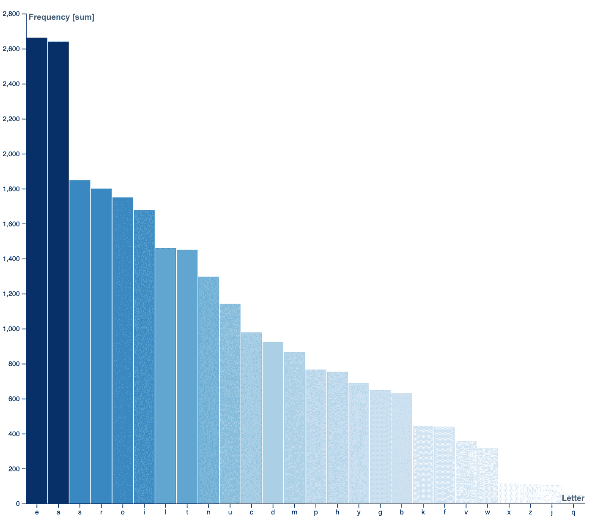
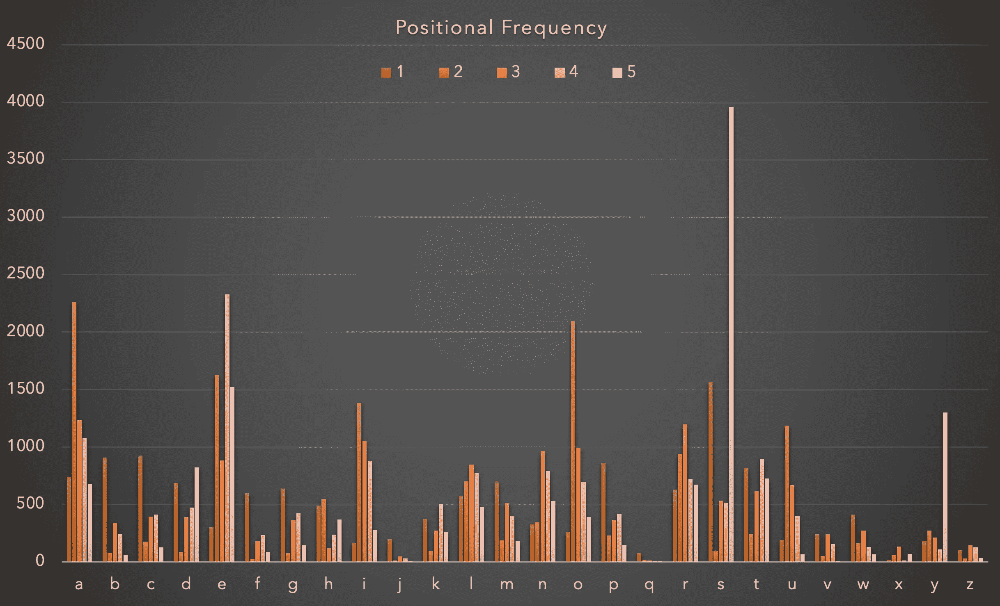

# 强力 Wordle 解决方案

> 原文：<https://levelup.gitconnected.com/brute-forcing-wordle-solutions-ce4c5f8d1200>

## 徒劳无功的练习


Ashkan Forouzani 在 [Unsplash](https://unsplash.com?utm_source=medium&utm_medium=referral) 上的照片

[Wordle](https://www.powerlanguage.co.uk/wordle/) 是一个非常受欢迎的文字游戏，你必须通过猜测其他 5 个字母的单词来猜测一个 5 个字母的单词。你只有 6 次机会这样做。每次猜测都会显示出猜测中的字母是否正确——相对于其在要猜测的实际单词中的位置&。

这是一个引人入胜的游戏。一个我每天花几分钟看的…

直到有一天，我决定用我可怜的 python 排骨，想一想我是否能得到一个解决方案，没有想太多。

*注意:我不是程序员、数据科学家或语言学家。我有工具和蛮力心态。我可以&我的很多假设都会是错的。对我来说，重要的是去做，而不是去想。*

# 第一次尝试

这个想法相当简单——英语中有 5 个单词(依我拙见)有 25 个独特的字母。如果不是 25，那么至少是 24，剩下的 2 留给你猜。如果不是 24，至少是 23。你明白我的意思了吧。

例如，单词:

1.  拉格比
2.  街区
3.  主要的
4.  投入
5.  班

盖上 20 个字母，剩下的 6 个让你猜。您可以用这段小小的 python 代码做到这一点:

```
x = "RugbyBlockChiefInputSquad"
currentString = "".join((x.lower()))
uniqueString = ''.join(set(currentString))
print(uniqueString + "  " + str(len(uniqueString)))
print("".join(sorted(uniqueString))) ## Returns the sorted string

**Output:**
hotifbregnplcuqsdkay  20
abcdefghiklnopqrstuy
```

缺少的字母是:

J M V W X Z

如果计数从 20 上升到 23，你就能更好地猜测了。再加上字母的频率(从 5196 个单词的列表中):



你会发现在前 5 次尝试后，你有很大程度的预测能力。

我在这里详细记录了第一次尝试。我将在这里总结一下高级方法:

1.  从 5196 个单词的列表中选择 5 个单词的组合。把它想成一个列表:
    ["word1 "、" word2 "、" word3 "、" word4 "、" word5"]
    对于第一个位置，有 5196 种可能。对于第二个，有 5195 种可能性等等…
2.  将列表压缩成一个字符串，并删除重复的字母。
3.  查找唯一字母的数量。如果计数超过 22，我们就要开始工作了。否则，转到下一个。

很简单，对吧？理论上，是的。实际上，这是一个梳理 234，356，702，080，215 次迭代的问题(在 1951 个单词的精简集上)。也就是 234 万亿。以每秒 1 万次运算的速度，那就是 743.1 年！

我做了一些优化来更快地找到解决方案，通过随机化、移动窗口，以及在形成组合时进行优化(如果前 3 个单词没有创建唯一的字符串，则丢弃该集合并移动到下一个)。

# 第二次尝试

在我打算做的第二次尝试中，我将从科学的角度来看待这个问题:

1.  在 Wordle 上找到合法的单词。
    在网站上翻来翻去，我发现开发者们很有风度地将所有可能的单词加入到一个数组中。数组大小为 12，972。这增加了**我的迭代计数到 3，058，571，387，612，500，000…😵也就是 969.86 万年。**
2.  **确定两个位置的概率&字母频率**
    利用这些数据，我首先会找出一个字母占据第一、第二位置的概率是多少，以此类推……同样，我会更新字母频率图。
3.  **想想辅音&元音之间的关系。有没有可能只知道元音，就能找到单词？还是只知道辅音就能更快地找到单词？从某种意义上说，如果我知道前三个单词中元音出现的位置，猜测在某种程度上变得更容易？我不知道。也许吧。**
4.  **并行处理以降低时间复杂度**
    这是一个[令人尴尬的并行](https://en.wikipedia.org/wiki/Embarrassingly_parallel)问题。很尴尬，不知道怎么并行。稍后将详细介绍。我无法让我的笔记本电脑连续运行几天。
5.  **利润？**
    真不知道有什么好处。但感觉这是一件有趣的事情。

# 位置概率&字母频率

这感觉是一件很琐碎的事情。比我聪明的人可以解释这里的结果。

## 密码

```
from wordle_words import words
from string import ascii_lowercase
import json

frequencyCounter = {}

for c in ascii_lowercase: ## Prepare the dictionary
    frequencyCounter[c] = {
        '1' : 0,
        '2' : 0,
        '3' : 0,
        '4' : 0,
        '5' : 0,
    }

def spliter(word): ## word splitter
    return [char for char in word]

for word in words: # Pick up a single word
    letterList = spliter(word)  # Convert it to a list

    i = 1    #To keep a track of which position we're on
    for letter in letterList: # Update the frequency counter
        frequencyCounter[letter][str(i)] += 1 # Increment value
        i += 1 #Increment position

print (json.dumps(frequencyCounter)) ##Dump json for converting to CSV
```

## 以下是输出:



我认为下一步将是找到涵盖最常见频率和位置的单词。

—

请继续关注这方面的更多冒险。我显然不能等待千百年来等待暴力完成。一定有更好的解决方案。

我还没有谷歌过。Github [*这里*](https://github.com/medicantBias117/wordle-bruteforce) *的所有代码都有。*

—

感谢您的阅读！我很想知道你是否找到了帮助你更快进入 word 的方法？