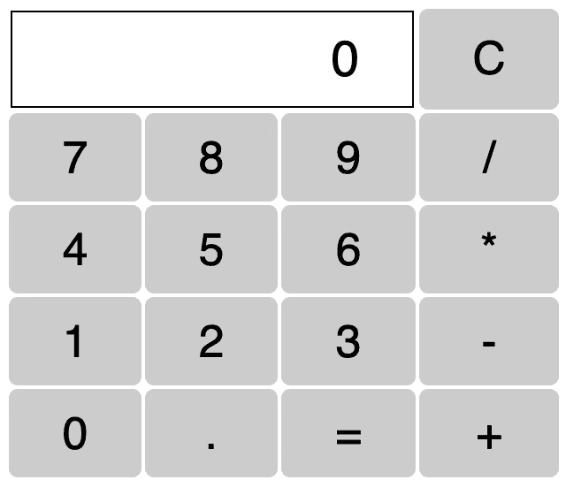

# Brython:关于用 Python 代替 JavaScript 进行前端开发

> 原文：<https://levelup.gitconnected.com/brython-on-replacing-javascript-with-python-for-front-end-development-5baf3064a067>

本文最初发布于`[https://blog.rajivabraham.com/posts/brython](https://blog.rajivabraham.com/posts/brython)`

# 目的。

这篇博客文章将简要介绍如何使用 [Brython](https://brython.info/) ，这是一个用于浏览器前端开发的 Python 实现。

整个项目在这里是。

# 介绍

出于对 JavaScript 程序员的嫉妒，一群 Python 程序员秘密开会讨论 Python 在这个世界末日的未来。JavaScript 无处不在，吃着 Python 的午餐。随着 Node.js 的出现，JavaScript 入侵了 Python 的领地，结束了它作为继 Ruby 之后每个人都喜欢的语言的统治地位(那时不是很占优势，对吧？作者先生)。是时候进军 JavaScript 领域的心脏了:浏览器。

# 不要忘记你的历史(和未来)

阴谋集团并不是唯一关心这个困境的绅士。Transcrypt 的作者相信毒药和间谍活动。他决定编写一个 Python 编译器来编译 JavaScript 代码。像上好的毒药一样，没有蟒蛇的踪迹。看起来很有希望。但是这篇无聊帖子的作者认为他发现了一个错误，但后来发现并非如此。不明智的是，他把 Transcrypt 放到了一个次要的地方，现在必须把它放在那里。

其他人想从历史中学习。干脆全家移民。至少， [Pyodide](https://hacks.mozilla.org/2019/04/pyodide-bringing-the-scientific-python-stack-to-the-browser/) 是这么想的。他们的策略是创建一个附带完整 Python 解释器的飞地，该解释器可以运行 Python 代码。因此，您可以运行任何 Python 代码，包括包含 C 语言绑定的大部分数据科学堆栈(例如 Numpy、Pandas)。

这看起来也很有希望。但是在作者最初的懒惰测试中，最初的页面加载有点慢(真正的原因是作者也找不到一种简单的方法来完成这项工作，并且很高兴不再进一步追求它。)

所以阴谋集团决定做每个阴谋集团应该做的事情，即创建另一个 Python 到 JavaScript 的编译器，但这一次，在页面加载时将其编译成 JavaScript(不像 Transcrypt 提前编译成 JavaScript)。这样，布里逊联谊会就成立了。一条蛇来统治他们。

# 你好世界

让我们把习惯的“你好，世界”编码起来

布里森伞兵(编译器)在这里。

```
<script type="text/javascript"
       src="https://cdn.jsdelivr.net/npm/brython@3.8.9/brython.min.js">
</script>
```

我们在页面加载时激活它

```
<body onload="brython()">
...
</body>
```

在上面的`body`标签中，我们编写了 Brython 代码:

```
<script type="text/python">
from browser import documentdocument <= "Hello World"
</script>
```

我们只是将`Hello World`添加到文档元素中。嗯。那很容易。

完整的形式如下所示。

```
<!doctype html>
<html>
<head>
    <meta charset="utf-8">
    <script type="text/javascript"
        src="https://cdn.jsdelivr.net/npm/brython@3.8.8/brython.min.js">
    </script>
</head><body onload="brython()"><script type="text/python">
from browser import documentdocument <= "Hello World"
</script>
</body>
</html>
```

这将简单地在页面上打印“Hello World”。

# 计算器

现在让我们制作一个计算器(代码提供:Brython)。完整的代码是[这里](https://github.com/RAbraham/brython-blog/blob/master/calculator.html)



是的，你是对的。我们确实需要一张桌子。我们做一个吧。

```
from browser import document, html
calc = html.TABLE()
```

让我们只添加第一行。只有显示框(我们将其命名为`result`)和`C`。

```
calc <= html.TR(html.TH(html.DIV("0", id="result"), colspan=3) +
                html.TD("C"))
```

是的，我也不是很确定这个`<=`语法。不过嘿，这么可爱的图书馆，我也将就一下:)。

现在让我们添加数字键盘

```
lines = ["789/", "456*", "123-", "0.=+"]
calc <= (html.TR(html.TD(x) for x in line) for line in lines)
```

最后，我们将`calc`添加到`document`

```
document <= calc
```

现在一切都好了。我们如何让它工作？首先，我们需要捕获对`result`元素的引用，以便在按下数字键盘时对其进行操作。

```
result = document["result"] # direct access to an element by its id
```

接下来，每当数字键盘中的任何元素被点击时，我们需要更新`result`。让我们创建一个事件处理程序。我们相信 Brython 开发人员的代码是有效的。注意基于您点击的按钮对`result`的操作。

```
def action(event):
    """Handles the "click" event on a button of the calculator."""
    # The element the user clicked on is the attribute "target" of the
    # event object
    element = event.target
    # The text printed on the button is the element's "text" attribute
    value = element.text
    if value not in "=C":
        # update the result zone
        if result.text in ["0", "error"]:
            result.text = value
        else:
            result.text = result.text + value
    elif value == "C":
        # reset
        result.text = "0"
    elif value == "=":
        # execute the formula in result zone
        try:
            result.text = eval(result.text)
        except:
            result.text = "error"
```

最后，我们将上面的事件处理程序与所有按钮的`click`事件关联起来。

```
for button in document.select("td"):
    button.bind("click", action)
```

看到了吧，别人写代码是多么容易:p .但是说真的，Brython 是工程学的一个奇葩，也许是程序员对他们钟爱的 Python 语言热爱的最好展示。请支持开发者，至少在他们的 Github [repo](https://github.com/brython-dev/brython) 上打上一颗星！

# 对于高级读者来说

*   也可以集成像 Vue.js 这样的第三方库，如此处的[所示](https://brython.info/gallery/test_vue.html)。
*   可以在[这里](https://anvil.works/blog/python-in-the-browser-talk)找到对这些概念的深入解释