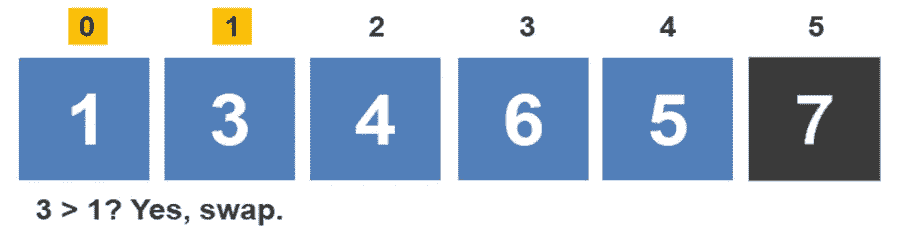

# 冒泡排序算法直观讲解

> 原文：<https://levelup.gitconnected.com/bubble-sort-algorithm-visually-explained-5a21e9101c69>

冒泡排序算法按升序对项目数组进行排序。它遍历数组并比较相邻的元素。如果它们没有被排序，它就交换它们。然后不断重复这个过程，直到数组被完全排序。让我们来看一个例子。

在第一次迭代中比较以下元素:0 和 1、1 和 2、2 和 3、3 和 4 以及 4 和 5。在第一次迭代的第一次比较中，比较索引 0 和 1 处的元素。因为 3 小于 7，所以元素保持在当前位置。

接下来，比较索引 1 和 2 处的元素。因为 7 大于 1，所以元素被交换。

接下来，比较索引 2 和 3 处的元素。因为 7 大于 4，所以元素被交换。

移动到元素 3 和 4，该算法比较值 7 和 6。因为 7 大于 6，所以值被交换。

最后，比较索引 4 和 5 处的元素。因为 7 小于 5，所以元素被交换。

这就完成了第一次迭代。我们知道最后一个元素是完全排序的。在下一次迭代中，将不会比较最后一个元素。因此，在第二次迭代中，将发生以下比较:0 和 1，1 和 2，2 和 3，3 和 4。

冒泡排序算法开始第二次迭代。比较索引 0 和 1 处的值。因为 3 大于 1，所以元素被交换。

接下来，该算法比较值 3 和 4。因为 3 小于 4，所以这些值保持在当前位置。

比较索引 2 和 3 处的值。因为 4 小于 6，所以这些值不会交换。

冒泡排序算法比较索引 3 和 4 处的值。因为 6 大于 5，所以元素被交换。

通过观察数组，我们可以很快看到数组已经排序，但是冒泡排序算法一直在运行，因为它不知道它已经完成了。它开始第三次迭代。因为 1 小于 3，所以值不会交换。

接下来，比较 3 和 4。因为 3 小于 4，所以值不会交换。

最后，比较值 4 和 5。因为 4 小于 5，所以这些值保持在当前位置。这完成了第三次迭代。冒泡排序算法保证它已经找到了序列中的最后 3 个数字。

冒泡排序开始第四次迭代。因为 1 小于 3，所以值不会交换。

接下来，该算法比较索引 1 和 2 处的值。因为 3 小于 4，所以元素保持在当前位置。这结束了第四次迭代。该算法保证最后 4 位数字已经排序。还有一次迭代。

冒泡排序算法在第五次迭代时开始工作。它只有一个比较:值 1 和 3 之间的比较。因为 1 小于 3，所以值保持在它们的当前位置，并且算法完成第五次迭代。

没有要执行的进一步比较。冒泡排序算法已经在 n-1 次迭代中对数组进行了排序，在本例中等于 5。

下面的例子是有意选择的，以表明即使冒泡排序算法在 2 次迭代中完成了排序，仍然需要 n-1 次迭代来完成算法的执行。可以推断出，冒泡排序算法对于大数据集是无效的；它总是在 O(n2)中运行。

> ***

如果你喜欢你所读的，我的书，**【算法的说明性介绍】，涵盖了这个算法和更多。**

# *我的书:算法的说明性介绍*

**

*这本书是为了填补计算机科学学生和程序员试图学习和分析目前存在的不同算法的空白而写的。我上了一门算法课程，对目前可用的材料类型感到失望。我经常碰到两种类型的书:*

*   *第一，过于复杂的书。这本书看起来像是为那些已经对这个主题很熟悉，并且想要一个更详细的数学算法的人设计的。*
*   *第二，过于简单的书。算法的基本介绍。这是对一些算法的高级概述，大部分复杂的算法都没有提到。完成后，这个人仍然不能展示当出现问题时算法是如何运行的。*

*这本书是为想要扩展视野的大学高年级学生和程序员设计的。它可以和复杂的书一起作为补充的书。读者将获得必要的知识来解决那些复杂的书中提出的数学密集型算法问题。每章包括一个简单的描述算法是如何工作的，然后是一两个详细的例子。遍历过程中不会跳过任何步骤。给读者呈现一个清楚的，简化的方法来解决本章致力于的算法。*

*每一章都遵循前一章的自然发展。如果某些算法很大程度上依赖于先验知识，前一章会讨论这个话题。例如，Kruskal 的算法严重依赖于最小生成树和贪婪算法的先验知识。每个主题都有自己的一章。*

*现可在[**Amazon.com**](https://www.amazon.com/Illustrative-Introduction-Algorithms-Dino-Cajic-ebook-dp-B07WG48NV7/dp/B07WG48NV7/ref=mt_kindle?_encoding=UTF8&me=&qid=1586643862)买到*

**

*迪诺·卡伊奇目前是 [LSBio(寿命生物科学公司)](https://www.lsbio.com/)、[绝对抗体](https://absoluteantibody.com/)、 [Kerafast](https://www.kerafast.com/) 、[珠穆朗玛生物](https://everestbiotech.com/)、[北欧 MUbio](https://www.nordicmubio.com/) 和 [Exalpha](https://www.exalpha.com/) 的 IT 负责人。他还担任我的自动系统的首席执行官。他有十多年的软件工程经验。他拥有计算机科学学士学位，辅修生物学。他的背景包括创建企业级电子商务应用程序、执行基于研究的软件开发，以及通过写作促进知识的传播。*

*你可以在 [LinkedIn](https://www.linkedin.com/in/dinocajic/) 上联系他，在 [Instagram](https://instagram.com/think.dino) 上关注他，或者[订阅他的媒体出版物](https://dinocajic.medium.com/subscribe)。*

*[*阅读迪诺·卡吉克(以及媒体上成千上万其他作家)的每一个故事。你的会员费直接支持迪诺·卡吉克和你阅读的其他作家。你也可以在媒体上看到所有的故事。*](https://dinocajic.medium.com/membership)*