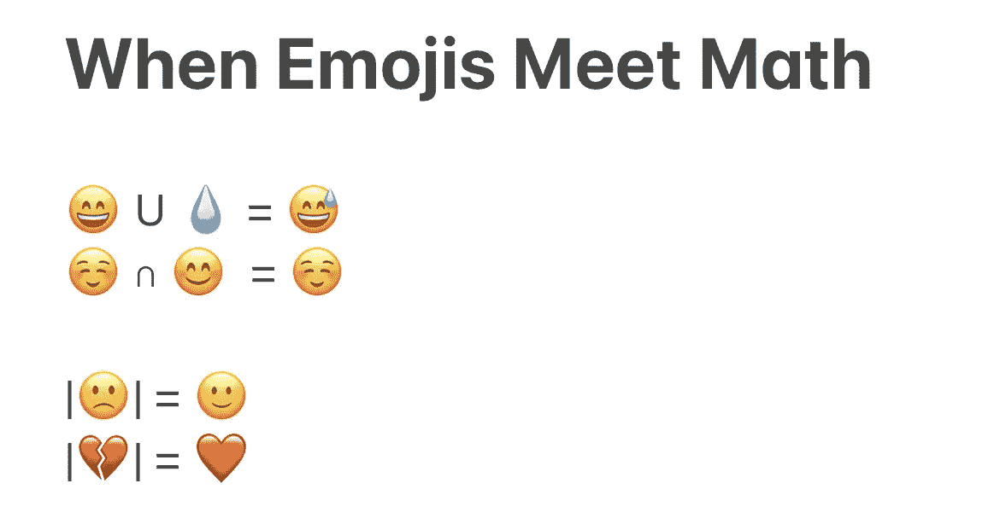
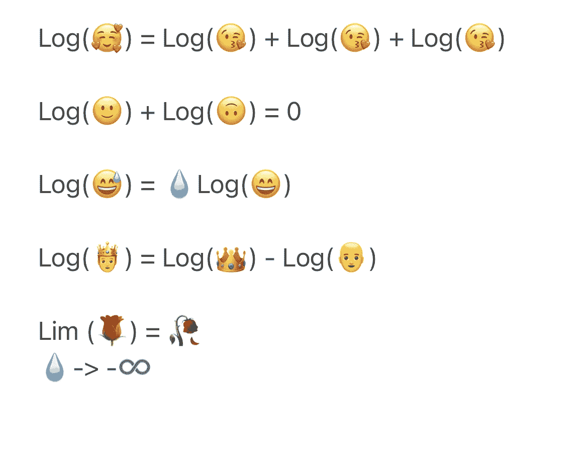
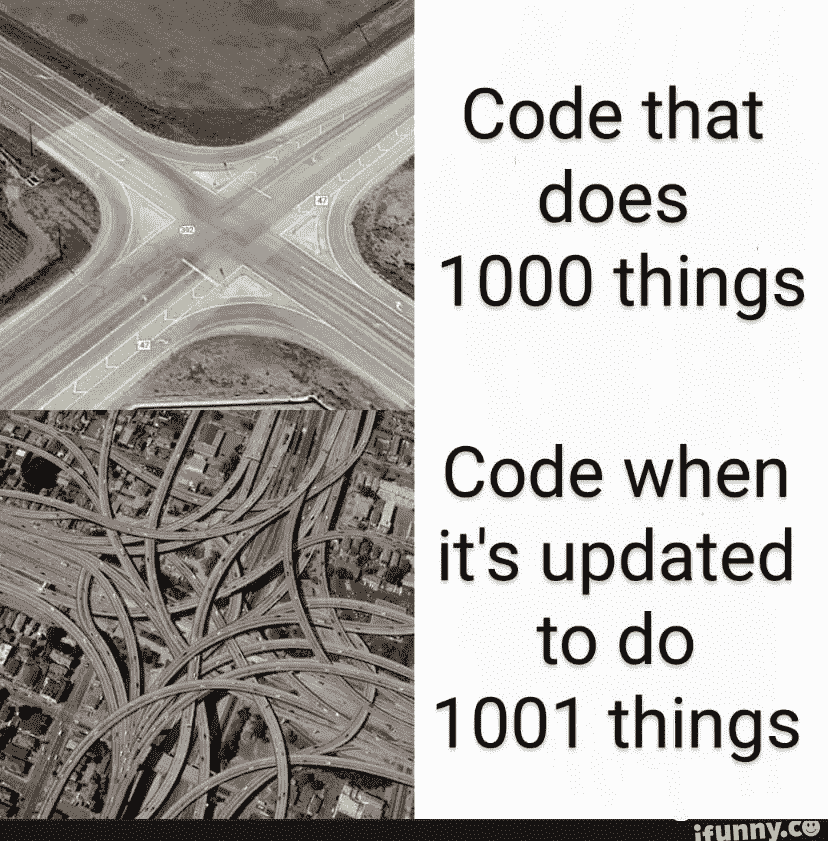
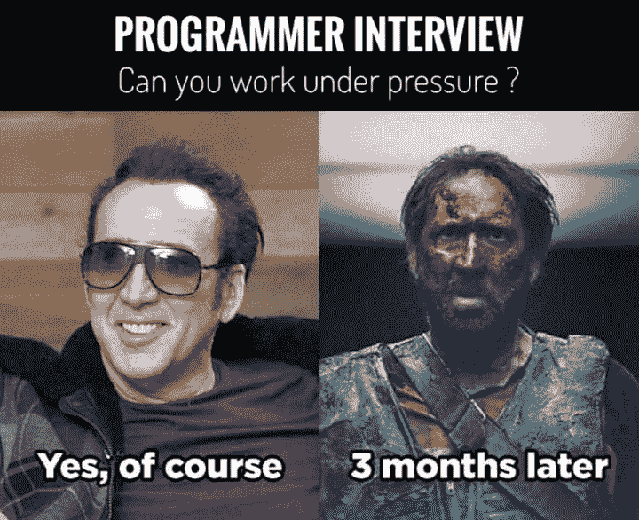
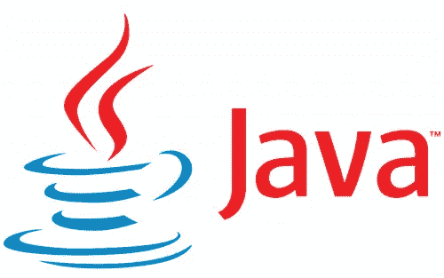
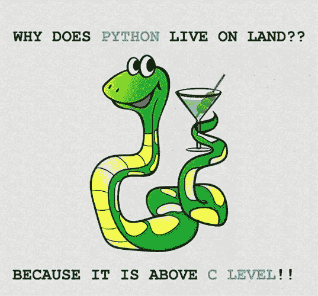
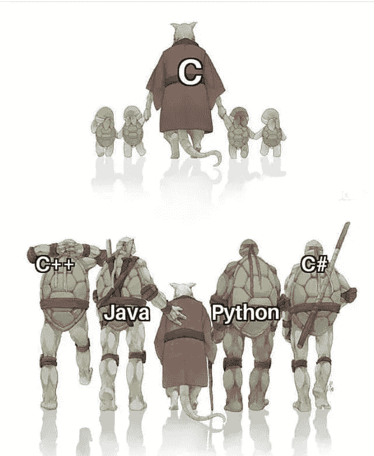

# 系好安全带。7 个搞笑的程序员迷因向你走来

> 原文：<https://levelup.gitconnected.com/buckle-up-7-hilarious-programmer-memes-headed-your-way-d696b3de5185>

让你笑到 2023 年的极客笑话

当我们走向 2022 年年底时，我想分享一些我最喜欢的让我崩溃的程序员迷因会很有趣。系好安全带，我们走吧！

是的，我们的列表必须从零开始！

## 0.当表情符号遇到数学

如果你发现自己很难记住数学运算，表情符号可以帮你解决！



作者创建的图像

**想要更多？！**



作者创建的图像

## 1.当你的客户要求你添加一个微小的功能时



【ifunny.com】图片来源:T2

## 2.开发人员应对难缠老板的指南

我们必须承认，与客户打交道并不总是我们工作中最容易的部分。然而，有时候，你的雇主也可以帮你安排，



[图片来源:Reddit](https://www.reddit.com/r/ProgrammerHumor/comments/d10tpf/thats_an_ambush_run/)

实话实说，“在压力下工作”不过是“你愿意加班却没有报酬”的糖衣而已，不是吗？

现在，如何不烧坏？你可能会问。嗯，在**喝一杯爪哇咖啡**怎么样？



[图片来源:JavaPoint](https://www.javatpoint.com/java-logo#:~:text=The%20Java%20logo%20is%20prototyped,consumed%20was%20Java%20coffee%20beans.)

如果 Java 不行，你的血管里就得有冰水(又名，保持冷静和控制)，就像**蟒蛇/蟒蛇们**做的那样，



[图像来源:probytes](https://www.probytes.net/blog/programming-memes-2018/)

## 3.编程语言的演变

说到 C 和 Python，它让我想起了编程语言的演变，



[图片来源:Reddit](https://www.reddit.com/r/ProgrammerHumor/comments/aehyv8/c_with_other_programming_languages/)

虽然我自己也是一个 Python 爱好者，但我很高兴地看到 ***小蟒龟*** 的受欢迎程度已经超过了 ***大师 Splinter C*** 就受欢迎程度而言，我更喜欢用这个来说明它们之间复杂的关系。


[图片来源:Reddit](https://www.reddit.com/r/ProgrammerHumor/comments/ftupjh/behind_every_oneliner_there_are_the_tears_of_many/)

## 4.“I”:第一个循环的常量变量名


[图片来源:Reddit](https://www.reddit.com/r/ProgrammerHumor/comments/lyeiky/i_the_constant_variable_name_for_first_loop/)

什么时候 `‘i’` 已经在用了？

[图片来源:张量](https://tenor.com/view/the-j-peter-griffin-poopshit-amogus-family-guy-gif-21866962)

## 5.隔离区的程序员？不存在！


[图片来源:脸书](https://m.facebook.com/photo.php?fbid=750479232024693&id=255282721544349&set=a.256282631444358&refid=13&__tn__=%2B%3E)

尽管如此，我们还是应该认真地去获得更多的**社交互动**,因为我们不想在下一次科技面试中出现这种情况。


[图片来源:脸书](https://www.facebook.com/codingninjas/photos/2083550821848738/)

## 6.实际上有意义的代码注释

随着 2022 年大规模技术裁员，每个人似乎都感到压力很大，并担心工作表现。因此，这些是人们实际上写的搞笑的代码注释，

```
/* 
***********************************************************
The reason this code does not work is on line 335 
This line is there because this customer has not paid for 
the application in over 2 years. 
************************************************************** 
*/ 
```

```
long time; /* know C */
```

```
// If this comment is removed the program will blow up
```

```
/*
* You may think you know what the following code does.
* But you dont. Trust me.
* Fiddle with it, and youll spend many a sleepless
* night cursing the moment you thought youd be clever
* enough to "optimize" the code below.
* Now close this file and go play with something else.
*/
```

# 离别赠言

失业、招聘冻结和其他全球和经济衰退，这些都是我们走向衰退的迹象。加上全球疫情，2022 年是艰难的一年。我希望这些有趣的迷因能让你笑逐颜开，我们一起度过难关！🙌

******🎥加入我们的 YouTube 数据科学家和开发者社区*** [***【数据与 Kat 对话】***](https://www.youtube.com/channel/UCbGx9Om38Ywlqi0x8RljNdw) ***😄热门视频:*** [***为什么有的人学编码比较快？***](https://www.youtube.com/watch?v=Cw2Co8enZhM)

***想要更多数据科学和编程技巧？使用*** [***我的链接***](https://yilistats.medium.com/membership) ***注册 Medium，获得我所有内容的完全访问权限。***

**你可能会觉得鼓舞人心的其他博客，**

[](https://towardsdatascience.com/python-3-11-new-features-that-you-will-truly-enjoy-9fd67882fdf) [## 您将真正喜欢的 Python 3.11 新特性

### 世界各地志愿者的努力值得称赞

towardsdatascience.com](https://towardsdatascience.com/python-3-11-new-features-that-you-will-truly-enjoy-9fd67882fdf) [](/3-small-sql-errors-that-cost-a-data-science-job-offer-7ee920084aed) [## 3 个小小的 SQL 错误让一份数据科学工作付出了代价

### 其中一个让我失去了一份 21.2 万美元的工作

levelup.gitconnected.com](/3-small-sql-errors-that-cost-a-data-science-job-offer-7ee920084aed)