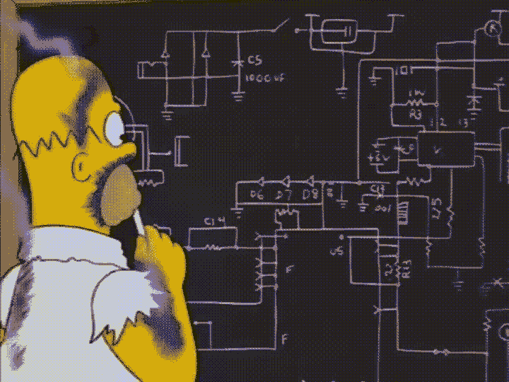
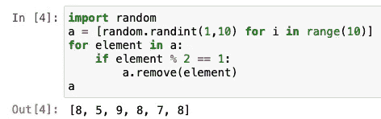
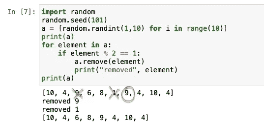
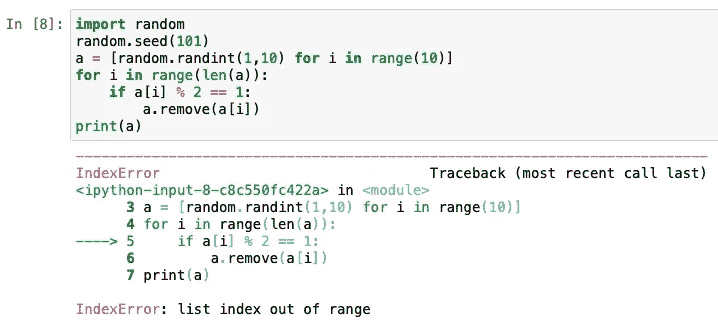
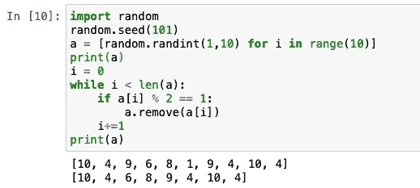
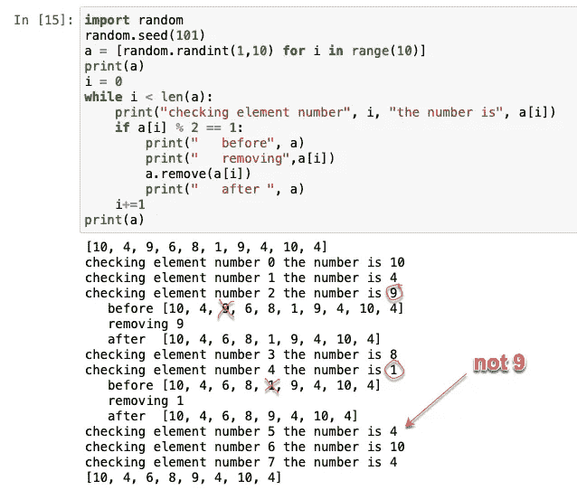
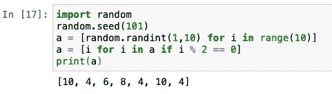
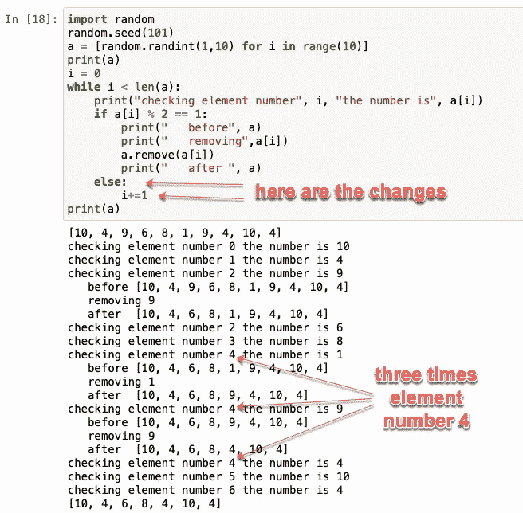

# 如何在 Python 中不过滤列表

> 原文：<https://levelup.gitconnected.com/bug-investigation-2-python-7bd5620ce9f5>

导致 bug 的常见错误

我最近[写了一篇关于 bug 调查](/bug-investigation-python-e2c5fcefbe40)的文章，展示了类中变量的惊人范围。

今天，我想展示另一个错误，它不仅是初学者经常犯的，也是一些“高级”开发人员经常犯的——主要是因为懒惰。

我们将尝试通过一些标准来过滤列表，什么可以更简单，以及有人如何在这里生成 bug？



# 错误的代码

我们创建一个由 10 个随机整数组成的列表，然后过滤掉奇数。最后，我们期望列表中只有偶数。

代码如下:

```
import random
a = [random.randint(1,10) for i in range(10)]
for element in a:
    if element % 2 == 1:
        a.remove(element)
```

这是令人惊讶的结果:



您可能会在输出中看到偶数和奇数。

慢慢来，试着自己找一个 bug。这很简单，虽然不明显。

# 一些见解

我会在这里帮你调试一下。

看看是不是真的把元素去掉了。为了确保我们总是有相同的随机数，我将使用“种子”函数。



好的，为什么第二个 9 还留在列表上？我们看到，第一个 9 被删除，所以毫无疑问它是奇数:)

为了理解这个问题，我们如下重构代码。



我们得到一个错误！什么？！哦，当然，列表会缩小，所以我们需要在每次迭代中检查列表的长度。让我们开始吧。



好吧，我们现在至少得到了同样的结果。有了精确的索引，调试就更容易了。我们再加一些印花吧。



在这里你可以看到，在检查了“1”之后，它跳过了“9”，转到了“4”。

# 问题的核心

当您删除一个元素时，它右边的所有元素都会向左移动。

假设您正在检查第 4 个元素，那么 i == 4。你要删除它。现在，第 5 个元素向左移动，成为第 4 个元素，而不是前一个元素！但是第 4 个元素已经被处理了，我们继续处理第 5 个元素，这是前 6 个元素！

因此，如果我们要删除一行中的两个元素，我们会跳过每隔一个元素，因为它被移动了。小心点！

# 解决方法

好吧，解决办法是什么？

首先，你可以使用发电机:



为什么不是发电机的问题？因为它不会删除原始列表中的任何元素，所以它会基于旧列表创建一个新列表。

第二，如果您真的需要使用索引，您可以注意元素编号，并且在您删除某些内容时不会增加它:



感谢您的关注！

把这个故事分享给你用 Python 写的朋友吧！

在这里看我的其他文章:【https://timurbakibayev.medium.com/

之前的 bug 调查在这里:

[](/bug-investigation-python-e2c5fcefbe40) [## Bug 调查(Python)

### 让我们一起在大树上找一只小虫子

levelup.gitconnected.com](/bug-investigation-python-e2c5fcefbe40)