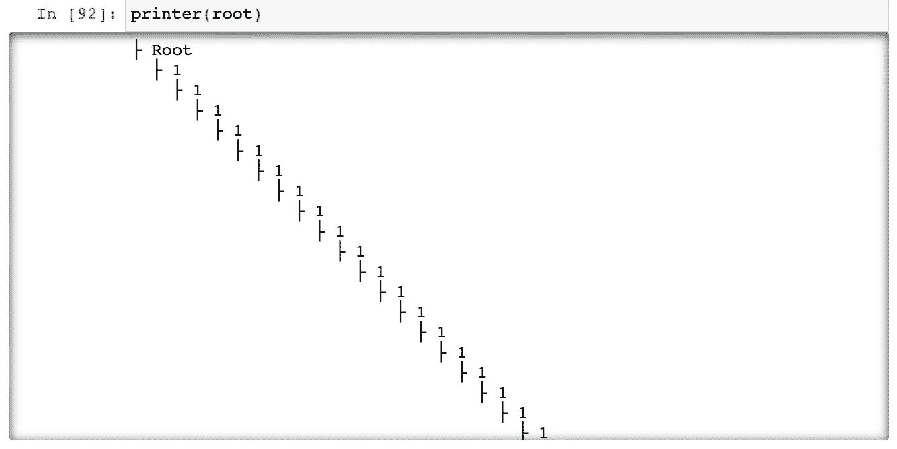
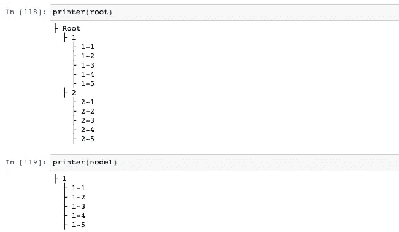

# 试着在这个小 Python 代码里找一个 bug。你会惊讶的！

> 原文：<https://levelup.gitconnected.com/bug-investigation-python-e2c5fcefbe40>

尤其是，如果您从另一种编程语言切换过来

# 介绍

在我更大的项目中，我有一个很难找到的 bug。这是绝对不明显的，我已经失去了相当多的时间来研究它。

所以我认为一起研究这个 bug 会很有趣。

我们将构建一个简单的树，并且已经有一个小 bug 在损害它。


来源:[https://www . Warren photographic . co . uk/00725-有模仿虫的绿树蚂蚁](https://www.warrenphotographic.co.uk/00725-green-tree-ants-with-mimic-bug)

我们开始吧！

# 建造一棵树

构建一棵树既简单又直接。我们只需要定义一个类节点，然后用一个列表把它们连接起来。

下面是一个实现:

```
class Node:
    children = []

    def __init__(self, name, parent=None):
        self.name = name
        self.parent = parent
        if parent is not None:
            parent.children.append(self)

    def __str__(self):
        return self.name
```

因此，当我们创建一个新节点时，我们可以设置一个父节点，新节点将被插入到父节点的子节点列表中。这样，我们就可以用这个简单的函数轻松地打印出完整的树:

```
def printer(root, level=0):
    print("  "*level + "├", root.name)
    for node in root.children:
        printer(node, level+1)
```

这里我们使用一个缩进的“级别”参数。我们是用 Python 写的，所以，对我们来说，缩进是最重要的。

好的。现在，一切准备就绪，让我们种一棵树:

```
root = Node("Root")
node1 = Node("1",root)
node11 = Node("1-1", node1)
node12 = Node("1-2", node1)
node13 = Node("1-3", node1)
node14 = Node("1-4", node1)
node15 = Node("1-5", node1)
node2 = Node("2",root)
node21 = Node("2-1", node2)
node22 = Node("2-2", node2)
node23 = Node("2-3", node2)
node24 = Node("2-4", node2)
node25 = Node("2-5", node2)
```

不错！现在让我们用上面的打印机函数打印出来:

```
printer(root)
```

就是这样。我们有一个问题:



你可能会看到这棵树永远不会结束

# 调查

首先，对您来说，分析上面的代码并自己找出问题会有趣得多。

我们的打印机是一个递归函数，它输出带有缩进的给定节点的名称，然后调用它自己的子节点，再缩进一点。这个功能没有问题，100%正确。

创建节点有问题吗？

不，我们将第一个节点创建为没有父节点的根节点(真可悲)，然后我们为根节点创建两个子节点，每个子节点后面跟着 5 个子节点。

所以，问题出在别的地方。只剩下类定义了。

让我们拿一个孩子，看看里面有什么:

```
print(node25)
#output: 2-5
```

那很好。

```
print(node25.parent)
#output: 2
```

那也可以。但是父母的父母呢？嗯…

```
print(node25.parent.parent)
#output: root
```

那也可以。让我们检查一下孩子们。

```
print(node25.children)
#output: [<__main__.Node object at 0x7fb443dce750>, <__main__.Node object at 0x7fb443dcec10>, <__main__.Node object at 0x7fb443dced50>, <__main__.Node object at 0x7fb443dcec90>, <__main__.Node object at 0x7fb443dced90>, <__main__.Node object at 0x7fb443dcea10>, <__main__.Node object at 0x7fb443ad4290>, <__main__.Node object at 0x7fb443ad40d0>, <__main__.Node object at 0x7fb443ad4210>, <__main__.Node object at 0x7fb443ad4150>, <__main__.Node object at 0x7fb443dcef50>, <__main__.Node object at 0x7fb443ad4110>]
```

什么？！有几个孩子？

```
print(len(node25.children))
#output: 12
```

嗯……我们在这里可以看到两个问题。

第一个问题是我们的列表看起来很奇怪。当然这个更重要:)

要解决这个问题，只需将“__str__”改为“__repr__”。这很奇怪。当我们打印出单个节点时，它使用“__str__”函数，在一个列表中，它使用“__repr__”。为什么，Python？

好的，第二个问题(主要问题)是 Node25 有太多的子节点。让我们用“__repr__”函数再次将它们打印出来:

```
print(node25.children)
#output: [1, 1-1, 1-2, 1-3, 1-4, 1-5, 2, 2-1, 2-2, 2-3, 2-4, 2-5]
```

哇，除了根之外的所有节点都是 Node25 的子节点！

好，那另一个节点呢？

```
print(node21.children)
#output: [1, 1-1, 1-2, 1-3, 1-4, 1-5, 2, 2-1, 2-2, 2-3, 2-4, 2-5]
```

嗯…

```
print(root.children)
#output: [1, 1-1, 1-2, 1-3, 1-4, 1-5, 2, 2-1, 2-2, 2-3, 2-4, 2-5]
```

现在问题清楚了——他们都分享自己的孩子。

原因如下:


# 问题的核心

问题的核心就在这里:

```
class Node:
    children = [] # <----- THIS IS THE BUG!

    def __init__(self, name, parent=None):
        self.name = name
        self.parent = parent
        if parent is not None:
            parent.children.append(self)

    def __repr__(self):
        return self.name
```

事实是，一个类中以这种方式声明的所有东西都是单例的。没错。相信我:)

如果你曾经用 C++或 Java 编写过，那是相当令人惊讶的，不是吗？

这里正确的实现是什么？

```
class Node:    
    def __init__(self, name, parent=None):
        self.name = name
        self.parent = parent
        self.children = [] # <--- move it here
        if parent is not None:
            parent.children.append(self)

    def __repr__(self):
        return self.name
```

如果你想确定一个对象或者一个变量属于一个对象，总是使用“self”！

现在，让我们再次检查:

```
print(root.children)
#out: [1, 2]
```

和打印机:



这样好多了！感谢阅读！

顺便说一下，我在我的其他文章中犯了完全相同的错误，包括俄罗斯方块的实现:

[](/writing-tetris-in-python-2a16bddb5318) [## 用 Python 写俄罗斯方块

### 用 Python 和 PyGame 编写俄罗斯方块的分步指南

levelup.gitconnected.com](/writing-tetris-in-python-2a16bddb5318) 

不过从现在开始，我会很小心的:)