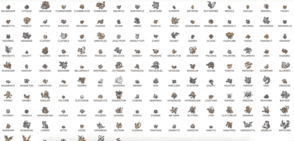
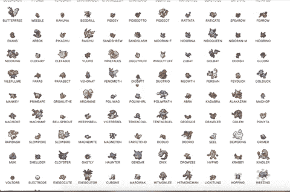
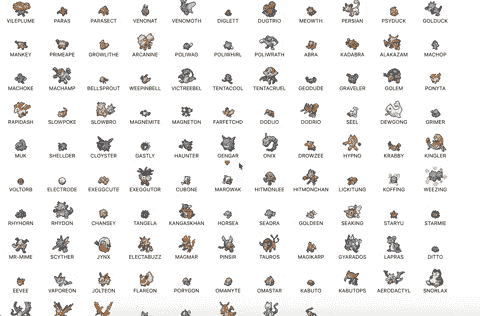

# 错误的内存组件和反应挂钩

> 原文：<https://levelup.gitconnected.com/buggy-memoized-components-and-react-hooks-6d83ccbd50a5>

蔬菜

*本条* [*的配套回购可以在这里找到*](https://github.com/MarkGeeRomano/stale-functions)

本文概述了使用从父代传下来的状态改变方法的记忆化功能组件可能遇到的一个错误。起初，我不理解我所看到的行为——在我意识到这是什么之后，它有助于巩固我对钩子本质的理解。希望这篇文章也能帮助你理解钩子。

在工作中，我试图记忆一个列表项类型的组件，以避免不必要的重新呈现，并向它传递一个将该项切换为收藏夹的函数。因为不是每个人都喜欢遵守广告技术隐私立法的例子——我的工作领域——让我们假设这个列表呈现了一些更普遍的东西——口袋妖怪。准确的说是最初的 151 个。

代码非常简单。一个`App`组件，在这里我们的状态被初始化，还有一个`Tile`组件，一个列表项组件，它呈现口袋妖怪的图像、名称和❤️(如果它是最喜欢的)。

状态是由 151 个对象组成的数组。每个对象包含一个`url`属性和一个`isFavorite`属性，前者包含我们将放入``标签的口袋妖怪图像的 url，后者初始化为`false`。有一个`toggleFavorite`函数接受一个索引，并返回一个总是有用的高阶函数，该函数翻转给定 pokemon 的`isFavorite`布尔值，并将更新后的数组传递给从`useState`返回的`setPokemon`函数。

`Tile`拿一个口袋妖怪物体当道具，还有`toggleFavorite`功能。它会呈现口袋妖怪的图像、名字，如果它是最喜欢的，还会呈现一颗心。点击它最父级的`div`可以将它标记为收藏或不收藏。

很管用。让我们记住`Tile`这样就不会每次都刷新了。为了记忆功能组件，我们将其包装在`React.memo`中。它工作于浅层比较道具，如果有任何不同，它将使用给定的更新道具重新渲染组件。在我们的例子中，浅渲染是不够的，因为我们传递的是一个对象和一个函数。所以我们可以传入第二个参数，回调，到`memo`。在这个回调中，我们可以访问旧属性和新属性，因为我们知道如果`isFavorite`的值已经改变，我们只需要重新呈现组件，我们可以比较这些值并返回一个布尔值。

让我们试着点击一下。应该没有明显的区别，除了可能稍微快一点，对吗？

似乎当你点击后面的口袋妖怪时，红心正在消失。然后如果你点击前面的，心就会回来。再点击什么，一切又会变得疯狂。这确实是一些奇怪的行为。经过一番挠头和大量的控制台日志记录后，我意识到:

*内存化组件的* `*toggleFavorite*` *函数内部是对* `*pokemon*` *状态数组的陈旧引用。在定义的时候，每个对象都有一个*`*isFavorite*`*`*false*`*的值。当你喜欢一个口袋妖怪时，你看到的是每次更新的原始数组，而不是预期的数组。**

*这个问题突出了基于类的组件和基于钩子的组件之间的主要区别——状态在呈现之间是不可变的。类没有我们刚刚看到的问题，因为每个函数调用都会发生变异`this.state`。我们可以在 setter 函数中传递一个回调来解决这个问题。传入的参数是真实的先前状态，因此我们可以确保我们永远不会处理对状态值的过时引用。*

**

*感谢阅读！本文的配套回购[可以在这里找到](https://github.com/MarkGeeRomano/stale-functions)*