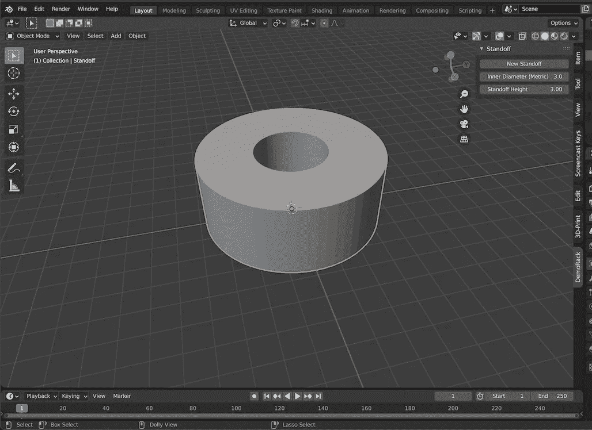

# 建立一个搅拌机附加准备规模

> 原文：<https://levelup.gitconnected.com/build-a-blender-add-on-ready-to-scale-8c285f9f0a5>

## 安装并运行一个基本的附加组件，为实现飞跃创造动力

*这是记录 Blender 3D 插件创建的系列文章的第 3 部分，该插件将在模块化系统中动态生成 3D 可打印组件。该系统是仿照这种广泛分叉的* [*6”机架式机箱*](https://www.thingiverse.com/thing:1936196) *。*

*到目前为止，所有的帖子都可以自行阅读。* [*第 1 部分*](/configure-blender-for-3d-printing-via-python-ecf729e4099b) *介绍了一个基本的 Blender Python 脚本，它可以自动配置 3D 打印的环境，而* [*第 2 部分*](/rapidly-spawn-printable-meshes-via-blender-python-9ff5c3af6379) *展示了如何使用* `*BMesh*` *模块来创建自定义网格几何图形。从这里开始，简单地将第 2 部分的要点* *复制到本文第 1 步创建的项目目录中，作为* `*standoff_mesh.py*` *。*

完全成熟的 Blender 3D 插件是令人惊讶的事情。作为 Python 和 Blender 的相对新手，我经常发现自己被社区中人们制作的非常强大的东西吓呆了。坦率地说，这些软件包中的一些看起来有点不可思议，当自我怀疑或冒名顶替综合症的唠叨声被打破时，人们很容易想到“要是有人能做出能做 *X.* 的东西就好了”

然后我记得，通过将好奇心和固执与良好的文档相结合，某人可以是任何人，并且 *X* 可以变成 *X、Y 和 z。*甚至最难的部分也可以解决——特别是因为所有固执和好奇的人确保 Blender 的 Python [文档](https://docs.blender.org/api/current/index.html)和[堆栈交换](https://blender.stackexchange.com)就像它让我们创建的 gee whiz 图形一样好。

同样，已经存在的文档和模型为从头开始编写 Blender 附加组件打下了良好的基础，在开始时为该附加组件提供可伸缩的结构有助于更清楚地展示 Python API 的各个部分是如何结合在一起的。换句话说，它使新编写的代码比实际情况更好，同时也使现有的代码更容易学习。

在本文结束时，我们将创建一个功能完整的已安装的附加组件，它提供了一个自定义 UI 元素来将`Standoff`硬件挂载点添加到 Blender 场景中，并带有界面控件来调整将要创建的网格的直径和高度。



最终目标:UI 面板有一个按钮来添加支架网格，并控制调整大小。和新的僵局。

# 步骤 1:文件结构

考虑到这一点，这里有一个完整的目录和文件结构，它将存在于这篇文章的末尾，可以在开始时使用`mkdir`和`touch`来创建。然后就是填空的游戏了。我调用项目`DemoRack`，并将它设置为我用于 Python 项目的文件夹中的顶级目录名——它不一定是特定于 Blender 的。

```
DemoRack
|-- README.md 
|-- DemoRack.zip <-- will (re)compile via 'zip -r DemoRack.zip src'
|-- src
|-- |-- __init__.py
|-- |-- standoff_mesh.py <-- from Part 2, not modified in this post 
|-- |-- standoff_operator.py
|-- |-- standoff_panel.py
|-- |-- standoff_props.py
```

这些文件中的每一个都将在一个单独的步骤中介绍，但是首先，这里有一个它们的功能的快速列表:

*   **DemoRack.zip:** 编译过的`src`，安装在 Blender 里的文件。
*   **__init__。py:** 为附加组件注册所有必要的信息和类。
*   **standoff_mesh.py:** 用于生成目标几何/网格数据的模块。
*   **standoff_operator.py:** 可供用户界面使用的“do-er”。
*   **standoff_panel.py:** 在 UI 元素上添加 Add-on 将… add on。
*   **standoff_props.py:** 定义`Panel`和`Operator`需要的数据对象。

简而言之，每个新的`standoff_`模块都将包括`register()`和`unregister()`功能。`__init__`模块将导入这些模块，并将两种类型的函数捆绑到单个迭代器中。Blender Python 文档描述了这些函数扮演的角色:

> `register`是仅在启用插件时运行的功能，这意味着无需激活插件即可加载模块。
> 
> `unregister`是卸载`register`设置的任何东西的功能，当插件被禁用时调用。

# 第二步:__init__。巴拉圭

有了这样的背景，并且因为`__init__`模块中的大部分代码都与`sys`和`importlib`包有关，所以我将在这里包括要点，而不是试图脱离描述 Python 模块导入的杂草。需要特别注意的附加组件是`module_names`列表，声明为`register`和`unregister`函数引入的文件名，以及打开的`bl_info`字典。如[官方插件介绍](https://docs.blender.org/manual/en/latest/advanced/scripting/addon_tutorial.html)教程中所述，`bl_info`包含了在首选项面板中可以找到的所有信息:

> `bl_info`是一个包含附加元数据的字典，例如要在首选项附加列表中显示的标题、版本和作者。它还指定了运行脚本所需的最低 Blender 版本；旧版本不会在列表中显示加载项

# 第三步:standoff_props.py

这个模块将是这个系列中涉及最多的，但是它也为其他模块提供了主干，并且实现了一个可以被广泛重用的模式。它依赖于导入`PropertyGroup`类型( [docs](https://docs.blender.org/api/current/bpy.types.PropertyGroup.html?highlight=propertygroup#bpy.types.PropertyGroup) )，用来捆绑一组[属性定义](https://docs.blender.org/api/current/bpy.props.html)、`bpy.props`。一旦向 Blender 注册了一个`PropertyGroup`,它就在 Python 可脚本化数据对象的指针和底层 C 分配的执行 Blender 繁重任务的内存之间提供了一座桥梁。

在`standoff_props.py`中，将定义一个类，从`bpy.types.PropertyGroup`继承，并跟踪 3 个属性特性:

*   `metric_diameter: FloatProperty(**kwargs)`
*   `height: FloatProperty(**kwargs)`
*   `mesh: PointerProperty(type=Mesh)`

前两个应该是不言自明的，在实现中会有更多的参数细节。第三，一个`PointerProperty`指向内存中的一个对象，并要求这个对象的类型在定义时指定，并且它是`PropertyGroup`或`bpy.struct.ID`的子类(即一个网格)。这意味着任何将值设置为任何其他数据类型的实例(在本例中，任何不是`bpy.types.Mesh`的实例)的尝试都将抛出错误，任何将值传递给期望任何其他数据类型的参数的尝试也是如此。

在这种情况下，`mesh`属性`PointerProperty`将用于保存在[第 2 部分](/rapidly-spawn-printable-meshes-via-blender-python-9ff5c3af6379) ( `standoff_mesh.py`)中创建的`Standoff.mesh()`类方法的返回值，并实例化用`metric_diameter`和`height`后面存储的值修改的&。这三个属性的完整定义如下:

```
class PG_Standoff(PropertyGroup):
    metric_diameter: FloatProperty(
        name="Inner Diameter (Metric)",
        min=2,
        max=5,
        step=50,
        precision=1,
        set=prop_methods("SET", "metric_diameter"),
        get=prop_methods("GET", "metric_diameter"),
        update=prop_methods("UPDATE"))
    height: FloatProperty(
        name="Standoff Height",
        min=2,
        max=6,
        step=25,
        precision=2,
        set=prop_methods("SET", "height"),
        get=prop_methods("GET", "height"),
        update=prop_methods("UPDATE"))
    mesh: PointerProperty(type=Mesh)
```

单独的`set`、`get`和`update`参数都指向`prop_methods`函数的返回值。这些值*必须*是函数，分别带参数`(self, value)`、`(self)`和`(self, context)`。这个闭包工厂可能看起来非常复杂，但是它将显著减少重复，并为与`PropertyGroup`数据属性的交互提供更大的灵活性。

需要理解的一个重要区别是，每当属性改变时，就会调用`update`函数——它不是作为更新定义它的属性的一种方式而被调用的。相反，它提供了一种将特定属性的更改传递给程序其他部分的方法；这必须小心使用，以避免无声的副作用，因为没有检查来避免无限递归(即，如果更新程序更新它所附加的属性，或者如果它包含的逻辑触发另一个修改其父属性的更新程序)。

另一件要注意的事情是，使用`set`和`get`函数意味着任何`default`值都必须通过一个显式的`set`调用来设置(而不是作为一个`kwarg`)，但这也提供了一个在必要时挂钩`on_load`方法的机会。最后，`prop_methods`函数必须在调用它的任何`PropertyGroup`类之前*定义。*

`prop_methods`功能的半肉骨架看起来像这样:

```
def prop_methods(call, prop=None):
    def getter(self):
        # getter function must check if prop attr has a value yet
            # if no value, will throw error, so must set default
            # can hook on load here
        # and either way, return self[prop] value def setter(self, value):
        self[prop] = value def updater(self, context):
        self.update(context) methods = {
        "GET": getter,
        "SET": setter,
        "UPDATE": updater
        } return methods[call]
```

完整的实现可以写成:

```
def prop_methods(call, prop=None):
    def getter(self):
        try:
            value = self[prop]
        except:
            set_default = prop_methods("SET", prop)
            set_default(self, self.defaults[prop])
            if hasattr(self, "on_load"):
                self.on_load()
            value = self[prop]
        finally:
            return value def setter(self, value):
        self[prop] = value

    def updater(self, context):
        self.update(context) methods = {
        "GET": getter,
        "SET": setter,
        "UPDATE": updater,
        } return methods[call]
```

要做到这一点，任何具有调用`prop_methods` *属性的类都需要*一个名为`defaults`的字典对象和一个名为`update`的方法(该函数提供了一个`on_load`方法，但并不要求)。在`PG_Standoff`类中，这些调用将用于在加载时以及在`metric_diameter`或`height`属性被修改时附加`Standoff.mesh()`的返回值。也就是说，`PG_Standoff`类的其余部分可以写成:

```
class PG_Standoff(PropertyGroup):
    # ... defaults = { "metric_diameter": 2.5, "height": 3 } standoff = Standoff() def on_load(self):
        if self.height and self.metric_diameter:
            self.__set_mesh() def update(self, context):
        self.__set_mesh() def __set_mesh(self):
        self.mesh = self.standoff.mesh(
           self.height, self.metric_diameter)
```

这样就只剩下安装附加组件时让 Blender 知道`PG_Standoff`类所需的`import`语句和`register`和`unregister`函数。在 register 函数中，我们还将从一个`PointerProperty`实例中指向`PG_PropertyGroup`类，引用自 Blender `Scene`类型的一个新属性，这将使从附加组件的其余部分访问变得简单。这就形成了一个完整的`standoff_props.py`模块，如下图所示:

# 步骤 4: standoff_operator.py

最后两个模块都是短文件，实现起来非常简单，因为构建和修改数据的繁重工作已经以简化其与 Blender Python API 的交互的方式完成了。在`standoff_operator`模块中，我们将定义(并注册)一个新的`bpy.types.Operator`类，它可以附加到任何 UI 按钮上。

对于如何定义新的`Operator`有一些要求，但是这些都有很好的文档记录并且很简单，通过从 CLI 启动 Blender，错误配置的`Operator`类的有用警告和错误消息将会立即变得显而易见。新`Operators`的预期定义详见本手册[章节](https://docs.blender.org/api/current/bpy.types.Operator.html)。这个脚本将定义`docstring`、`bl_idname`、`bl_label`和`bl_options`属性的值。它还将定义一个`execute`方法，该方法需要`self`和`context`参数，并且包含逻辑和事件，这些逻辑和事件将被附加到调用在`bl_idname`下注册的`Operator`的任何 UI 按钮。

# 步骤 5: standoff_panel.py

定义一个新的`Panel`类实际上遵循与定义一个新的`Operator`相同的模式，从概念上讲，简单地将最后一步中的`execute`方法替换为这一步中的`draw`方法是有意义的。相关的[面板手册章节](https://docs.blender.org/api/current/bpy.types.Panel.html?highlight=panel#bpy.types.Panel)给出了几个有用的例子，还有更多包含在 *UI 脚本>模板> Python 菜单中。*在`bpy.types.UILayout` [手册章节](https://docs.blender.org/api/current/bpy.types.UILayout.html)中可以找到更多的可能性，它记录了`Panel`对象的导入子对象。在`draw`方法中，这是一个简单(并且非常开放)的过程:

1.  从`context`访问相关数据对象
2.  为任何需要按钮的`Operator`调用创建`layout.operator`对象
3.  为用户可写的数据属性创建`layout.prop`对象

当然，对于该模式和更复杂的数据类型，还有很多扩展和变化的空间。但是在基础上，这是 API 通过遵循使用`bpy.props`和`bpy.types.PropertyGroup`实例的内置模式来处理繁重工作的另一个地方。由于这种简单性，这是另一个模块，可以直接将整个脚本视为一个要点:

唯一的额外变化是`DemoRackPanel`的类定义，`StandoffPanel`继承了`bpy.types.Panel`的类定义。因为这将不是`DemoRack`附加组件中唯一的`Panel`，并且它们都将在 View 3D 侧抽屉中的单个选项卡下，所以消除 3 行重复很简单。`layout.prop`和相关函数中的模式是将一个数据对象作为第一个参数，将该对象中属性的字符串标识符作为第二个参数。

剩下要做的就是从`DemoRack/src/`目录中编译`DemoRack.zip`文件，然后将该本地文件安装在*Edit>Preferences>Add-ons*中，就像其他文件一样。

*感谢您全程支持这篇文章，当然也感谢您对代码或文章的任何反馈/批评。幸运的话，这将是这个系列中最长的一篇文章。至于其余的，我的目标是把事情分解成更小的块。要一次查看所有要点，* [*点击此链接*](https://gist.github.com/ocommaj/d9b2e0b68f300f9afe9f559d660b2b23) *。在* [*德莫瑞*](https://github.com/ocommaj/DemoRack) *有一个完整的项目回购。*