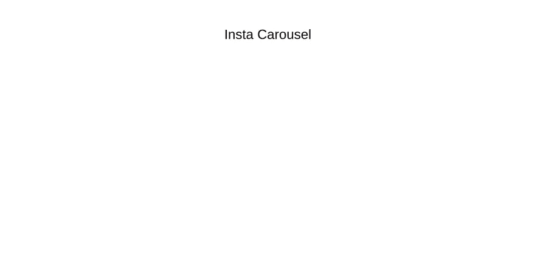

# 用 Reactjs、Material-UI 和 Swiperjs 构建一个类似 Instagram 的旋转明信片

> 原文：<https://levelup.gitconnected.com/build-a-carousel-postcard-like-instagram-with-reactjs-material-ui-and-swiperjs-9b36a9e44766>


旗帜

# 现场演示

你可以从[这里](https://insta-carousel-demo.vercel.app/)演示网站


# 视频教程

我已经在我的 youtube 频道上制作了一个视频。更多细节请查看。

# 注意:

该应用程序是用 Material-UI V4 构建的。当前版本是 5。但是不用担心。您仍然可以使用代码。您只需要更改组件的导入路径。其他的都一样。[查看他们的文档了解更多详情。](https://mui.com/guides/migration-v4/#introduction)

# 从头开始设置

# 创建一个创建-反应-应用程序

```
npx create-react-app <app>
cd <app>
```

# 安装软件包

```
yarn add @material-ui/core @material-ui/icons swiper
```

# 从最小设置开始

```
git clone git@github.com:thatanjan/insta-carousel-yt.git
cd insta-carousel-yt
git fetch
git checkout scratch
```

# 创建应用程序的容器和标题

```
// App.js
import Grid from '@material-ui/core/Grid'
import Typography from '@material-ui/core/Typography'import PostCard from './PostCard'function App() {
    return (
        <div className='App'>
            <Grid container>
                <Grid
                    iem
                    xs={12}
                    style={{ height: '25vh', display: 'grid', placeItems: 'center' }}
                >
                    <Typography variant='h3'>Insta Carousel</Typography>
                </Grid> <Grid item container xs={12} justifyContent='center'>
                    <Grid item xs={3}>
                        <PostCard />{' '}
                    </Grid>
                </Grid>
            </Grid>
        </div>
    )
}export default App
```



## 解释:

*   创建了一个居中的标题。
*   制作了一个装有明信片的容器，它将占用 12 个格子中的 3 个。如果你不知道 UI 网格的材质，你可以看下面的视频。

```
import React from 'react'
import { Swiper, SwiperSlide } from 'swiper/react'
import { makeStyles } from '@material-ui/core/styles'
import Card from '@material-ui/core/Card'
import CardHeader from '@material-ui/core/CardHeader'
import CardMedia from '@material-ui/core/CardMedia'
import CardContent from '@material-ui/core/CardContent'
import CardActions from '@material-ui/core/CardActions'
import Avatar from '@material-ui/core/Avatar'
import IconButton from '@material-ui/core/IconButton'
import Typography from '@material-ui/core/Typography'
import FavoriteIcon from '@material-ui/icons/Favorite'
import ShareIcon from '@material-ui/icons/Share'
import MoreVertIcon from '@material-ui/icons/MoreVert'
import CommentIcon from '@material-ui/icons/Comment'import SwiperCore, {
    Keyboard,
    Scrollbar,
    Pagination,
    Navigation,
} from 'swiper/core'import 'swiper/swiper.min.css'
import 'swiper/components/pagination/pagination.min.css'
import 'swiper/components/navigation/navigation.min.css'
import 'swiper/components/scrollbar/scrollbar.min.css'import avatarImage from './media/postAvatar.jpg'
import ts_1 from './media/carousels/ts_1.jpg'
import ts_2 from './media/carousels/ts_2.jpg'
import ts_3 from './media/carousels/ts_3.jpg'
import ts_4 from './media/carousels/ts_4.jpg'
import ts_5 from './media/carousels/ts_5.jpg'const useStyles = akeStyles({
    media: {
        height: 0,
        paddingTop: '100%',
    },
    swiperContainer: {
        paddingBottom: '3rem',
        '& .swiper-pagination-bullet': {
            background: 'blue',
        },
        '& .swiper-button-next:after': {
            fontSize: '2rem !important',
        },
        '& .swiper-button-prev:after': {
            fontSize: '2rem !important',
        },
    },
})SwiperCore.use([Keyboard, Scrollbar, Pagination, Navigation])const images = [ts_1, ts_2, ts_3, ts_4, ts_5]const PostCard = () => {
    const { media, swiperContainer } = useStyles()
    return (
        <Card>
            <CardHeader
                avatar={<Avatar src={avatarImage} />}
                title='Just a Carousel'
                subheader={new Date().toDateString()}
                action={
                    <IconButton>
                        <MoreVertIcon />
                    </IconButton>
                }
            /> <Swiper
                grabCursor
                keyboard={{ enabled: true }}
                pagination={{ clickable: true }}
                navigation
                loop
                className={swiperContainer}
            >
                {images.map((image, index) => (
                    <SwiperSlide key={index}>
                        <CardMedia className={media} image={image} />
                    </SwiperSlide>
                ))}
            </Swiper> <CardActions disableSpacing>
                <IconButton>
                    <FavoriteIcon />
                </IconButton>
                <IconButton>
                    <CommentIcon />
                </IconButton>
                <IconButton>
                    <ShareIcon />
                </IconButton>
            </CardActions> <CardContent>
                <Typography variant='body2' color='textSecondary' component='p'>
                    Adipisicing eaque temporibus elit incidunt obcaecati. Aut eum excepturi id
                    aut consequatur ex? Incidunt debitis at consequuntur accusamus rerum
                    Tempora veritatis maiores quam molestias aut placeat qui. Iure neque libero
                    voluptas aliquid!
                </Typography>
            </CardContent>
        </Card>
    )
}export default PostCard
```


## 解释:

*   我们已经使用了卡片、卡片标题和材料 UI 中的其他组件。
*   CardMedia 组件将包含我们的图像。它有一点点定制风格，以便它在每个屏幕尺寸上都保持响应，并且它将始终保持纵横比。
*   我们从 Swiperjs 中导入了`Keyboard, Scrollbar, Pagination, Navigation`模块。要有导航，用键盘导航等等。
*   我们给`Swiper`组件添加了自定义样式来修改`Swiper`组件的图标。

项目已经准备好了。更多详情请观看视频。