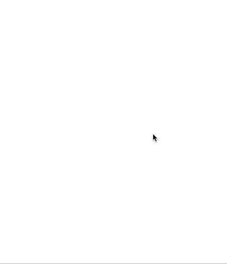

# 用 React 构建一个象棋战术应用程序(第 1 部分)

> 原文：<https://levelup.gitconnected.com/build-a-chess-tactics-app-with-react-part-1-49be01fc63b5>

## 从头做起


照片由[Louis Hansel @ shotsoflouis](https://unsplash.com/@louishansel?utm_source=unsplash&utm_medium=referral&utm_content=creditCopyText)在 [Unsplash](https://unsplash.com/s/photos/online-chess?utm_source=unsplash&utm_medium=referral&utm_content=creditCopyText) 上拍摄

在我的上一篇文章中，我构建了一个简单的象棋应用来展示创建象棋应用是多么简单。在这篇文章中，让我们更进一步，建立一个象棋战术应用程序。

## 系列

*   [用 React 构建一个象棋战术 App(第一部分)](/build-a-chess-tactics-app-with-react-part-1-49be01fc63b5)(本帖)
*   [用 React 构建一个象棋战术应用(第二部分)](/build-a-chess-tactics-app-with-react-part-2-35621640afd1)

## 先决条件

*   浏览一下[我的上一篇帖子](/how-to-create-a-simple-chess-app-with-react-e18c0179b167)，这样你就知道了基本的国际象棋编程术语。
*   反应(明显)

## 我们在建造什么

一如既往，在开始之前。让我们快速浏览一下我们将要构建的内容。



我们将建立这个应用程序的一部分。在这一部分中，我们将创建应用程序的核心组件`TacticBoard`，并使用一些硬编码策略来测试它。

在下一部分。我们将把这个应用程序连接到一个国际象棋战术 API，并添加移动反馈。

## 我们开始吧

创建一个新的支持 typescript 的 react 应用程序。

```
npx create-react-app tactics-trainer --template=typescript
```

安装`chessboardjsx`和`chess.js`

```
yarn add chessboardjsx chess.js @types/chess.js
```

删除`App.tsx`、`App.css`中的所有代码。我们将从创建战术界面开始。我在`src/types/Tactic.ts`保存这个文件。

战略

`fen`是战术的起始位置。`blunderMove`是国际象棋的[三](https://www.chessprogramming.org/Algebraic_Chess_Notation#Standard_Algebraic_Notation_.28SAN.29)步棋，包含着错误的一步棋，从而产生一种战术。`solution`是一组[散](https://www.chessprogramming.org/Algebraic_Chess_Notation#Standard_Algebraic_Notation_.28SAN.29)招式，内含战术解答。

现在我们已经完成了战术界面，让我们来构建`TacticBoard`。在我们开始之前，我们将需要一些 utils 函数来使`TacticBoard`工作。

让我们分解这些功能。

*   `getSideToPlayFromFen`——给定一个[分](https://www.chessprogramming.org/Forsyth-Edwards_Notation)，得到哪一方下一步棋。
*   `makeMove` —给定一个[分](https://www.chessprogramming.org/Forsyth-Edwards_Notation)和移动类型`string`或`ShortMove`。在栅栏上移动并在移动后返回栅栏。
*   `validateMove` —这是我们将用来确认已玩过的招式的功能。它接受 3 个参数(fen，move，solution ),如果有效，则返回下一个 fen 和剩余的解决方案，否则为 null。

## 战术板

现在我们必须做好基础工作。再来看`TacticBoard`组件。

## 了解战术板

从道具开始。我们有 4 个道具:

*   `tactic` —在棋盘上游戏的战术对象。
*   `onIncorrect` —如果走法不正确，则进行回调调用。
*   `onCorrect` —如果播放的移动是正确的，则回调调用。
*   `onSolve` —战术解决后的回叫。

那么我们有两个状态变量。

*   `fen` —保持战术的初始位置。每当一个游戏的移动是正确的或者策略被解决的时候得到更新。
*   `solution` —这将保持战术的状态。当策略被解决时，我们不断地移除解决方案的第一项。一旦解为空，战术也就解决了。

我们使用`useEffect`挂钩来播放`blunderMove`并在组件安装后更新`fen`。

`handleMove` —当用户在棋盘上移动时调用。我们在`handleMove`中做的第一件事是检查所下的棋是否有效，并更新`fen`和`solution`。叫`onCorrect`。否则调用`onIncorrect`因为所下的棋不正确。

然后我们检查`solution`是否不为空，并自动播放下一步棋，再次更新`fen`和`solution`。如果`solution`为空，则表示该战术已解决。所以我们称之为`onSolve`。

最后，棋盘很像上一篇[文章](/how-to-create-a-simple-chess-app-with-react-e18c0179b167)中的棋盘，除了我们有两个额外的道具。

*   `transitionDuration` —告诉棋盘移动动画的持续时间。
*   `orientation` —棋盘的方位。因为我们自动玩`blunderMove`，所以我们将它设置为与初始 fen 方相反的一方来玩。

## 测试策略板

我们将用一些硬编码的策略来测试它。

我们使用两个状态变量。

*   `key` —每当战术改变时，战术板组件触发组件重新渲染的键。
*   我们将在下一部分讨论为什么我们有一个战术数组而不是一个战术变量。

最后，我们呈现传递键的`TacticBoard`组件，证明回调函数。

在`onSolve`中，我们选择了一个随机战术，称之为`nextTactic`。从`tactics`数组中移除第一个战术。将下一个`nextTactic`连接到`tactics`数组。并更新`key`状态。

如果你运行这个应用程序，你将能够解决一些战术(同样的 4 战术一遍又一遍)。

在下一篇[文章](/build-a-chess-tactics-app-with-react-part-2-35621640afd1)中，我们将把我们的应用程序插入到一个国际象棋战术 API 服务中，这样我们就可以免费玩无限国际象棋战术了。

这就是这篇文章的内容。我希望你喜欢它。如果你看到了，请鼓掌。

感谢阅读。

[用 React 构建一个象棋战术 App(第二部分)](/build-a-chess-tactics-app-with-react-part-2-35621640afd1)

# 分级编码

感谢您成为我们社区的一员！ [**订阅我们的 YouTube 频道**](https://www.youtube.com/channel/UC3v9kBR_ab4UHXXdknz8Fbg?sub_confirmation=1) 或者加入 [**Skilled.dev 编码面试课程**](https://skilled.dev/) 。

[](https://skilled.dev) [## 编写面试问题+获得开发工作

### 掌握编码面试的过程

技术开发](https://skilled.dev)