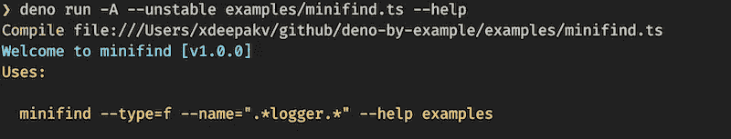
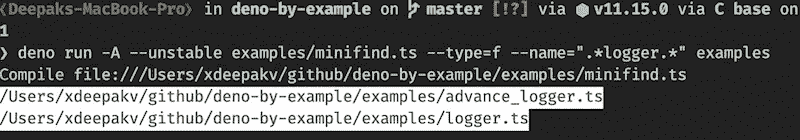

# 通过示例构建成熟的 CLI 工具| Deno

> 原文：<https://levelup.gitconnected.com/build-a-cli-tool-deno-by-example-79d39f25eb0a>

我们已经在另一个教程中看到了如何创建一个[问候 CLI](https://deepakshrma.github.io/02-greet-from-cli) 。现在，我们将扩展我们的知识，创建一个部分克隆 Mac/Unix `find`的`full-fledged` CLI。


[亚历山大·奈特](https://unsplash.com/@agkdesign?utm_source=unsplash&utm_medium=referral&utm_content=creditCopyText)在 [Unsplash](/s/photos/innovation?utm_source=unsplash&utm_medium=referral&utm_content=creditCopyText) 上的照片

创建 CLI 需要以下提到的功能:

1.  输入命令参数解析器
2.  遍历文件和目录树
3.  根据参数过滤文件/目录
4.  记录器，更好的记录信息

## 1.输入命令参数解析器

```
async function main(args: string[]) {
  console.log(args);
}
main(Deno.args);
```

在`Deno`拿论据，很容易。每个进程都有`Deno.args`，它返回传递给程序的参数。

*运行:*

`deno run examples/minifind.ts param1 param2`

*输出:*

`[ “param1”, “param2” ]`

`Deno.args`返回传递给程序的字符串数组(examples/minifind.ts)。

我们的 CLI 需要像`type`、`name`和`help`这样的参数。来获得这些参数的值。我们需要分析论点。Deno 有`flags` [模块](https://deno.land/std/flags/mod.ts)帮助解析和收集参数。再来补充一下`parser`。

```
import { parse } from "[https://deno.land/std/flags/mod.ts](https://deno.land/std/flags/mod.ts)";async function main(args: string[]) {
  const {
    type,
    name,
    not,
    help,
    _: [dir = "."],
  } = parse(args);console.log({
    type,
    name,
    not,
    help,
    dir,
  });
}
main(Deno.args);
```

*运行:*

```
deno run examples/minifind.ts --help --type=f --type=d --name=".*\.ts" examples
```

*输出:*

```
{ type: [ "f", "d" ], name: ".*\.ts", not: undefined, help: true, dir: "examples" }
```

当您使用一个给定的示例运行程序时，您将看到如上所示的输出。Deno parse 帮助你收集所有的参数。

我已经使用了 ES6 分解特性来分配默认值。

Deno parse 自动尝试基于模式收集和组合参数。任何作为前缀(—)传递的参数都被视为带值的参数。如果你不传递它旁边的值。它将变成布尔型。

*例 1:*

```
console.log(parse(["--test", "t"])); // { _: [], test: "t" }
console.log(parse(["--test"])); // { _: [], test: true }
```

需要注意的是:如果你不止一次的传递同一个参数。`parse`在`array`中合并。在上面的例子中，类型被传递了两次。这就是为什么`type`有值`[ "f", "d" ]`的原因。

*例 2:*

```
console.log(parse(["--test", "t", "--test", "t2"])); // { _: [], test: [ "t", "t2" ] }
```

下划线(`_`)在这里就像 rest 参数的集合。如果参数不遵循标准的`--`或`-`前缀。在`_`中收集的所有参数作为一个数据数组。我们从 rest `_`中提取`dir`作为目录名。

*例 3:*

```
const { _ } = parse(["--test", "t", "examples"]);
console.log(_); // _ == [ "examples" ]
const [dir = "."] = _;
console.log(dir); // examples
```

更多信息请阅读:[https://deno.land/std/flags](https://deno.land/std/flags)

## 2.遍历文件和目录树

既然现在我们已经解析了参数，让我们添加一些逻辑来读取目录。

我们可以做的第一件事是，我们可以解析需要搜索文件的`path`或`directory`。我们可以使用[路径模块](https://deno.land/std/path)中的 resolve 方法。

```
import { parse } from "[https://deno.land/std/flags/mod.ts](https://deno.land/std/flags/mod.ts)";
import { resolve } from "[https://deno.land/std/path/mod.ts](https://deno.land/std/path/mod.ts)";async function main(args: string[]) {
  const {
    type,
    name,
    not,
    help,
    _: [dir = "."],
  } = parse(args);
  const dirFullPath = resolve(Deno.cwd(), String(dir));
  console.log(dirFullPath);
}
main(Deno.args);
```

*运行:*

`deno run -A examples/minifind.ts examples`

*输出:*

`*/Users/xdeepakv/github/deno-by-example/examples*`

`resolve`需要`--allow-read`的许可。目前，我已经给了所有许可通过标志`-A`。你可以阅读更多关于[权限](https://deno.land/manual/getting_started/permissions)

`Deno.cwd()`用于获取当前运行路径。我们必须将`dir`转换成一个字符串。因为`parse`可以根据输入类型将其转换为`string | number`。

使用`Deno.readDir`可以读取目录。但是我们正在遍历整个目录和文件树。编写遍历方法可能很棘手。你可以自己试试。

这里，我将借助[https://deno.land/std/fs/mod.ts](https://deno.land/std/fs/mod.ts)的`walk`功能。

```
import { parse } from "[https://deno.land/std/flags/mod.ts](https://deno.land/std/flags/mod.ts)";
import { resolve } from "[https://deno.land/std/path/mod.ts](https://deno.land/std/path/mod.ts)";
import { walk } from "[https://deno.land/std/fs/mod.ts](https://deno.land/std/fs/mod.ts)";async function main(args: string[]) {
  const {
    type,
    name,
    not,
    help,
    _: [dir = "."],
  } = parse(args);
  const dirFullPath = resolve(Deno.cwd(), String(dir));
  for await (let entry of walk(dirFullPath)) {
    console.log(entry);
  }
}
main(Deno.args);
```

*运行:*

`deno run -A --unstable examples/minifind.ts examples`

*输出* ***:***

```
{
  path: "/Users/xdeepakv/github/deno-by-example/examples/sample_employee.csv",
  name: "sample_employee.csv",
  isFile: true,
  isDirectory: false,
  isSymlink: false
}
{
  path: "/Users/xdeepakv/github/deno-by-example/examples/06_readfile_chunk.ts",
  name: "06_readfile_chunk.ts",
  isFile: true,
  isDirectory: false,
  isSymlink: false
}
```

由于`walk`功能不是稳定功能。在运行该示例时，我们必须使用`--unstable`标志。

Walk 函数返回一个`entries`的异步生成器。每个条目都有`name`和`path`以及其他标志，如`isDirectory`和`isFile`。

漂亮:最困难的部分已经完成了。现在我们可以读取整个目录以及其中的文件。

## 3.根据参数过滤文件/目录

Walk 函数接受`WalkOptions`作为第二个参数。我们可以使用这个选项来添加我们的逻辑。

*界面:*

```
export interface WalkOptions {
  maxDepth?: number;
  includeFiles?: boolean;
  includeDirs?: boolean;
  followSymlinks?: boolean;
  exts?: string[];
  match?: RegExp[];
  s
```

*代码:*

```
// rest of the code
async function main(args: string[]) {
  // rest of the code
  const dirFullPath = resolve(Deno.cwd(), String(dir));
  let includeFiles = true;
  let includeDirs = true;
  let types = type ? (Array.isArray(type) ? type : [type]) : ["f", "d"];
  if (!types.includes("f")) {
    includeFiles = false;
  }
  if (!types.includes("d")) {
    includeDirs = false;
  }
  const options = {
    maxDepth: 2,
    includeFiles,
    includeDirs,
    followSymlinks: false,
    skip: [/node_modules/g],
  };
  for await (const entry of walk(dirFullPath, options)) {
    console.log(entry.path);
  }
}
main(Deno.args);
```

*运行:*

`deno run -A --unstable examples/minifind.ts examples`

*输出:*

```
/Users/xdeepakv/github/deno-by-example/examples
/Users/xdeepakv/github/deno-by-example/examples/subfolder
/Users/xdeepakv/github/deno-by-example/examples/subfolder/dummy.ts
```

默认类型包括`file`和`dir`[“f”、“d”]。用户可以通过标志`--type=f`和`--type=d`来覆盖行为。

***仅运行目录:***

`deno run -A --unstable examples/minifind.ts --type=d examples`

***仅运行文件:***

`deno run -A --unstable examples/minifind.ts --type=f examples`

`WalkOptions`支持 regexp 包含和排除模式。我们可以用它来按名称过滤条目。

```
/// rest of the codeasync function main(args: string[]) {
  /// rest of the codelet matchRegexps: RegExp[] | undefined = name
    ? (Array.isArray(name) ? name : [name]).map(
        (reg: string) => new RegExp(reg)
      )
    : undefined;
  const options = {
    maxDepth: 2,
    includeFiles,
    includeDirs,
    followSymlinks: false,
    match: matchRegexps,
    skip: [/node_modules/g],
  };
  for await (const entry of walk(dirFullPath, options)) {
    console.log(entry.path);
  }
}
main(Deno.args);
```

**运行-获取所有包含记录器的文件名:**

`deno run -A --unstable examples/minifind.ts --type=f --name=”.*logger.*” examples`

现在我们有工作`minifind`。**噪音**！

## 4.记录器，更好的记录信息

```
/// rest of the code
import { Logger } from "[https://deno.land/x/deno_util/logger.ts](https://deno.land/x/deno_util/logger.ts)";const usesFormat = `Uses:\n\n  minifind %s`;
const logger = new Logger();function printHelp(command: string) {
  logger.info(`Welcome to minifind [v%s]`, "1.0.0");
  logger.warn(usesFormat, command);
}
async function main(args: string[]) {
  /// rest of the codeif (help) {
    printHelp(`--type=f --name=".*logger.*" --help examples`);
    Deno.exit(0);
  }/// rest of the codefor await (const entry of walk(dirFullPath, options)) {
    logger.inverse(entry.path);
  }
}
main(Deno.args);
```

最后缺少的部分是告诉你的用户关于你的 CLI。为此，我们为用户添加了帮助信息。我在用我自己创造的`logger-util`。你可以在这里阅读更多[https://deno.land/x/deno_util](https://deno.land/x/deno_util)。

*在帮助下运行:*

`deno run -A --unstable examples/minifind.ts --help`

*输出:*



*用其他选项运行:*

`deno run -A --unstable examples/minifind.ts --help`

*输出:*



TaDa！👏👏现在您知道了如何创建 CLI。

## 奖金:

现在我们有了工作的命令行界面。然而，我们不得不使用`deno run`和`filename`来运行命令，这不是*想要/可行的*。Deno 提供`install`命令。使用它，我们可以将任何程序转换成一个`executable`工具。

让我们将 minifind 转换为`executable`。这很简单。

```
deno install -f --allow-read --unstable examples/minifind.ts
```

一旦运行以上命令，您将看到如下输出:

```
Add /Users/xdeepakv/.deno/bin to PATH
    export PATH="/Users/xdeepakv/.deno/bin:$PATH"
```

如果你看到了，只需将`export PATH="/Users/xdeepakv/.deno/bin:$PATH"`这一行添加到你的`.bashrc`或`.bash_profile`(取决于你的操作系统类型)。一旦你在路径中添加了`.deno/bin`。打开一个新的终端，并尝试下面提到的命令。

```
minifind --type=f --name=".*logger.*" examples
```

现在您的 **minifind** 已经准备好用于生产(CLI)。:-)

*希望你喜欢这个教程。请看看我们网站上的其他教程:*[https://deepakshrma.github.io/deno-by-example/](https://deepakshrma.github.io/deno-by-example/)

所有工作实例都可以在我的 Github 中找到:[https://Github . com/deepakshrma/deno-by-example/tree/master/examples](https://github.com/deepakshrma/deno-by-example/tree/master/examples)