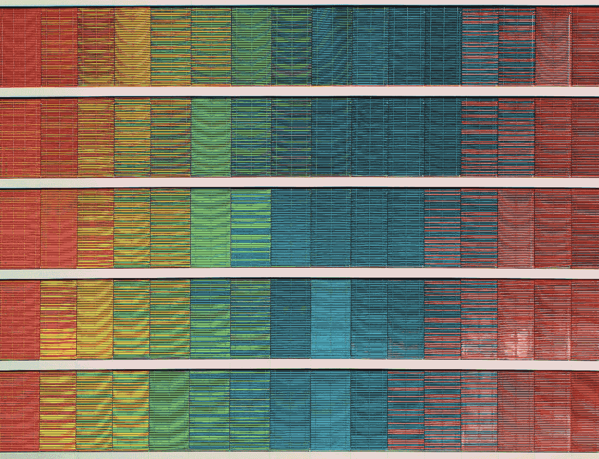
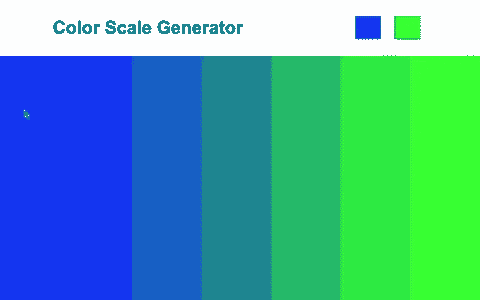
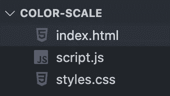
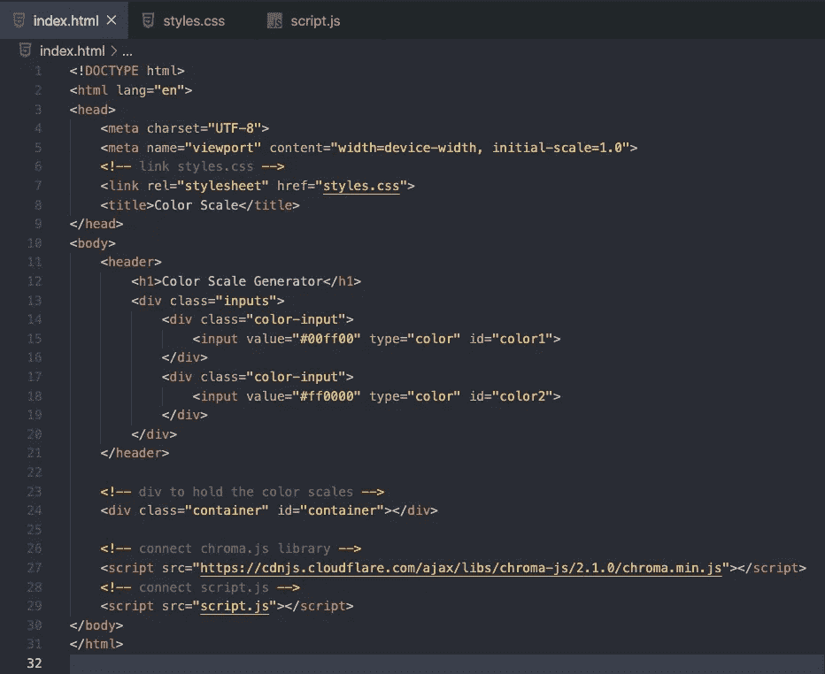
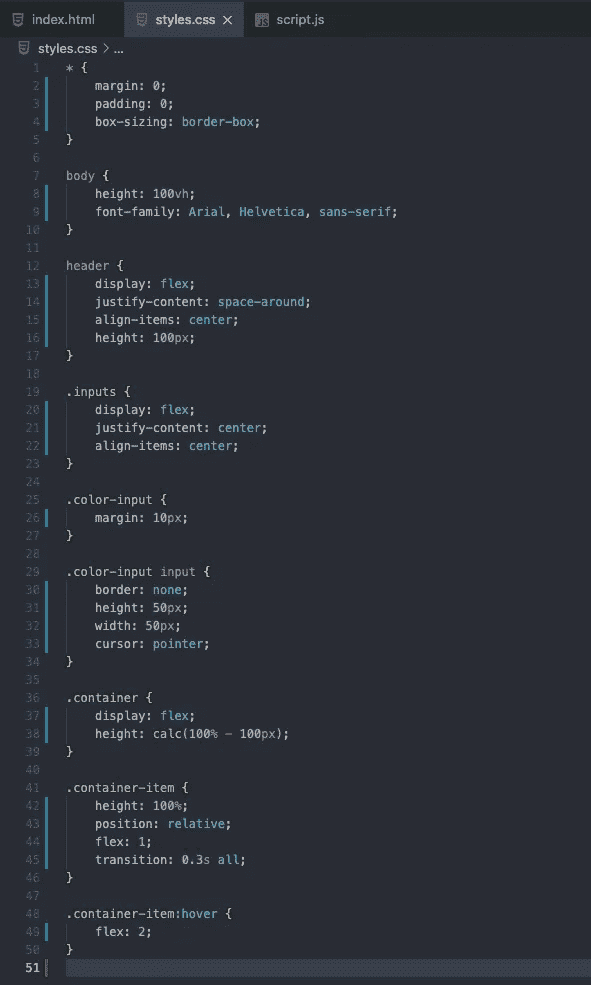
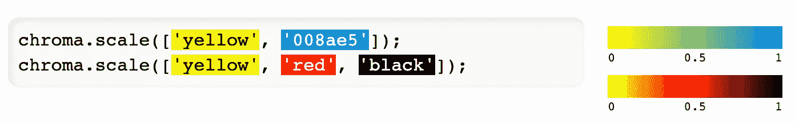
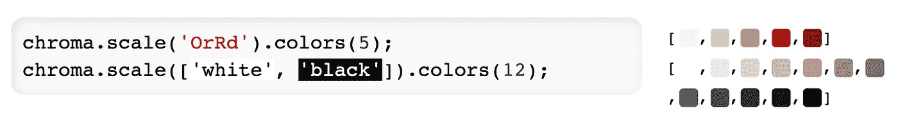
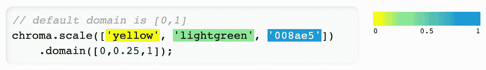
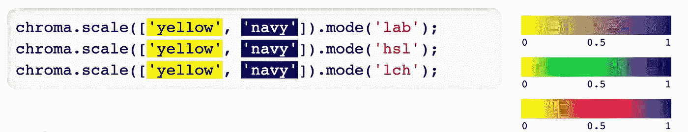
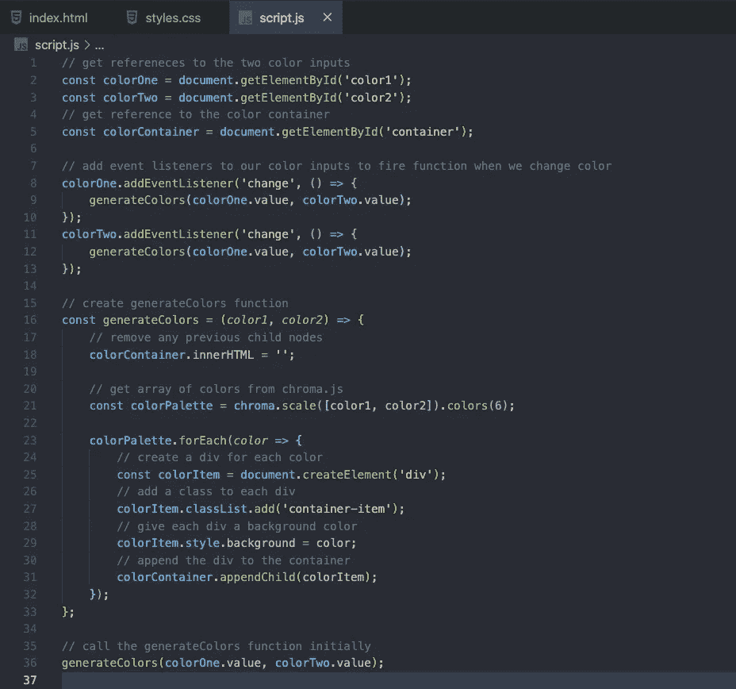

# 用 Chroma.js 构建色标生成器

> 原文：<https://levelup.gitconnected.com/build-a-color-scale-generator-with-chroma-js-810b7cf7b587>

## 让我们来看看 chroma.js 缩放函数



里卡多·戈麦斯·安吉尔在 [Unsplash](https://unsplash.com?utm_source=medium&utm_medium=referral) 上的照片

我最近偶然发现了一个有用的 JavaScript 库，叫做 [chroma.js](https://gka.github.io/chroma.js/) 。Chroma.js 是一个小型的零依赖 JavaScript 库，支持各种颜色转换和色阶。

使用 chroma.js 可以做很多事情，包括:

*   从多种格式中读取颜色
*   分析和处理颜色
*   将颜色转换成多种格式
*   不同颜色空间中的线性插值和贝塞尔插值

在本文中，我们将通过使用 HTML、CSS 和 JavaScript 构建一个色标生成器来看看这个库。这是我们将要构建的预览。



我们将构建的预览

你可以在这里查看项目实况，或者在下面的我的 GitHub repo 查看整个项目的代码。

[](https://github.com/chadmuro/color-scale-generator) [## Chad muro/色标发生器

### 在 GitHub 上创建一个帐户，为 Chad muro/色标生成器的开发做出贡献。

github.com](https://github.com/chadmuro/color-scale-generator) 

# 设置我们的 HTML

让我们首先设置我们的应用程序。我们将有三个文件，index.html，样式. css 和脚本. js



我们将首先连接 styles.css 和 script.js 文件，并将 chroma.js 的 [CDN](https://cdnjs.com/libraries/chroma-js) 添加到我们的 HTML 文件中。将这行代码添加到 head 标记中。

```
<link rel="stylesheet" href="styles.css">
```

结束 body 标签上面的这几行代码。

```
<script src="https://cdnjs.cloudflare.com/ajax/libs/chroma-js/2.1.0/chroma.min.js"></script>
<script src="script.js"></script>
```

现在，让我们构建 HTML 文件的主体。在 body 标签中，我们将有一个带有 h1 标签的标题。呆在我们的头中，我们将创建一个 div 来保存我们的颜色输入。这里，我们有两个颜色类型的输入，每个输入都有一个 id。在我们的标题下面，我们将有一个 div 标签，它将是显示色阶的容器。我们的 HTML 文件应该如下所示。



index.html

# 使用 CSS 添加样式

我们将使用 CSS 为我们的应用程序添加一些基本的样式。在我们的应用程序中，我们利用 flexbox 进行布局和悬停功能。如果你不熟悉 flexbox，可以看看下面的 CSS-Tricks 指南。

[](https://css-tricks.com/snippets/css/a-guide-to-flexbox/) [## Flexbox | CSS-技巧完全指南

### 我们的 CSS flexbox 布局综合指南。这份完整的指南解释了 flexbox 的一切，重点是所有…

css-tricks.com](https://css-tricks.com/snippets/css/a-guide-to-flexbox/) 

如果你想复制这个文件，你可以看看下面的 styles.css 图片或者检查我的报告。



样式. css

# Chroma.js 的比例函数

在我们的应用程序中，我们将使用 chroma.js 中的 scale 函数来生成一个色标。这是一个将数值映射到调色板的函数。您可以将颜色数组传递给 chroma.scale。如果您传递两种以上的颜色，它们将沿渐变分布。

```
chroma.scale([color1, color2]);
```



[https://gka.github.io/chroma.js/#chroma-scale](https://gka.github.io/chroma.js/#chroma-scale)

我们还将链接另一个名为 scale.colors 的函数，它接受一个数字作为参数。该函数从色标中获取该数量的等距颜色，并返回一个颜色数组。

```
chroma.scale([color1, color2]).colors(6);
```



https://gka.github.io/chroma.js/#scale-colors

在我们的应用程序中，我们将只使用 chroma.scale 和 scale.colors 函数。但是，您可以查看许多其他有用的函数，包括 scale.domain 和 scale.mode。

scale.domain 允许您将输入域更改为您的用例。当有两种以上的颜色输入时，您也可以设定每种颜色的位置。



【https://gka.github.io/chroma.js/#scale-domain 

scale.mode 允许您更改想要使用的颜色模式。有时当你混合颜色时，中心周围的渐变会变暗。我肯定不是这方面的专家，但我发现这个[视频](https://www.youtube.com/watch?v=LKnqECcg6Gw)有助于解释为什么会发生这种情况。下图显示了改变模式时颜色渐变的一些效果。



[https://gka.github.io/chroma.js/#scale-mode](https://gka.github.io/chroma.js/#scale-mode)

# 创建我们的 JavaScript 文件

既然我们已经了解了如何使用 chroma scale 函数，那么让我们通过用 JavaScript 添加功能来完成我们的应用程序。我们将首先获取对颜色输入和颜色容器的引用。

```
const colorOne = document.getElementById('color1');
const colorTwo = document.getElementById('color2');
const colorContainer = document.getElementById('container');
```

然后，让我们在颜色输入上添加事件侦听器，每当颜色输入改变时，事件侦听器就会触发。

```
colorOne.addEventListener('change', () => {
  generateColors(colorOne.value, colorTwo.value);
});
colorTwo.addEventListener('change', () => {
  generateColors(colorOne.value, colorTwo.value);
});
```

接下来，我们将创建 generateColors 函数。这个函数将接受颜色输入值，并使用 chroma.js 生成一个色标。

```
const generateColors = (color1, color2) => {
  colorContainer.innerHTML = '';
  const colorPalette = chroma.scale([color1, color2]).colors(6);

  colorPalette.forEach(color => {
    const colorItem = document.createElement('div');
    colorItem.classList.add('container-item');
    colorItem.style.background = color;
    colorContainer.appendChild(colorItem);
  });
};
```

最后，我们将使用输入中的默认值来调用 generateColors 函数。

```
generateColors(colorOne.value, colorTwo.value);
```

最终的 script.js 文件应该如下所示。



script.js

就是这样！你的应用程序现在应该是完整的，你可以继续添加更多你喜欢的样式和功能。

使用 chroma.js 库可以对颜色做很多事情，我建议查看他们的[文档](https://gka.github.io/chroma.js/)以了解更多信息。

感谢阅读！如果你喜欢这篇文章，看看下面的文章，我们看了 Anime.js 库并创建了一个弹跳动画。

[](https://medium.com/javascript-in-plain-english/build-a-bouncing-basketball-app-with-anime-js-90eb5b4630d1) [## 用 Anime.js 搭建弹跳篮球 App

### 用 Anime.js 创建弹跳效果

medium.com](https://medium.com/javascript-in-plain-english/build-a-bouncing-basketball-app-with-anime-js-90eb5b4630d1)