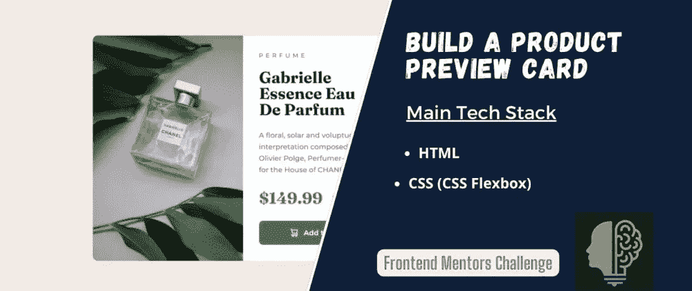

# 构建 CSS 预览卡组件

> 原文：<https://levelup.gitconnected.com/build-a-css-preview-card-component-f9344dd5b160>



嘿，伙计们，欢迎来到这个如何构建预览卡组件的分步教程。不浪费时间，让我们直接开始吧。要开始下载这些 starter [文件](https://www.frontendmentor.io/challenges/product-preview-card-component-GO7UmttRfa)。如有必要，请确保注册/登录 frontendmentor。

## HTML 入门(仔细研究)

```
<main>
<div class='container'> <!-- Always Good to have a container -->
<div class='card'> <!-- for the actual card. div--self explantory -->
    <div class='left'></div> <!-- space for background image. -->
    <div class='right'>
            <h4>
              Preview
            </h4>
            <h1>
              Gabrielle <br> Essence Eau <br>De Parfum
            </h1>
            <p>
              A floral, solar and voluptuous interpretation 
              composed by Olivier Polge, 
              Perfumer-Creator for the House of CHANEL.
            </p>
            <div class="text-container">
              <span id="big-text"> $149.99</span>
              <span id="small-text">$169.99</span>
            </div>
            <button>
               Add to cart
            </button>
    </div>
```

```
</main>
```

# CSS 代码

```
body {
  background-color: hsl(30, 38%, 92%);
  /*you can find the color in the style-guide.md*/
  font-family: system-ui;
}
.container {
  /*This set of styles will center everything in the container(in this case the card)*/
  display: flex;
  justify-content: center;
  align-items: center;
  min-height: 100vh;
}
.left {
  width: 50%;
  height: 450px;
   /*Adding the background image */
  background-image: url("./images/image-product-desktop.jpg");
  background-position: center;
  background-size: cover;
  /*Rounded corners at specific locations*/
  border-top-left-radius: 10px;
  border-bottom-left-radius: 10px;
}
.right {
  width: 50%;
  margin-left: 20px;
}
.card {
  width: 600px;
  /*Remember that body is not white;this makes the card stand out*/
  background-color: #fff;
  display: flex;
  /*Rounded corners at specific locations*/
  border-top-right-radius: 10px;
  border-bottom-right-radius: 10px;
}
/*The text container contains the $169.99 & $149.99*/
.text-container {
  display: flex;
  align-items: center;
  width: 70%;
}
/*Self Explanatory*/
h4 {
  letter-spacing: 3px;
  color: grey;
}
/*Self Explanatory*/
p {
  color: grey;
  line-height: 25px;
}
/*Self Explanatory*/
#big-text {
  font-size: 30px;
  font-weight: bold;
  margin-bottom: 20px;
/*Remember that this color can be found in the style-guided.md*/
  color: hsl(158, 36%, 37%);
}
/*Self Explanatory*/
#small-text {
  color: grey;
  text-decoration: line-through;
}
button {
/*when styling a button remember that the padding is very important*/
  padding: 15px 20px;
/*stripping away browser defaults*/
  border: none;
  outline: none;
  color: #fff;
  /*Remember the button has an Image*/
  display: flex;
  align-items: center;
  justify-content: center;
  background-color: hsl(158, 36%, 37%);
  /*because we are giving the .right div margin:20px therefore width:80%*/
  width: 80%;
  /*Rounded Corners*/
  border-radius: 10px;
}
/*The image inside the button*/
button img {
/*This will adjust it a lit bit */
  padding-right: 10px;
}
/*This styles will on apply to devices below 600px*/
@media (max-width: 600px) {
  .card {
    flex-direction: column;
    /*Changes the layout of the card*/
    height: 600px;
  }
  .right {
    width: 80%;
    /*becuase of the margin 80% not 100% for mobile*/
  }
  button {
    margin: 10px;
  }
  .left {
    /*changing the product image*/
    background-image: url("./images/image-product-mobile.jpg");
    background-position: center;
    background-size: cover;
     /*border radius configuration*/
    border-bottom-left-radius: 0px;
    border-top-left-radius: 10px;
    border-top-right-radius: 10px;
    width: 100%;
    height: 300px;
  }
  br {
    display: none;
    /*this will make our br tags disappear*/
  }
  #big-text {
    margin-bottom: 10px;
  }
}
/** Happy Coding!**/
```

```
console.log("Happy coding")
```