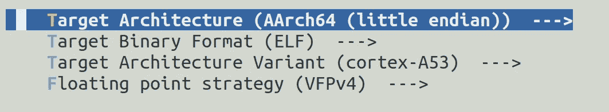
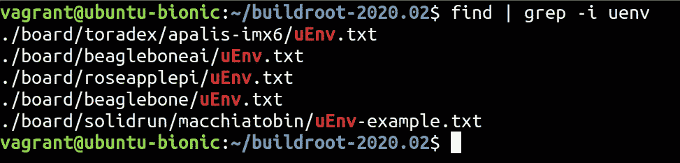

# 为物联网构建定制的 Linux

> 原文：<https://levelup.gitconnected.com/build-a-custom-linux-for-iot-ab0a12dfd8b6>

本教程将帮助您使用 Buildroot(即:一个 Raspberry Pi)为您的物联网/嵌入式项目构建一个定制的 Linux 发行版。还有一些其他的选择，但是我发现 Buildroot 足够一致和简单，所以我们将坚持使用它作为本文的建议。


艾蒂安·吉拉尔代在 [Unsplash](https://unsplash.com?utm_source=medium&utm_medium=referral) 拍摄的照片

# 什么是 Buildroot？

Buildroot 是一个社区驱动的开源工具集，它将帮助您生成一个完整的根文件系统，然后您可以将其闪存到设备中。
它可以自己构建工具链、rootfs、bootloaders、内核和库。

你可以在它的官方页面上了解更多信息:

[](https://buildroot.org/) [## Buildroot 让嵌入式 Linux 变得简单

### 由于其内核式的 menuconfig、gconfig 和 xconfig 配置接口，构建一个基本系统用…

buildroot.org](https://buildroot.org/) 

## 安装和文档

要开始使用 Buildroot，您可以从官方页面下载正确的版本，并使用以下链接访问官方文档。

 [## build root——让嵌入式 Linux 变得简单

### 一旦您签出了源树的副本，您可以随时更新您的源树，以便它与…同步

buildroot.org](https://buildroot.org/download.html) [](https://buildroot.org/downloads/manual/manual.html) [## Buildroot 用户手册

### 为了实现这一点，Buildroot 能够生成交叉编译工具链、根文件系统、Linux……

buildroot.org](https://buildroot.org/downloads/manual/manual.html) 

照片由 [Michael Dziedzic](https://unsplash.com/@lazycreekimages?utm_source=medium&utm_medium=referral) 在 [Unsplash](https://unsplash.com?utm_source=medium&utm_medium=referral)

# 创建我们自己的 Linux

## 配置和构建

我们的第一步将是下载官方配置的流浪者构建，旋转虚拟机并登录到它。

```
**curl -O** [**https://buildroot.org/downloads/Vagrantfile**](https://buildroot.org/downloads/Vagrantfile) **vagrant up
vagrant ssh**
```

下一步是进入`buildroot-{version}`目录，发出以下命令构建配置。

```
**cd buildroot-*/
make menuconfig**
```

使用 menuconfig，您可以通过选择库、内核版本、架构、内核特性和模块等来定制您的 Linux。

在我们的例子中，我们不打算从头开始配置整个构建，因为这个过程很繁琐。我们将从预设开始。简而言之，我们将看到如何加载一个默认的配置文件(或“defconfig”)来从一个合理的预置开始，并从那里定制我们的构建。

通过发出以下命令，可以强制 Buildroot 下载构建当前配置所需的所有源文件。

```
**time make source 2>&1 | tee download.log
make source**
```

现在让我们研究一些预制的配置文件，这些文件是 Buildroot 发出以下命令时附带的。

```
**ls ./configs**
```

对于本文的提议，我们对构建一个 Raspberry Pi 3 x64 系统感兴趣。让我们看看我们的选择。

```
**ls configs/ | grep rasp**
raspberrypi0_defconfig
raspberrypi0w_defconfig
raspberrypi2_defconfig
raspberrypi3_64_defconfig
raspberrypi3_defconfig
raspberrypi3_qt5we_defconfig
raspberrypi_defconfig
```

从目前的列表中我们可以选择“raspberrypi3_64_defconfig”，这似乎是最好的选择。

现在有了我们的目标 defconfig 文件，我们运行 make 来加载它的选项，并从开始一组合理的默认值。

```
**make raspberrypi3_64_defconfig
make menuconfig**
```

这次运行了`make menuconfig`之后，您应该会注意到从 defconfig 文件中加载的几个变化。作为一个例子，我们可以在这里看到*“目标选项”*菜单已经为 Raspberry Pi 3 选择了合适的架构选项。这就是为什么使用 defconfig 文件可以为您节省大量时间，并避免以后出现一些问题。



现在是时候定制您的 Linux 版本了。请记住，如果您不确定您正在做什么，您可以通过重新运行前面步骤中的命令来重新加载默认配置。

添加完令人惊叹的定制之后，是时候下载所有需要的包并构建整个工具链、rootfs 和内核映像了。Buildroot 会处理所有的事情，你只需要耐心等待，因为这个过程需要相当长的时间。

```
**time make 2>&1 | tee build.log**
```


照片由[诺德伍德主题](https://unsplash.com/@nordwood?utm_source=medium&utm_medium=referral)在 [Unsplash](https://unsplash.com?utm_source=medium&utm_medium=referral) 上拍摄

## 迭代定制过程

这个加载 defconfig、定制构建和构建的过程可以重复进行，直到系统完全符合您的要求。要保存您当前的配置，您可以将它的最小版本保存为“默认配置文件”,发出以下命令。

```
**make savedefconfig**
```

要加载预先存在的 defconfig 文件，您只需重复我们在前面步骤中所做的相同操作，但使用新的 defconfig 文件名。

```
**make {your custom defconfigfile name}**
**make menuconfig**
**make**
```

## 闪烁图像

构建过程的结果将被放入`./output/images`中，并将包括设备树块、引导加载程序、根文件系统和内核映像。

一旦构建完成，我们可以将其闪存到 SD 卡。
为此，首先将**第一阶段引导加载程序、第二阶段引导加载程序、内核映像和设备树 blob** 复制到 SD 卡的引导分区。

```
**cd /buildroot/output/images
cp MLO u-boot.img zImage am3535x-boneblack.dtb /media/(whoami)/bootpartition**
```

我们需要为 Uboot 提供一个环境配置文件(名为`uEnv.txt`)，这样它就知道在启动时从哪里获取内核映像。Buildroot 提供了几个 uEnv 文件，您可以通过发出以下命令找到它们。



下一步是将 rootfs 提取到第二个分区中。

```
**sudo tar -C /media/(whoami)/rootfspartition -xfv /buildroot/output/images/rootfs.tar**
```

现在我们已经将所有内容复制到 SD 卡中，我们可以卸载它的分区了。

```
**umount /media/(whoami)/bootpartition
umount /media/(whoami)/rootfspartition**
```


照片由[路易斯·里德](https://unsplash.com/@_louisreed?utm_source=medium&utm_medium=referral)在 [Unsplash](https://unsplash.com?utm_source=medium&utm_medium=referral) 拍摄

## 测试

是时候将 SD 卡放入主板，启动它，并通过串口连接来测试我们的定制操作系统了。要通过串行连接，您可以使用`picocom`、`screen`或`minicom`。

```
**picocom /dev/ttyUSB0**
```


照片由[哈里森·布罗德本特](https://unsplash.com/@harrisonbroadbent?utm_source=medium&utm_medium=referral)在 [Unsplash](https://unsplash.com?utm_source=medium&utm_medium=referral) 上拍摄

如果你喜欢这篇文章，不要犹豫，分享它，在 [Medium](https://medium.com/@syscall59) 、 [Twitter](https://twitter.com/syscall59) 和 [Github](https://github.com/alanvivona) 上关注我吧！

> 推特:[https://twitter.com/syscall59](https://twitter.com/syscall59)中:[https://medium.com/@syscall59](https://medium.com/@syscall59)Github:[https://github.com/alanvivona](https://github.com/alanvivona)

下次见！