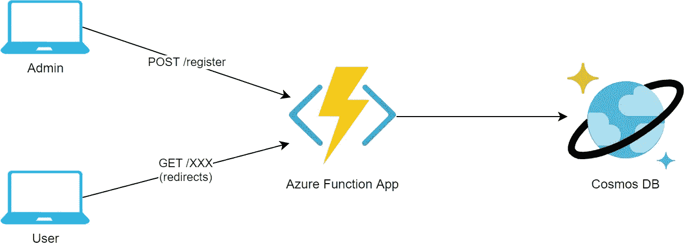
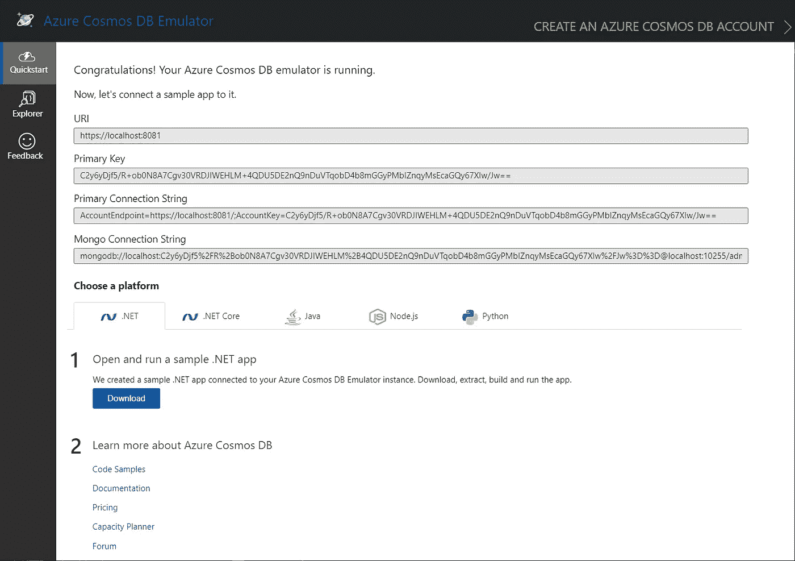
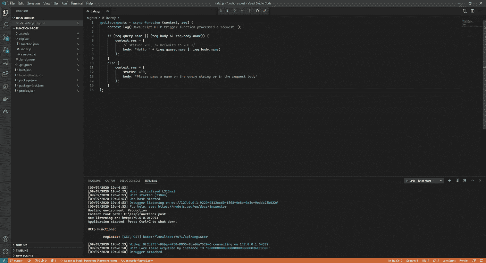

# 使用 Azure 函数和 Cosmos DB 构建一个定制的 URL 缩短器

> 原文：<https://levelup.gitconnected.com/build-a-custom-url-shortener-using-azure-functions-and-cosmos-db-c20e59261375>

由[马克斯·德尔西德](https://unsplash.com/@maxdelsid?utm_source=unsplash&utm_medium=referral&utm_content=creditCopyText)在 [Unsplash](https://unsplash.com/?utm_source=unsplash&utm_medium=referral&utm_content=creditCopyText) 拍摄的照片

# 介绍

本文描述了如何使用带有 Azure 函数和 Cosmos DB 的 Azure 无服务器平台构建自定义 URL shortener 服务。我在最近阅读了 [Jussi Roine 的文章](https://jussiroine.com/2020/07/building-a-custom-url-shortener-service-using-azure-and-a-serverless-approach/)后有了这个想法，他在文章中使用无服务器的 Azure 方法构建了一个 URL shortener 服务(如 [bit.ly](https://bitly.com/) ),这是一种由他领导的使用 [Azure Logic Apps](https://azure.microsoft.com/en-us/services/logic-apps/) 和一个定制 web 应用程序的方法。当我在读他的文章时，我意识到用 [Azure Functions](https://azure.microsoft.com/en-us/services/functions/) 和正确使用输入和输出绑定来构建相同的解决方案，可以产生一个非常优雅的解决方案。因此，我踏上了一段旅程，想看看这样的解决方案到底有多聪明。

我还希望该解决方案具有高度可伸缩性，并在响应查询时实现非常低的延迟，因此我选择使用 [Azure Cosmos DB](https://azure.microsoft.com/en-us/services/cosmos-db/) 作为存储解决方案。Cosmos DB 是微软专有的全球分布式多模型数据库服务。Cosmos DB 保证在第 99 百分位的读写延迟小于 10ms，所以这是一个自然的选择。

# 要求

URL 缩写服务应该有两个端点:

1.  一个 URL 注册端点，它允许客户端向它们的重定向目标注册缩短的 URL(通常称为虚 URL)。
2.  URL 重定向端点，web 浏览器可以在这里使用虚荣心域发出`GET`请求，并接收到重定向到目标 URL 的请求。

此外，如上所述，服务应该具有以下运行时质量:

1.  响应重定向请求的延迟非常低。
2.  在请求吞吐量和地理可扩展性方面具有超高的可扩展性。
3.  运营成本相对较低，成本与请求吞吐量成比例。

# 解决方案

为了回答上面的需求，我决定采用下面的解决方案架构。

URL 缩写体系结构

除了满足功能需求之外，这种架构还与期望的运行时质量保持一致。

1.  Cosmos DB [保证第 99 百分位的读取(索引)和写入的延迟](https://docs.microsoft.com/en-us/azure/cosmos-db/introduction#guaranteed-low-latency-at-99th-percentile-worldwide)小于 10ms，同时允许几乎无限的吞吐量(通过适当的扩展)。唯一可以改善这种延迟的机制是内存缓存，如 [Redis](https://redis.io/) (或 [Azure Cache for Redis](https://azure.microsoft.com/en-us/services/cache/) )。然而，这确实需要额外的工作，因为仅靠 Redis 无法提供所需的持久性一致性。我们可以将 Redis 作为缓存机制和 Cosmos DB 作为持久性结合起来，从而两全其美；然而，这超出了本文的范围。
2.  只需点击一个按钮，我们就可以在[多个地区](https://docs.microsoft.com/en-us/azure/cosmos-db/how-to-multi-master)快速部署 Cosmos DB，在全球范围内扩展我们的数据。
3.  Azure Functions 是一个轻量级的解决方案，开销很小。Azure Functions(以及几乎所有无服务器平台)唯一的缺点是[冷启动时间](https://azure.microsoft.com/en-us/blog/understanding-serverless-cold-start/)，这可能会很长。然而，高级和专用托管计划解决了 Azure 上的这个问题(以增加财务费用为代价)。
4.  Cosmos DB 和 Azure 函数都可以从低成本开始，随着所需吞吐量的增加而增加支出。

# 宇宙数据库

要使用 Cosmos DB，您可以使用 [Cosmos DB 模拟器](https://docs.microsoft.com/en-us/azure/cosmos-db/local-emulator)(仅在 Windows 上)或[在 Azure](https://docs.microsoft.com/en-us/azure/cosmos-db/create-cosmosdb-resources-portal) 上创建一个 Cosmos DB 帐户。Cosmos DB 提供了一个免费层，适合我们的网址缩写。无论您选择哪种方式，请注意 Cosmos DB 连接字符串，因为您将需要它来配置我们即将实现的 Azure 功能。

Cosmos DB 仿真器

# Azure 函数

## 创建函数应用程序

创建 Azure Functions App 的方法有很多，支持的语言有多种。对于我的实现，我选择使用 Node.js 和使用 Visual Studio 代码的 JavaScript。要引导应用程序，您可以遵循方便的[快速入门指南](https://docs.microsoft.com/en-us/azure/azure-functions/functions-create-first-function-vs-code?pivots=programming-language-javascript)。我使用以下输入来响应 VSCode 扩展提示:

*   语言: *JavaScript*
*   模板: *HTTP 触发器*
*   函数名:*寄存器*
*   授权级别:*匿名*(这对于演示来说很好，但是对于生产来说，你可以使用[功能键](https://docs.microsoft.com/en-us/azure/azure-functions/functions-bindings-http-webhook-trigger?tabs=csharp#authorization-keys)或者 [EasyAuth](https://docs.microsoft.com/en-us/azure/app-service/overview-authentication-authorization)

该扩展现在应该创建一个名为“注册”的基本“Hello World”风格的功能应用程序您可以通过按 F5 调试应用程序或从终端窗口启动`npm start`来启动应用程序。这两个选项都应该启动 Azure Functions 运行时，并允许您测试您的应用程序。

初始工作空间与代码工作空间

您可以通过从工作区的根文件夹执行以下命令来测试该函数是否正常运行:

一旦一切正常，就可以删除`sample.dat`文件了。

## 配置 Cosmos 数据库

要配置 Cosmos DB，编辑`local.settings.json`文件并添加以下连接字符串:

代码片段中的连接字符串对应于 Cosmos DB 模拟器。如果您在 Azure 中创建了一个 Cosmos DB 帐户，那么您应该将连接字符串替换为您创建的 Cosmos DB 实例上的门户中可用的连接字符串。

## 自定义路由前缀

默认情况下，Azure Functions 运行时会给所有 HTTP 触发路由加上前缀`/api`。因为我们想保持 URL 的简短(这是一个 URL **shortener** 服务…)，我们需要删除这个前缀。

幸运的是，可以通过编辑`host.json`文件并添加以下配置来定制前缀。

此配置将默认路由前缀设置为空字符串，实际上是将其删除。

## 创作 URL 注册端点

首先，我们将配置`function.json`文件中的函数绑定，如下所示:

让我们将这个定义分解成几个部分:

1.  第 4–9 行定义了 HTTP 触发器。我们正在定义一个将`POST`请求匹配到`/register`端点的路由。然后，该请求在`req`对象上可用。
2.  第 12–14 行定义了 HTTP 响应输出，由返回对象的属性`res`分配。
3.  第 17–25 行是有趣的地方。这些行定义了一个输出绑定，它将返回对象的属性`registration`绑定到 Cosmos DB 数据库集合中的一个文档。因此，我们的函数分配给`registration`属性的任何对象都被自动放置到 DB 中，而无需编写任何与 Cosmos DB 相关的代码。我们稍后将使用这个文档来重定向传入的请求。此外，绑定定义了如果数据库或集合不存在，将为我们自动创建它们。相当整洁！

一旦所有绑定就绪，函数本身就非常简单:

我们期待一个带有两个字符串属性的请求体— `url`和`vanity`。如果这些属性存在，我们将返回一个注册对象(通过绑定输出到数据库)和一个成功的 HTTP 响应。否则，返回一个`400 bad request`响应。

## 添加 URL 重定向端点

一旦我们在数据库中注册了虚荣心 URL，最后一件事就是编写重定向逻辑本身。首先，让我们看看函数绑定。

1.  第 4–9 行定义了 HTTP 触发器。我们正在设置一个通配符路由，它将`GET`请求匹配到函数应用程序域中的任意**端点。我们还在一个名为`vanity`的变量中捕获了路由路径，我们稍后会用到它。这部分是魔术发生的地方。**
2.  第 12-21 行是魔法继续的地方。这些行定义了一个 Cosmos DB 输入绑定，对于每个请求，它自动获取 id 为`vanity`的文档。您还记得，这是从请求路径中提取的一个变量，它与`register`函数中的输出绑定所使用的标识符相匹配。因此，用虚拟 URL `myvanity`注册生成一个 id 为`myvanity`的文档，该文档被输出到数据库中。当通过在`http://domain/myvanity`上执行`GET` 请求重定向时，从 DB 中获取相同的文档，并且该函数可以重定向到它。甜美优雅，在我看来。
3.  第 24–26 行简单地定义了 HTTP 输出属性名。

一旦绑定就绪，代码本身也很简单:

如果在数据库中找到匹配的文档，则发送重定向。否则，返回一个`404 Not Found`错误。

# 测试解决方案

要测试注册过程，您可以发出以下命令:

确保你注册后得到一个成功的`204 No Content`响应，和一个`302 Found`响应虚荣心 URL 请求。

# 结论

无服务器平台提供了一种舒适的机制，以一种简单、经济的方式实现简单的 API。聪明地使用 Azure 函数绑定允许我们实现高度的复杂性，同时保持我们需要编写的绑定特定代码最少。Cosmos DB 作为一个易于使用但功能强大的文档数据库平台完善了解决方案。总之，我们看到了如何利用这些平台来优雅地实现一个定制的 URL shortener 服务。

感谢您花时间阅读这篇文章。请在下面给我留言。非常感谢您的反馈。

# 资源

以下是附加资源:

*   [样本源代码](https://github.com/estiller/azure-functions-url-shortener)
*   [Azure Functions JavaScript 开发者指南](https://docs.microsoft.com/en-us/azure/azure-functions/functions-reference-node)
*   [快速入门:使用 Visual Studio 代码在 Azure 中创建一个函数](https://docs.microsoft.com/en-us/azure/azure-functions/functions-create-first-function-vs-code)
*   [Azure 函数触发器和绑定概念](https://docs.microsoft.com/en-us/azure/azure-functions/functions-triggers-bindings)