# 用 Python 和 Tkinter 构建桌面应用

> 原文：<https://levelup.gitconnected.com/build-a-desktop-app-with-python-4a847e3b596c>

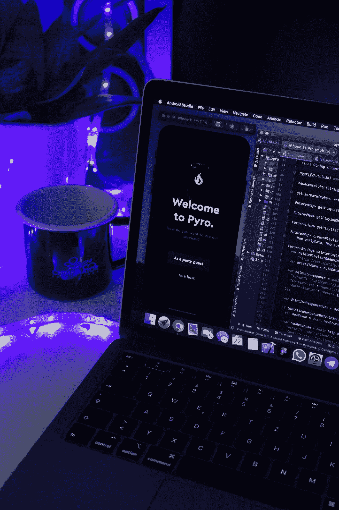

照片由 [Unsplash](https://unsplash.com?utm_source=medium&utm_medium=referral) 上的 [Niclas Illg](https://unsplash.com/@nicklbaert?utm_source=medium&utm_medium=referral) 拍摄

在本文中，我们将学习如何使用 python 和 Tkinter 模块开发现代桌面应用程序。桌面应用程序是您的 CLI 程序的用户界面，为用户提供了一种与您的代码进行交互的简单方式。我们可以简单地把它说成是你的程序的前端视图。他们有一些后端代码，你看到的窗口是连接到后端的前端，你在前端做的任何动作都会触发后端代码。我们将介绍如何使用 python 中的 Tkinter 模块开发 GUI。

# Tkinter 基础

我们将使用 Tkinter-python 设计一个登录应用程序。让我们从在程序中导入库开始，并设置我们的 GUI 窗口。

所以我们桌面应用的基本干扰，窗口被拆分成三步。

1.  `Tk()`调用`Tkinter class`和他们的方法，这将为我们制造一个窗口。
2.  `window.title()`设置窗口的标题
3.  `window.mainloop()`如你所知，python 代码在完成后逐行运行，这些代码行退出程序以使我们的应用程序窗口活跃，我们设置了`mainloop`方法，该方法将再次开始循环，使 python 再次读取`tkinter`类。结果将如下所示。

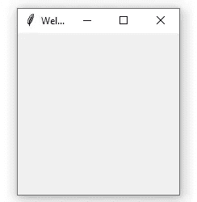

让我们来看看如何改变应用程序的窗口大小和背景颜色。

为了改变应用程序窗口的大小，Tkinter 有一个名为 geometry 的方法，我们在其中传递了宽度和高度。我设置的尺寸是 350x200，这是现在正常的尺寸。结果将如下所示。

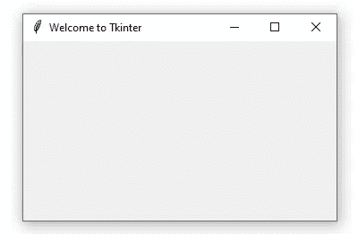

# 标签文本

标签只是显示在桌面应用程序上的普通文本。为了使用 Tkinter 制作标签，我们将使用方法`Label`。在设置函数之后，我们将传递包含文本、字体和文本大小的参数。

如果你已经设置了标签函数，并把窗口作为参数传递，因为它是我们的根和文本，在双引号中设置为 python，字体设置为大小为 30 的`Arial Bold`。在下一行中，我们使用了`lb1.pack()`，它基本上是设置我们的文本在中心对齐的位置。如果你删除代码行，你的文本将没有位置，你看不到他。我们将学习如何手动设置我们的文本的位置。检查下面的结果。

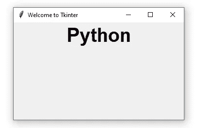

# 按钮和位置

每个桌面应用程序都有一些帮助用户执行软件操作的按钮。Tkinter python 为我们提供了在程序中添加按钮的方法。使用`Button()`这个方法，我们传递按钮名称和命令，告诉按钮在按钮被点击后你需要做什么。

在每个`Tkinter`方法调用中，我们总是需要传递根变量，它是一个窗口。在下一行中`btn.pack()`将我们的按钮与标签文本对齐，如果你运行代码，结果将如下所示。

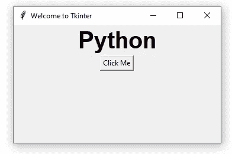

现在我们将学习如何改变按钮的大小，以及如何设置按钮在窗口中的位置。首先，让我们看看如何改变按钮的大小。让我们转到使用`tkinter ttk`的现代按钮创建——库只是在您的代码中导入了`ttk`。

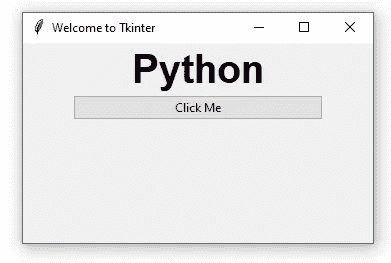

我必须通过将宽度作为参数传递并将其值设置为 40 来更改按钮的宽度。您可以通过设置按钮的背景色和前景色来更改按钮的颜色。前景将设置文本的颜色，背景将设置按钮的背景颜色。

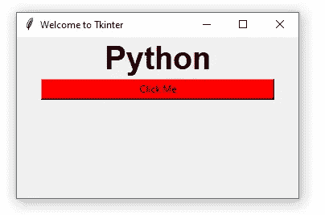

# 按钮操作

按钮动作用于在按下按钮时执行特定的任务或功能。如果我们桌面应用程序中的按钮没有任何功能，那么它将是无用的。我们已经讨论了在按钮函数中发送的参数。其中一个就是`command=`。让我们创建一个单独的 python 函数，并将命令设置为我们函数的名称。我将开发一个按钮按下功能，将打印*“按钮被按下！”*每当按下*按钮时。*

如果你运行，你会看到每次你按下按钮，btn_function 被调用，它在 print 函数中打印字符串文本。您可以使用按钮设置自己的桌面应用程序功能。

# 输入文本框

让我们举一个例子，我们正在开发一个用户注册的应用程序，为此我们需要输入用户的姓名、年龄等信息。For inputs `Tkinter`为我们提供了一个输入方法，在这个方法中我们传递了存储我们的输入和输入框大小的`textvariable`。

我们已经使用了 Tkinter 的`Enter()`函数，并传递了根变量、宽度和包含 var 变量的文本变量。如果您看到第 14 行，我们将 StringVar 存储在 Var 变量中，这表明我们将存储一个字符串类型的数据。您可以使用任何数据类型，比如 int、boolean 等。`Entry`该方法为我们提供了以下两种功能。

1.  `set()`用于设置输入框中的数值或文本
2.  `get()`用于获取输入框中输入的值或文本

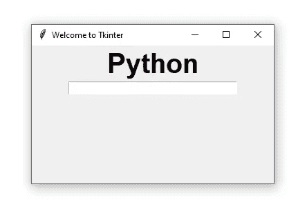

# 登录系统项目

让我们试着用 python 制作一个登录页面桌面应用程序，使用`Tkinter methods`和我们目前所学的知识。首先，让我们导入 Tkinter 的模块并设置我们的窗口。接下来，我们将添加两个输入框，用于获取用户名和密码等输入，然后我们将添加一个按钮，以便在用户填写所有输入字段时进行函数调用。检查下面的代码。

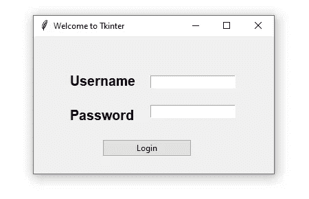

现在我们将实现按钮操作，这将是一个弹出消息窗口，显示您成功登录的消息，如果用户没有填写其中一个字段，它将弹出一条消息，指示用户输入正确的用户名和密码。为此，我们将使用 tkinter `messagebox`，它有一个名为`showinfo`的方法，我们在其中传递了弹出消息窗口的标题和消息。

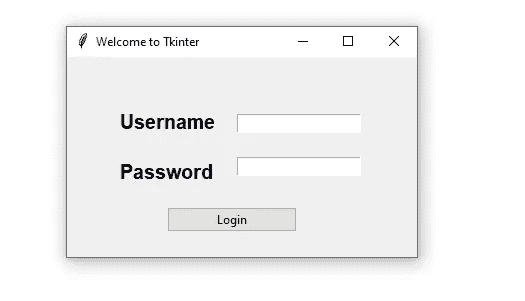

我们在第 3 行导入了一个消息框`showinfo`方法，并在函数名 message 中实现了它，我们还使用 get()函数创建了一个逻辑来查看用户是否填写了所有字段。当按钮按下时，程序将控制发送到消息功能，该功能将检查用户是否输入了正确的信息，如果他们输入了正确的信息，它将向他们显示是否 body 语句消息，否则将执行 body 语句。

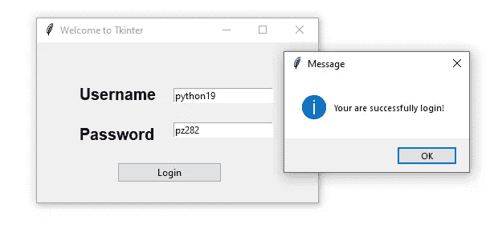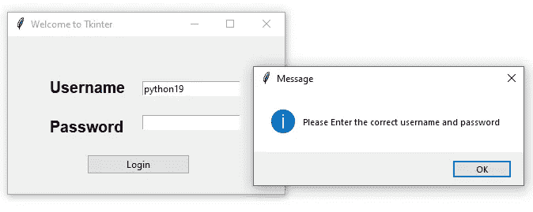

# 最后的想法

到目前为止，我们已经学习了 python 中桌面应用程序模块的基础知识，我们将看到如何创建按钮、标签和窗口，这是每个桌面应用程序的基础。接下来，我们做了一个小的登录项目，学习如何添加一个弹出消息窗口。您可以探索 Tkinter 模块，进一步学习。