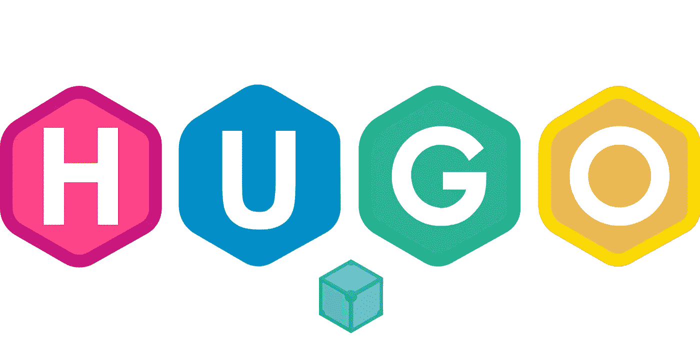

# 用 Hugo 建立一个分布式网站

> 原文：<https://levelup.gitconnected.com/build-a-distributed-website-with-hugo-1183bb098057>



Hugo 是一个有趣的静态网站生成器。它高效、简洁、强大。我将向你展示用它从零开始建立一个网站的愉快旅程。

Hugo 非常简单易学，所以我相信任何一个有基础技术背景的人都可以用 Hugo 快速创建一个漂亮的静态网站。

# 背景

最近，我在学习 [IPFS](https://ipfs.io/) ，发现这个东西非常适合托管静态网站，因为它是以内容为中心的，分布式的，防篡改的，防审查的。

话虽如此，为什么不为了好玩而在 IPFS 上建一个博客呢？所以我决定写下学习 IPFS 的过程，并把学习笔记发布到 Hugo 的网站上。

# 雨果是什么

[Hugo](https://gohugo.io/) 是一个静态网站生成器。它是用 Golang 编写的，运行效率极高。它号称是世界上最快的网站建设工具。

我不确定它是否是最快的，但它是零依赖，易于安装，可用于多平台。这些特征足以吸引我。

与 Hugo 相比， [Jekyll](https://jekyllrb.com/) 是用 Ruby 编写的，安装/维护起来稍微不太容易，运行起来效率也不高。

更不用说来自 NodeJS 社区的 [Hexo](https://hexo.io/) 了——是的，我对 NodeJS 有偏见。只要有可能，我会选择远离它😆。

# 快速启动

现在工具选好了，我们开始吧。

## **创建源代码库**

首先，在 Github 上创建一个仓库来跟踪我的网站，然后克隆这个空仓库。(您需要用您自己的网址替换该网址)

```
git clone [https://github.com/dche423/blog.git](https://github.com/dche423/blog.git)
```

## 安装 Hugo 并初始化网站

遵循[Hugo 官方文档](https://gohugo.io/getting-started/quick-start/)，流程相当简单。

本文以 macOS 为例，其他平台没有太大区别。

先用自制软件安装。

```
brew install hugo
```

运行`hugo`验证安装是否成功

```
$ hugo version
Hugo Static Site Generator v0.69.0/extended darwin/amd64 BuildDate: 
```

创建一个名为“博客”的新网站

```
$ hugo new site blog
Error: /dche423/blog already exists and is not empty. see — force.$ hugo new site blog **--force**
Congratulations! Your new Hugo site is created in /dche423/blog.
…
```

如果目标文件夹存在并且不为空，Hugo 将不会执行创建操作。只有当我们指定参数`force`时，动作才会成功

接下来，我需要一个网站的主题，我决定使用[阿南刻](https://themes.gohugo.io/gohugo-theme-ananke/)这是相同的官方教程。当然，你可以根据自己的喜好选择其他主题。在[雨果主题中心](https://themes.gohugo.io/)还有很多其他选择。

```
cd blog
git submodule add [https://github.com/budparr/gohugo-theme-ananke.git](https://github.com/budparr/gohugo-theme-ananke.git) themes/anankeecho 'theme = "ananke"' >> config.toml
```

主题的 git 存储库作为子模块添加到项目中，这样它就可以不断更新。一旦主题被克隆，编辑配置文件`config.toml`为网站启用这个主题。

## 创作一篇文章

虽然也可以在适当的目录中手动创建文件，但使用`hugo`命令会更容易，该命令会自动生成文件，并以[前体](https://gohugo.io/content-management/front-matter/.html)的格式填充相关元数据。

```
hugo new posts/build-website-with-hugo.md
```

下面是创建的降价文件的内容。

```
 —--
title: “Build Website With Hugo”
date: 2020–05–27T16:02:20+08:00
draft: true
 —--
```

两个属性`title`和`date`是直观的，不做解释。

属性`draft`表示这篇文章的状态。默认生成操作中不会生成 HTML 页面。当内容已经完成时，您可以将该属性值更改为`false`

## 启动 Hugo 开发服务器

下面是如何启动 Hugo dev 服务器在本地访问网站。

请注意在启动时添加了参数`-D`，它确保可以显示草稿状态的文章。

然后访问 [http://localhost:1313](http://localhost:1313](http://localhost:1313)) 会调出网站主页(虽然到目前为止几乎是一个空页面)。

注意:`1313`是 Hugo 服务器的默认端口，如果这个端口已经被另一个服务占用，Hugo 会自动切换到另一个可用的端口。

保持服务器运行，打开本地网站的浏览器会在任何文章被修改后自动刷新显示最新内容。

至此，一个基本的网站框架已经就绪。

# 定制您的网站

虽然网站框架可用，但一些基本信息需要进一步调整和定制。

## 调整基本信息

先看`config.toml`文件:

```
baseURL = "[https://example.org/](https://example.org/)"
languageCode = "en-us"
title = "My New Hugo Site"
**theme = "ananke"**
```

最后一行是刚定主题的时候加的。

`title`和`baseURL`都需要适当修改。更新后的内容如下所示:

```
baseURL = "/"
languageCode = "en-us"
title = "Che Dan"
theme = "ananke"
```

请注意，我们没有将`baseURL`更改为特定域下的地址(例如[https://www.chedan.io/](https://www.chedan.io/))，因为我们希望相同的 HTML 文件既服务于传统的域地址，也能在分布式 web 地址下正常工作。后续文章将更详细地解释这种权衡。

## 调整文章摘录

该网站的主页是一个文章列表，列表中的每一项都包含一个文章标题和一个摘录。

默认情况下，Hugo 选择文章的前 70 个单词作为摘录。对于东亚语言，需要在`config.toml`中启用属性`hasCJKLanguage`才能正确计数单词。

数字 70 可以通过`config.toml`中的属性`summaryLength`进行调整。

也可以使用`plainify`和`safeHTML`函数控制摘录中 HTML 的行为。这需要您更新网站模板，详情请访问[模板文档](https://gohugo.io/templates/)和[功能文档](https://gohugo.io/functions/)

除了自动摘录，Hugo 还支持两种手动方式。

1.  插入分隔符`<!--more-->`。分隔符之前的文本成为摘录。
2.  使用前沿元数据提供独立摘录。这种方法的好处是显而易见的，摘录不直接绑定到内容，非常灵活，因为它是由作者提供的，并且支持任何 HTML 格式。缺点是增加了手动工作量。要使用这种方法，您需要将`summary`元数据添加到一篇文章的前一部分。

如果为一篇文章设置了多个摘录，系统将优先选择:

```
Delimiter > Front Matter > Automatical Excerpt
```

有关更多摘录相关设置，请参见此处的[和](https://gohugo.io/content-management/summaries/)

## 关于代码突出显示

Hugo 内置了对代码块语法高亮显示的支持。

它开箱即用，并通过[高亮短代码](https://gohugo.io/content-management/syntax-highlighting/)提供额外的控制。(用于行号显示、多行高亮显示等。)

## 显示目录(TOC)

要显示目录，将`toc`添加到首页。

```
toc: ture
```

需要注意的是，Hugo 在 TOC 中默认只显示二级和三级标题，相当于`config.toml`中配置的以下项目。

```
[markup]
  [markup.tableOfContents]
    endLevel = 3
    startLevel = 2
```

如果你想改变它，你可以相应地调整数字。但是，根据官方文件，TOC 不应该有太多的级别，以防止过多的缩进。

另外，Hugo 0.6.x 好像 TOC 缩进有问题。比如 [#6613](https://github.com/gohugoio/hugo/issues/6613) 、 [#6623](https://github.com/gohugoio/hugo/issues/6623) 。一般来说，我们不需要多层次的 TOC。

## 设置网站的主图片和文章的标题图片

可以在`config.toml`中设置收藏夹图标和主图像。

```
[params]
  favicon = “favicon.ico”
  featured_image = “/sfo.jpg”
```

要在文章中添加标题图像，只需在头版添加一个属性。

```
**featured_image**: /hugo-logo-wide.svg
```

根据 Hugo 官方推荐，图片资源应该放在目录`./static`中。

该图像不仅会显示在文章详细信息页面中(自动缩放和裁剪)，还会作为缩略图显示在文章列表中。

# 建设

至此，网站已经做好了。要构建静态页面，我们需要将文章的属性`draft`改为`false`，并运行`hugo`命令:

生成的网页将出现在目录`./public`中。现在，所有需要做的工作就是部署网站。我将把它部署到 IPFS 网络，而不是部署到普通的 web 服务器上(细节将在下一篇文章中解释)。

但在深入研究技术细节之前，让我们先来试试这个 IPFS 主办的网站: [https://www.chedan.io](https://www.chedan.io) ，我的中文个人网站。它看起来和其他网站一样，但在幕后，它完全不同。因为我没有网络服务器。

# 结论

这篇文章记录了我和 Hugo 边做边学的过程。

总的来说，Hugo 在简单性和灵活性之间取得了很好的平衡。新手可以快速起来。而当用户需要更多定制时，Hugo 也完全支持。

和 Hugo 一起建网站的经历让我回忆起了 90 年代刚建个人主页的美好时光。这是我的荣幸。

作为入门教程，本文不涉及 Hugo 的一些高级特性，如[短码](https://gohugo.io/content-management/shortcodes/)、[原型](https://gohugo.io/content-management/archetypes/)、[模板机制](https://gohugo.io/templates/)等。相信这些在以后的实践中也会有用。

这篇文章是我学习和探索 IPFS / Web3 的起点。接下来，我将介绍如何将这个网站发布到 IPFS，向您展示传说中的 IPFS 可以很容易上手，并且可以与传统的 web 系统共存。

敬请期待！