# 在 Go with GCP 堆栈中构建财务“速度限制”实时数据处理管道

> 原文：<https://levelup.gitconnected.com/build-a-finance-velocity-limits-real-time-data-process-pipeline-in-go-with-gcp-stacks-558081f6ba8c>

周末构建和学习—第 3 部分

在金融领域，账户有所谓的**“速度限制”是很常见的**这个周末，我将编写一个数据处理管道，接受或拒绝交易，将资金实时加载到客户的账户中。

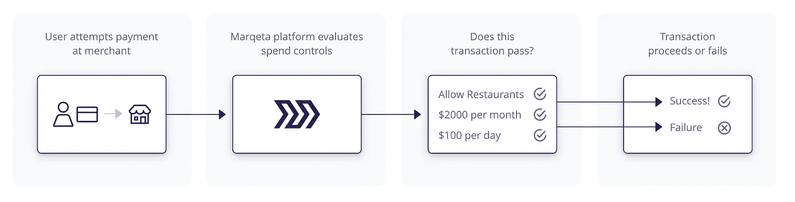

数据流

# **简单用例&规格:**

1.  每个传入的数据都是一个简单的 JSON 有效负载，如下所示:

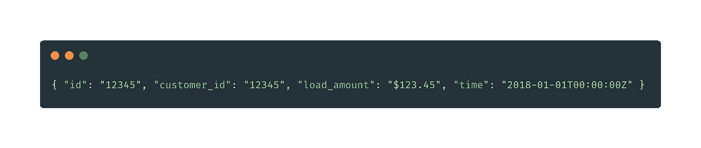

JSON 有效负载—传入

2.每个客户都有三个限制:

*   每天最多可装载 2000 美元
*   每周最多可装载 10，000 美元
*   无论数量多少，每天最多可执行 2 次装载。

这样，一个用户试图在一天内加载 1000 美元两次，在第二次尝试时会被拒绝，一个用户试图在一天内加载 500 美元四次也会被拒绝。

3.如果一个事务 ID 对于一个特定的用户被观察了不止一次，那么除了第一个实例之外的所有实例都可以被忽略。(*为了以后的阅读，请记住这一点，因为我想故意忽略这个需求，并将其添加回来，以测试我的应用程序架构是否可以扩展。*)

4.对于每笔交易，我们将返回一个 JSON 响应，指示交易是否根据用户的活动被接受，其结构如下:

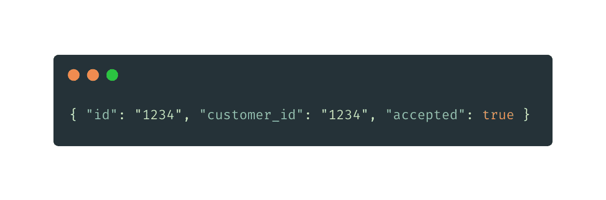

输出 JSON 响应

# 计划是:

1.  我们将把用例作为实时过程来处理，这将需要计划规模。一个**工作队列**似乎是一个合适的解决方案。
2.  我们已经确定了 3 个需求，例如每天可以加载**2000 美元**，每周加载**10000 美元**，每天加载 **2 次**。我们希望确保这可以是**可配置的**，并且还必须将实现逻辑与工作队列分开。
3.  我们还必须考虑内存缓存，以确保事务被跟踪，以符合验证规则。 **Redis** 或 **GCP 消防基地**似乎是这个任务的一个好选择，但是，作为 POC 属性，我们只使用本地映射引用来保持我们的记录跟踪。
4.  最终的输出，对于演示性质，我们可以保存为输出文件，并作为我们以前的教程/文章批处理到 GCP。(本文中我们不会解释太多。)

 [## 使用 Go 和 GCP 堆栈构建一个简单的 Lambda 架构数据管道。

### 周末构建和学习—第 2 部分

medium.com](https://medium.com/@jayhuang75/build-a-simple-lambda-architecture-data-pipeline-by-using-go-and-gcp-stacks-ea5ca7aa8a99) 

5.按照惯例，单元测试必须超过 80% 。

# 让我们编码

> 让我们开始分解高层次的设计和实现细节。

## **代码结构**

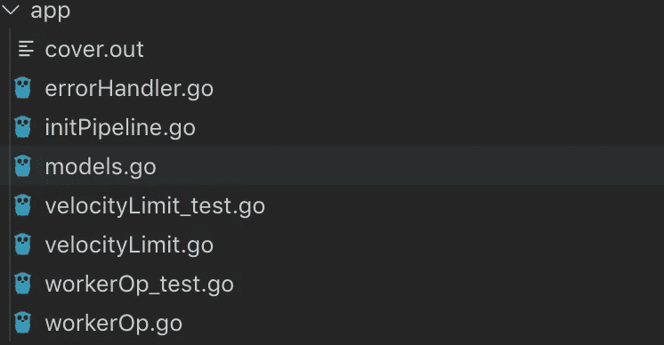

代码结构

## 运行中的界面

每个传入的交易都需要应用 3 个规则的验证。这可以由接口容易而有效地处理。

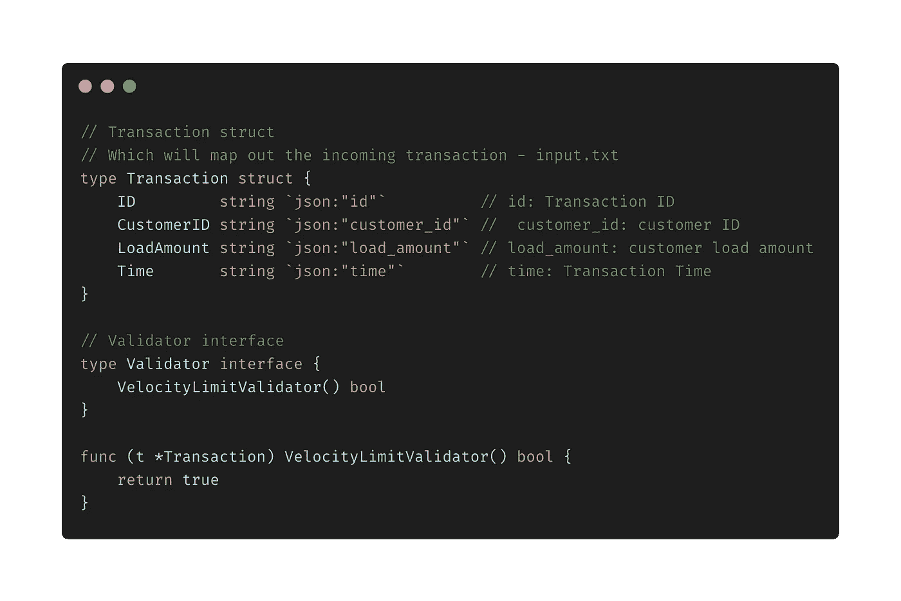

运行中的界面

## 在管道上签名

当您启动一个管道时，您不希望重新调用相同的初始函数并一遍又一遍地构造管道。单例模式应该适合我们的需求。就像初始化数据库连接一样。然而，我还想让这个**对于整个流程流来说是可扩展的**，以防我决定添加更多的连接，比如 Redis / GCP 栈。

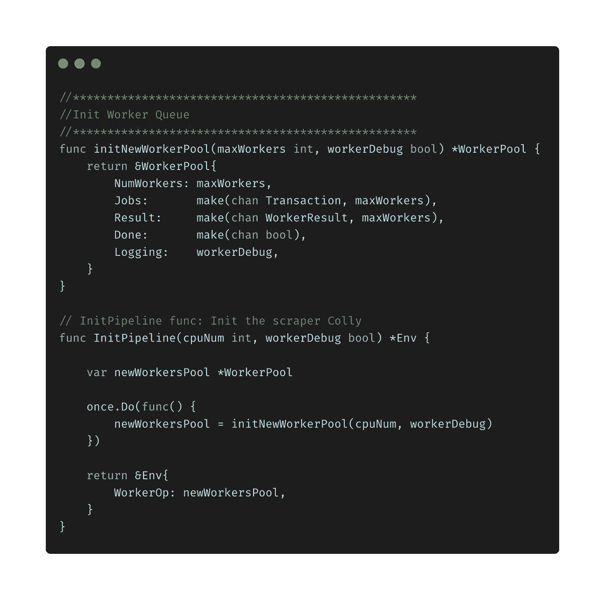

在管道上签名

## 工作队列实现

Go 有它漂亮的异步处理:**go routines**通道。

与其他语言的 async/waits、promises 和 futures 相比，goroutine 和 channels 更简单，更不容易出错，但功能同样强大。

构建工人队列系统背后的想法。我们希望维护一个任务/工作队列，在那里我们将推送一个新的工作/作业(在我们的用例中也称为事务)。当新的事务来自实时上游系统时，工作人员将主动监视队列并完成这些工作。

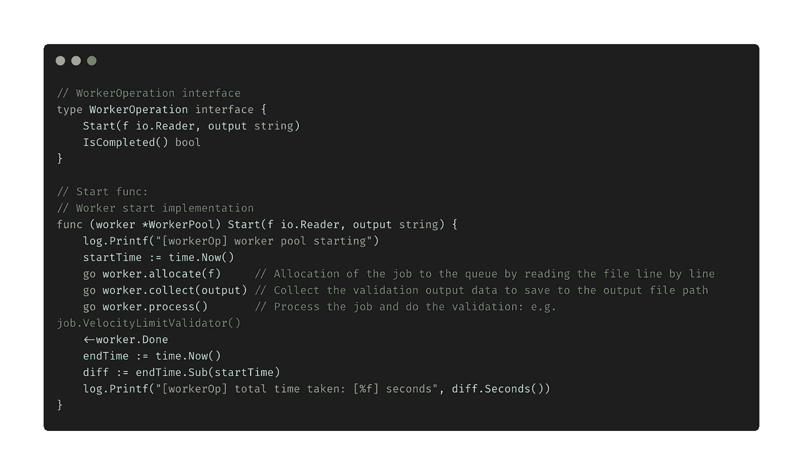

工作队列实现

好处:

1.  更好的表现
2.  提高可靠性
3.  增加延展性

## 如何开始管道和单元测试

大多数实现逻辑都是基于接口实现抽象出来的。

好处:

1.  Main.go 的每一步看起来都简单易懂。
2.  使用 mock 进行单元测试很容易满足我们 80%以上的覆盖率要求。

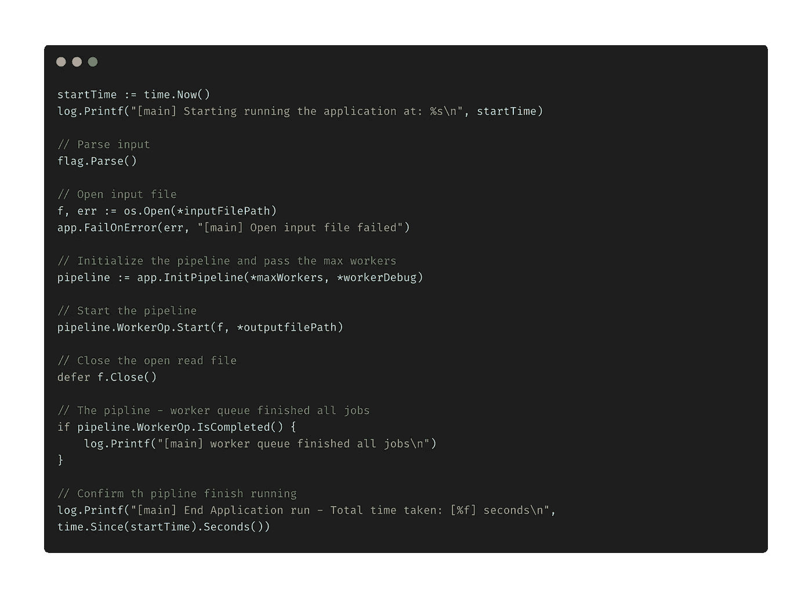

main.go 实现

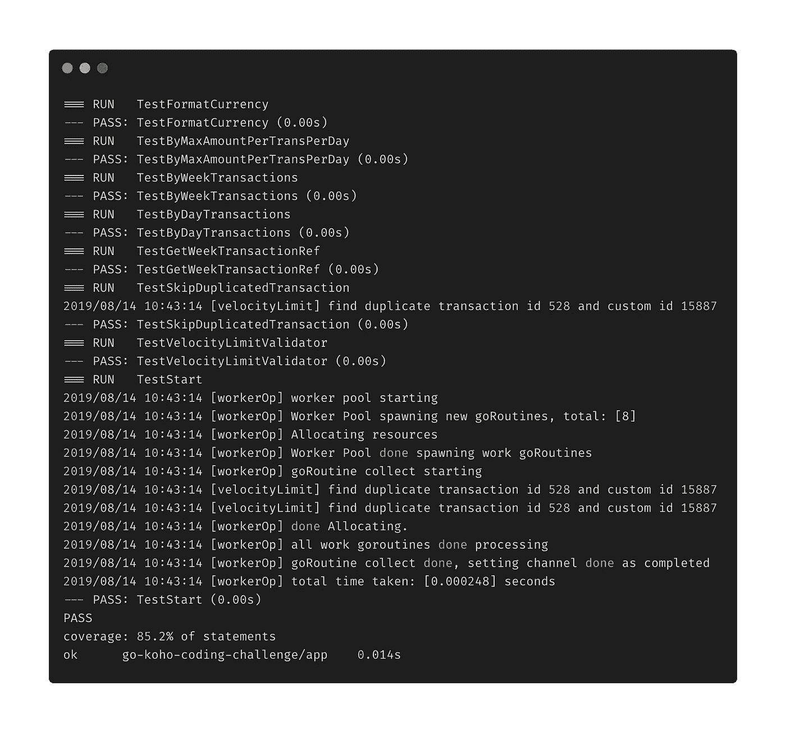

单元测试—覆盖率 85.2%

## 最终执行输出

我们在 input.txt 中有大约 1000 条记录，执行时间只需要 0.005 秒。

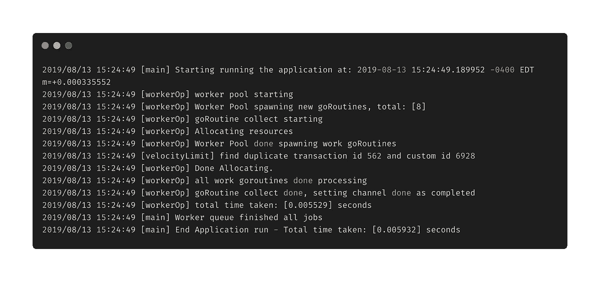

执行输出

# 嘿，这个管道很容易扩展。

你还记得我在简单用例&规范第 3 节中提到的吗？

> 3.如果一个事务 ID 对于一个特定的用户被观察了不止一次，那么除了第一个实例之外的所有实例都可以被忽略。(*请记住这一点，以便将来阅读，因为我想故意忽略这一需求，并将其添加回来，以测试我的应用程序架构是否可以伸缩。*)

让我们考虑这是一个需要添加的新验证规则。

我们唯一需要做的是:

1.  在交易界面中添加基于业务规则的新验证功能。
2.  在流水线处理函数中添加函数调用。

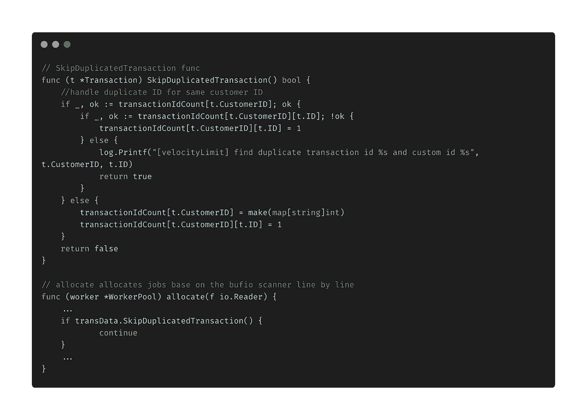

# 我学到了什么？

1.  学习金融“速度极限”的定义和概念。
2.  如何实现一个工作队列系统来处理事务数据？
3.  延展性建筑设计。
4.  永远享受编码的乐趣。:)

**在下一篇文章第 4 部分中，我将使用内存缓存解决方案来扩展这个管道。敬请关注。**

**如果你想看我的其他系列文章，请看下面:**

[https://medium.com/@jayhuang75](https://medium.com/@jayhuang75)