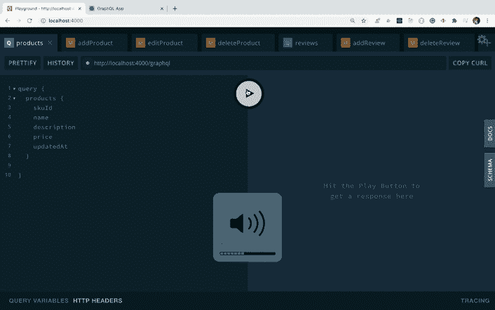

# 使用 GraphQL 作为后端 API 构建一个全栈应用程序(第 3 部分)

> 原文：<https://levelup.gitconnected.com/build-a-full-stack-app-using-graphql-as-backend-api-part-3-4af6489112e0>

使用 MongoDB + GraphQL + React + Node.js 栈构建 App。


由[卢卡斯·布拉塞克](https://unsplash.com/@goumbik?utm_source=medium&utm_medium=referral)在 [Unsplash](https://unsplash.com?utm_source=medium&utm_medium=referral) 上拍摄的照片

这是使用 GraphQL API 构建全栈应用程序系列的最后一部分。如果你错过了第一部[这里是](/learn-the-basics-of-graphql-4740d76d5e8a#7120)



更新商店以增加评论

现在，在`ProductsList.js`文件中添加`handleProductModalClose`事件处理程序

```
handleProductModalClose = () => {
  this.props.dispatch(clearError());
  this.setState({ isOpen: false });
};
```

在`render`方法中，将`propsToPass`对象改为

```
const propsToPass = {
  selectedProduct,
  isOpen,
  reviews,
  handleActionBtnClick: this.handleActionBtnClick,
  handleProductModalClose: this.handleProductModalClose
};
```

并把这些价值从州政府中拿出来

```
const {
  products,
  errorMsg,
  isLoading,
  isOpen,
  reviews,
  selectedProduct
} = this.state;
```

现在，你的`ProductsList.js`将看起来像这样

```
import React from 'react';
import { connect } from 'react-redux';
import _ from 'lodash';
import {
  initiateGetProducts,
  initiateDeleteProduct
} from '../actions/products';
import { initiateGetReviews } from '../actions/reviews';
import { clearError } from '../actions/error';
import Product from './Product';
import Layout from './Layout';class ProductsList extends React.Component {
  state = {
    products: [],
    errorMsg: '',
    isLoading: false,
    selectedProduct: null,
    reviews: null,
    isOpen: false
  };componentDidMount() {
    this.setState({ isLoading: true });
    this.props.dispatch(initiateGetProducts()).then(() => {
      this.setState({
        products: this.props.products,
        isLoading: false
      });
    });
  }componentDidUpdate(prevProps, prevState) {
    if (prevProps.products.length !== this.props.products.length) {
      this.setState({ products: this.props.products });
    }
    if (prevProps.error !== this.props.error) {
      this.setState({ errorMsg: this.props.error });
    }
    if (
      prevProps.reviews.skuId !== this.props.reviews.skuId ||
      (this.props.reviews.list &&
        prevProps.reviews.list.length !== this.props.reviews.list.length)
    ) {
      this.setState({ reviews: this.props.reviews });
    }
  }handleProductModalClose = () => {
    this.props.dispatch(clearError());
    this.setState({ isOpen: false });
  };handleActionBtnClick = (type, skuId, name) => {
    if (type === 'edit') {
      this.props.history.push({
        pathname: `/edit/${skuId}`,
        state: { type, skuId }
      });
    } else if (type === 'view') {
      this.setState(
        (prevState) => ({
          isOpen: !prevState.isOpen,
          selectedProduct: prevState.products.find(
            (product) => product.skuId === skuId
          )
        }),
        () => {
          this.props.dispatch(
            initiateGetReviews(this.state.selectedProduct.skuId)
          );
        }
      );
    } else if (type === 'delete') {
      const shouldDelete = window.confirm(
        `Are you sure you want to delete product with name ${name}?`
      );
      if (shouldDelete) {
        this.setState({ errorMsg: '' });
        this.props.dispatch(initiateDeleteProduct(skuId)).then(() => {
          const { errorMsg } = this.state;
          if (errorMsg === '') {
            const { history } = this.props;history.push('/');
          }
        });
      }
    }
  };render() {
    const {
      products,
      errorMsg,
      isLoading,
      isOpen,
      reviews,
      selectedProduct
    } = this.state;const propsToPass = {
      selectedProduct,
      isOpen,
      reviews,
      handleActionBtnClick: this.handleActionBtnClick,
      handleProductModalClose: this.handleProductModalClose
    };return (
      <Layout>
        {errorMsg !== '' && <p className="errorMsg">{errorMsg}</p>}
        {isLoading ? (
          <p className="loading">Loading...</p>
        ) : (
          <React.Fragment>
            {!_.isEmpty(products) ? (
              products.map((product, index) => {
                return (
                  <React.Fragment key={product.skuId}>
                    {index === 0 ? (
                      <React.Fragment>
                        <div className="product product-header">
                          <div className="name">Product Name</div>
                          <div className="description">Description</div>
                          <div>Price</div>
                        </div>
                        <Product {...product} {...propsToPass} />
                      </React.Fragment>
                    ) : (
                      <Product {...product} {...propsToPass} />
                    )}
                  </React.Fragment>
                );
              })
            ) : (
              <p className="no-result">
                No products found. Please add some products.
              </p>
            )}
          </React.Fragment>
        )}
      </Layout>
    );
  }
}const mapStateToProps = (state) => {
  return {
    products: state.products,
    error: state.error,
    reviews: state.reviews
  };
};export default connect(mapStateToProps)(ProductsList);
```

在`components`文件夹下新建一个文件`ProductModal.js`，并在其中添加以下内容。

```
import React from 'react';
import Modal from 'react-modal';
import { connect } from 'react-redux';
import ProductReviews from './ProductReviews';
import { initiateAddReview, clearReviews } from '../actions/reviews';Modal.setAppElement('#root');class ProductModal extends React.Component {
  state = {
    showAddReview: this.props.isOpen ? false : true,
    errorMsg: ''
  };componentDidUpdate(prevProps, prevState) {
    if (prevProps.error !== this.props.error) {
      this.setState({ errorMsg: this.props.error });
    }
    if (prevProps.isOpen !== this.props.isOpen) {
      const { dispatch, isOpen } = this.props;
      dispatch(clearReviews());
      this.setState({ showAddReview: isOpen ? false : true });
    }
  }render() {
    const {
      handleProductModalClose,
      isOpen,
      name,
      skuId,
      description,
      price,
      reviews
    } = this.props;const { showAddReview, errorMsg } = this.state;const customStyles = {
      content: {
        top: '50%',
        left: '50%',
        right: 'auto',
        bottom: 'auto',
        transform: 'translate(-50%, -50%)',
        width: '700px',
        height: '600px',
        display: 'flex',
        boxShadow: '0 0 7px 2px #444'
      }
    };return (
      <div>
        <Modal
          isOpen={isOpen}
          onRequestClose={handleProductModalClose}
          style={customStyles}
          contentLabel="Product Details"
        >
          <div className="product-details">
            <div className="close" onClick={handleProductModalClose}>
              x
            </div>
            <h3 className="heading">Product Details</h3>
            <p>
              <strong>Sku Id:</strong>
              <span>{skuId}</span>
            </p>
            <p>
              <strong>Name:</strong>
              <span>{name}</span>
            </p>
            <p>
              <strong>Description:</strong>
              <span>{description}</span>
            </p>
            <p>
              <strong>Price:</strong>
              <span>{price}</span>
            </p>
            {errorMsg && <p className="errorMsg">{errorMsg}</p>} <ProductReviews reviews={reviews} />
          </div>
        </Modal>
      </div>
    );
  }
}const mapStateToProps = (state) => {
  return {
    error: state.error
  };
};export default connect(mapStateToProps)(ProductModal);
```

这里，我们使用`react-modal`库来显示一个模态。它需要一个用于显示或隐藏模态的`isOpen`道具。在`npmjs`查看他们的示例，了解如何使用[这里](https://www.npmjs.com/package/react-modal#user-content-examples)

现在打开`Product.js`文件，取出通过的道具

```
const {
  name,
  skuId,
  description,
  price,
  handleActionBtnClick,
  handleProductModalClose,
  isOpen,
  selectedProduct,
  reviews
} = props;
```

在顶部添加对`ProductModal`文件的导入

```
import ProductModal from './ProductModal';
```

并在`<React.Fragment>`标签的末尾之前添加`ProductModal`组件，并向其传递所需的道具。

你的`Product.js`文件将会是这样的

```
import React from 'react';
import { Button } from 'react-bootstrap';
import ProductModal from './ProductModal';const Product = (props) => {
  const {
    name,
    skuId,
    description,
    price,
    handleActionBtnClick,
    handleProductModalClose,
    isOpen,
    selectedProduct,
    reviews
  } = props;
  return (
    <React.Fragment>
      <div className="product-item">
        <div className="product" data-skuid={skuId}>
          <div className="name">{name}</div>
          <div className="description">{description}</div>
          <div>{price.toFixed(2)}</div>
        </div>
        <div className="buttons">
          <div className="btn">
            <Button
              variant="info"
              type="submit"
              size="sm"
              onClick={() => handleActionBtnClick('view', skuId)}
            >
              View
            </Button>
          </div>
          <div className="btn">
            <Button
              variant="secondary"
              type="submit"
              size="sm"
              onClick={() => handleActionBtnClick('edit', skuId)}
            >
              Edit
            </Button>
          </div>
          <div className="btn">
            <Button
              variant="danger"
              type="submit"
              size="sm"
              onClick={() => handleActionBtnClick('delete', skuId, name)}
            >
              Delete
            </Button>
          </div>
        </div>
      </div>
      <ProductModal
        isOpen={isOpen}
        handleProductModalClose={handleProductModalClose}
        {...selectedProduct}
        reviews={reviews}
      />
    </React.Fragment>
  );
};export default Product;
```

在`components`文件夹下新建一个文件`Review.js`，并在其中添加以下内容。

```
import React from 'react';
import moment from 'moment';export default class Review extends React.Component {
  handleDeleteReview = (event) => {
    event.preventDefault();
    this.props.handleDeleteReview(this.props._id);
  };render() {
    const { title, comment, updatedAt } = this.props;return (
      <div className="review">
        <div className="updated_time">
          <div>{moment(+updatedAt).format('dddd, MMMM Do, YYYY h:mma')}</div>
          <div className="delete-review">
            <a href="/#" onClick={this.handleDeleteReview}>
              Delete
            </a>
          </div>
        </div>
        <div className="main-section">
          <p className="title">{title}</p>
          <p>{comment}</p>
        </div>
      </div>
    );
  }
}
```

在 components 文件夹中创建一个新文件 ProductReviews.js，并在其中添加以下内容。

```
import React from 'react';
import { connect } from 'react-redux';
import _ from 'lodash';
import Review from './Review';
import { initiateDeleteReview } from '../actions/reviews';class ProductReviews extends React.Component {
  handleDeleteReview = (id) => {
    this.props.dispatch(initiateDeleteReview(id));
  };render() {
    let { reviews } = this.props; if (reviews) {
      reviews = reviews.list;return (
        <div className="reviews">
          <h4 className="title">Reviews</h4>
          {!_.isEmpty(reviews) ? (
            reviews.map((review) => (
              <Review
                key={review._id}
                {...review}
                handleDeleteReview={this.handleDeleteReview}
              />
            ))
          ) : (
            <p>No reviews added. Be the first one to add review.</p>
          )}
        </div>
      );
    } else {
      return null;
    }
  }
}export default connect()(ProductReviews);
```

现在，重新启动`server`和`client`，首先从`server`文件夹执行`yarn start` 命令，然后从`client`文件夹执行，如果 MongoDB 服务器没有运行，也要执行，然后检查查看产品功能。


查看按钮功能的产品模式

现在，让我们添加选项，从 modal 本身添加一个新的评论。

在`components`文件夹中新建一个文件`ReviewForm.js`，并在其中添加以下内容。

```
import React from 'react';
import { Form, Button } from 'react-bootstrap';export default class ReviewForm extends React.Component {
  state = {
    title: '',
    comment: '',
    errorMsg: ''
  };handleSubmitReview = (event) => {
    event.preventDefault();
    const { skuId } = this.props;
    const { title, comment } = this.state; if (title.trim() !== '' && comment.trim() !== '') {
      this.props
        .handleSubmitReview(skuId, {
          title,
          comment
        })
        .then((response) => {
          if (response) {
            this.setState({
              title: '',
              comment: '',
              errorMsg: ''
            });
          }
        });
    } else {
      this.setState({ errorMsg: 'Please enter all the fields.' });
    }
  };handleInputChange = (event) => {
    const { name, value } = event.target; this.setState({
      [name]: value
    });
  };render() {
    const { showAddReview, toggleReview } = this.props;
    const { title, comment, errorMsg } = this.state; return (
      <React.Fragment>
        <Button
          variant="secondary"
          type="submit"
          size="sm"
          onClick={toggleReview}
        >
          {showAddReview ? 'Hide add review' : 'Add a review'}
        </Button>
        {errorMsg !== '' && <p className="errorMsg">{errorMsg}</p>}
        <div className={`add-review ${showAddReview ? '' : 'hide'}`}>
          <Form onSubmit={this.handleSubmitReview}>
            <Form.Group controlId="review_title">
              <Form.Label>Title</Form.Label>
              <Form.Control
                type="text"
                name="title"
                value={title}
                placeholder="Enter title for your review"
                onChange={this.handleInputChange}
                autoComplete="off"
              />
            </Form.Group>
            <Form.Group controlId="review_comment">
              <Form.Label>Write your review</Form.Label>
              <Form.Control
                as="textarea"
                name="comment"
                value={comment}
                rows="3"
                placeholder="Enter your review"
                onChange={this.handleInputChange}
                autoComplete="off"
              />
            </Form.Group>
            <Button variant="secondary" type="submit" size="sm">
              Publish
            </Button>
          </Form>
        </div>
      </React.Fragment>
    );
  }
}
```

打开`ProductModal.js`文件，在`ProductReview`组件之前导入并使用`ReviewForm`组件。

另外，在其中添加`toggleReview`和`handleSubmitReview`功能

```
handleSubmitReview = (skuId, review) => {
  return this.props.dispatch(initiateAddReview(skuId, review)).then(() => {
    const { errorMsg } = this.state; if (errorMsg === '') {
      this.setState({ showAddReview: false });
      return true;
    }
  });
};toggleReview = () => {
  this.setState((prevState) => ({ showAddReview: !prevState.showAddReview }));
};
```

为文件顶部的`initiateAddReview`添加导入。

```
import { clearReviews, initiateAddReview } from '../actions/reviews';
```

你的`ProductModal.js`文件现在会是这样的。

```
import React from 'react';
import Modal from 'react-modal';
import { connect } from 'react-redux';
import ReviewForm from './ReviewForm';
import ProductReviews from './ProductReviews';
import { clearReviews, initiateAddReview } from '../actions/reviews';Modal.setAppElement('#root');class ProductModal extends React.Component {
  state = {
    showAddReview: this.props.isOpen ? false : true,
    errorMsg: ''
  };componentDidUpdate(prevProps, prevState) {
    if (prevProps.error !== this.props.error) {
      this.setState({ errorMsg: this.props.error });
    }
    if (prevProps.isOpen !== this.props.isOpen) {
      const { dispatch, isOpen } = this.props;
      dispatch(clearReviews());
      this.setState({ showAddReview: isOpen ? false : true });
    }
  }handleSubmitReview = (skuId, review) => {
    return this.props.dispatch(initiateAddReview(skuId, review)).then(() => {
      const { errorMsg } = this.state; if (errorMsg === '') {
        this.setState({ showAddReview: false });
        return true;
      }
    });
  };toggleReview = () => {
    this.setState((prevState) => ({ showAddReview: !prevState.showAddReview }));
  };render() {
    const {
      handleProductModalClose,
      isOpen,
      name,
      skuId,
      description,
      price,
      reviews
    } = this.props; const { showAddReview, errorMsg } = this.state; const customStyles = {
      content: {
        top: '50%',
        left: '50%',
        right: 'auto',
        bottom: 'auto',
        transform: 'translate(-50%, -50%)',
        width: '700px',
        height: '600px',
        display: 'flex',
        boxShadow: '0 0 7px 2px #444'
      }
    }; return (
      <div>
        <Modal
          isOpen={isOpen}
          onRequestClose={handleProductModalClose}
          style={customStyles}
          contentLabel="Product Details"
        >
          <div className="product-details">
            <div className="close" onClick={handleProductModalClose}>
              x
            </div>
            <h3 className="heading">Product Details</h3>
            <p>
              <strong>Sku Id:</strong>
              <span>{skuId}</span>
            </p>
            <p>
              <strong>Name:</strong>
              <span>{name}</span>
            </p>
            <p>
              <strong>Description:</strong>
              <span>{description}</span>
            </p>
            <p>
              <strong>Price:</strong>
              <span>{price}</span>
            </p>
            {errorMsg && <p className="errorMsg">{errorMsg}</p>}
            <ReviewForm
              showAddReview={showAddReview}
              handleSubmitReview={this.handleSubmitReview}
              toggleReview={this.toggleReview}
              skuId={skuId}
            />
            <ProductReviews reviews={reviews} />
          </div>
        </Modal>
      </div>
    );
  }
}const mapStateToProps = (state) => {
  return {
    error: state.error
  };
};export default connect(mapStateToProps)(ProductModal);
```

现在检查应用程序。我们将能够添加新的评论并立即看到它。


添加审阅功能

就是这样。我们已经完成了全栈应用的全部功能。

你可以在[这个分支](https://github.com/myogeshchavan97/graphql-fullstack-app/tree/part2_full_stack_app)和主分支[这里](https://github.com/myogeshchavan97/graphql-fullstack-app)找到这篇文章的完整源代码

今天到此为止。我希望你学到了新东西。

**别忘了直接在你的收件箱** [**订阅我的每周时事通讯，里面有惊人的技巧、诀窍和文章。**](https://yogeshchavan.dev/)