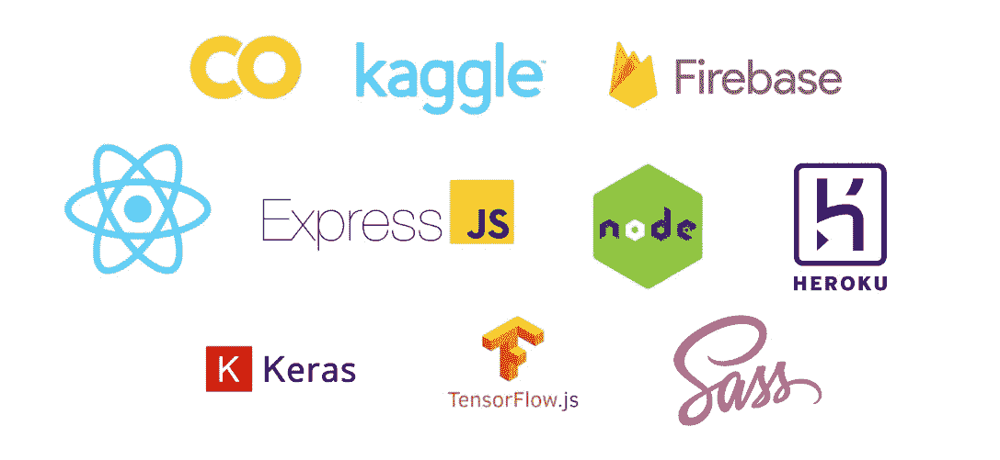
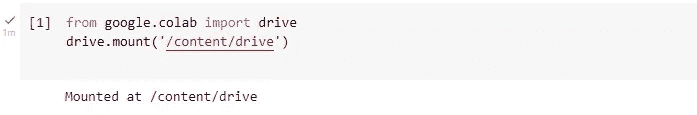
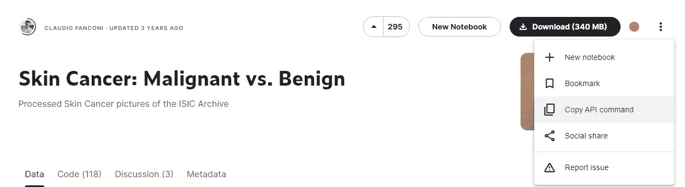
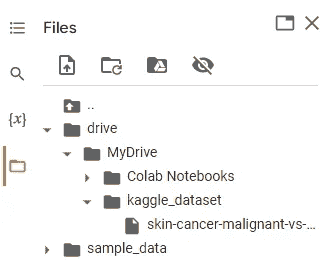
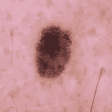
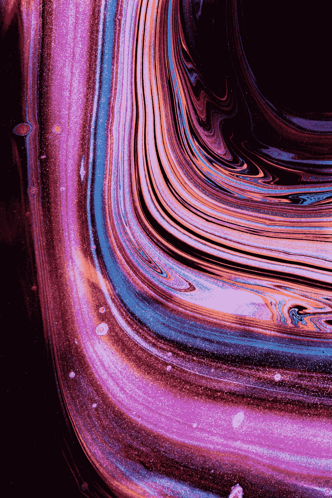
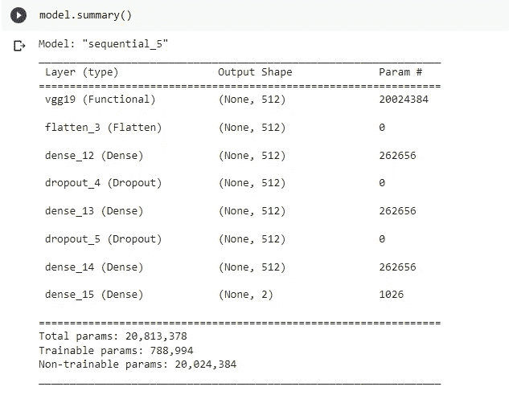
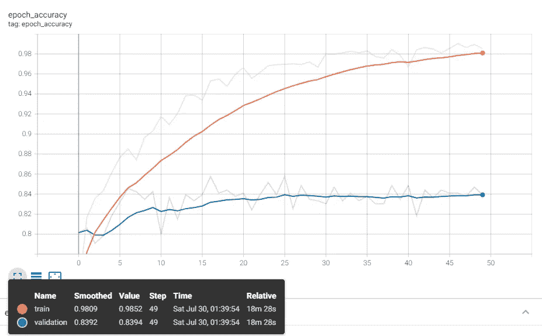

# 学习从头开始构建一个完整的实时皮肤癌检测 Web 应用程序(第 1 部分)

> 原文：<https://levelup.gitconnected.com/build-a-full-stack-web-application-for-real-time-skin-cancer-detection-5bda4f43681f>

这是一个构建全栈 web 应用程序的教程，可以用来实时诊断皮肤癌。

## 使用的技术

我们将使用以下技术来构建该应用程序:

*   React.js
*   厚颜无耻
*   节点. js
*   快递. js
*   Tensorflow.js
*   张量流和 Keras
*   重火力点
*   赫罗库



用于构建应用程序的技术(图片由作者提供)

# 涉及的步骤

我们将通过以下步骤创建此应用程序:

1.  训练人工智能模型以区分良性和恶性皮肤病变
2.  使用我们的人工智能模型创建后端
3.  在云服务器上托管后端
4.  创建一个前端应用程序，用户可以点击照片/上传图像用于皮肤癌识别
5.  将前端连接到后端
6.  在云服务器上托管我们的前端应用程序
7.  测试应用程序

出于可读性的考虑，本教程将被分成多个中等大小的帖子。


凯利·西克玛在 [Unsplash](https://unsplash.com?utm_source=medium&utm_medium=referral) 上的照片

激动吗？

开始吧！

*免责声明:请记住，该应用程序尚未在实际的皮肤癌患者身上进行测试和验证。因此，它不应用于生产，而应仅用于学习目的。*

# 步骤 1:训练一个人工智能模型

首先，我们需要训练一个人工智能模型来区分良性和恶性皮肤病变。

## 图像数据集

为了进行训练，我们将使用在 **Kaggle** 上提供的免费图像数据集。

[](https://www.kaggle.com/datasets/fanconic/skin-cancer-malignant-vs-benign) [## 皮肤癌:恶性还是良性

### 国际标准工业分类档案中经过处理的皮肤癌照片

www.kaggle.com](https://www.kaggle.com/datasets/fanconic/skin-cancer-malignant-vs-benign) 

数据集名为 ***皮肤癌:恶性与良性*** ，由两个文件夹组成，包含良性**和恶性**皮肤痣的图像。****

数据集中每幅图像的分辨率为 **244x244** 。

## Google 协同实验室入门

我们将使用 [*谷歌合作实验室*](https://research.google.com/colaboratory/) 来预处理来自该数据集的图像，然后训练我们的 AI 模型以用于应用程序。

*   如果您不熟悉 Google 协作室，请使用您的 Gmail 帐户登录，然后创建一个新笔记本。
*   一旦你进入这个笔记本，我们将把 Google Drive 连接到它。

```
from google.colab import drivedrive.mount('/content/drive')
```

该命令将导致一个提示，要求您允许此笔记本访问您的 Google Drive 文件。

*   出现提示时，授予访问 Google Drive 的必要权限。
*   成功后，您将看到以下输出:



作者图片

*   接下来，我们将在 Google Drive 中创建一个名为`kaggle_dataset`的目录，并切换到它。

```
%mkdir '/content/drive/MyDrive/kaggle_dataset'%cd '/content/drive/MyDrive/kaggle_dataset'
```


照片由[石蛙 ID](https://unsplash.com/@shiwa_id?utm_source=medium&utm_medium=referral) 在 [Unsplash](https://unsplash.com?utm_source=medium&utm_medium=referral) 上拍摄

## Kaggle 入门

*   登录到 [Kaggle](https://www.kaggle.com/)
*   转到“帐户”选项卡，并在 API 部分单击“创建新的 API 令牌”。

你可以用这个下载一个包含 Kaggle 的 API 证书的文件`kaggle.json`到你的电脑上。

## 将 Kaggle 与 Google Drive 配合使用的配置

*   为了在 Google Drive 中使用 Kaggle，我们将把`kaggle.json`中的凭证添加到环境变量中。
*   复制`kaggle.json`中的`username`和`key`，并将其添加到 Google 协同实验室的环境变量中，如下所示:

```
import osos.environ['KAGGLE_USERNAME'] = "your_username_here" os.environ['KAGGLE_KEY'] = "you_key_here" os.environ['KAGGLE_CONFIG_DIR'] = "/content/drive/MyDrive/kaggle_dataset"
```

## 将图像数据集下载到 Google Drive

*   转到下面的图像数据集，点击“复制 API 命令”

[](https://www.kaggle.com/datasets/fanconic/skin-cancer-malignant-vs-benign) [## 皮肤癌:恶性还是良性

### 国际标准工业分类档案中经过处理的皮肤癌照片

www.kaggle.com](https://www.kaggle.com/datasets/fanconic/skin-cancer-malignant-vs-benign) 

作者图片

*   在笔记本中运行此命令，将数据集下载到 Google Drive 中。

```
!kaggle datasets download -d fanconic/skin-cancer-malignant-vs-benign
```


作者图片

*   这会将图像数据集下载到`kaggle_dataset`文件夹中



作者图片

*   解压缩该文件

```
!unzip skin-cancer-malignant-vs-benign.zip
```

这将在`kaggle_dataset`文件夹中创建一个名为`data`的文件夹。

*   将此重命名为`skin_cancer_data`以避免混淆。

## 图像预处理

我们将为定义以下变量:

*   训练数据文件夹的路径(`TRAIN_PATH`)
*   测试数据文件夹的路径(`TEST_PATH`)
*   上述文件夹中的类别子文件夹(`CATEGORIES`)
*   图像尺寸(`IMG_SIZE`)

```
TRAIN_PATH = "/content/drive/MyDrive/kaggle_dataset/skin_cancer_data/train"TEST_PATH = "/content/drive/MyDrive/kaggle_dataset/skin_cancer_data/test"CATEGORIES = ['benign','malignant']IMG_SIZE = 224 #The default input size for training our AI model (VGG19) is 224x224
```

## 通过显示图像进行测试

*   我们将尝试从数据集中打开一个图像，以测试一切是否正常。

为此我们将使用`IPython`库。

```
from IPython.display import display
from IPython.display import Imagefor category in CATEGORIES:
    path = os.path.join(TRAIN_PATH, category) for img in os.listdir(path):
        display(Image(filename=os.path.join(path, img), width = IMG_SIZE, height = IMG_SIZE))
        break
    break
```

*   如果到目前为止一切正常，您将看到以下输出。



作者图片

## 创建培训数据

*   为此，我们将创建一个名为`create_training_data()`的函数并执行它。

```
import cv2training_data = []def create_training_data():
    for category in CATEGORIES:
        path = os.path.join(TRAIN_PATH, category) class_num = CATEGORIES.index(category) for img in os.listdir(path):
            try:
                img_array = cv2.imread(os.path.join(path, img))
                new_array = cv2.resize(img_array, (IMG_SIZE, IMG_SIZE))
                training_data.append([new_array, class_num])
        except Exception as e:
            passcreate_training_data()
```

这将创建一个数组`training_data`，由图像数据和图像所属的类别(良性/恶性)组成。

这个数组的长度将会是 **2637** 。

## 创建测试数据

*   为此，我们将创建一个名为`create_testing_data()`的函数并执行它。

```
import cv2testing_data = []def create_testing_data():
    for category in CATEGORIES:
        path = os.path.join(TEST_PATH, category)class_num = CATEGORIES.index(category)for img in os.listdir(path):
            try:
                img_array = cv2.imread(os.path.join(path, img))
                new_array = cv2.resize(img_array, (IMG_SIZE, IMG_SIZE))
                testing_data.append([new_array, class_num])
        except Exception as e:
            passcreate_testing_data()
```

这将创建一个数组`testing_data`，由图像数据和图像所属的类别(良性/恶性)组成。

这个数组的长度将是 **660** 。


照片由 [DeepMind](https://unsplash.com/@deepmind?utm_source=medium&utm_medium=referral) 在 [Unsplash](https://unsplash.com?utm_source=medium&utm_medium=referral) 上拍摄

## 随机打乱数据

*   在进一步预处理之前，我们将随机打乱数据集图像。

```
import randomrandom.shuffle(training_data)
random.shuffle(testing_data)
```

## 将数据拆分为要素和标签

*   我们将训练数据和测试数据分别拆分成特征`X_train`、`X_test`和标签`y_train`、`y_test`。

```
X_train= []
y_train= []
X_test = []
y_test = []for features, label in training_data:
    X_train.append(features)
    y_train.append(label)for features, label in testing_data:
    X_test.append(features)
    y_test.append(label)
```

## 将列表转换为具有所需形状的 Numpy 数组

*   我们将在培训前将培训和测试功能和标签转换为所需的形状。

```
import numpy as npX_train = np.array(X_train).reshape(-1, IMG_SIZE, IMG_SIZE, 3) y_train = np.array(y_train)X_test = np.array(X_test).reshape(-1, IMG_SIZE, IMG_SIZE, 3)
y_test = np.array(y_test)
```

## 规范化数组

*   我们将通过将所有值除以 255 来规范化`X_train` & `X_test`。

```
X_train = X_train/255.0
X_test = X_test/255.0
```



Solen Feyissa 在 [Unsplash](https://unsplash.com?utm_source=medium&utm_medium=referral) 上拍摄的照片

## 使用 ImageDataGenerator 预处理图像数组

`ImageDataGenerator`来自 Tensorflow，可用于生成具有实时数据增强的批量张量图像数据。

我们可以通过改变图像亮度、缩放、剪切、宽度、高度、旋转和许多其他参数来增加图像数据。

为了简单起见，我们现在不使用这些增强参数。

```
from tensorflow.keras.preprocessing.image import ImageDataGeneratortrain_datagen = ImageDataGenerator()
test_datagen = ImageDataGenerator()train_set = train_datagen.flow_from_directory(TRAIN_PATH, target_size = (IMG_SIZE, IMG_SIZE), batch_size = 32, class_mode = 'categorical')test_set = test_datagen.flow_from_directory(TEST_PATH, target_size = (IMG_SIZE, IMG_SIZE), batch_size = 32, class_mode = 'categorical')
```

## 使用迁移学习和 Keras 训练 VGG-19 模型

我们将使用迁移学习并在我们的数据集上训练一个`VGG_19`模型。

更多关于 VGG 的信息可以在这里找到:

[](https://keras.io/api/applications/vgg/) [## Keras 文档:VGG16 和 VGG19

### 实例化 VGG16 模型。关于图像分类使用案例的参考，请参见本页的详细示例。对于…

keras.io](https://keras.io/api/applications/vgg/) 

*   我们将导入以下内容开始:

```
import tensorflow
from tensorflow.keras.models import Sequential
from tensorflow.keras.layers import Dense, Flatten, Dropout
from tensorflow.keras.applications.vgg19 import VGG19
from tensorflow.keras.preprocessing import image
```

*   该模型可以初始化如下:

```
model = Sequential()
```

*   VGG19 模型在 ImageNet 数据集上进行了预训练。
    我们将按如下方式加载该模型:

```
pretrained_model = VGG19(
    include_top=False,
    weights="imagenet",
    input_tensor=None,
    input_shape= False,
    pooling = "max")
```

*   为了保留这个预训练模型的权重，我们将使用以下命令:

```
for layer in pretrained_model.layers:
    layer.trainable = False
```

*   接下来，我们将向这个预训练的 VGG19 模型添加以下层。

```
model.add(pretrained_model)model.add(Flatten())model.add(Dense(512, activation = "relu"))
model.add(Dropout(0.3))model.add(Dense(512, activation = "relu"))
model.add(Dropout(0.3))model.add(Dense(512, activation = "relu"))model.add(Dense(2, activation = "sigmoid"))
```

*   要查看模型摘要，我们将使用以下方法:

```
model.summary()
```



作者图片

*   用`binary_crossentropy`作为损失函数，`adam`作为优化器，`accuracy`用于监控模型性能。

```
model.compile(loss="binary_crossentropy", optimizer = "adam", metrics = ["accuracy"])
```

*   我们将使用 TensorBoard 来监控模型训练。

有关 TensorBoard 的更多信息，请访问:

[](https://www.tensorflow.org/tensorboard) [## 张量板|张量流

### TensorBoard 提供机器学习实验所需的可视化和工具:跟踪和…

www.tensorflow.org](https://www.tensorflow.org/tensorboard) 

```
%load_ext tensorboard
```

这个命令将在我们的笔记本中加载 TensorBoard。

*   接下来，我们将创建两个回调的列表。
    第一次回调将保存具有最高验证准确性的最佳训练模型。
    第二次回调将保存日志，供 TensorBoard 稍后使用。

```
my_callbacks = [
tensorflow.keras.callbacks.ModelCheckpoint(filepath='/content/drive/MyDrive/kaggle_dataset/skin_cancer_data/skin_cancer_VGG19.h5',monitor = "val_accuracy", save_best_only = True, verbose = 1),tensorflow.keras.callbacks.TensorBoard(log_dir='/content/drive/MyDrive/kaggle_dataset/skin_cancer_data/logs')
]
```


乔治·帕甘三世在 [Unsplash](https://unsplash.com?utm_source=medium&utm_medium=referral) 上的照片

我们可以使用训练数据作为`train_set`，验证数据作为`test_set`，数量`epochs`作为 50，回调作为`my_callbacks`来开始训练模型。

```
model.fit(train_set, validation_data= test_set, epochs=50, callbacks=my_callbacks)
```

*   **生成一个验证精度为** `**85.152%**` **的模型。**
*   TensorBoard 可用于通过以下方式可视化模型训练:

```
%tensorboard --logdir /content/drive/MyDrive/kaggle_dataset/skin_cancer_data/logs
```



模型训练期间每个时期的训练和验证准确性(图片由作者提供)

*   我们可以注意到，在训练我们的模型时，我们明显地过度拟合了。

因为本教程的目的是学习创建一个全栈 web 应用程序，而不是最大化模型的准确性，所以我们将继续使用当前的模型，该模型现在被保存为`skin_cancer_VGG19.H5`文件夹中的`skin_cancer_data`文件夹，如我们之前在回调中指定的那样。

## 将. h5 模型转换为。json 模型

*   在你的笔记本上安装 [**TensorflowJS**](https://www.tensorflow.org/js/guide/conversion) 使用如下:

```
!pip install tensorflowjs
```

*   接下来，使用以下命令转换模型:

```
!tensorflowjs_converter --input_format=keras /content/drive/MyDrive/kaggle_dataset/skin_cancer_data/skin_cancer_VGG19.h5 /content/drive/MyDrive/kaggle_dataset/skin_cancer_data/tfjs_model
```

这将把`skin_cancer_VGG19.h5`模型转换成一种可以在我们的前端应用程序中使用的格式。

该模型将保存在-

```
 /content/drive/MyDrive/kaggle_dataset/skin_cancer_data/tfjs_model
```

关于接下来的步骤，在本教程的下一部分再见！

感谢您阅读这篇文章！

*如果你是 Python 或编程的新手，可以看看我的新书，书名是'* [**《没有公牛**t 学习 Python 指南》**](https://bamaniaashish.gumroad.com/l/python-book) **'** *下面:*

[](https://bamaniaashish.gumroad.com/l/python-book) [## 学习 Python 的无牛指南

### 你是一个正在考虑学习编程却不知道从哪里开始的人吗？我有适合你的解决方案…

bamaniaashish.gumroad.com](https://bamaniaashish.gumroad.com/l/python-book) [](https://bamania-ashish.medium.com/membership) [## 通过我的推荐链接加入 Medium——Ashish Bama nia 博士

### 阅读 Ashish Bamania 博士(以及 Medium 上成千上万的其他作家)的每一个故事。您的会员费直接…

bamania-ashish.medium.com](https://bamania-ashish.medium.com/membership) 

# 分级编码

感谢您成为我们社区的一员！在你离开之前:

*   👏为故事鼓掌，跟着作者走👉
*   📰查看[升级编码出版物](https://levelup.gitconnected.com/?utm_source=pub&utm_medium=post)中的更多内容
*   🔔关注我们:[Twitter](https://twitter.com/gitconnected)|[LinkedIn](https://www.linkedin.com/company/gitconnected)|[时事通讯](https://newsletter.levelup.dev)

🚀👉 [**加入人才集体，找到一份令人惊喜的工作**](https://jobs.levelup.dev/talent/welcome?referral=true)