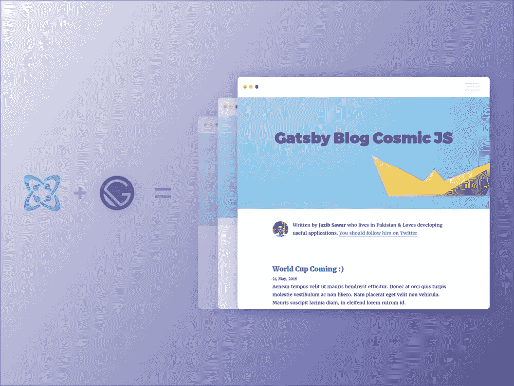
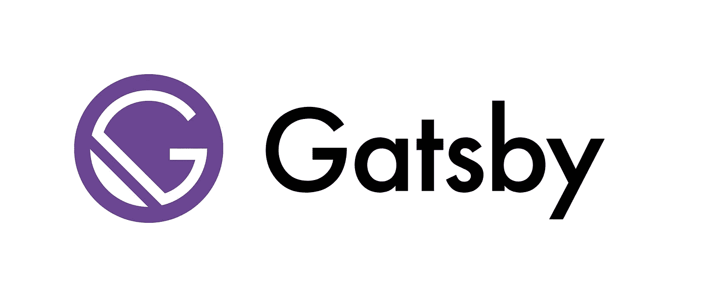
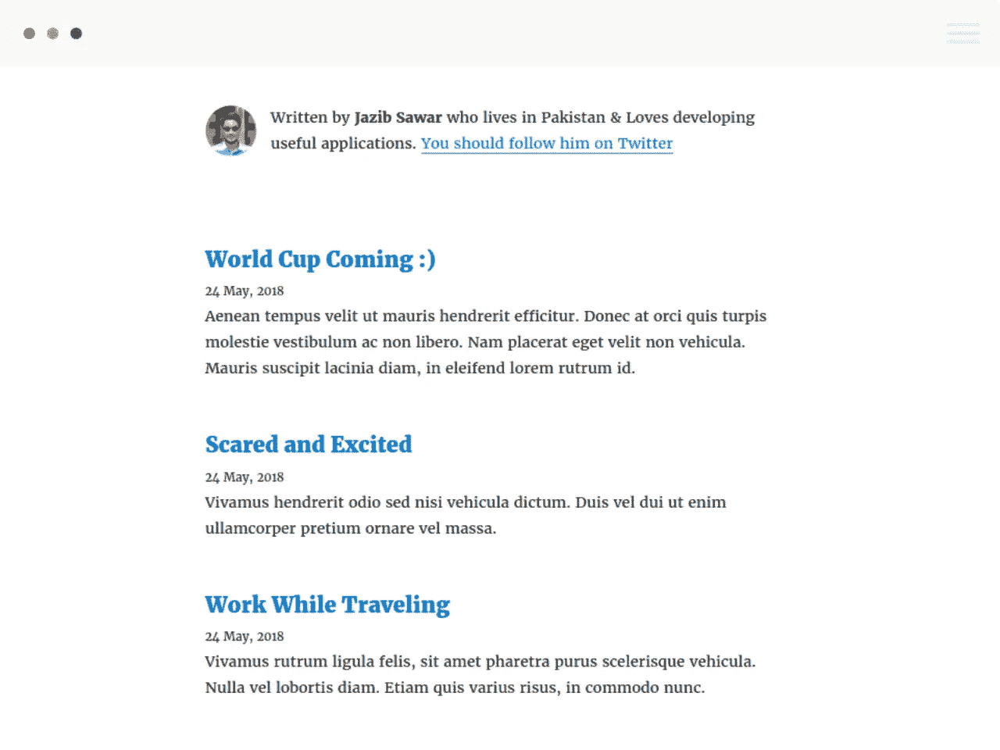
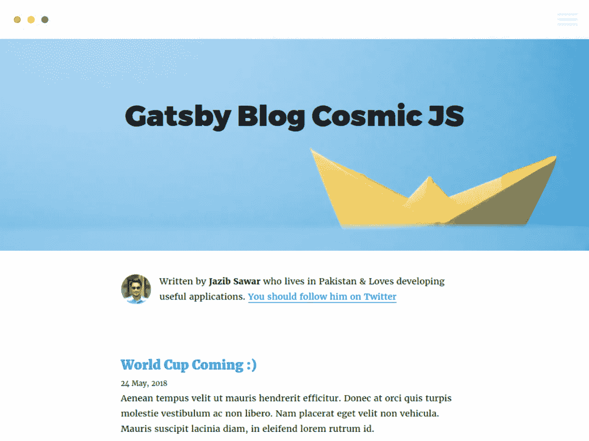

# 用 Gatsby、CosmicJS 和 React 创建一个静态网站博客

> 原文：<https://levelup.gitconnected.com/build-a-gatsby-blog-using-the-cosmic-js-source-plugin-57ea1b7c87dd>



最初发表于 [Cosmic JS 开发者文章](https://cosmicjs.com/articles)。

在本教程中，我们将学习如何使用 React、 [Gatsby JS](https://gatsbyjs.org/) 和 [Cosmic JS](https://cosmicjs.com/) 创建一个简单而快速的静态网站博客。Gatsby 是一个工具，可以让你生成静态 HTML 页面(服务器端渲染),这对于你的 web 应用程序来说是一个巨大的性能提升

# TL；速度三角形定位法(dead reckoning)

[盖茨比博客](https://cosmicjs.com/apps/gatsby-blog)
[盖茨比博客代码库](https://github.com/cosmicjs/gatsby-blog-cosmicjs)
[盖茨比快速入门](https://github.com/cosmicjs/gatsby-starter)
[查看演示。](https://gatsby-blog-cosmicjs.netlify.com/)

# 先决条件

在开始之前，您需要 NodeJS、npm 和 Gastby CLI。请确保您已经安装了这些。

# 盖茨比是什么？

Gatsby 是 React 的一个超快的网站框架。它允许开发者在几分钟内快速构建基于 React 的网站。无论你是想发展博客还是商业网站，《盖茨比》都会是一个不错的选择。



由于 Gatsby 使用 React 和 React 路由器，客户端在初始呈现后成为单页面应用程序。它还将为 route 生成一个静态 HTML 页面，确保您的初始加载几乎是即时的。

# 博客发展

我们必须设置环境，以便开始在博客上工作。

# 安装盖茨比

首先，安装 Gatsby CLI:

```
npm install --global gatsby-cli
```

# 搭建一个盖茨比模板

```
gatsby new gatsby-blog-cosmicjs
```

在项目的文件夹中输入:

```
cd gatsby-blog-cosmicjs
```

启动服务器:

```
gatsby develop
```

至此，您应该已经能够访问您的 Gatsby JS 博客网站了，地址是: [http://localhost:8000](http://localhost:8000/) 。

# 安装宇宙 JS 源代码插件

在静态博客中，你的数据可以从不同的来源消费:Markdown 文件、HTML 文件、外部 API (WordPress、 [Cosmic JS](https://cosmicjs.com) 等)。

因此，盖茨比实现了独立的层:数据层。它由 GraphQL 提供支持。非常令人兴奋的东西！

GraphQL 是脸书为 API 开发的现代查询语言。它允许客户端使用键/值对对象定义他们想要的查询。用户将密钥发送给服务器，服务器用相应的值进行响应。

要将这个数据层与不同的数据提供者连接起来，您需要集成源插件。幸运的是，有许多源代码插件可以满足大多数需求。

在我们的例子中，我们使用的是[宇宙 JS](https://cosmicjs.com/) 。显然，我们需要为 Cosmic JS 集成源代码插件。好消息:Cosmic JS 已经实现了他们的[源码插件](https://www.gatsbyjs.org/packages/gatsby-source-cosmicjs/)！

让我们安装:

```
npm install --save gatsby-source-cosmicjs
```

我们还需要安装一些其他插件。我们也这么做吧

```
npm install --save gatsby-plugin-offline gatsby-source-filesystem
```

这些插件需要一些配置。因此，将`gatsby-config.js`的内容替换为:

*路径:*

然后，重启服务器，让 Gatsby 考虑这些更新。

# 帖子列表和设置

首先，我们想在主页上显示文章列表。为此，请将以下内容添加到现有主页文件中:

*路径:* `*src/pages/index.js*`

## 解释:

在`*index.js*`文件的末尾，我们导出了 pageQuery。这些是 GraphQl 查询，用于获取关于设置和帖子列表的重要信息。

然后，我们将`{ data }`被析构的对象作为`IndexPage`的参数传递，并对其`allCosmicjsPosts` & `cosmicjsSettings`对象进行循环以显示数据。



# 单柱布局

到目前为止，我们已经将 Cosmic JS 源代码插件与 Gatsby 集成在一起，它看起来就像一个博客。现在，我们将致力于博客文章的详细信息页面。

让我们创建模板:

*路径:*

这看起来不错，但是此时，Gatsby 不知道何时应该显示这个模板。每个帖子都需要一个特定的 URL。因此，我们将通过`createPage`函数通知 Gatsby 我们需要的新 URL。

*路径:*

重启**盖茨比服务器。**

从现在开始，您应该可以通过点击主页上显示的 URL 来访问详细页面。


# 额外的东西！

除此之外，我们还实现了`*src/components/Bio.js*`来显示作者信息& `*src/layouts/index.js*`来创建博客的通用布局。

[的源代码可以在 GitHub](https://github.com/cosmicjs/gatsby-blog-cosmicjs) 上获得。要实时查看它，克隆存储库，并运行(`cd gatsby-blog-cosmicjs && npm i && npm run develop`)。

最后重启服务器，访问网站。看起来会很棒！

盖茨比生成的静态网站可以[轻松发布在存储提供商](https://www.gatsbyjs.org/docs/deploy-gatsby/)上:Netlify、S3/Cloudfront、GitHub pages、GitLab pages、Heroku 等。

**注意:**我们的[演示](https://gatsby-blog-cosmicjs.netlify.com/)部署在 Netlify 上。



# 结论

恭喜你。您已经成功构建了一个超级快速且易于维护的博客！请随意继续这个项目来发现盖茨比和宇宙 JS 的优点。

您可以将 Cosmic JS 的强大功能添加到任何新的或现有的代码库中，而不考虑编程语言。在[我们的知识库](https://cosmicjs.com/knowledge-base)中查看更多应用集成技巧。

Cosmic JS 使内容管理者和开发者能够更好地合作。通过提供直观的管理仪表板、强大的 API 和灵活的用户角色，应用程序的构建速度更快、重量更轻，并且您的整个团队在这个过程中节省了时间。

[Cosmic JS](https://cosmicjs.com/) 是一个 API 第一的基于云的内容管理平台，可以轻松管理应用和内容。如果你有关于 Cosmic JS API 的问题，请在 [Twitter](https://twitter.com/cosmic_js) 或 [Slack](https://cosmicjs.com/community) 上联系创始人。