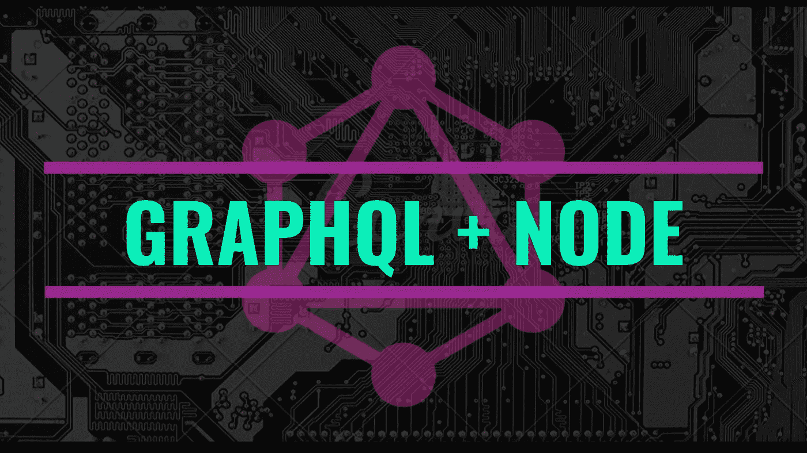
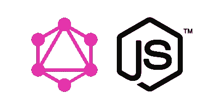
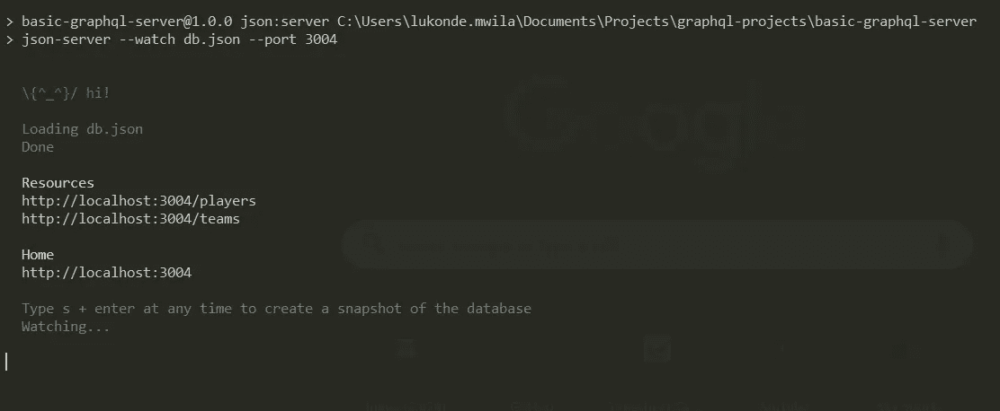
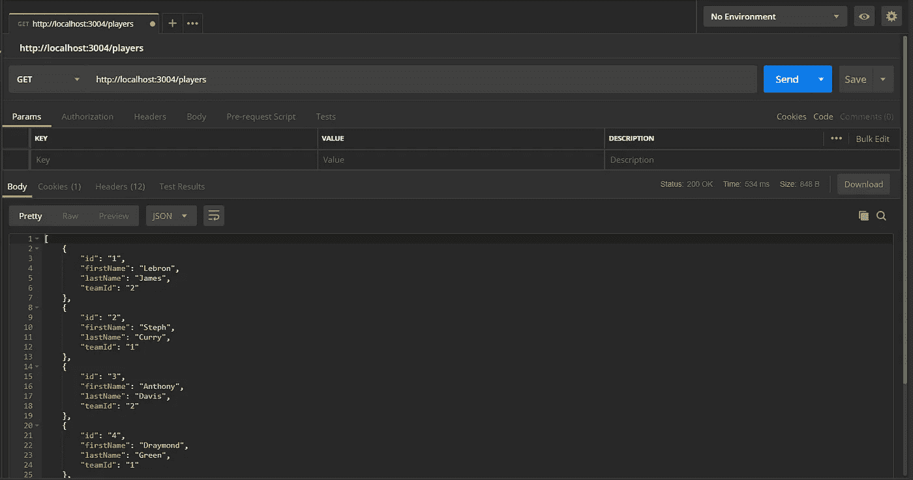
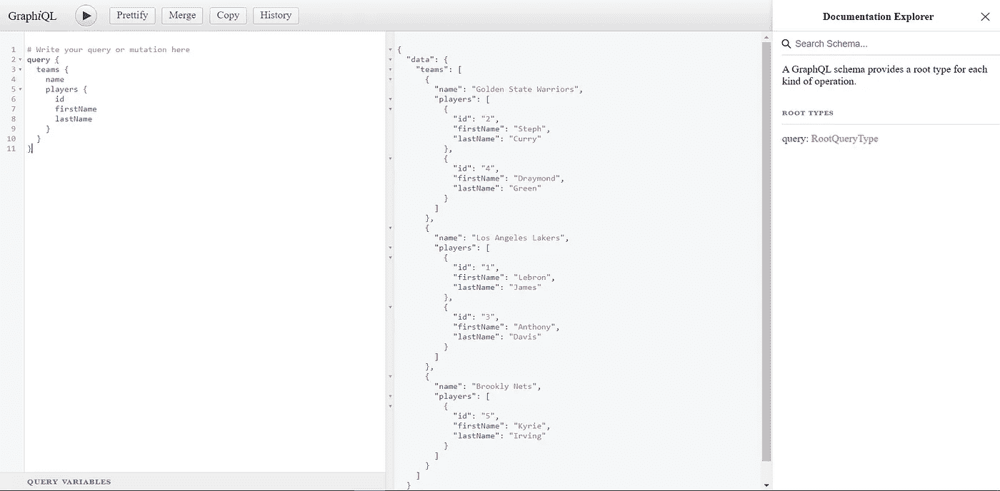
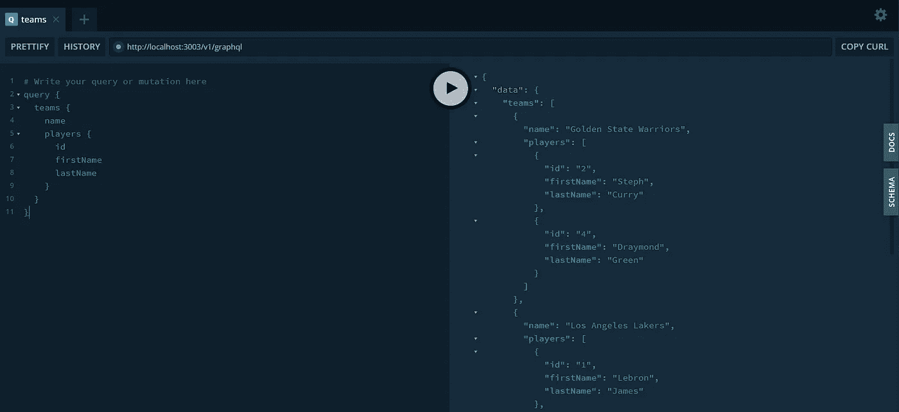

# 用 Node.js 和 Express 构建一个 GraphQL 服务器

> 原文：<https://levelup.gitconnected.com/build-a-graphql-server-with-node-js-express-ba1edf7b3b72>



# GraphQL 快速介绍

GraphQL 为你的 API 提供了数据及其类型的完整定义(或描述)。它使客户能够准确地要求他们需要的，而不是更多，使 API 更容易随着时间的推移而发展，并支持强大的开发工具。

GraphQL 是为了解决 RESTful 路由中出现的问题而构建的。RESTful 路由指的是操作托管在服务器上的数据的传统模式或通用规则。这些约定包括 [HTTP 请求方法或动词](https://developer.mozilla.org/en-US/docs/Web/HTTP/Methods)(如 POST、PUT、GET、DELETE 等)的类型以及请求被发送到的 URL，以便执行 CRUD(创建、读取、更新和删除)操作。

具有高度关系数据的 RESTful 路由开始变得相当具有挑战性。

*   当我们有大量嵌套关系时，决定 URL 模式就变得很困难
*   当获取大量嵌套的数据时，我们很容易遇到这样的情况:我们发出太多的 HTTP 请求来获取我们需要的数据
*   我们很容易过度获取数据

GraphQL 希望修复 RESTful 路由和过度服务数据方面的一些大的不一致。

GraphQL 认为我们的应用程序中的所有数据看起来像一个图表。但是，它需要了解不同的数据片段、数据片段之间的关系以及如何访问这些数据。我们使用一个模式来实现这一点。

## (计划或理论的)纲要

该模式告诉 GraphQL 正在处理的数据类型以及数据片段之间的关系。所以模式负责告诉 GraphQL 应用程序的数据、这些数据对象的属性
以及这些对象如何相互关联。

它是任何 GraphQL 服务器实现的核心，描述了连接到它的客户机可用的功能。

模式中的核心构建块是*类型。类型*在模式中提供了广泛的功能，包括:

*   创建类型之间的关系(例如，玩家和团队之间)
*   定义客户端可以执行哪些数据获取(查询)和数据操作(变异)操作

简而言之，模式通知 GraphQL 我们的数据是什么样的，以及可以对这些数据执行的操作😃。

## 强类型

GraphQL 是一种强类型语言。以下是一些常用的数据类型:

```
| TYPE     | DESCRIPTION          
|----------|-------------------------------------------------------|
| Scalar   | Stores a single value                                                                   |
| Object   | Shows what kind of object can be fetched                                                |
| Query    | Entry point type to other specific types                                                |
| Mutation | Entry point for data manipulation                                                       |
| Enum     | Useful in a situation where you need the user to pick from a prescribed list of options |
```

对象类型是模式中最常用的类型，代表一组字段。对象类型中的每个字段都映射到另一个类型，从而允许嵌套类型。换句话说，一个对象类型由多个标量类型或对象类型组成。定义对象类型的语法如下:

```
type Person {
   _id:ID
   firstName: String
   lastName: String
   age: Int
   height: Float
}
```

## 根查询

图是一种数据结构，包含节点和每个节点之间的关系(也称为边)。记住这一点，GraphQL 需要一个被称为根查询的数据，它本质上是数据图表的入口点。换句话说，根查询允许我们进入我们的数据结构。

现在我们已经介绍了 GraphQL 背后的一些重要理论，让我们继续构建一个 GraphQL 服务器的基本工作示例。

游戏时间到了！

# 带有 Node.js & Express 的 GraphQL



假设您已经安装了 [Node.js](https://nodejs.org/en/) ，您可以继续创建一个新的项目文件夹，并使用以下命令初始化一个新的 *package.json* 文件:

```
$ npm init -y
```

然后，您可以更新 *package.json* 文件中的一些值，比如名称、作者和描述。

现在让我们安装一些 graphql 服务器需要的依赖项。

```
$ npm i --save graphql graphql-tag express express-graphql body-parser axios graphql-playground-middleware-express$ npm i -D nodemon
```

express-graphql 库充当 graphql 和 Express (HTTP 服务器)之间的兼容层。Json 服务器将被用来创建假的 REST APIs。

## 假冒的原料药

继续在根目录下创建一个 **db.json** 文件，json-server 将使用它来为我们创建 API。然后你可以把这个内容[添加到这个新添加的文件中。](https://gist.github.com/LukeMwila/8aaa944ae017a9c2fe7a626da8b1ecd2)

然后，您可以使用以下脚本更新 package.json 文件，以测试您的假 API:

```
"json:server": "json-server --watch db.json --port 3004"
```

完成后，您可以运行以下命令:

```
$ npm run json:server
```

然后，您应该会看到以下内容:



CLI 结果

请随意使用 API 客户端测试 API，如 [Postman](https://www.getpostman.com/) 或直接在您的浏览器中测试。



邮递员结果

## GraphQL 实现

在根目录下创建一个 **src** 文件夹。然后，您可以设置以下文件和文件夹:

```
├── schema/
├── app.js
└── server.js
```

让我们从 **app.js** 和 **server.js** 文件开始，用 GraphQL 层初始化我们的 HTTP 服务器。

**app.js**

```
const express = require('express');
const expressGraphQL = require('express-graphql');
const bodyParser = require('body-parser');
const expressPlayground = require('graphql-playground-middleware-express').default;const schema = require('./schema');
const app = express();app.get('/playground', expressPlayground({ endpoint: '/v1/graphql' }));app.use(bodyParser.json());
app.use(
  '/v1/graphql',
  expressGraphQL({
   schema,
   graphiql: true
  })
);module.exports = app;
```

**server.js**

```
const http = require('http');
const app = require('./app');const port = process.env.PORT || 3003;
const server = http.createServer(app);server.listen(port, () => console.log(`Server running on ${port}`));
```

现在让我们继续定义我们的 GraphQL 模式。在模式文件夹中，设置以下文件和文件夹结构:

```
├── types/
├── index.js
└── root_query.js
```

让我们在 **index.js** 文件中创建我们的模式。

```
const graphql = require('graphql');
const { GraphQLSchema } = graphql;// Root query
const query = require('./root_query');module.exports = new GraphQLSchema({
  query
});
```

正如您所看到的，我们正在这个文件中导入我们的根查询，但是还没有用必要的内容填充我们的 **root_query.js** 文件，所以现在让我们开始吧。

**root_query.js**

```
const graphql = require('graphql');
const axios = require('axios');const { GraphQLObjectType, GraphQLList } = graphql;/** Data Types */
const player = require('./types/player');
const team = require('./types/team');const rootQuery = new GraphQLObjectType({
  name: 'RootQueryType',
  fields: () => ({
    players: {
      type: new GraphQLList(player),
      resolve(parentValue, args) {
       return axios
         .get(`http://localhost:3004/players`)
         .then(response => response.data);
      }
    },
    teams: {
      type: new GraphQLList(team),
      resolve(parentValue, args) {
       return axios
         .get(`http://localhost:3004/teams`)
         .then(response => response.data);
       }
    }
  })
});module.exports = rootQuery;
```

现在我们已经添加了根查询，让我们创建可以在图中访问的对象的两种数据类型。两个文件( **player.js** 和 **team.js** )都将被添加到 **types** 文件夹中。

**player.js**

```
/**
 * Player type
 */
const graphql = require('graphql');
const axios = require('axios');
/** Import object types from GraphQL */
const { GraphQLObjectType, GraphQLString } = graphql;const Player = new GraphQLObjectType({
  name: 'Player',
  fields: () => ({
    id: { type: GraphQLString },
    firstName: { type: GraphQLString },
    lastName: { type: GraphQLString },
    team: {
      type: require('./team'),
      resolve(parentValue, args) {
        return axios
          .get(`[http://localhost:3004/team/${parentValue.id}`](http://localhost:3004/team/${parentValue.id}`))
          .then(response => response.data);
      }
    }
  })
});module.exports = Player;
```

您可能想知道 resolve 函数是干什么的。简而言之，它通过为 GraphQL 查询生成响应来充当查询处理程序。parentValue 是我们正在处理的当前数据对象的实例。GraphQL 模式中的每个解析器函数都接受四个位置参数，如下所示:

```
fieldName:(parentValue, args, context, info) => { result }
```

**team.js**

```
/**
 * Team type
 */
const graphql = require('graphql');
const axios = require('axios');
/** Import object types from GraphQL */
const { GraphQLObjectType, GraphQLString, GraphQLList } = graphql;const Team = new GraphQLObjectType({
  name: 'Team',
  fields: () => ({
    id: { type: GraphQLString },
    name: { type: GraphQLString },
    players: {
      type: new GraphQLList(require('./player')),
      resolve(parentValue, args) {
        return axios
          .get(`[http://localhost:3004/teams/${parentValue.id}/players`](http://localhost:3004/teams/${parentValue.id}/players`))
          .then(response => response.data);
      }
    }
  })
});module.exports = Team;
```

完成后，您可以将以下脚本添加到您的 *package.json* 文件中:

```
"start": "nodemon src/server.js"
```

然后运行`npm start`。

一旦您的应用程序启动并运行，请在浏览器中打开两个选项卡并转到以下链接:

```
GraphiQL: [http://localhost:3003/v1/graphql](http://localhost:3003/v1/graphql)
GraphQL Playground: [http://localhost:3003/playground](http://localhost:3003/playground)
```

[*graph QL*](https://github.com/graphql/graphiql)和[*graph QL Playground*](https://github.com/prisma-labs/graphql-playground)都是浏览器内 IDE，为您的 GraphQL API 提供了出色的开发工作流程，并为您的模式提供了文档。

在两个 IDE 中，测试以下查询:

```
# Write your query or mutation here
query {
  teams {
    name
    players {
      id
      firstName
      lastName
    }
  }
}
```

预期的结果应该如下:



图形 QL



GraphQL 游乐场

女士们先生们，这是一个带有 Node.js 和 Express 的 GraphQL 服务器的基本实现。这个例子的源代码可以在这里找到[。](https://github.com/LukeMwila/basic-graphql-server)

如果你喜欢这篇文章，请在这里给我买杯咖啡[☕️😃。](https://www.buymeacoffee.com/lukemwila)