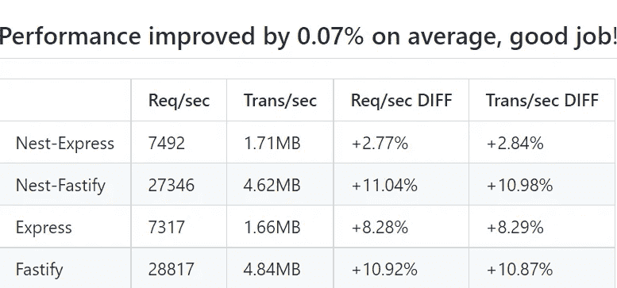

# 用 NestJS 增强你的应用:提示和技巧

> 原文：<https://levelup.gitconnected.com/build-a-high-performance-nestjs-app-5b807ff452e4>

## 4 种性能提升技术，充分利用 NestJS


[迭戈·希门尼斯](https://unsplash.com/ja/@diegojimenez?utm_source=unsplash&utm_medium=referral&utm_content=creditCopyText)在 [Unsplash](https://unsplash.com/s/photos/road?utm_source=unsplash&utm_medium=referral&utm_content=creditCopyText) 上拍照

作为一个强大的 Node.js 应用程序框架，NestJS 为构建服务器端应用程序提供了广泛的特性。随着越来越多的开发人员发现它的好处，它越来越受欢迎。

然而，在构建 NestJS 应用程序时，性能往往是一个被忽视的方面。在本文中，我将讨论一些制作高性能 NestJS 应用程序的实用技术

## 架构选择

默认情况下，由于其受欢迎程度，NestJS 运行在 [Express](https://expressjs.com/) primary 之上。虽然有一些开销，但 NestJS 的性能与 Express 相差不远。Express 被认为是一个性能良好的框架。因此，默认选项:Nest-Express 对于普通的服务器端应用程序来说已经足够好了。

但是如果性能是第一优先考虑的，更好的选择是使用 F [astify](https://docs.nestjs.com/techniques/performance) 比 Express 快得多。

以下是 Nest-Express 与 Nest-Fastify 和 Express 的近期基准测试结果。我们可以看到 Nest-Fastify 比 Nest-Express 快 3 倍以上。



最近的一个基准([https://github.com/nestjs/nest/pull/10276/checks?check_run_id=8318006381](https://github.com/nestjs/nest/pull/10276/checks?check_run_id=8318006381)

如果你正在构建一个新的 NestJS 应用程序，首先要考虑的事情之一就是你是应该坚持使用 Express，还是从 Fastify 开始。对于现有的应用程序，也可以从 Express 迁移到 Fastify，因为 Nest 使用[适配器](https://docs.nestjs.com/techniques/performance)提供了框架独立性。

## 贮藏

缓存可以显著提高您的 NestJS 应用程序或任何 web 应用程序的性能。这是一个复杂的话题，被认为是计算中的两大难题之一。然而，NestJS 通过其良好抽象的 API 使之变得更加容易。

NestJS 提供了一个现成的[缓存管理器。](https://docs.nestjs.com/techniques/caching)缓存管理器为各种缓存存储提供商提供 API。默认的存储提供程序是内存中的数据存储，并且是内置的。要启用内存缓存，我们需要如下所示导入 CacheModule。

```
import { CacheModule, Module } from '@nestjs/common';
import { AppController } from './app.controller';

@Module({
  imports: [CacheModule.register()],
  controllers: [AppController],
})
export class AppModule {}
```

更多配置选项，请参考[官方文档](https://docs.nestjs.com/techniques/caching)。

您可以切换到许多其他存储提供商，例如， [redis store](https://github.com/dabroek/node-cache-manager-redis-store) 。

无论您选择哪个存储提供者，您都可以设置一个缓存拦截器来自动缓存 get 响应。

```
import * as redisStore from 'cache-manager-redis-store';
@Module({
  imports: [CacheModule.register({store: redisStore})],
  controllers: [AppController],
  providers: [
    {
      provide: APP_INTERCEPTOR,
      useClass: CacheInterceptor,
    },
  ],
})
```

上述配置将导入`CacheInterceptor`，并将其全局绑定到所有端点。或者，您也可以使用`UseInterceptors`在控制器级别绑定`CacheInterceptor` 。

## 启用 Gzip

启用 Gzip 压缩可以大大提高 API 性能。它不仅适用于 NestJS，相反，它适用于任何常见的 Web API 服务。它很容易实现并且非常有效，但同时也很容易被遗忘。

Gzip 压缩 API 请求和响应。结果是有效负载减少了 10 倍。

您可以通过 Nginx 启用 Gzip 压缩。大多数 NestJS 应用程序位于 Nginx 之后，您可以配置 Nginx 使用`gzip`来动态压缩 HTTP 响应。下面是一个在`nginx.conf`中启用 Gzip 的例子。

```
gzip on;
gzip_disable "msie6";
```

另一种方法是在 NestJS 应用程序中启用 Gzip。在您的 NestJs 应用程序中，您可以利用提供的压缩中间件包来压缩和提供内容。

```
import * as compression from 'compression';
// somewhere in your initialization file
app.use(compression());
```

在上面的例子中，`compression`中间件是从`@nestjs/common`包中导入的，用于为应用程序的所有请求启用 gzip 压缩。如果客户端支持，这允许应用程序使用 gzip 压缩响应，这可以提高应用程序的性能和效率。

## 集群模式

默认情况下，NestJS 应用程序实例在单线程中运行。由于所有服务器都有多个 CPU 内核，单线程实例无法充分利用服务器资源。

为了利用多核来提高性能，我们可以使用 NodeJS 中的集群[模块](https://nodejs.org/api/cluster.html)。在集群模式下，子进程作为一个集群运行，因此传入的请求被同时处理。这导致更好的吞吐量。

在 NestJS 中创建集群服务很简单。下面是一个实现的例子。

上述代码的要点是

*   首先，我们导入集群模块并获得 CPU 内核的数量
*   主进程负责创建工作进程，工作进程负责运行 NestJS 应用程序。
*   对于主进程，为每个可用的 CPU 创建一个工作进程。我们还监听工作进程的退出，当任何工作进程崩溃时，主进程将派生一个新进程。
*   对于子进程，我们可以使用 bootstrap 函数来启动服务器实例。

在生产环境中，您可以使用 pm2 在集群模式下运行应用程序。以下命令将以 8 个 CPU 内核的集群模式启动应用程序。

```
pm2 start dist/main.js -i 8
```

总的来说，在 NestJS 应用程序中使用集群模式可以通过在多个工作进程之间分担工作负载来提高性能和可伸缩性。

# 摘要

优化 NestJS 应用程序的性能是一项复杂而多方面的任务。在本文中，我们讨论了如何利用内置的 NestJS 特性(如 Fastify 和 Cache Manager)来提高性能。Gzip 和 Cluster 模块通常不仅用于优化 NestJS，还用于优化其他 NodeJS web 应用程序。

如果你觉得这篇文章很有用，你可能也想看看我的其他与 NestJS 相关的文章，关于[如何构建高效且可维护的 NestJS 应用](https://medium.com/p/be6bc77e789e)和 [NestJS 安全性](https://medium.com/gitconnected/maximize-code-security-in-your-nestjs-applications-part-1-b7abb99fa048)。

编程快乐！