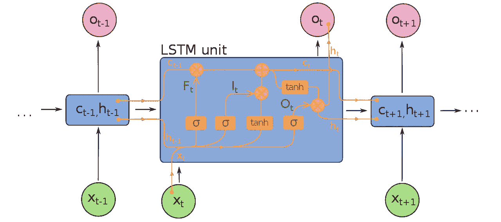

# 使用 Tensorflow 和 Keras 构建垃圾邮件分类器

> 原文：<https://levelup.gitconnected.com/build-a-mail-spam-classifier-using-tensorflow-and-keras-9bc687d2a1d3>

杰斯温·托马斯在 [Unsplash](https://unsplash.com?utm_source=medium&utm_medium=referral) 上的照片

自然语言处理是深度学习的主要应用之一。在深度学习的帮助下，我们赋予机器理解自然语言的能力。使用深度学习，我们可以解决一系列问题，如文本翻译、测试自动完成、拼写检查、情感分析等。

在这篇文章中，我希望给出一个关于如何使用深度学习技术制作垃圾邮件分类器的教程。我们将使用 TensorFlow 和 Keras 深度学习框架。在这里我只是提供了一个详细的事情解释，查看代码请参考我的 GitHub 回购[。](https://github.com/nerdylabs/Mail-Spam-detection-using-NLP)

# 为什么要深度学习？

在我们回答这个问题之前。我们来问为什么机器学习？你可以用传统的软件工程技术来解决这个问题。您收集了一些包含垃圾邮件和非垃圾邮件的数据。您观察到一些事情，如垃圾邮件包含许多不必要的感叹号“！！！!"，邮件中包含“优惠、出售、%、紧急、限时交易”等字样。现在，您可以编写一个算法，在其中保存一个在垃圾邮件中常见的单词和事物的列表。现在，每当一封新邮件包含您的观察列表中的任何单词，您就将该邮件标记为垃圾邮件。这种解决方案的问题是，这不是问题的永久解决方案，也就是说，垃圾邮件发送者现在理解了您的垃圾邮件分类器的工作方式，您只是从数据中寻找某些单词，垃圾邮件发送者现在用更改修改他们的邮件，现在您的算法失败了。你必须不断手动更新你的系统。

在机器学习的帮助下，我们说，“这些是我的一些邮件，一些是垃圾邮件，一些不是垃圾邮件，请想出一种方法来分类这些邮件”。然后你的机器会浏览这些邮件，并学习一些相关性来对邮件进行分类。这样做的好处是，如果垃圾邮件发送者现在改变了邮件的结构，你的机器会主动学习这些变化，因为你没有像第一种情况那样对它进行显式编程。因此，机器学习的定义是"*机器学习*包括计算机发现它们如何在没有明确编程的情况下执行任务。"

现在深度学习是机器学习算法的子集。在将机器学习应用于图像、文本、音频等非结构化数据时，深度学习非常有用。因此，为了构建我们的垃圾邮件分类器，我们使用深度学习技术。

# 一些额外的阅读

*   现在，为了构建这个分类器，我使用了 [*TensorFlow*](https://www.tensorflow.org/) 库。现在 TensorFlow 是 Google 开发的深度学习框架。使用 TensorFlow，您可以轻松构建这些深度学习模型。
*   Keras — Keras 是构建在 TensorFlow 之上的高级 API。最初的 Keras 和 TensorFlow 是独立的库。在 TensorFlow 2.0 之后，Keras 现在集成在 TensorFlow 本身中。
*   Colab——Google Colab 是一个免费的基于云的虚拟环境，在这里你可以访问免费的 GPU 来训练你的深度学习模型。你得到 python，Jupyter 笔记本 UI 等。

*   长短期记忆(LSTM)是一种特殊类型的神经结构。它来自一个叫做循环神经网络(RNN)的基础结构。如果你不知道 LSTMs 和 RNN [*参考这个视频*](https://www.youtube.com/watch?v=qjrad0V0uJE&list=PLtBw6njQRU-rwp5__7C0oIVt26ZgjG9NI&index=3) *。*

# 解决问题

“你可以用机器做任何事情，只要你能把它转换成数字，并对它进行编程以找到模式”这是我在 YouTube 视频上看到的评论，让我们来分析一下。

所以你可以应用机器学习，只要你能把你的输入转换成数字，你看当你用机器学习或深度学习解决计算机图像问题时，你把你的图像转换成数字，现在计算机本来就以矩阵和像素数字的形式存储图像，所以不用担心。但是，对于文本来说，计算机本来就把文本存储为文本，而不是以数字的形式存储，现在你可能会争论 ASCII 值之类的东西，但这不是我的意思。我的意思是你的程序应该把文本看作数字，而不是原生文本。

现在，第二个陈述是“对它编程以找到模式”，而不是你已经将你的数据(输入/输出)转换为数字，现在你需要对它编程以找到模式，这就是深度学习的作用。你看，机器学习就是在数据中寻找相关性和模式。借助这些在数据中发现的相关性，你的程序可以了解数据是如何发展的，因此当你提供新数据时，它可以根据以前学习的相关性预测一些事情。

既然我们了解了问题以及如何解决问题，我们现在可以尝试解决它。

# 1.学习单词嵌入

解决问题的第一步是将原始文本转换成数字。这可以通过使用某种频率采样方法来实现。例如，假设你有这样一句话，“我喜欢狗！”，你可以用 1 - I，2 - love，3 - dogs 把这个转换成“1 2 3”。现在，假设你有另外一句话，比如“*我喜欢猫！*”，你可以把这个从上面的例子 1 - I，2 - love，4 - cats 转换成“1 2 4”。所以像这样，每当你发现一个新单词，你就赋予它一个新的值，然后继续。这叫做标记化。

现在仅仅将单词转换成数字是不够的，你的神经网络必须理解单词之间的含义和相关性。例如，像猫和狗这样的词必须是高度相关的，因为它们指向同一个事物，例如，宠物、四条腿的动物等等。像人类和狗这样的词不应该高度相关。

现在，为了学习这种相关性，我们需要学习一种叫做单词嵌入的东西。这只是一个数字矩阵，包含了这些学习到的嵌入。详细解释参考视频。

现在有一些预先训练好的单词嵌入可以使用， [*参考 Keras docs 了解同样的*](https://keras.io/examples/nlp/pretrained_word_embeddings/) *。*

Keras 有它的嵌入层。 [*参考嵌入层文档。*](https://www.tensorflow.org/api_docs/python/tf/keras/layers/Embedding)

# 到目前为止，这个想法

1.  我们做的第一件事就是加载数据集。
2.  然后我们将文本转换成数字。
3.  然后我们生成了一个矩阵来解释这些数字。
4.  现在，我们准备将这个新生成的矩阵输入到我们的神经网络中。

> 要查看代码，请参考我的 GitHub repo。

# 2.建设 LSTM 网络

简单 RNN 的思想是获取顺序数据并按顺序通过每个时间步。现在的问题是，RNN 受到梯度消失问题的困扰，对于长句子表现不佳。

想想这些句子，“没有什么技术是伟大的”和“现在什么也做不了”。在第一句话中，我指的是虚无品牌，在第二句话中，我指的是一种情况。

无论如何，单词“nothing”在句子的上下文中是什么意思是至关重要的。该信息必须被保存，并且必须被传递到神经网络的后面的层，这是简单的 RNN 模型所不能实现的。

因此，我们使用 LSTM，其中 LSTM 计算与句子上下文相关的某些门值。

我们可以使用 TensorFlow 提供的 LSTM 层。

> 查看代码请[参考我的 GitHub 回购。](https://github.com/nerdylabs/Mail-Spam-detection-using-NLP)

最后，我们已经来到了教程的结尾。我希望你学到了一些东西。感谢您的阅读！

*更多内容看* [***说白了就是***](https://plainenglish.io/) *。报名参加我们的* [***免费周报***](http://newsletter.plainenglish.io/) *。关注我们关于*[***Twitter***](https://twitter.com/inPlainEngHQ)*和*[***LinkedIn***](https://www.linkedin.com/company/inplainenglish/)*。加入我们的* [***社区***](https://discord.gg/GtDtUAvyhW) *。*