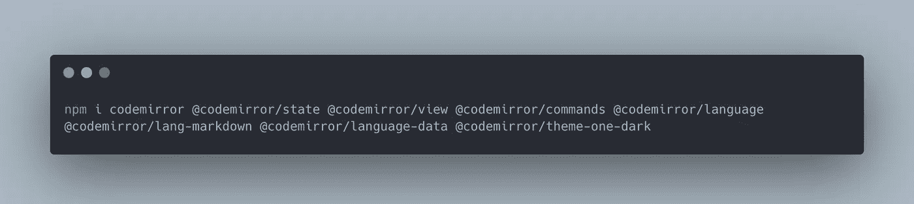
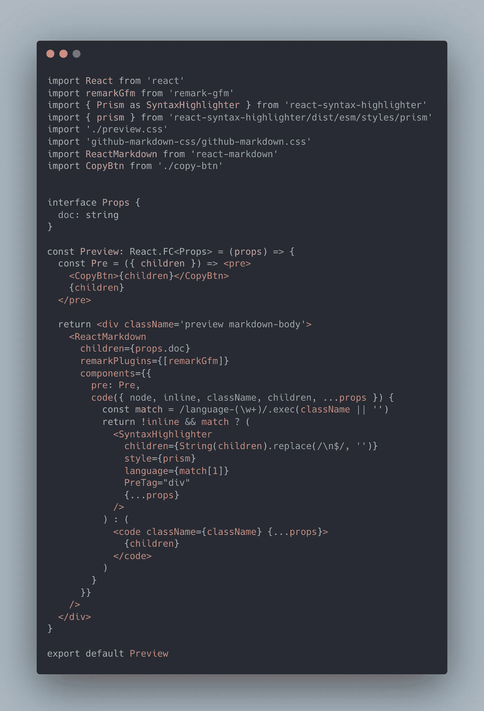

# 使用 Electron、ReactJS、Vite、CodeMirror 和 Remark 构建一个 Markdown 编辑器

> 原文：<https://levelup.gitconnected.com/build-a-markdown-editor-using-electron-reactjs-vite-codemirror-and-remark-e551d91b6233>

## 具有编辑器、预览和代码语法突出显示。


(左)Markdown 编辑器；(右)预览。npm inpm run watch

*提示:如果你想使用另一个包管理器如* `*yarn*` *，你需要编辑* `[*.github/workflows*](https://github.com/amy-juan-li/electron-vite-react-typescript/blob/main/.github/workflows)` *，因为它默认使用* `*npm*` *。(了解更多回购内幕:* [*举例-电子-降价-编辑*](https://github.com/amy-juan-li/example-electron-markdown-editor) *)*

# 使用 CodeMirror 6 构建 Markdown 编辑器

> [*code mirror 6*](https://codemirror.net/6/)*是一个新的 web 代码编辑器库，是基于过去 13 年来构建和维护版本 1 到 5 的经验而从头实现的。它的目标是比以前的版本更具可扩展性和可访问性。*
> 
> *作者 Marijn Haverbeke*

*提示:请参考* [*CodeMirror 6 迁移指南*](https://codemirror.net/docs/migration/)

## 安装依赖项



NPM I code mirror @ code mirror/state @ code mirror/view @ code mirror/commands @ code mirror/lang-markdown @ code mirror/language-data @ code mirror/theme-one-dark

使用 CodeMirror 6 创建 Markdown(或任何其他语言)编辑器的三个核心部分:

1.  创建编辑器状态
2.  创建编辑器视图
3.  为编辑器创建父(HTML)元素

## 创建 React 挂钩以提供编辑器视图组件

React Hook 允许我们在不同的地方重用代码，允许我们在未来更容易地扩展我们的应用程序。

*。/packages/renderer/src/use-code mirror . tsx*


创建降价编辑器视图。由[李冠仪](https://medium.com/u/9f2dc23bfffa?source=post_page-----e551d91b6233--------------------------------)拍摄

## 通过为编辑器提供状态处理程序和父元素来使用 React 挂钩

*。/packages/renderer/src/editor . tsx*


Consume React Hook — useCodeMirror，为编辑器提供状态处理函数和父元素。照片由[李冠仪](https://medium.com/u/9f2dc23bfffa?source=post_page-----e551d91b6233--------------------------------)

## 在应用程序组件中实现编辑器组件

*。/packages/renderer/src/app . tsx*


在 App 组件中实现 markdown 编辑器组件。照片由[李冠仪](https://medium.com/u/9f2dc23bfffa?source=post_page-----e551d91b6233--------------------------------)拍摄。

# 使用`react-markdown`在 React 中创建降价预览

## 安装依赖项

```
yarn add react-markdown
```

## 创建预览组件并实现 ReactMarkdown 组件

*。/packages/renderer/src/preview . tsx*


在我们的应用中使用 react-markdown。照片由[李冠仪](https://medium.com/u/9f2dc23bfffa?source=post_page-----e551d91b6233--------------------------------)拍摄。

## 在应用程序组件中实现预览组件

*。/packages/renderer/src/app . tsx*


向应用程序添加降价预览组件。照片由[李冠仪](https://medium.com/u/9f2dc23bfffa?source=post_page-----e551d91b6233--------------------------------)拍摄

## 输出

```
npm run watch
```


在 Mac 上的开发环境中运行应用程序。由[李冠仪](https://medium.com/u/9f2dc23bfffa?source=post_page-----e551d91b6233--------------------------------)拍摄。

您会注意到代码语法没有突出显示。因此，让我们通过引入另一个依赖项来解决这个问题:

```
npm i react-syntax-highlighter
```

现在 *preview.tsx* 变成了:


添加代码语法突出显示以反应降价。[李冠仪](https://medium.com/u/9f2dc23bfffa?source=post_page-----e551d91b6233--------------------------------)截图

现在我们已经强调了我们的代码语法:


在 markdown 编辑器中编写一个代码块，并在预览页面上突出显示代码语法。[李冠仪](https://medium.com/u/9f2dc23bfffa?source=post_page-----e551d91b6233--------------------------------)截图

接下来，我们还想添加一个允许用户复制代码的功能。

*   为复制按钮创建一个组件:


允许用户复制/粘贴代码。[李冠仪](https://medium.com/u/9f2dc23bfffa?source=post_page-----e551d91b6233--------------------------------)截图

*   在 *preview.tsx* 里面使用



将复制按钮集成到预览组件中。[李冠仪](https://medium.com/u/9f2dc23bfffa?source=post_page-----e551d91b6233--------------------------------)截图

输出:


“复制”按钮显示在代码块内的右上角。截图由[李冠仪](https://medium.com/u/9f2dc23bfffa?source=post_page-----e551d91b6233--------------------------------)


在开发环境中测试我们的应用:


左侧面板:写下降价。右面板:在 React 组件中渲染降价。GIF 作者[李冠仪](https://medium.com/u/9f2dc23bfffa?source=post_page-----e551d91b6233--------------------------------)

# 使用 CodeMirror RunMode 函数在 React 中创建降价预览(实验)

[在编辑器外运行 CodeMirror 模式。](https://codemirror.net/5/demo/runmode.html) `[CodeMirror.runMode](https://codemirror.net/5/demo/runmode.html)` [功能](https://codemirror.net/5/demo/runmode.html)。如何使用`runMode function`在我最喜欢的 YouTuber 创建的这个视频中有解释- [如何使用 Electron、ReactJS、Vite、CodeMirror 和 Remark](https://www.youtube.com/watch?v=gxBis8EgoAg&t=1s) 构建 Markdown 编辑器。但你不能只是复制代码，并期望它像视频中显示的那样工作，因为它使用 CodeMirror 5。因此，要使它与 CodeMirror 6 一起工作，您需要一些额外的调整。

与第一种方法相比，第二种方法需要花费更多的精力来完成工作，但是为什么在这里值得一提呢？事实上，使用 CodeMirror RunMode 的好处是，我们可以像在 CodeMirror 构建的 markdown 编辑器中一样突出显示代码语法。

以后我会用代码镜像`runMode`功能更新我的解决方案。我们可以比较使用不同技术的差异。

# 编译并打开电子应用程序

> 使用 npm 脚本`compile`:这个脚本被配置为尽快编译应用程序。它还没有准备好发布，只为当前平台编译，用于调试。(鸣谢:【https://github.com/cawa-93/vite-electron-builder】T2)

```
npm run compile
```


```
open dist/mac/your-app-name.app
```


在 Mac 上运行 markdown editor 桌面应用程序。[李冠仪](https://medium.com/u/9f2dc23bfffa?source=post_page-----e551d91b6233--------------------------------)截图

*提示:运行编译后的 app 时，不能像以前一样运行开发中的 app。*


*修复:你要关闭编译好的 app，然后* `*npm run watch*`


# 结论

感谢阅读！本文介绍了如何使用 CodeMirror 6 创建 Markdown 编辑器，以及如何创建 Markdown 预览页面。有了这个基本设置，您可以随时通过向项目添加新功能来扩展此应用程序。请随意使用这个例子。

接下来，我将使用 Next.js、TypeScript、TailWindCSS、CodeMirror 6 和 react-markdown 为 web 应用程序重新创建这个 markdown 编辑器。

编码快乐！☺️

[*如果你想在 Medium 上阅读来自*](https://medium.com/@amy-juan-li/membership) [*李冠仪*](https://medium.com/u/9f2dc23bfffa?source=post_page-----e551d91b6233--------------------------------) *以及成千上万其他作家的每一个故事，那就考虑成为 Medium 会员吧。每月 5 美元，你可以无限制地访问媒体内容。如果你* [*通过我的推荐链接*](https://medium.com/@amy-juan-li/membership) *报名，我会得到一点佣金。*

# 进一步阅读

[](https://amy-juan-li.medium.com/why-i-use-obsidian-for-note-taking-making-system-as-a-tech-writer-e208699e0011) [## 作为一名软件开发人员，我从观念转向黑曜石的两大原因

### 使用 VIM 快速输入，使用 Markdown 有效格式化笔记。

amy-juan-li.medium.com](https://amy-juan-li.medium.com/why-i-use-obsidian-for-note-taking-making-system-as-a-tech-writer-e208699e0011) 

# 有用的资源和链接

*   我跟随完成上述项目的视频— [如何使用 Electron、ReactJS、Vite、CodeMirror 和 Remark](https://www.youtube.com/watch?v=gxBis8EgoAg&t=1s) 构建一个 Markdown 编辑器
*   我在 [Vite-electron-builder](https://github.com/cawa-93/vite-electron-builder) 上构建的原始模板