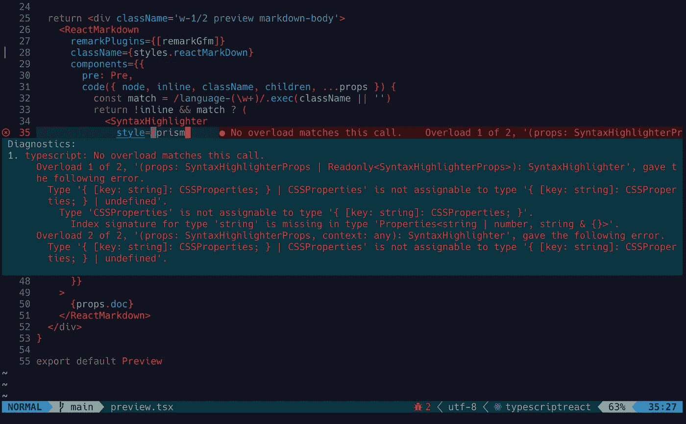
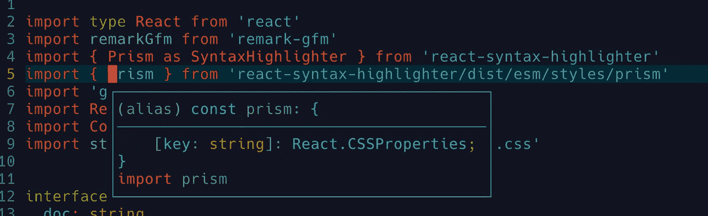

# 使用 Next.js、TypeScript、CodeMirror 6 和 react-markdown 构建和部署 Markdown 编辑器

> 原文：<https://levelup.gitconnected.com/build-a-markdown-editor-with-next-js-typescript-and-codemirror-6-38d4d5a8d3b3>

## 学习构建 Next.js 应用程序。


在生产环境中工作。GIF 作者[https://github . com/remarkjs/react-markdown # when-should-I-use-this](https://medium.com/u/9f2dc23bfffa#when-should-i-use-this)

## 安装依赖项

```
yarn add react-markdown
```

## 创建预览组件并实现 ReactMarkdown 组件

*。/components/preview.tsx*


使用预览组件中的 ReactMarkdown 组件。照片由[*。/components/copy-btn.tsx*

> 诊断:
> 
> `typescript: Element implicitly has an ‘any’ type`](https://medium.com/u/9f2dc23bfffa#1</h2><p id=) [](https://medium.com/u/9f2dc23bfffa#1</h2><p id=)

[CopyBtn 组件内部出现类型错误。](https://medium.com/u/9f2dc23bfffa#1</h2><p id=)[*。/components/preview.tsx*

> **诊断:**
> 
> `Type '{[key, string]: CSSProperties;} | CSSProperties' is not assignable to '{[key, string]: CSSProperties;} | undefined'. Type 'CSSProperties' is not assignable to '{[key, string]: CSSProperties;}'`



**调查**

非常奇怪，因为我们注意到`prism`的类型是`{[key, string]: CSSProperties;}`而不是`'{[key, string]: CSSProperties;} | CSSProperties'`](https://medium.com/u/9f2dc23bfffa#2</h2><p id=) [](https://medium.com/u/9f2dc23bfffa#2</h2><p id=)

[检查我们选择的主题的“类型”。](https://medium.com/u/9f2dc23bfffa#2</h2><p id=) [出现类型不匹配错误是因为`react-markdown`的`CodeProps`中定义的`style`和`SyntaxHighlighterProps`中定义的`style`是不同的类型。

**使用** `**CodeProps**`中定义的 `**style**` **修复**

从`react-markdown/lib/ast-to-react`第一次导入`CodeProps`


然后应用`CodeProps`作为在`code`函数中传递的参数类型:


`style`将用于`SyntaxHighlighter`。

现在，更新后的预览组件看起来像什么:](https://medium.com/u/9f2dc23bfffa#47 </a>不兼容问题的解释和解决方案:</p><blockquote class=) [](https://medium.com/u/9f2dc23bfffa#47 </a>不兼容问题的解释和解决方案:</p><blockquote class=)

[使用“CodeProps”中的“style”。截图由](https://medium.com/u/9f2dc23bfffa#47 </a>不兼容问题的解释和解决方案:</p><blockquote class=)[李冠仪](https://medium.com/u/9f2dc23bfffa?source=post_page-----38d4d5a8d3b3--------------------------------)

## 成功的建筑


*注意:我们现在可以忽略与 ESLint 相关的错误，因为它不会影响我们的生产结果。*

是时候将我们的 Next.js 应用程序部署到生产环境中了。

# 部署应用程序

我们使用 Vercel 作为这个 Next.js web 应用程序的托管服务。

## 步骤 1:从 Vercel 仪表板添加一个新项目


## 步骤 2:导入目标 Git 存储库


选择您的项目 git repo:


## 步骤 3:开始部署


> **编译错误:**
> 
> `Do not pass children as props, nest children between the opening and closing tag`


## 调查

> 使用 JSX 时，子元素应该嵌套在开始和结束标记之间。当不使用 JSX 时，子代应该作为附加参数传递给`React.createElement`。
> 
> 来源:[关于 eslint-plugin-react 的规则](https://github.com/jsx-eslint/eslint-plugin-react/blob/master/docs/rules/no-children-prop.md)

## 修复该问题

在`SyntaxHighlighter`的开始和结束标签之间嵌套子标签


使用 Lazygit 可视化并提交对 GitHub repo 的更改。[李冠仪截图](https://medium.com/u/9f2dc23bfffa?source=post_page-----38d4d5a8d3b3--------------------------------)

一旦提交了我们的更改，Vercel 部署管道中的重建过程就会自动开始。


## 成功部署


将我们的 Next.js 应用成功部署到生产环境中。[李冠仪](https://medium.com/u/9f2dc23bfffa?source=post_page-----38d4d5a8d3b3--------------------------------)截图

通过点击生成的[应用链接](https://example-nextjs-markdown-editor.vercel.app/)从浏览器打开我们的应用，检查其在生产环境中的性能:


在生产环境中测试应用程序。GIF 由[李冠仪](https://medium.com/u/9f2dc23bfffa?source=post_page-----38d4d5a8d3b3--------------------------------)

欢迎试用该应用程序。请对本 app 的未来发展留下任何意见或建议。

# 结论

本文涵盖了创建新的 Next.js 应用程序、集成新的包、修复类型错误、在开发环境中测试每个功能、构建应用程序以准备部署到生产环境，以及最终部署应用程序的整个过程。您可能会注意到，本文并不打算从一开始就为您提供每一步的正确代码。我们不断从错误中学习，变得比昨天更好。顺便说一下，你不能忽视试图找出解决方案、调查错误的根本原因、修复错误等有趣的部分。尤其是当我们面临构建一个全新项目的挑战时。

感谢阅读！

编码快乐！☺️


App 链接:[https://example-nextjs-markdown-editor.vercel.app/](https://example-nextjs-markdown-editor.vercel.app/)

[*如果你想在 Medium 上阅读来自*](https://medium.com/@amy-juan-li/membership) [*【李冠仪】*](https://medium.com/u/9f2dc23bfffa?source=post_page-----38d4d5a8d3b3--------------------------------) *以及成千上万其他作家的每一个故事，考虑成为 Medium 会员* *。每月 5 美元，你可以无限制地访问媒体内容。如果你通过我的链接* *注册，我会得到一点佣金。*

# 进一步阅读

[](https://amy-juan-li.medium.com/build-a-markdown-editor-using-electron-reactjs-vite-codemirror-and-remark-e551d91b6233) [## 使用 Electron、ReactJS、Vite、CodeMirror 和 Remark 构建一个 Markdown 编辑器

### Markdown 编辑器和带有代码语法突出显示的预览页面。

amy-juan-li.medium.com](https://amy-juan-li.medium.com/build-a-markdown-editor-using-electron-reactjs-vite-codemirror-and-remark-e551d91b6233) 

[李冠仪](https://amyjuanli.medium.com/?source=post_page-----38d4d5a8d3b3--------------------------------)

## 网站开发

[View list](https://amyjuanli.medium.com/list/web-dev-db243e7bdf05?source=post_page-----38d4d5a8d3b3--------------------------------)6 stories

# 有用的资源和链接

*   [CodeMirror doc](https://codemirror.net/)
*   [GitHub Repo for react-syntax-highlighter](https://github.com/react-syntax-highlighter/react-syntax-highlighter)
*   [GitHub 回购反应降价](https://github.com/remarkjs/react-markdown)