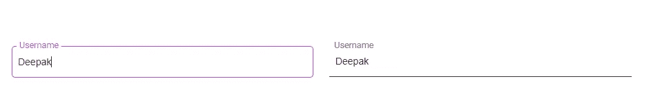

# 如何使用 LitElement 构建类似材料的输入 Web 组件

> 原文：<https://levelup.gitconnected.com/build-a-material-like-input-web-component-using-litelement-20e9e0d203b6>

## 探索“文学元素”


由[斯凯工作室](https://unsplash.com/@skyestudios?utm_source=unsplash&utm_medium=referral&utm_content=creditCopyText)在 [Unsplash](https://unsplash.com/s/photos/lit?utm_source=unsplash&utm_medium=referral&utm_content=creditCopyText) 上拍摄的照片

在开始编写代码之前，我想简单解释一下 web 组件和`[LitElement](https://lit-element.polymer-project.org/)`。

## **什么是 web 组件？**

Web 组件是一组 web 平台 API，允许我们创建新的自定义的、可重用的、封装的 HTML 标签，以便在网页和 web 应用程序中使用。

我们可以创建自己的自定义元素，并在使用提供的浏览器 API 注册后在浏览器中使用它们。

## **什么是‘LitElement’？**

`LitElement`是一个简单的基类，用于创建快速、轻量级的 web 组件。它是谷歌在聚合物项目下添加的。

`LitElement`在一个项目中，我的团队需要创建我们自己的核心定制元素库，可以在多个 web 应用程序中使用，而不用担心我们的应用程序是用普通 JS 还是任何 JS 框架编写的(如 [Vue](https://vuejs.org/) 、 [Angular](https://angular.io/) 、 [React](https://www.google.com/url?sa=t&rct=j&q=&esrc=s&source=web&cd=1&cad=rja&uact=8&ved=2ahUKEwiGq43C_bDoAhUM7KYKHZYMB40QFjAAegQIAxAB&url=https%3A%2F%2Freactjs.org%2F&usg=AOvVaw26YbpVhaFnAB4A6G8-4uAs) 等)，这让我遇到了这个问题。

当我们开始学习`LitElement`时，没多久我们就适应了。

# 创建“LitElement”组件

首先，我们需要从 npm 安装“LitElement”包，然后按照上面提到的步骤创建元素。

```
npm install lit-element
```

*   导入`LitElement`基类和`html`辅助函数
*   创建一个扩展`LitElement`基类的新类
*   实现`render`来定义元素模板
*   最后，使用全局`customElements` `define()`方法在浏览器中注册元素

```
*// Import the LitElement base class and html helper function* **import** { LitElement, html } **from** 'lit-element';

*// Extend the LitElement base class*
**class** Input **extends** LitElement {

//*Implement `render` to define the element template.* render(){
    *
    //Render the element using the `html` tag function*
    **return** html`
      <p>I will be displayed in the browser</p>
    `;
  }
}
*// Register the new element with the browser.*
customElements.define('my-element', MyElement);
```

# **输入 Web 组件代码**

现在，让我们从代码开始。

1.  这里我们通过实现一个静态的`properties` getter 来声明元素的属性。
2.  在调用`super()`之后，我们在构造函数中初始化我们的属性。我们可以用 JavaScript 表达式进一步向`LitElement`模板添加属性。
3.  在静态`styles` getter 中声明 CSS 属性。一件很棒的事情是这些静态样式适用于组件的所有实例。CSS 中的任何表达式都只计算一次，然后在所有实例中重复使用。
4.  然后，我们使用 JavaScript 表达式将模板中的本地输入与元素属性绑定在一起——就像`input`的类型属性与元素的属性类型绑定在一起一样。所以当元素的 type 属性改变时，原生输入的 type 属性也会改变。

```
**<input type=”${this.type}” />**
```

我们可以插入 JavaScript 表达式作为 HTML 文本内容、属性、布尔属性、属性和事件处理程序的占位符。

*   文字内容:`<p>${...}</p>`
*   属性:`<p id="${...}"></p>`
*   布尔属性:`?disabled="${...}"`
*   属性:`.value="${...}"`
*   事件处理程序:`@event="${...}"`

5.一旦输入值改变了其上的输入事件，我们就调用`inputHandler`方法，最终发出`val-change` 自定义事件。

6.最后，我们将元素注册到浏览器中。

```
import { LitElement, html, css } from "lit-element";import { classMap } from "lit-html/directives/class-map";class Input extends LitElement {*// properties getter*
static get properties() {return {
type: { type: String },
label: { type: String },
value: { type: String },
disabled: {type: Boolean},
outline: { type: Boolean }
};}constructor() {super();*// initialize the properties* this.value = "";
this.outline = false;
this.disabled = false;}//
static get styles() {return css`*{
box-sizing: border-box;
}.form-group {
position: relative;
margin: 1rem 0;
}input.outline {
border: 1px solid  #333333;
border-radius: 5px;
}label {
position: absolute;
font-size: 1rem;
left: 0;
top: 50%;
transform: translateY(-50%);
background-color:  #fff;
color: gray;
padding: 0 0.3rem;
margin: 0 0.5rem;
transition: 0.1s ease-out;
transform-origin: left top;
pointer-events: none;
}input {
font-size: 1rem;
outline: none;
border: none;
border-radius: 0px;
padding: 1rem 0.6rem;
color:  #333333;
transition: 0.1s ease-out;
border-bottom: 1px solid  #333333;
background: transparent;
cursor: text;
margin-left: auto;
width: 95%;
margin-right: auto;
}input:focus{
border-color:  #b949d5;
}input:focus + label{
color:  #b949d5;
top: 0;
transform: translateY(-50%) scale(0.9);
}input:not(:placeholder-shown) + label{
top: 0;
transform: translateY(-50%) scale(0.9);
}input:focus:not(.outline) ~ label,
input:not(:placeholder-shown):not(.outline) ~ label
{
padding-left: 0px;
}input:disabled,  input:disabled ~ .label {
opacity: 0.5;
}`;}render() {return html`<div class="form-group">
<input
class=${classMap({
outline: this.outline
})}@input=${this.inputHandler}type="${this.type}"placeholder=" ".value=${this.value}?disabled="${this.disabled}"/><label>${this.label}</label></div>`;}inputHandler(event) {this.dispatchEvent(new CustomEvent("val-change", {detail: { value: event.composedPath()[0].value }}));}}customElements.define("material-input", Input);
```

现在，我们可以这样使用这个元素:

## 1.有角的

```
<material-input [label]="'Username'"  [outline]="true"
(val-change)="username = $event.detail.value"  type="text"[value]="'Deepak'">
</material-input>
```

## 2.某视频剪辑软件

```
<material-input :label="'Username'"  
@val-change="username = $event.detail.value"  type="text" :value="'Deepak'">
</material-input>
```

## 3.香草 JS

```
<material-input label="Username"  
  type="text" value="Deepak">
</material-input><script>document.querySelector("material-input").addEventListener("val-change", function(event){
  console.log(event.detail.value);
});
</script>
```

这是元素在浏览器中的外观。



该`LitElement`包是聚合物 3.0 的一部分。您可以在此了解更多信息:

[](https://lit-element.polymer-project.org/) [## 文学元素

### LitElement 简单、熟悉的开发模型使得构建 Web 组件比以往任何时候都更容易。表达你的 UI…

lit-element.polymer-project.org](https://lit-element.polymer-project.org/)