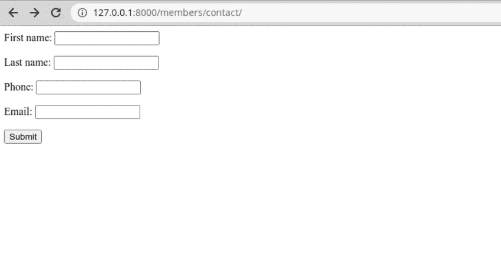
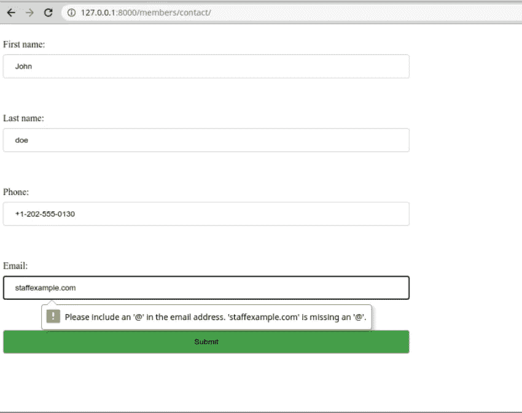
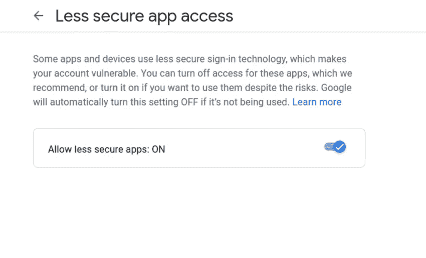
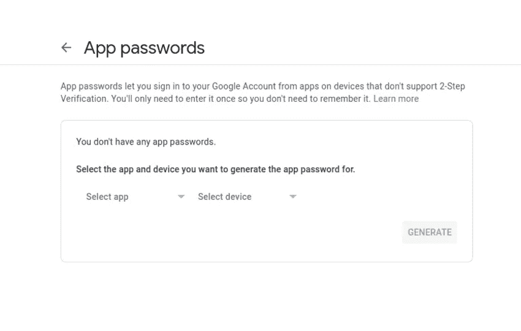
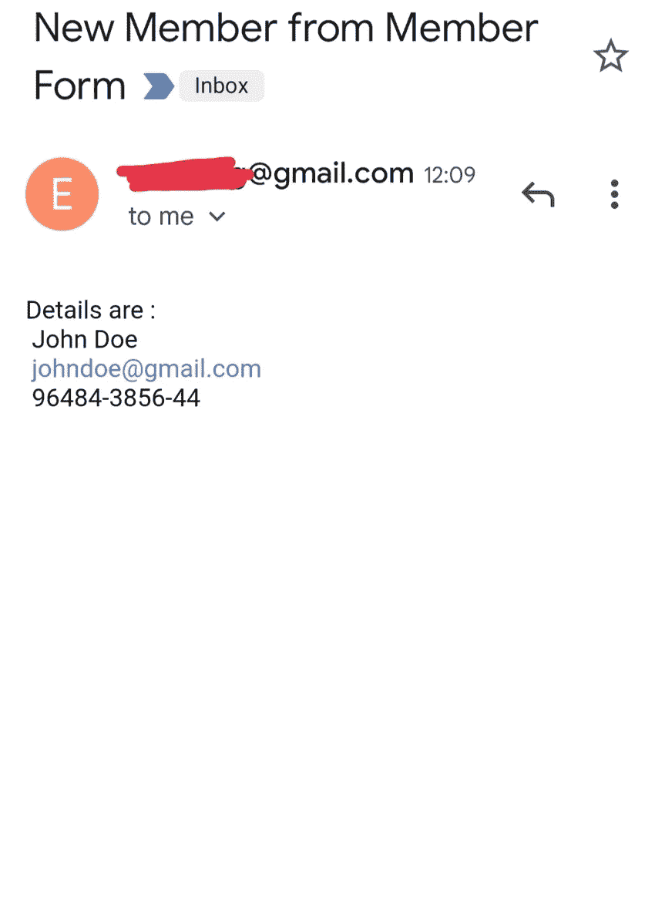

# 用 Python 和 SMTP 构建会员注册表单

> 原文：<https://levelup.gitconnected.com/build-a-member-registration-form-with-python-and-smtp-5b4cdcd20e2d>

从 Django 应用程序发送电子邮件。


格伦·卡斯滕斯-彼得斯在 [Unsplash](https://unsplash.com/s/photos/email?utm_source=unsplash&utm_medium=referral&utm_content=creditCopyText) 上的照片

表单是任何应用程序的重要组成部分，包括收集信息、填写调查或报告索赔。它们通过将来自多个来源的所有数据收集到一个来源来简化管理员的工作。

本教程将构建一个简单的注册表单，用户可以使用 Django 提交数据。一旦用户提交表单，我们还会将提交到表单的数据发送到电子邮件。

# 先决条件

*   Python 3.5 以上版本
*   姜戈
*   简单邮件传输协议

# Django 项目设置

创建一个隔离的 python 环境，即虚拟环境。建议使用虚拟环境将每个项目的依赖项与系统依赖项分开。例如，您可能在系统中安装了不同版本的 Python，但是每个项目都使用不同的 Python 版本。
首先创建项目目录结构。

```
mkdir django-forms
```

使用 Python venv 创建虚拟环境

```
python3.8 -m venv env
```

激活虚拟环境

```
source env/bin/activate
```

激活虚拟环境后，命令行应该如下所示:

```
(env) earth@earth-Notebook-PC ~/Desktop/Django-member-form/member_forms $
```

在您的虚拟环境中安装 Django

```
pip install django
```

创建新的 Django 项目

```
django-admin.py startproject .
```

创建会员应用程序

```
python3.8 manage.py startapp members
```

将应用程序成员添加到列表`INSTALLED_APPS`

# 数据库ˌ资料库

Django 附带了一个 SQLite 数据库，非常适合开发。在我们的应用程序中，我们希望将成员提交的数据存储在数据库中。您可以在 settings.py 文件中找到我们项目的数据库设置。

您仍然可以配置您的项目来使用 Django 支持的以下数据库

*   一种数据库系统
*   MariaDB
*   关系型数据库
*   神谕

尽管出于开发目的，SQLite 也能很好地工作。

# 模型

模型描述了 Django 应用程序中的对象。我们创建的 app members 有一个文件`models.py`，打开它并定义一个包含以下字段的成员类。

# 运行迁移

Django 迁移影响对模型的更改。

```
python3.8 manage.py makemigrations
Migrations for 'members':
  members/migrations/0001_initial.py
    - Create model Member
```

运行 migrate 命令。

```
python3.8 manage.py migrate
```

# 形式

Django 中的泛型类使得创建表单变得很容易。在成员应用程序中创建一个 forms.py 文件，并添加以下代码。

这里我们创建了一个继承自`ModelForm`的`MemberForm`类。我们还定义了一个元类，它定义了模型中定义的所有表单字段。

# 视图

视图用于呈现 HTML 内容。打开`views.py`,创建一个定义表单的函数，并将其呈现为一个上下文。

# 模板

我们仍然没有一个模板。Django 会自动在会员 app 的模板目录中寻找模板。创建一个文件`templates/members/member_form.html`。将以下内容添加到`member_form.html`。

```
<form action="" method="post">
   
   {{ form }}
   <input type="submit" value="Submit">
</form>
```

当用户提交表单时，我们需要让他们知道表单提交成功了。因此，让我们创建一个用户将被重定向到的页面。在 templates 文件夹中，创建一个文件`success.html`，并添加以下内容。

```
<h2>Thanks for submitting</h2>
```

# 资源定位符

更新主`urls.py`文件以包含成员应用程序的 URL

```
from django.contrib import adminfrom django.urls import path,include urlpatterns = [path('admin/', admin.site.urls),path('members/', include('members.urls'))]
```

然后创建一个文件`members/urls.py`并添加下面的代码。

```
from django.urls import pathfrom .views import submit_formurlpatterns = [path('contact/', submit_form, name='contact'),]
```

现在运行服务器并导航到[http://127 . 0 . 0 . 1:8000/members/contact/](http://127.0.0.1:8000/members/contact/)，您应该会看到如下所示的表单。



形式

让我们添加一些 CSS 来使表单更漂亮。



正如您在上面的截图中看到的，我们的表单正在按预期工作。验证也按预期进行。

# 发送电子邮件

Django 提供了 [smtplib](https://docs.python.org/3/library/smtplib.html#module-smtplib) 模块，我们将使用它在提交表单后发送电子邮件。要使用该模块，我们需要配置 Google Gmail SMTP。您使用的 gmail 帐户应该启用不太安全的访问。转到安全性>不太安全的应用程序访问并将其打开。



如果您的帐户启用了两步验证，您将需要特定于应用程序的密码来访问不太安全的应用程序。



应用程序密码

Django 需要的其他配置有:

*   电子邮件 _ 后端
*   电子邮件 _ 主机
*   电子邮件 _ 主机 _ 用户
*   电子邮件 _ 主机 _ 密码
*   电子邮件端口
*   电子邮件 _ 使用 _TLS

打开 setting.py 并添加配置。

```
DEFAULT_FROM_EMAIL = 'youraccount@gmail.com'EMAIL_BACKEND = 'django.core.mail.backends.smtp.EmailBackend'EMAIL_HOST = 'smtp.gmail.com'EMAIL_HOST_USER = 'youraccount@gmail.com'EMAIL_HOST_PASSWORD = 'app-password'EMAIL_PORT = 587EMAIL_USE_TLS = True
```

现在让我们更新视图，以包含发送电子邮件的逻辑。 [smtplib](https://docs.python.org/3/library/smtplib.html#module-smtplib) 模块带有`send_email`包装器，使得发送电子邮件格外快速；我们只需要指定主题、消息和收件人。

这是提交表格后发送的电子邮件。



邮件截图

# 结论

SMTP 协议模块对于开发来说是完美的，但是如果你需要一种更健壮的发送电子邮件的方式，可以考虑使用 T2 send grid T3，它提供了一个免费的计划，更加可靠和快速。

你也可以看看这篇关于如何[用 Django 和 Python](https://betterprogramming.pub/build-a-personal-journal-with-django-and-python-f4835d27368c) 构建个人日志的教程。如果你喜欢读这篇文章，考虑注册成为一名[灵媒会员](https://essyking.medium.com/membership)。