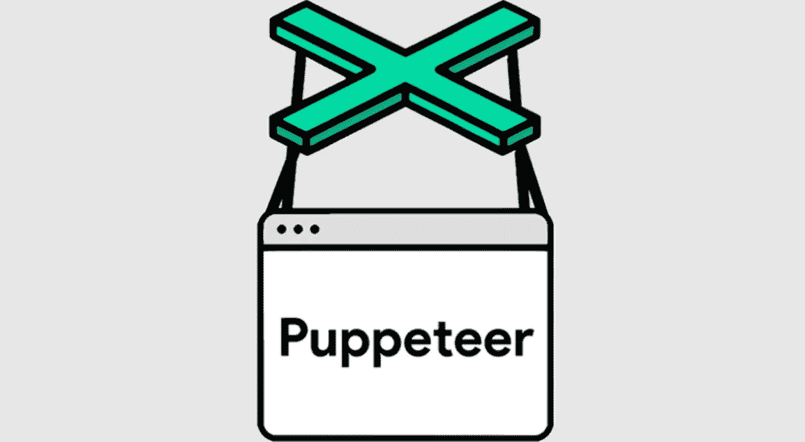
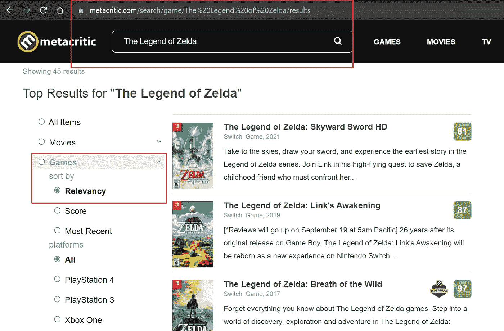
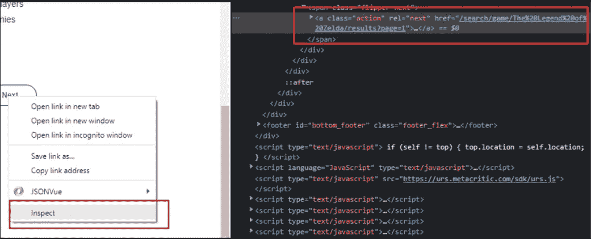
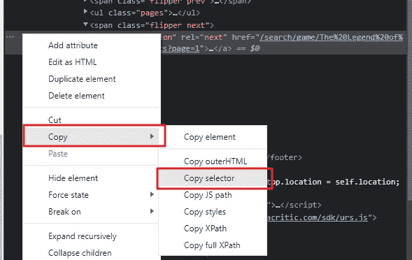
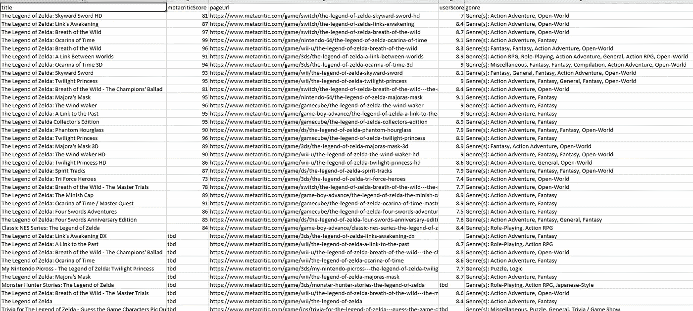

# 使用 NodeJS 和 Puppeteer 构建一个元代码 Web Scraper

> 原文：<https://levelup.gitconnected.com/build-a-metacritic-web-scraper-using-nodejs-and-puppeteer-a10d8c3630b2>



## 介绍

这篇文章将是一个交互式教程，我们将使用 NodeJS 和 Puppeteer 构建一个 web scraper。这个工具将收集关于塞尔达传说系列中视频游戏的关键信息。我们将把收集到的所有信息写入一个 CSV 文件，因此在本练习结束时，我们将生成一个包含多个网页中所有信息的报告。我们将从 Metacritic 收集数据，这是一个收集视频游戏、电影、电视节目和音乐评论的网站。

## 什么是网络抓取，它有什么好处

Web 抓取是自动从网站收集数据的过程。数据收集是通过脚本自动完成的，通常来自多个页面，有时来自多个网站，收集的数据随后被导出为对用户最有利的格式。这可以是单个报告或 API 调用的形式。在我们的示例中，我们将创建一个报告。

Web 抓取非常有用，因为自动化数据收集的过程要比人工从一个网页到另一个网页并手动提取和检索他们需要的信息快得多。通常，他们需要持续地(每天、每周、每月)执行这样的任务，在这种情况下，需要做的就是安排脚本运行来收集数据，而不是一次又一次地执行相同的任务。除了我们收集有关视频游戏特许经营权的信息之外，还有其他流行的 web 抓取用例，包括但不限于:收集股票价格、房地产数据、产品详情、体育统计数据等信息。现在让我们看看我们将如何建立我们的网页抓取器。

## 构建我们的 Web Scraper

既然我们已经简要介绍了什么是 web 抓取，为什么您可能想要使用它，以及它的好处是什么，现在让我们来构建我们的 Metacritic web scraper。以下项目的 Github 库可以在这里找到[。](https://github.com/mwiginton/metacritic-zelda-webscraper)

我们的 web scraper 的逻辑可以在我们的`index.js`文件中找到。让我们从文件的最顶端开始，在这里我们将导入本例中使用的所有包:

布袋戏网刮刀的进口

我们列出的第一个进口产品是`puppeteer`包。这是我们用来做网络抓取的包。

你看到的下一个进口将是`fs`包。这是我们将用来将我们的网络抓取结果写入我们的 csv 报告的包。

您看到的最后一个导入将是`fast-csv`包。这个包将与我们的`fs`包一起工作，帮助我们将 csv 数据写入报告。

既然我们已经介绍了使这个工具工作所需的所有包，让我们进入这个脚本的逻辑。

让我们跳到我们的`index.js`文件的第 73 行，在那里我们看到有一个对我们的`scrapeMetacritic()`函数的函数调用。这是我们脚本的入口点。让我们进入我们的`scrapeMetacritic()`函数。在我们函数的最开始，您会看到下面几行:

在这段代码的第一行，我们使用 Puppeteer 来初始化我们的`browser`对象，我们将从 web 上抓取数据。Chromium 浏览器捆绑在 Puppeteer 包中，这是我们将用于网络抓取的浏览器。你会注意到我们在初始化浏览器时设置的一些参数。参数`headless: false`表示我们不希望在运行脚本时隐藏浏览器。通过将这个值设置为`false`，当我们运行我们的脚本时，您将实际上能够在浏览器中看到所有正在执行的活动。看到所有的浏览器活动都被自动化是非常酷的！默认情况下，Chromium 中的浏览器窗口非常小，很难看到所有内容，所以我们可以用下面的参数`defaultViewport: false`来覆盖它。

在初始化我们的`browser`之后，我们使用新初始化的`browser`对象来初始化我们的`page`对象，代码为`await browser.newPage()`。在我们的 page 对象下面，我们初始化一个空数组`listPageData`。这是我们将用于存储关键信息的集合，我们希望从搜索结果页面中提取这些信息，并最终填充我们的最终 csv 报告。

在本例中，您将看到的最后一行是我们导航到想要访问的页面的位置。在我们的例子中，我们希望导航到用户从 Metacritic 搜索栏中搜索“塞尔达传说”并通过游戏过滤后的页面。`waitUntil: “load”`参数表示我们希望在进一步执行任何代码之前等待页面完全加载完毕。

```
await       page.goto('https://www.metacritic.com/search/game/the%20legend%20of%20zelda/results', {waitUntil: "load"});
```



导航到 Metacritic.com，搜索塞尔达传说，并确保你在左侧导航过滤游戏。这样做之后，这将是我们在示例中导航到的 URL。

在我们的脚本中导航到元符号搜索结果页面后，您会注意到下面一行:

我们正在初始化的这个`nextButtonVisible`变量是我们将用来进入下一页搜索结果的变量。我们可以看到搜索结果包含多个页面。只要“Next”按钮存在并可点击，我们就想继续导航到搜索结果的下一页，继续获取我们的数据。我们通过在木偶师的内置`page.$()`函数中搜索下面的选择器并传递查询选择器`span.flipper.next > a > span`来搜索可点击的“下一步”按钮的存在。只要这个元素不为空，我们就知道可以继续分页和获取数据。

要找到本例中“Next”按钮的选择器(以及任何其他选择器)，您可以在 web 浏览器中右键单击该元素并选择“Inspect”选项。



右键单击“下一步”按钮，然后单击“检查”。您将看到生成 next 按钮的 HTML 代码。

右键单击并检查元素后，您需要右键单击下一步按钮的 HTML 源代码，将鼠标悬停在“复制”上，然后选择“复制选择器”选项。这将为您提供选择器，我们可以使用它在您的木偶脚本中搜索 HTML 元素。



右键单击下一步按钮的 HTML 源代码，选择复制，然后选择复制选择器

在声明了检查可点击的“Next”按钮是否存在的`nextButtonVisible`变量之后，我们可以进入 while 循环的逻辑，只要我们能够点击“Next”按钮，这个循环就会继续执行。

```
while (nextButtonVisible)
```

我们在 while 循环体中做的第一件事是等待搜索结果完全加载到页面上。`page.waitForSelector()`函数接受一个字符串参数作为查询选择器，我们希望在继续之前等待它。在我们知道结果已经加载之前，我们不想继续尝试收集任何数据。我们在下面一行中执行这个逻辑，等待搜索结果的选择器出现在网页上。您可以像检索“下一步”按钮的选择器一样检索搜索结果的选择器:

```
await page.waitForSelector('.search_results.module > .result.first_result');
```

在等待搜索结果加载完毕后，我们希望捕获所有搜索结果的内容。我们可以通过使用`page.$$()`函数来做到这一点，该函数接受一个字符串参数，该参数表示我们所针对的选择器。在我们的例子中，选择器是`‘.search_results.module > .result’`，它获取当前页面上的所有搜索结果。我们可以将这些搜索结果存储在我们的`gameResults`数组中

```
const gameResults = await page.$$('.search_results.module > .result');
```

将当前页面的所有结果存储在 array 中后，我们希望遍历数组中的每个结果。对于数组中的每个元素，我们希望捕获关键信息，用这个关键信息创建一个 JSON 对象，然后将该对象推送到我们在脚本开始时初始化的`listPageData`数组中。`listPageData`数组是我们将用来填充最终 csv 报告的。代码如下所示:

对于每个列表，捕获关键信息并推送到我们的 listPageData 数组

在上面的循环体中，我们使用`page.evaluate()`函数捕获关键信息，该函数接受元素 el，然后调用`el.querySelector()`函数，该函数接受 web 元素的查询选择器作为参数。我们希望从这个页面获得的关键信息是`title`，它是游戏的标题、`metacriticScore`，它是评论家给出的分数，以及`url`，它是我们将导航到当前游戏的详细信息页面的 url。在`title`和`metacriticScore`的情况下，我们提取这些元素的`textContent`属性。在`url`的例子中，因为它是一个链接，所以我们将查询选择器中的`href`属性作为目标。在我们提取了这些关键点之后，我们可以将包含这些信息的 JSON 对象推送到我们的`listPageData`数组中。

在我们循环完当前页面上的搜索结果后，我们需要检查是否可以单击导航到下一个页面，或者是否已经到达了搜索结果的末尾。执行此逻辑的代码如下:

检查是否存在可点击的“下一步”按钮。如果存在，请单击该按钮。如果不存在，将 nextButton 可见变量设置为 false，这样我们就可以结束 while 循环。

在上面的代码片段中，我们首先通过搜索选择器`‘span.flipper.next > a > span’`来检查可点击的 Next 按钮是否存在。如果这样的元素存在并且不是`null`，我们知道我们能够继续在搜索结果中分页。我们可以使用`page.click()`方法点击下一个按钮，并传递代表下一个按钮的`‘span.flipper.next > a > span’`选择器。如果我们在页面上找不到这个元素，我们知道我们已经到达了搜索结果的末尾，我们可以通过将我们的`nextButtonVisible`变量设置为`false`来退出 while 循环。

当我们浏览完搜索结果后，我们希望导航到每个游戏的详细信息页面，以提取关键信息，包括游戏类型以及用户分数。注意，在我写作和从事这个项目的时候，我努力弄清楚如何在我们最初的循环中导航到细节页面和返回到上一页。一个理想的解决方案，会采用这种方法，这是我真正想要完成的。但是我下面的解决方案是我所面临的这个问题的变通方法。随时欢迎任何建议！导航到每个搜索结果的详细信息页面的代码如下:

这里你可以看到我们在第一个循环中创建的`listPageData`数组上循环，它包含了我们当前抓取的信息。对于数组中的每个元素，我们首先获取当前条目的 URL:`let url = entry.pageUrl`。这将用于导航到当前列表的详细信息页面，我们正在下一行:`await page.evaluate((url)=>{window.location = url}, url)`。一旦我们导航到细节页面，我们就等待页面加载，然后尝试进行交互:`await page.waitForSelector(‘body > iframe’)`。一旦页面加载完毕，我们初始化一个变量`userScore`，来存储用户评分的平均等级。

然后，我们将继续从详细信息页面中捕获我们想要的两个数据点:`userScore`和`genre`。我们使用常用的`page.evaluate()`和`querySelector()`函数，并传递这些元素的查询选择器字符串。

一旦我们有了当前列表的两个关键数据点，我们就想返回并更新我们的`listPageData`数组中的适当列表，以包含这些信息。我们通过使用 Javascript 的内置`Array.filter()`函数并返回具有与当前页面的 url 相匹配的`pageUrl`属性的条目来实现。我们找到的元素存储在一个`matchingEntry`变量中，返回的类型是一个数组，在本例中只包含一个匹配元素`var matchingEntry = listPageData.filter(function(item) { return item.pageUrl === url; })`。

一旦我们有了匹配的变量，我们就可以将包含`genre`和`userScore`的这两个新数据点添加到我们列表中的那个元素。该逻辑的代码如下:

一旦我们最终完成了包含我们想要的所有数据的 JSON 对象列表的构建，我们就可以将这些信息写入最终的 CSV 报告。

在上面的例子中，我们使用`fs`包来创建我们的写流`ws`以写入我们的 csv 文件`out.csv`。一旦我们打开了写流对象，我们就可以使用我们的`fastcsv`库来帮助我们写 csv 数据。我们使用我们的`listPageData`数组来填充我们的报告，并使用数组中键的名称来设置报告中的标题名称，方法是传递下面的参数 header:在我们的`fastcsv.write()`函数中为 true。此操作完成后，您将得到一份最终报告，类似于这样，其中包含我们收集的所有数据:



我们收集的所有数据的最终报告。

最后一步是使用`browser.close()`功能关闭我们的浏览器。

## 结论

感谢您花时间阅读本教程。如果您对需要改进的地方有任何反馈，或者在测试这个实现时遇到任何障碍。请随时联系我，让我知道。我总是乐于接受建设性的反馈，并在过程中帮助解决问题。网络抓取有时也很挑剔，会导致一些不一致的行为。所以，如果你看到任何给你带来麻烦的事情，我很乐意听到，并尽力帮助你。

*如果你喜欢阅读这篇文章，请考虑使用* [*我的推荐链接*](https://medium.com/@michelle.wiginton00/membership) *注册 Medium。这种订阅保证了可以无限制地访问我的文章以及其他许多学科的数千名天才作家的文章。*

# 分级编码

感谢您成为我们社区的一员！更多内容见[升级编码出版物](https://levelup.gitconnected.com/)。
跟随:[推特](https://twitter.com/gitconnected)，[领英](https://www.linkedin.com/company/gitconnected)，[通迅](https://newsletter.levelup.dev/)
**升一级正在改造理工大招聘➡️** [**加入我们的人才集体**](https://jobs.levelup.dev/talent/welcome?referral=true)