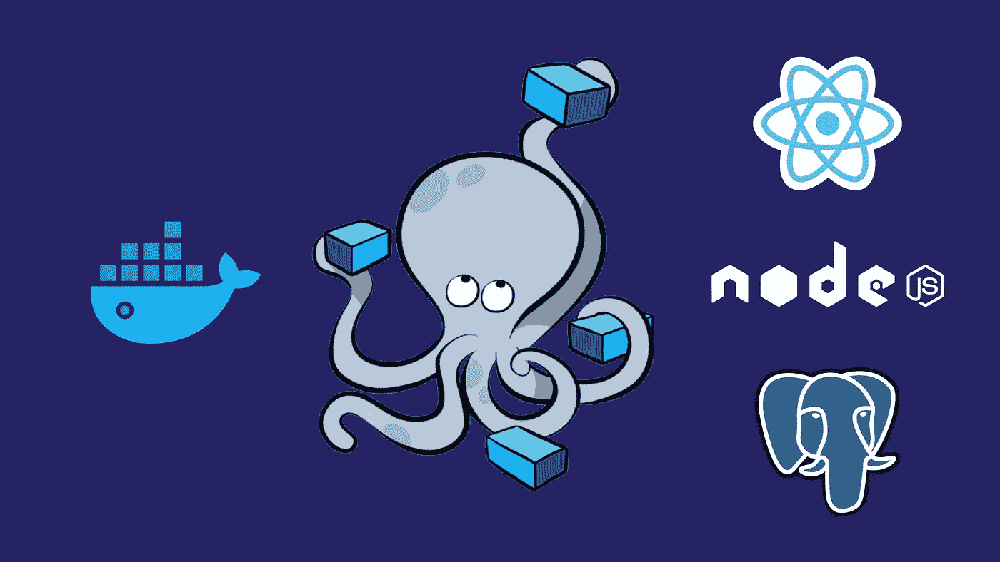
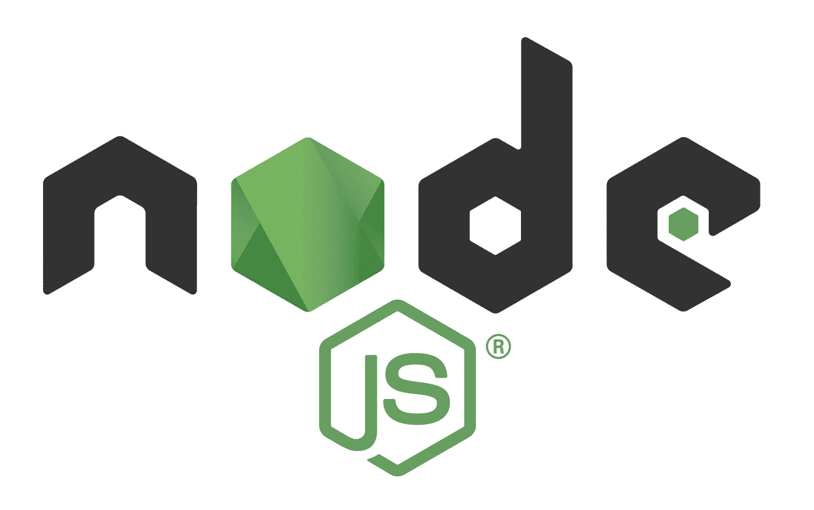
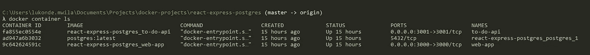
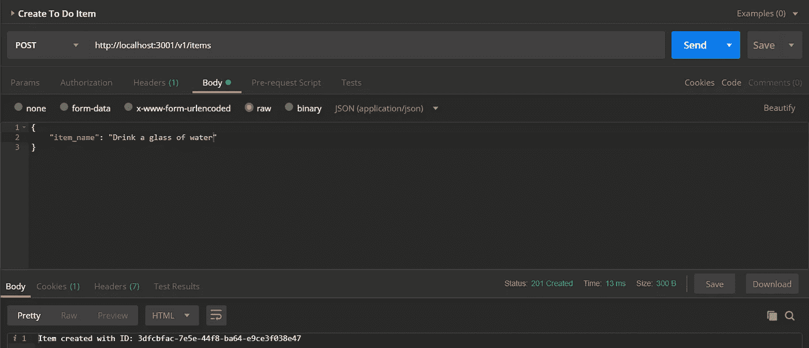
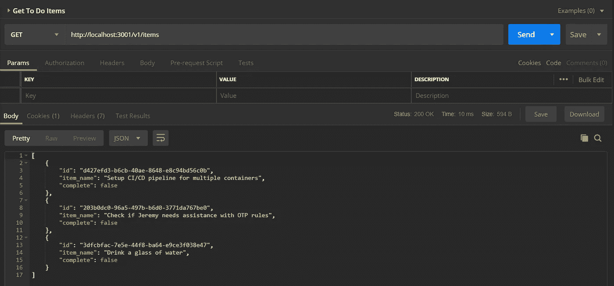
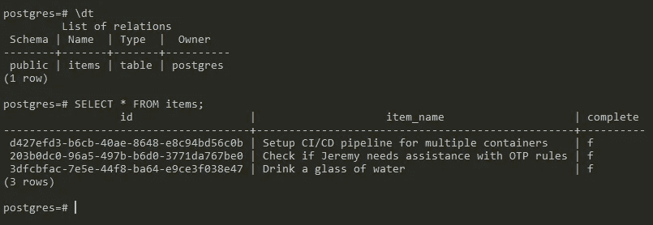
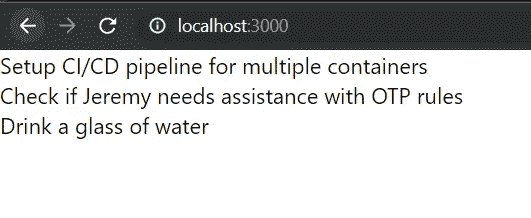

# 用 Docker 构建一个多容器 Docker 应用程序，Docker 由 React、Node 和 Postgres 应用程序组成

> 原文：<https://levelup.gitconnected.com/build-a-multi-container-application-with-docker-compose-460f6199ef3c>



我之前写了一篇关于[用头脑思考 Docker](/wrapping-your-head-around-docker-27b94deadfc8) 的文章，我认为用一个实际动手的例子来跟进是个好主意。我们将进行一点跳跃，直接用 [Docker Compose](https://docs.docker.com/compose/) 运行多个容器。我在上一篇 Docker 文章中没有提到这一点，所以我将从概述它是什么以及它如何帮助我们实现运行多个容器的目标开始。

如果你不是一个读者📖类型的人，或者如果你对 Docker 有足够的经验，只是想看看编码的例子，请随时到这里的[回购](https://github.com/LukeMwila/react-express-postgres)。否则，再逗留几分钟，看看如何构建这个多容器应用程序，它有一个客户机(React)、一个服务器(Node.js)和一个数据库实例(Postgres)。我们的应用程序是做什么的？你猜对了，这是一个待办事项应用程序😐。

我应该马上说，这篇文章的目的不是深入研究示例应用程序中的三种技术，而是展示 Docker Compose 在本地(在您的机器上)轻松运行多个容器的用法。下一次，我们将着眼于将我们的多容器应用程序部署到云中。

如果你喜欢这篇文章，请在这里给我买杯咖啡[☕️](https://www.buymeacoffee.com/lukemwila)😃。

# Docker 撰写


Docker Compose 是一个独立的工具，随 Docker 一起安装。它是一个单独的 CLI。Docker Compose 使我们可以非常简单直接地同时启动多个 Docker 容器，并通过某种形式的网络自动将它们连接在一起。docker-compose 的主要用途是充当 docker CLI，但允许您快速发出更多命令。

当使用 docker compose 创建容器时，我们不需要设置任何端口声明，因为我们希望本地机器能够将流量发送到容器中。

在我们开始破解我们的应用程序之前，创建以下文件夹结构:

```
├── client
├── server
└── docker-compose.yml
```

# 客户端(React 应用程序)


像往常一样，我使用 [create-react-app](https://github.com/facebook/create-react-app) 和 TypeScript。您不必为 TypeScript 配置费心，因为我们不会对应用程序进行太多充实。一旦我们启动并运行了 React 应用程序，我们将创建一个 docker 文件，用于构建图像。Docker 文件是一个纯文本文件，其中包含多行配置。这个配置将定义我们的容器的行为，更具体地说，它将包含什么程序，当它启动一个容器时它做什么。

创建 Dockerfile 文件遵循以下步骤:

*   指定基础图像
*   运行一些命令来安装附加程序和依赖项
*   指定容器启动时运行的命令

为开发环境配置一个容器，为生产环境配置一个容器，这是很好的做法。因此，我们将有一个 Dockerfile，它将在 dev (Dockerfile.dev)中运行我们的应用程序。在客户端文件夹中，创建 **Dockerfile.dev** 文件，并用以下内容填充它:

```
FROM node:10-alpine AS alpineWORKDIR /app# A wildcard is used to ensure both package.json AND package-lock.json are copied
COPY package*.json .## install only the packages defined in the package-lock.json (faster than the normal npm install)
RUN npm install
# Copy the contents of the project to the image
COPY . .
# Run 'npm start' when the container starts.
CMD ["npm", "run", "start"]
```

现在我们已经完成了，让我们创建一个`.env`文件来定义一个带有 to-do API 路径的环境变量。

```
REACT_APP_TO_DO_ITEMS_API=http://localhost:3001/v1
```

我们希望 React 应用程序做的只是列出需要完成的项目。因此，您可以从 **App.tsx** (或 **App.js** )文件中删除样板代码，并用以下代码更新它:

```
import React from 'react';
import './App.css';function App() {
  const [toDoItems, updateToDoItems] = React.useState([]); React.useEffect(() => {
    const getToDoItems = async () => {
      const response = await fetch(
        `${process.env.REACT_APP_TO_DO_ITEMS_API}/items`
      ); const items = await response.json();
      if (items && Array.isArray(items) && items.length) {
        // [@ts](http://twitter.com/ts)-ignore
        updateToDoItems(items);
      }
    };
    getToDoItems();
  }, []);return (
    <div>
      {toDoItems && toDoItems.length
        ? toDoItems.map((item: any, i: number) => {
            return (
              <div key={i}>
                {`${item.item_name}`}
                <br />
              </div>
            );
          })
        : 'No items to be done'}
    </div>
  );
}export default App;
```

现在让我们把注意力转向服务器应用程序。

# 服务器(Node.js 应用程序)



在我们的服务器文件夹中，让我们继续运行以下初始化命令:

```
$ npm init -y
```

一旦我们的 **package.json** 文件被创建，我们就可以安装一些依赖项了。

```
$ npm i --save express cors body-parser dotenv pg uuid
```

让我们也安装 nodemon。

```
$ npm i -D nodemon
```

一旦你完成了这些，你的 **package.json** 文件应该看起来像这样:

```
{
  "name": "server",
  "version": "1.0.0",
  "description": "",
  "main": "index.js",
  "scripts": {
    "start": "node src/index.js",
    "dev": "nodemon src/index.js",
    "test": "echo \"Error: no test specified\" && exit 1"
  },
  "keywords": [],
  "author": "**your name**",
  "license": "ISC",
  "dependencies": {
    "body-parser": "^1.19.0",
    "cors": "^2.8.5",
    "dotenv": "^8.2.0",
    "express": "^4.17.1",
    "pg": "^7.14.0",
    "uuid": "^3.3.3"
  },
  "devDependencies": {
    "nodemon": "^2.0.0"
  }
}
```

在我们的服务器目录中，创建一个具有以下结构的 **src** 文件夹:

```
├── config
└── index.js
```

config 文件夹将有一个 **index.js** 文件，其中包含连接到 Postgres 数据库所需的配置。

```
const config = {
  pgUser: process.env.PGUSER,
  pgHost: process.env.PGHOST,
  pgDatabase: process.env.PGDATABASE,
  pgPassword: process.env.PGPASSWORD,
  pgPort: process.env.PGPORT
};module.exports = config;
```

然后我们可以将这个对象导入到 **src/index.js** 文件中来配置 Postgres 客户端连接。我还为要在 out-to-do 应用程序中执行的每个 CRUD 操作添加了一条路径。

```
require('dotenv').config();**// Express App Setup**
const express = require('express');
const http = require('http');
const bodyParser = require('body-parser');
const cors = require('cors');
const uuid = require('uuid/v4');**// Config**
const config = require('./config');**// Initialization**
const app = express();
app.use(cors());
app.use(bodyParser.json());**// Postgres client**
const { Pool } = require('pg');
const pgClient = new Pool({
  user: config.pgUser,
  host: config.pgHost,
  database: config.pgDatabase,
  password: config.pgPassword,
  port: config.pgPort
});
pgClient.on('error', () => console.log('Lost Postgres connection'));pgClient
  .query(
    `
  CREATE TABLE IF NOT EXISTS items (
    id uuid,
    item_name TEXT NOT NUll,
    complete BOOLEAN DEFAULT false,
    PRIMARY KEY (id)
  )
`
  )
  .catch(err => console.log(err));**// Express route handlers**
app.get('/test', (req, res) => {
  res.send('Working!');
});**// Get all to do list items**
app.get('/v1/items', async (req, res) => {
  const items = await pgClient.query('SELECT * FROM items');
  res.status(200).send(items.rows);
});**// Get a single todo item**
app.get('/v1/items', async (req, res) => {
  const id = req.params.id;const items = await pgClient
    .query('SELECT * FROM items WHERE id = $1', [id])
    .catch(e => {
      res
        .status(500)
        .send(`Encountered an internal error when fetching item with ID ${id}`);
    });res.status(200).send(items.rows);
});**// Create a todo item**
app.post('/v1/items', async (req, res) => {
  const { item_name } = req.body;
  const id = uuid();
  const item = await pgClient
    .query(
      `INSERT INTO items (id, item_name, complete) VALUES 
    ($1, $2, $3)`,
      [id, item_name, false]
    )
    .catch(e => {
      res
        .status(500)
        .send('Encountered an internal error when creating an item');
    });res.status(201).send(`Item created with ID: ${id}`);
});**// Update a todo item**
app.put('/v1/items/:id', async (req, res) => {
  const id = req.params.id;
  const { item_name, complete } = req.body;await pgClient
    .query(
      `
    UPDATE items SET item_name = $1, complete = $2 WHERE id = $3
  `,
      [item_name, complete, id]
    )
    .catch(e => {
      res
        .status(500)
        .send('Encountered an internal error when updating an item');
    });res.status(200).send(`Item updated with ID: ${id}`);
});**// Delete a todo item**
app.delete('/v1/items/:id', async (req, res) => {
  const id = req.params.id;await pgClient.query('DELETE FROM items WHERE id = $1', [id]).catch(e => {
    res.status(500).send('Encountered an internal error when deleting an item');
  });res.status(200).send(`Item deleted with ID: ${id}`);
});**// Server**
const port = process.env.PORT || 3001;
const server = http.createServer(app);
server.listen(port, () => console.log(`Server running on port ${port}`));
```

既然我们已经把 Node.js 应用程序整理好了，我们可以继续为它创建一个 **Dockerfile.dev** 文件。

```
# Specify a base image
FROM node:12.13.0-alpine AS alpineWORKDIR /app# Install dependencies
COPY package.json .
RUN npm install 
COPY . .# Default command
CMD ["npm", "run", "dev"]
```

# 数据库(Postgres)


您可能已经注意到，我们没有为我们的数据库创建单独的文件夹，那么 Postgres Dockerfile 文件将存放在哪里呢？实际上我们不需要。我们可以从 [Docker Hub](https://hub.docker.com/_/postgres) 中提取 Postgres 图像，我们将使用它来启动我们的容器。

# 将这一切结合在一起

现在我们将注意力转向我们在项目开始时创建的 **docker-compose.yml** 文件。这个文件将允许我们定义和配置不同的服务，以便它们可以在一个隔离的环境中一起运行。服务定义包含应用于为该服务启动的每个容器的配置，非常类似于将命令行参数传递给`docker container create`。同样，网络和卷的定义类似于`docker network create`和`docker volume create`。

当我们为 Postgres 数据库定义服务容器时，我们需要做的就是从 Dockerhub 中指定我们将使用的映像，在本例中是 hub 上可用的最新版本的 Postgres。

```
postgres:
  image: postgres:latest
```

至于客户机和服务器，因为我们在各自的目录中都有 **Dockerfile.dev** 文件，所以我们可以通过指定容器(文件夹或目录)的上下文来配置服务的构建细节，因为我们都将 Dockerfile 用于构建基本映像。

```
web-app:
  build:
    context: ./client
    dockerfile: Dockerfile.dev
  volumes:
    - /app/node_modules
    - ./client:/app
  ports:
    - '3000:3000'
  restart: on-failure
  container_name: web-app
to-do-api:
  build:
    context: ./server
    dockerfile: Dockerfile.dev
  ports:
    - '3001:3001'
  restart: on-failure
  container_name: to-do-api
  volumes:
    - /app/node_modules 
# Inside the container, don't try to override this folder, just leave as is
    - ./server:/app 
# Look at the server directory and copy everything into the app folder in the container
```

您可能已经注意到为 **web-app** 和 **to-do-api** 服务定义的卷。请记住，当我们创建一个映像时，我们实际上是在获取目录中所有源代码的快照。docker 卷有一个指向创建映像的本地目录的引用。这基本上就是如何将 docker 容器中的文件和文件夹连接到本地目录中的文件和文件夹。

您可以使用[‘environment’键](https://docs.docker.com/compose/compose-file/#environment)在服务的容器中设置环境变量。您可能还记得，我们在**server/src/config/index . js**文件中使用环境变量设置 Postgres 连接值。我们可以在 **docker-compose.yml** 文件中为要传递给容器的 **to-do-api** 服务定义这些变量的值。

最终产品应该是这样的:

**docker-compose.yml**

```
version: '3'
services:
  postgres:
    image: postgres:latest
  web-app:
    build:
      context: ./client
      dockerfile: Dockerfile.dev
    volumes:
      - /app/node_modules
      - ./client:/app
    ports:
      - '3000:3000'
    restart: on-failure
    container_name: web-app
  to-do-api:
    build:
      context: ./server
      dockerfile: Dockerfile.dev
    ports:
      - '3001:3001'
    restart: on-failure
    container_name: to-do-api
    volumes:
      - /app/node_modules # Inside the container, don't try to override this folder, just leave as is
      - ./server:/app # Look at the server directory and copy everything into the app folder in the container
    environment:
      - PGUSER=postgres
      - PGHOST=postgres
      - PGDATABASE=postgres
      - PGPASSWORD=
      - PGPORT=5432
```

# 运行容器

要启动并运行容器，我们可以运行以下命令:

```
$ docker-compose up -d
```

我已经添加了`-d` (detach)标志，以便容器在后台启动。

当集装箱启动时，我们可以用`docker container ls`或`docker ps`来检查正在运行的集装箱。



运行容器

让我们继续使用 Postman 创建一些待办事项。



使用邮递员创建项目

根据我得到的响应，我的数据库中应该有项目。我们可以通过简单地向相关端点运行 GET 请求来测试这一点，或者我们可以 SSH 到我们正在运行的数据库容器中。让我们双管齐下😄。第一个简单的事情是在 Postman 上打开一个新标签，并运行 GET 请求到`[http://localhost:3001/v1/items](http://localhost:3001/v1/items.)` [。](http://localhost:3001/v1/items.)



使用邮递员获取项目

现在让我们采取第二种方法。要在容器中获得 bash shell，运行下面的`docker exec -it <container id> <command>`命令。`-it`标志用于综合终端。所以我要跑`docker exec -it ad947a6b302 bash`。一旦我进入，我就可以使用默认凭证通过`psql -U postgres`连接到`postgres`数据库。然后，我可以通过运行`\dt`命令来检查 items 表是否存在。如果我得到了预期的结果，那么我可以运行一个基本的 SQL 查询来获得 items 表中带有`SELECT * FROM items;`的所有条目。



最后，让我们测试我们的客户机应用程序，以确保我们从数据库中获得了项目列表。只需打开一个浏览器，进入相关端口上的本地主机，在我的例子中，React 应用程序运行在端口 3000 上。

鼓声…



反应应用程序结果

如您所见，我得到了预期的输出。组成我们应用程序的每个容器都在正常运行🙌 😃。

正如开始提到的，这个应用程序的所有源代码都可以在这里找到:[https://github.com/LukeMwila/react-express-postgres](https://github.com/LukeMwila/react-express-postgres)