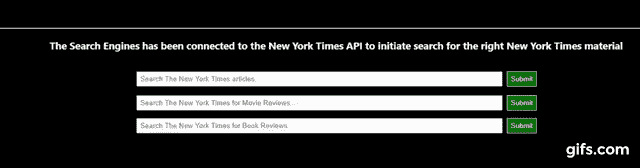

# 使用纽约时报 API 和 React 构建一个新闻应用程序

> 原文：<https://levelup.gitconnected.com/build-a-news-app-using-new-york-times-api-and-react-js-38faf2b3585>

## 我如何使用免费的纽约时报 API 和 React 构建一个搜索引擎来查找最新的纽约时报文章

## **1。注册 API**

一旦你注册了纽约时报开发者控制台，它将为你提供构建搜索引擎所需的免费 API。你会看到很多种类的 API:电影评论、档案、文章搜索、RSS 提要等等。你需要根据自己的需求做出决定。


纽约时报开发人员控制台

然后，您必须在门户中创建一个应用程序来生成您的 API 需要使用的密钥。


在纽约时报开发人员控制台中创建新应用程序

为您的应用命名，然后启用您想要使用的 API。我已经为我的应用程序启用了电影评论和文章搜索。但是这里我将讨论文章搜索 API。

## **2。如何将文章搜索 API 连接到您的应用程序**

单击位于菜单或导航栏上的 API 部分。点击文章搜索 API。在这里，您将看到文章搜索 API 和示例或属性，您可以使用它们来过滤您的搜索等。对于我的应用程序，我将使用 axios 来获取 API。我不得不使用以下命令安装 axios:

```
npm install — save axios
```

一旦安装完毕，我必须导入它。

```
import axios from ‘axios’;
```

在我文章的搜索中，我希望显示包含搜索关键字的前三条最新新闻。首先，我们必须创建搜索引擎的输入部分，这是我创建的代码。我在这里使用类组件，所以我们将使用状态。

```
<tr><td><input style={{width:'60%', margin:'5px', padding:'5px'}} type="text" value={this.state.value} onChange={this.search} placeholder="Search The New York Times articles.. "/><button style={{padding:'6px', margin:'3px', position:'relative',backgroundColor:'#017102', color:'white', border:'1px solid white'}} onClick={this.searching}>Submit</button></td></tr>
```

如您所见，我用 onClick={this.searching}启动了 onClick 事件，它将从输入中获取值，即动态值 value={this.state.value}，并将提交输入值以获取 API。输入的 onChange 事件将显示和记录搜索引擎在输入任何内容时所经历的变化。这是最终产品应该完成的任务。


文章搜索 API 纽约时报

虽然我们从这个 gif 中只得到一个搜索结果，这是第一个结果，但我想告诉你如何从最新的新闻中添加至少三个搜索结果。为了做到这一点，首先我们必须声明状态。

```
export class App extends Component {constructor(props){super(props);this.state={firstNewsUrl:''};this.state={firstNewsAbstract:''};this.state={secondNewsUrl: ''};this.state={secondNewsAbstract:''};this.state={thirdNewsUrl:''};this.state={thirdNewsAbstract:''};this.state={value:''};this.state={query:''};this.search= this.search.bind(this);this.searching= this.searching.bind(this);}
```

为了正确显示搜索结果，我们需要每篇文章的 API 中的两个值，我们需要新闻摘要或标题，我更喜欢控制台中称为摘要的摘要，我们还需要 url，以便人们可以单击它并直接找到它所指的时报文章。

对于这三个搜索结果，我创建了六个状态，firstNewsUrl、firstNewsAbstract、secondNewsUrl、secondNewsAbstract、thirdNewsUrl 和 thirdNewsAbstract。值 state 来自我发起的搜索的输入 null。我还绑定了输入中的 onChange 事件和提交按钮中的 onClick 事件，这样只有当事件被触发时才会调用这些函数。

```
search=(event)=>{this.setState({value: event.target.value});console.log(this.state.value);}
```

此搜索事件控制台记录 state.value 如下:


console.log onChange 事件

虽然没有必要这样做。我这样做是为了方便。

**现在实际获取 API**

首先，让我们创建一个获取新闻的函数。

```
fetchNews= () =>{axios.get(`https://api.nytimes.com/svc/search/v2/articlesearch.json?q=${this.state.value}&api-key=Your API Key`)
.then((response)=>{
const testing= response.data;
console.log(testing);}}
```

然后在提交按钮的 onClick 事件处理函数中插入函数 fetchNews。

```
searching=(event)=>{
event.preventDefault();
this.fetchNews();
console.log('Searching NY Times');
console.log("===========================");
}
```

每当点击搜索引擎的提交按钮时，搜索功能被激活。如果您还记得，我们已经在提交按钮中启动了 onClick={this.searching}。

event.preventDefault()阻止浏览器的默认行为执行。然后调用 this.fetchNews。首先，我们需要在控制台日志中看到来自 API 的数据，并检查响应是什么样子的。我们可以通过控制台记录响应来实现这一点。如果你去我的 fetchNews 函数，你会看到我已经创建了这个:

```
const testing= response.data;console.log(testing);
```

这会产生以下搜索结果


控制台日志 API 响应

现在，通过单击箭头来更深入地了解这一点。


控制台日志 API 响应更深入

现在我们知道如何从 response 调用它们，以及这些文档的名称。例如，文章的 url 称为 web_url 等。如您所见，我们看到了 10 篇最新的新闻文章。我们可以将所有这些数据存储在变量中。我更喜欢常量，因为常量是不可变的，我们当然不想弄乱值。

*存储来自 Times API 的变量*

```
fetchNews= () =>{axios.get(`https://api.nytimes.com/svc/search/v2/articlesearch.json?q=${this.state.value}&api-key=YOUR API KEY`).then((response)=>{const testing= response.data;console.log(testing);const headlines1= response.data.response.docs[0].web_url;const headlinesAbstract= response.data.response.docs[0].abstract;const headlinesUrl= response.data.response.docs[1].web_url;const headlines2Abstract= response.data.response.docs[1].abstract;const headlinesUrl3= response.data.response.docs[2].web_url;const headlines3Abstract= response.data.response.docs[2].abstract;console.log(headlines1);console.log(headlinesUrl);}).catch((error)=>{console.log(Error);})}
```

*现在更新状态*

```
fetchNews= () =>{axios.get(`https://api.nytimes.com/svc/search/v2/articlesearch.json?q=${this.state.value}&api-key=YOUR API KEY`).then((response)=>{const testing= response.data;console.log(testing);const headlines1= response.data.response.docs[0].web_url;const headlinesAbstract= response.data.response.docs[0].abstract;const headlinesUrl= response.data.response.docs[1].web_url;const headlines2Abstract= response.data.response.docs[1].abstract;const headlinesUrl3= response.data.response.docs[2].web_url;const headlines3Abstract= response.data.response.docs[2].abstract;this.setState({firstNewsUrl:' '+headlines1});this.setState({firstNewsAbstract:'1\. '+headlinesAbstract});this.setState({secondNewsUrl:''+headlinesUrl});this.setState({secondNewsAbstract:'2\. '+headlines2Abstract});this.setState({thirdNewsUrl:''+headlinesUrl3});this.setState({thirdNewsAbstract:'3\. '+headlines3Abstract});this.setState({value:''});console.log(headlines1);console.log(headlinesUrl);}).catch((error)=>{console.log(Error);})}
```

现在状态已经更新了，是时候在浏览器中显示数据了。我在 React 中使用<ahref>,尽管我听说在 React 中有更好的链接 URL 的方法。请评论并告诉我。</ahref>

*在浏览器中呈现数据*

```
<a style={{color:'white'}} target='_blank' href={this.state.firstNewsUrl}>{this.state.firstNewsAbstract}</a><a style={{color:'white'}} target='_blank' href={this.state.secondNewsUrl}> {this.state.secondNewsAbstract}</a><a style={{color:'white'}} target='_blank' href={this.state.thirdNewsUrl}>{this.state.thirdNewsAbstract}</a>
```

请注意，我使用了 target='_blank '以便在新页面中打开 url。这里，web_url 的状态在 href 属性中，而抽象的状态在标记中，因为这就是我们将要看到的。



文章搜索 API 的作用

我想你会对最终产品满意的。请注意，该 API 仅用于非商业用途，前提是你需要与《纽约时报》合作，通过广告或订阅将你的应用货币化。在搜索 API 的帮助下，你可以搜索从 1981 年至今的 280 万篇文章。您可以检索标题、摘要、主要段落等。借助于查询参数 begin_date 和 end_date，您可以在特定期间内搜索日期。你可以将搜索限制在体育、音乐或艺术等方面。例如，通过将该属性放入 API http 请求中，我们可以将搜索范围限制为仅来自纽约的 sports desk。

```
fq=news_desk:("Sports") AND glocations:("NEW YORK CITY")
```

请参考《泰晤士报》开发人员控制台上关于任何 API 部分的文章搜索 API 部分的概述，该部分将介绍您可以使用其 API 做的无数事情以及实现这些事情的方式。

总而言之，世界上所有的新闻都掌握在你的手中。但是，API 请求被限制为每天 4000 个请求，每分钟 10 个请求。确保不要超出限制。

我希望你玩得开心

编码并创建！

萨曼贾