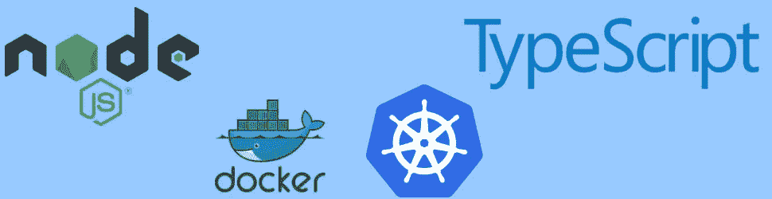
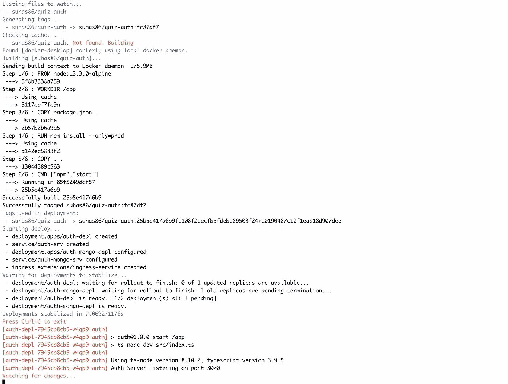
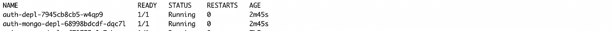
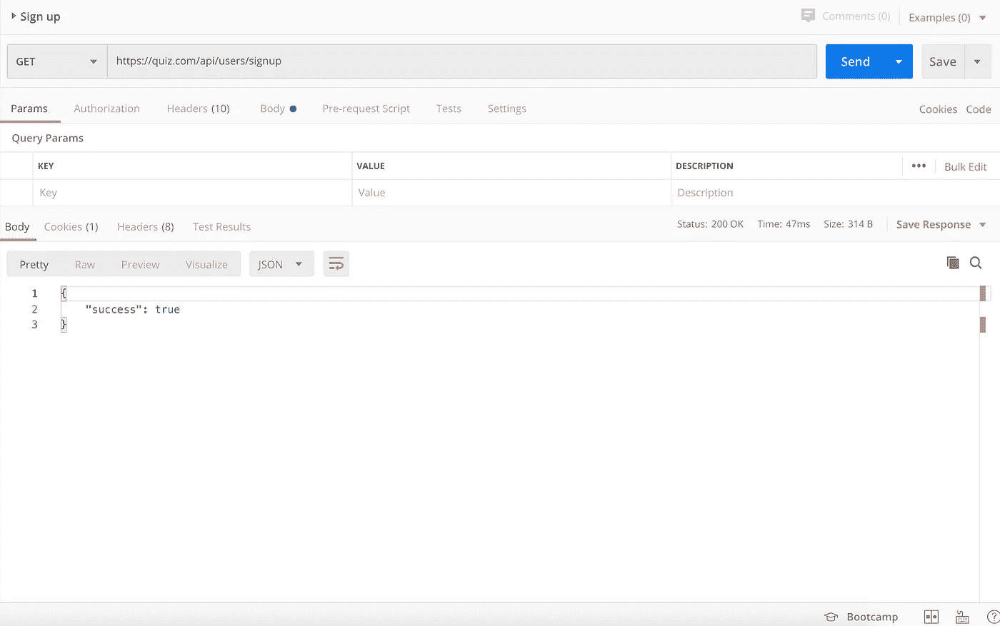

# 使用 Kubernetes 构建一个节点服务

> 原文：<https://levelup.gitconnected.com/build-a-node-service-using-kubernetes-b360bde91ced>



在本文中，我将尝试向您介绍如何使用 MongoDB 开发为节点应用程序设置 Kubernetes。

阅读本文的先决条件 Node、TypeScript、Docker 和 Kubernetes 的基础知识

**让我们从设置应用程序开始**

首先，让我们创建一个 package.json 并安装该应用程序所需的所有依赖项

```
npm init
```

在这个应用程序中，我们将使用 express framework 和 TypeScript。因此，让我们继续安装它。

```
npm i express @types/express typescript @types/typescript
```

现在，要在本地运行这个应用程序，我们需要 ts-node-dev 来运行并重启我们基于 TypeScript 构建的节点应用程序。更多信息可以在[这里](https://www.npmjs.com/package/ts-node-dev)找到。

```
npm i ts-node-dev
```

最后，要启动应用程序，请将 package.json 中的脚本标记编辑到下面的代码中，其中 index.ts 是应用程序的源文件。

```
"scripts": { "start": "ts-node-dev src/index.ts", "test": "echo \"Error: no test specified\" && exit 1"}
```

**为我们的应用程序创建一个 express 服务器并设置一个路由**

现在让我们在 routes 文件夹中创建一个简单的路由，稍后它将被转换为一个简单的注册路由

```
import express, { Request, Response } from "express";const router = express.Router();router.get("/api/users/signup", (req: Request, res: Response) => { console.log("API Hit"); res.send({ success: true });});export { router as SignupRoute };
```

我将把应用程序和 express server 分成两个文件，因为稍后我需要应用程序配置来为这个应用程序编写单元测试。

我将在 app.ts 下定义我的应用程序

```
import express from "express";import { json } from "body-parser";import { SignupRoute } from "./routes/signup";const app = express();app.use(json());app.set("trust proxy", true);app.use(SignupRoute)export { app };
```

在 index.ts 中启动 express 服务器

```
import { app } from "./app";const start = async () => { app.listen(3000, () => { console.log(" listening on port 3000"); });};start();
```

现在，我们的基本应用程序已经准备好了一个简单的路线，让我们为这个应用程序创建 Docker 文件

**我们的节点应用程序的 Docker**

我们的 docker 文件将定义以下步骤

1.  From = >我们将在哪个服务器上运行应用程序
2.  WORKDIR = >我们的应用程序的目录
3.  COPY => Copy package.json
4.  运行= >安装在 pacakge.json 中定义的所有 npm 软件包
5.  复制= >源文件的其余部分
6.  CMD = >运行我们的应用程序的命令

```
FROM node:13.3.0-alpineWORKDIR /appCOPY package.json .RUN npm install --only=prodCOPY . .CMD ["npm","start"]
```

建立并推广 docker 映像

```
docker build -t dockerid/imagename .In my case its
docker build -t suhas86/authFollowed bydocker push dockerid/imagename
docker push suhas86/auth
```

**为我们的应用程序设置 Kubernetes】**

在设置之前，让我们有一个小的库伯内特之旅

**什么是 Kubernetes？**

***注意:如果你了解 Kubernetes 的基础知识，你可以跳过这一节***

Kubernetes 是一个运行许多不同容器的工具。

每当我们想使用 Kubernetes 时，我们都需要一个 docker 图像。Docker 图像基本上是如何创建容器的指南

我们使用这个映像创建一个容器，并将其部署到 Kubernetes 集群。

为了用 docker 映像创建一个容器，我们需要创建一个配置文件。在这个配置文件中，我们提到了需要运行多少 docker 映像副本，并使其可以从网络上访问。

当我们将这个配置信息提供给 Kubernetes 时，它将获取 docker 映像。如果图像不可用，它将从 docker hub 下载。

它将下载 docker 映像并在 pod 中创建容器。Pod 是 Kubernetes 应用程序的基本执行单元。

所以这些舱将运行我们的服务。但是，如果出了问题，我们需要重新启动吊舱呢？

为了维护 pod，我们为 pod 创建部署。如果 pod 出现任何问题，或者说它崩溃或被意外删除。这些部署将确保自动重新创建它。

因此，配置的第二部分是使它可以从网络访问。为此，Kubernetes 创造了服务。服务提供对我们服务器内部运行的 pod 的访问。它处理我们 Kubernetes 集群中不同 pod 之间的网络。

在我们的项目中，让我们称之为 auth，我们需要为 auth 模块和 auth mongo DB 部署和服务。所以让我们为相同的创建 YAML 文件。我们将在 infra/k8s 目录下创建这些 YAML 文件，这是标准做法。

**用于授权的 YAML 文件**

上面的文件部署了 pod 以及连接到网络的服务。

总结一下 YAML 文件，我们将部署的名称命名为 auth-depl，将 pod 的名称命名为 auth，在 spec 下，我们提供了创建容器所需的映像、Mongodb URL，接下来我们将为其创建一个配置文件，并通过名称 auth-srv 访问我们的 pod。

同样，现在让我们为这个项目所需的 mongo DB 创建 YAML

在这个 YAML 文件中，我们将使用 MongoDB 团队创建的 mongo 映像在我们的 pod 中创建一个容器。

**负载平衡器和入口控制器**

我们需要一个负载平衡器服务来从集群外部进行服务调用。负载平衡器服务将流量放入单个 pod 中。但是，如果我们有多个集群，单独的负载平衡器是不够的。如果我们有多个 pod，我们需要将流量分配到不同的 pod，我们需要有路由规则来决定将请求发送到哪里。为此，我们使用入口控制器。具有一组路由规则的 pod

在这个应用程序中，我们将使用 ingress-nginx 来创建负载平衡器服务和 ingress。请点击此[链接](https://kubernetes.github.io/ingress-nginx/deploy/)获取 NGINX 入口控制器的安装指南。

YAML 文件入口服务

在上面的 YAML 文件中，我提到了我们之前创建的 **auth-srv** 的路由规则。还有，我提到过主持人是 quiz.com。

要更改本地主机的主机名

```
code /etc/hosts .This will open host file in your code editorAdd this at the end of the file
127.0.0.1 quiz.comNote: If your editor is not configured in command path. Please do this manuallay. Also to make this change you need to grant Admin access
```

[**斯卡福德**](https://skaffold.dev/) **进行开发**

每次我们进行更改时，我们都需要构建 docker 映像，推送映像，并再次应用 Kubernetes 部署，例如 kubectl apply -f auth-dep.yaml ,这相当耗时且令人沮丧。为了在开发过程中自动化这一过程，我们使用了 skaffold。此外，当我们退出 skaffold 时，将删除所有属于该项目的 pod 和对象。斯卡福德的安装指南可以在[这里](https://skaffold.dev/docs/install/)找到

在这个配置文件中，我们在 manifests 下给了 infra k8s 路径，在 artifacts 下给了映像名称。

在开发机器上运行我们的应用程序

```
skaffold dev
```

您将在您的控制台上看到类似的内容



现在，如果你打开另一个控制台，输入 **kubectl get pods。**您可以看到我们应用程序的所有窗格



要测试我们的负载平衡器服务和 NGINX 入口控制器，请访问 postman 或任何其他 API 测试工具，并测试我们在 routes 目录中编写的 GET 方法，您应该会得到 200 个响应。



节点应用程序的 Kubernetes 设置到此结束。这方面的代码可以在 [GitHub](https://github.com/suhas86/node-typescript-kube-sample/tree/initial-setup) 中找到。

我最近学习了 Kubernetes 来构建一个微服务应用。我对 Kubernetes 的世界如此着迷，我想在一篇文章中分享我的学习。希望这能让您了解如何为您的应用程序设置 Kubernetes。如果你对我们如何改进这个设置有任何建议，请留下评论，因为这将有助于我和其他开发者在这方面做更多的改进。

有一篇后续文章，我使用了 MongoDB 的相同设置，并解释了使用 GitHub hooks 的[测试驱动开发和持续集成。](https://medium.com/@murthy.suhas/test-driven-development-continuous-integration-using-nodejs-and-github-hooks-f9f0e2924f7)

编码快乐，干杯！