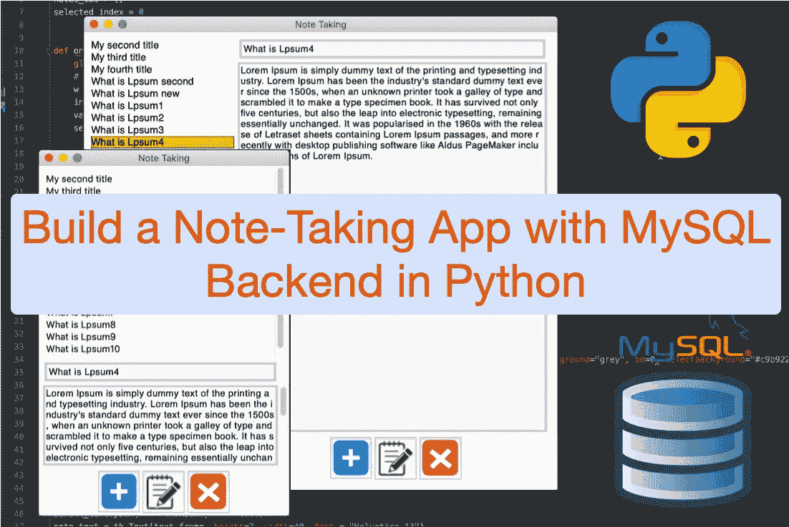
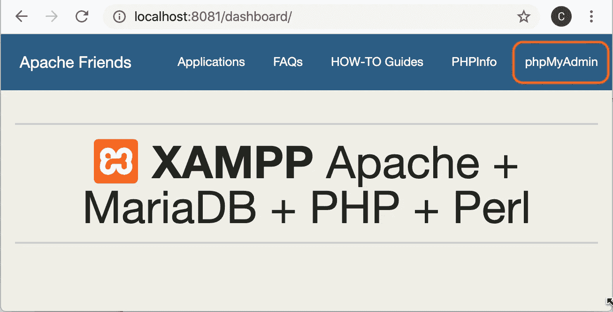
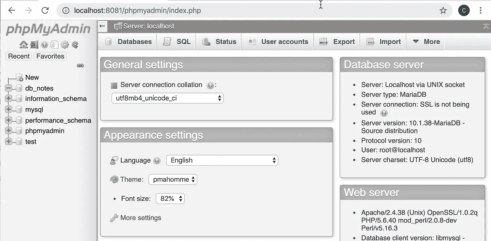
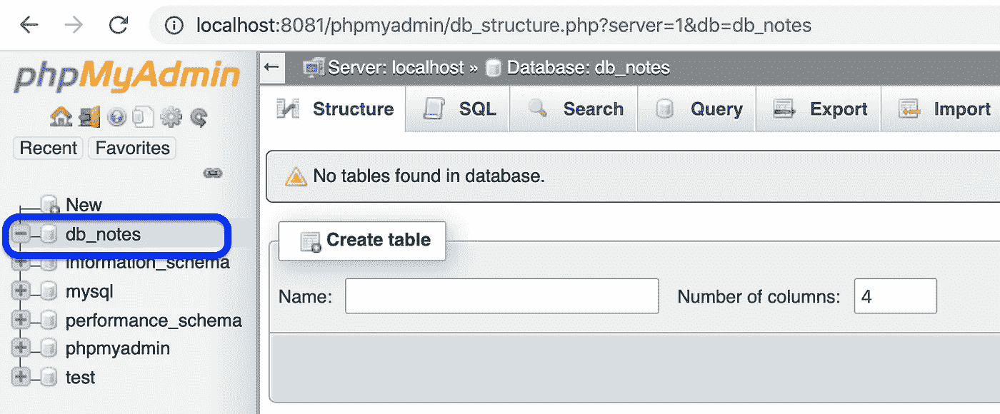
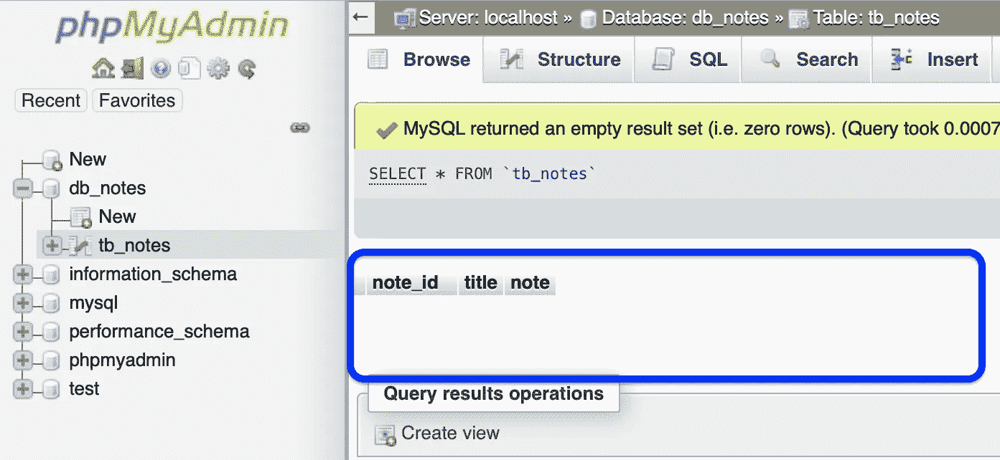
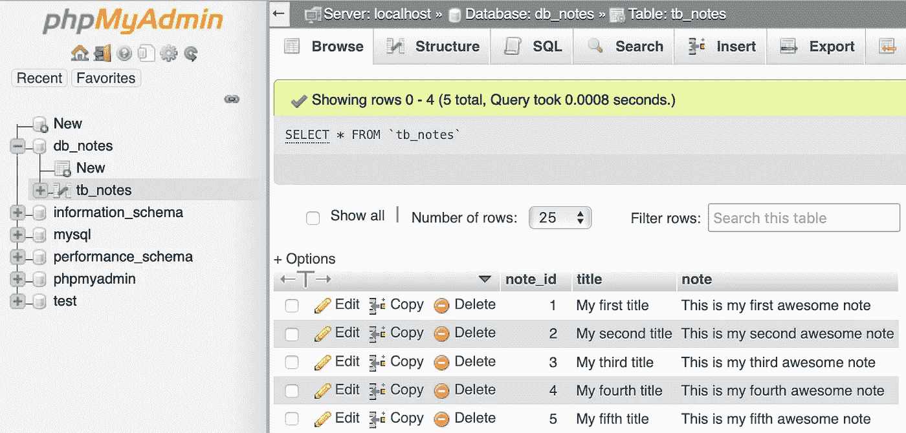
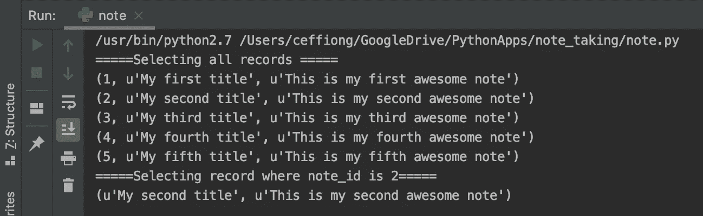
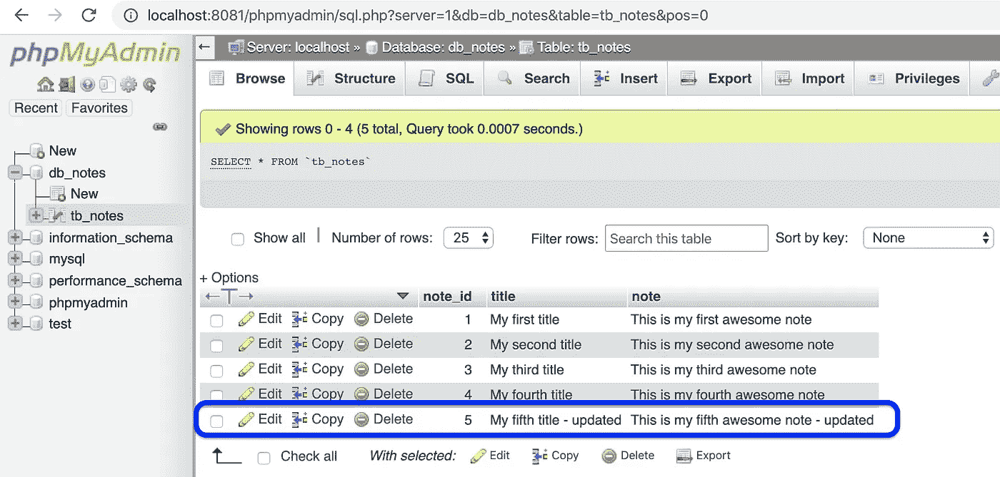
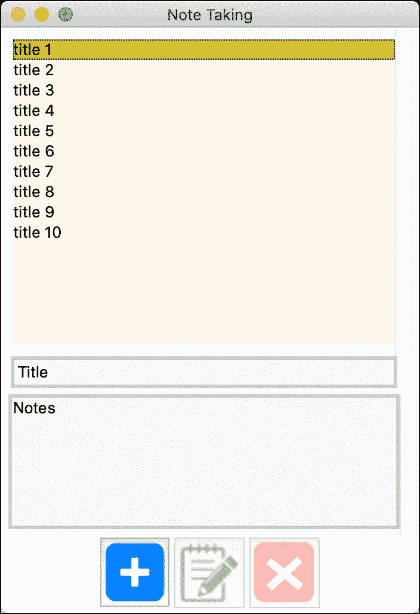

# 用 Python 语言的 MySQL 后端构建一个笔记应用程序

> 原文：<https://levelup.gitconnected.com/build-a-note-taking-app-with-mysql-backend-in-python-927b4c5fad91>

## 了解如何在 Python 中执行数据库创建读取更新删除(CRUD)操作。

我将向您展示如何通过构建一个笔记桌面应用程序来执行各种数据库操作，例如 Python 中的 CRUD。我的目标不仅仅是教你如何用 Python 创建一个笔记应用程序，而是向你提供工具、原则和概念，它们可以应用于构建其他酷的 web、桌面、移动应用程序(需要后端数据库)。

我将假设您已经安装并设置了 Python 和 [Tkinter 库](https://tkdocs.com/tutorial/install.html)(用于构建我们的 GUI)。本教程不会关注 Tkinter，因为我将更多地关注与数据库相关的操作。因此，如果你还不熟悉 Tkinter，请看看我的[以前的教程](https://medium.com/@ceffiong/learn-python-by-building-a-gui-guessing-game-with-tkinter-9f82291db6?sk=4154727ca3623ac1a98f9aa1dbb4a565)。我已经在 github 上传了完整的[源代码，供大家下载](https://github.com/effiongcharles/note-taking-app-python)试用。

上面的电影展示了工作的应用程序。该应用程序将允许用户添加新的笔记，查看笔记细节，更新和删除现有的笔记。该应用程序依靠 mysql 数据库来保存(存储)我们的笔记数据。我们将从应用后端开始，即设置和执行基本的数据库 CRUD 操作，然后实施前端-UI。系好安全带准备起飞！

# 备份—数据库设置和操作

我们很酷的应用程序将使用 mysql 数据库后端来保存数据。但是我们如何建立这样一个数据库呢？为了在您的系统上托管数据库服务器，您可以下载并安装 mysql。有几个选项(比如 [WAMP 服务器](http://www.wampserver.com/en/))但是我们将使用 XAMPP，这是一个流行的开源 Apache 发行版，附带 Mysql 数据库。安装和使用都很简单。前往 https://www.apachefriends.org/index.html[并点击下载按钮来下载 XAMPP。按照说明安装并启动 XAMPP。](https://www.apachefriends.org/index.html)

图 1: XAMPP 仪表板

图 1 显示了在本地主机和端口 8081 上运行的 XAMPP 仪表板。端口号取决于您的设置:)XAMPP 附带了 phpMyAdmin——一个 web 界面，允许您执行各种与数据库相关的功能。点击“phpMyAdmin”菜单进入 phpMyAdmin 网络界面。

图 2: phpMyAdmin web 界面

图 2 显示了 phpMyAdmin web 界面。我们可以从这个界面创建数据库、表格和执行数据库操作(插入数据、选择、删除等)，但是，嘿，让我们通过 Python 脚本来完成吧。那不是很有趣吗？我打赌会的！

图 3:数据库连接和创建数据库功能

图 3 中的代码片段显示了创建数据库的函数。我们需要一个“驱动程序”来连接 MySQL 数据库服务器。这个驱动是在*行 1* 导入的。接下来，我们创建一个 MySQL 连接对象，其中我们指定了 MySQL 服务器的详细信息，即主机地址、端口、用户和密码*(第 3 行)*。您需要更改它们以匹配您的服务器凭据。

***db_create_db(..)*** 函数创建一个数据库(即 db_notes)如果它不存在。这很重要，因为我们不想每次函数执行时都重写数据库。光标用来处理各种数据库操作。在执行了函数*(第 10 行)*之后，我们可以检查 phpMyAdmin 来查看数据库是如何创建的，如图 4 所示。

图 4:创建的数据库“db_notes”

目前，我们的数据库已经创建，但是为空(没有表)。下一步是创建表。一个数据库就像一个集合，它承载着其他数据库对象，例如表、视图等。让我们看看如何创建一个表。

图 5:创建表格功能

图 5 中的代码片段创建了表( *tb_notes* )。首先，我们选择将托管该表的数据库*(第 3 行)*。接下来，我们创建一个包含我们的 *sql* 查询*的字符串(第 5–8 行)。*注意(和数据库一样),如果表不存在，我们会创建它以防止覆盖。我们的表将有 3 个字段:*注释 id、标题和注释*。我们需要一种方法来惟一地标识表中的每条记录(一个表行被称为一条记录)，因此我们在 *note_id 上使用了一个“*主键*”。*这意味着我们的表中不能有两个记录具有相同的 *note_id* 并且字段不能为 *NULL。另外，我们将 *note_id* 设置为“自动递增”,这意味着数据库服务器负责为每个插入的数据创建唯一的 *id* 。我们使用游标*执行 *sql* 查询(第 9 行)。*在执行了函数*(第 12 行)*之后，我们可以检查 phpMyAdmin 来查看表是否被创建，如下图 6 所示。*

图 6:创建了表“tb_notes”

注意，新创建的表在 *db_notes* 数据库中，因为我们选择了它。我们的表已创建，但目前为空。让我们看看如何通过 Python 向表中插入数据。

图 7:插入数据功能

图 7 中的代码片段显示了如何将数据插入到我们的表中。注意，我们在查询*(第 4 行)中指定了将要插入数据的表。*此外，该查询只指定了*标题*和*注释*字段，而没有指定*注释 id* 字段，因为 db 服务器负责为*注释 id* 字段创建唯一 id，如前所述。提交函数被调用来完成插入操作*(第 7 行)*。这是修改表数据的每个事务/查询所必需的。调用该函数将虚拟记录插入我们的表*(第 18–19 行)。*

图 8:插入的音符数据

我们可以很容易地通过 phpMyAdmin 验证该记录是否成功保存在表( *tb_notes* ) 中，如图 8 所示。如前所述，我们还可以清楚地看到服务器自动为我们插入了 *note_id* 字段。您可能想知道如何从数据库表中读取数据。接下来我们来看看这个。

图 9: Select all from database 和 init 函数

图 9 中的代码片段— ***db_select_all(..)*** 显示了如何从数据库表中检索所有数据。我们使用 MySQL 的“SELECT”关键字来选择数据，光标从表中获取所有( ***** ) 数据。类似地，我们可以使用 *WHERE* 关键字选择一个或多个记录。WHERE 关键字可以与 SELECT 一起使用，以便只检索与 WHERE 子句匹配的记录。这在**中有说明 *db_select_specific_note(..)*** 函数在图 9 中我们从表中只选择了一条记录。

图 10:选择查询的输出

select 函数以二维数组的形式返回选定的数据。如果我们打印出返回数据(*见图 9，第 12–14 行)*,(执行两个功能的)输出如图 10 所示。

有些情况下，我们需要更新数据库中的记录。接下来看看怎么做。

图 11:更新数据功能

图 11 示出了更新数据库中特定记录的功能。该查询使用 MySQL“UPDATE”关键字和“WHERE”子句来更新与 *note_id(第 7 行)*匹配的记录。为了测试这个方法，我们调用方法*(第 10 行)*来更新 *note_id* 为 5 的记录。我们可以通过 phpMyAdmin 验证更新，如图 12 所示。

图 12:更新的数据库表

现在我们已经完成了**C**create**R**EAD 和 **U** pdate，我们只剩下 **D** elete 操作了。让我们看看如何从数据库表中删除记录。

图 13 从数据库功能中删除记录

图 13 中的代码片段显示了如何删除记录。该功能使用 MySQL *DELETE* 、 *WHERE* 关键字选择要删除的具体记录。在这里，具有指定的 *note_id* 的记录将从我们的表中删除。我们调用该函数，从我们的表*(第 10 行)*中删除 *note_id* 为 3 的记录。如果我们检查 pypMyAdmin，我们可以确认第 3 条记录中 *note_id* 已经被删除。这在下面的图 14 中示出。

图 14:删除数据库记录

既然我们已经知道如何执行 CRUD 数据库操作，我们就可以将这些知识应用于构建应用程序的前端。

# 前端—笔记界面

在上一节中，我们使用 Python 脚本对笔记执行了 CRUD 操作。这对于测试我们的后端很好，但是不方便用户。因此，我们将创建一个用户界面，从中可以执行 CRUD 操作。例如，我们希望能够在一个漂亮的用户界面而不是终端上显示笔记。

图 15:笔记应用主窗口

图 15 显示了应用程序主窗口。它由*列表框*小部件(用于显示注释标题)、*条目*小部件(用于输入和显示注释标题)、*文本*小部件(用于输入和显示注释)和*按钮*小部件(用于添加、编辑和删除注释)组成。目前，我们正在展示“虚拟”标题(例如标题 1、标题 2、标题 3……)。如果我们显示数据库表中的数据，不是很酷吗？让我们看看下一步怎么做。

图 16: init 函数

我们依靠 ***init(..)*** 功能(如图 16 所示)将我们数据库中的数据显示到 UI 上。有趣的是，我们在这里利用后端函数来创建数据库、表和读取数据。我们获取数据库中的所有注释，并将其存储在*注释*变量*(第 6 行)*中。然后，我们使用一个循环来附加每个*标题*(注释[0]返回 id，而注释[1]返回标题)，如*第 9 行所示。*我们还将 *note_id* 的值保存在 *notes_id* 变量中。这是因为 Tkinter listbox 小部件的限制(我们需要手动将 *Listbox 小部件*上的标题映射到它们各自的 id。)

当我们选择或点击任何列表框项目(标题)时，调用图 17 代码片段所示的 ***onselect()*** 函数。

图 17:列表框选择函数代码段

在这里，我们从*事件*中获取被点击项目的索引和值，并将其传递给 ***display_note(..)*** 功能。display_note 函数(希望)非常容易理解。首先，我们清除字段*(第 18–19 行)*。接下来，我们从数据库*(第 15 行)*中获取想要显示的数据。数据(存储在注释变量中)包含从数据库中检索的*标题*(数据[0])和*注释*(数据[1】)。我们在 UI *(第 18–19 行)*上显示标题和注释，并启用我们的编辑和删除按钮。接下来，让我们看看如何从 UI 向 db 添加新的注释。

图 18 保存便笺功能

当点击“添加”按钮时。调用图 18 所示的 ***save_note()*** 功能。这个函数可能看起来很长，但是很容易理解。首先，我们检查用户是否输入了有效标题，并注意到*(第 5–12 行)*。然后，我们检查以确保输入的标题是唯一的。如果满足上述条件，我们将数据(标题、注释)保存到数据库中(使用我们之前创建的 db 函数)，更新 UI —将新添加的列表追加到显示区域*(第 32 行)*，并清空文本区域。接下来，我们来看看如何更新 UI。

当点击“编辑”按钮时，我们调用***update _ note()***函数。这个函数类似于我们之前讨论的 *save_note()* 函数。主要区别是我们使用了***db _ update _ note()***函数。所以，我不会用重复来烦你:)最后一步是在单击 delete 按钮时删除 db 记录。接下来让我们看看这背后的逻辑。

图 19:删除注释功能

我们在点击删除按钮时调用 ***date_note()*** 函数。该功能如图 19 所示。首先，我们确保用户选择要删除*(第 8–10 行)*的注释。然后，我们显示一个提示，让用户确认删除操作*(第 12 行)*。如果确认为“是”*(第 14 行)，*我们从数据库表中删除该记录(使用 db 删除功能— *第 17 行*)，并从 UI 中删除该记录(*第 21–23 行*)。是的，我们完成了:)

# 摘要

我已经向您展示了如何通过构建一个笔记应用程序来执行数据库**C**reate**R**EAD**U**pdate 和 **D** elete (CRUD)功能。我希望你现在已经掌握了 db 的原则和概念，可以用它们来开发出色的 db 后端应用程序(web、移动、桌面)。我迫不及待地想看看你下一步会创造什么！

如果我们不仅可以查看自己的笔记，还可以查看其他用户的笔记，这不是很酷吗？为了改进这个应用程序和你的编程实践，我建议你增加那个功能。**提示:**您至少需要两个数据库表(一个用于用户信息，另一个用于注释)，并使用 [***外键*** 关系](https://dev.mysql.com/doc/refman/5.6/en/create-table-foreign-keys.html)连接这两个表。

你可以在我的 github 上下载 [**完整的项目源代码。如果您有任何问题，请随时试用代码并联系我。**](https://github.com/effiongcharles/note-taking-app-python)

祝你好运！