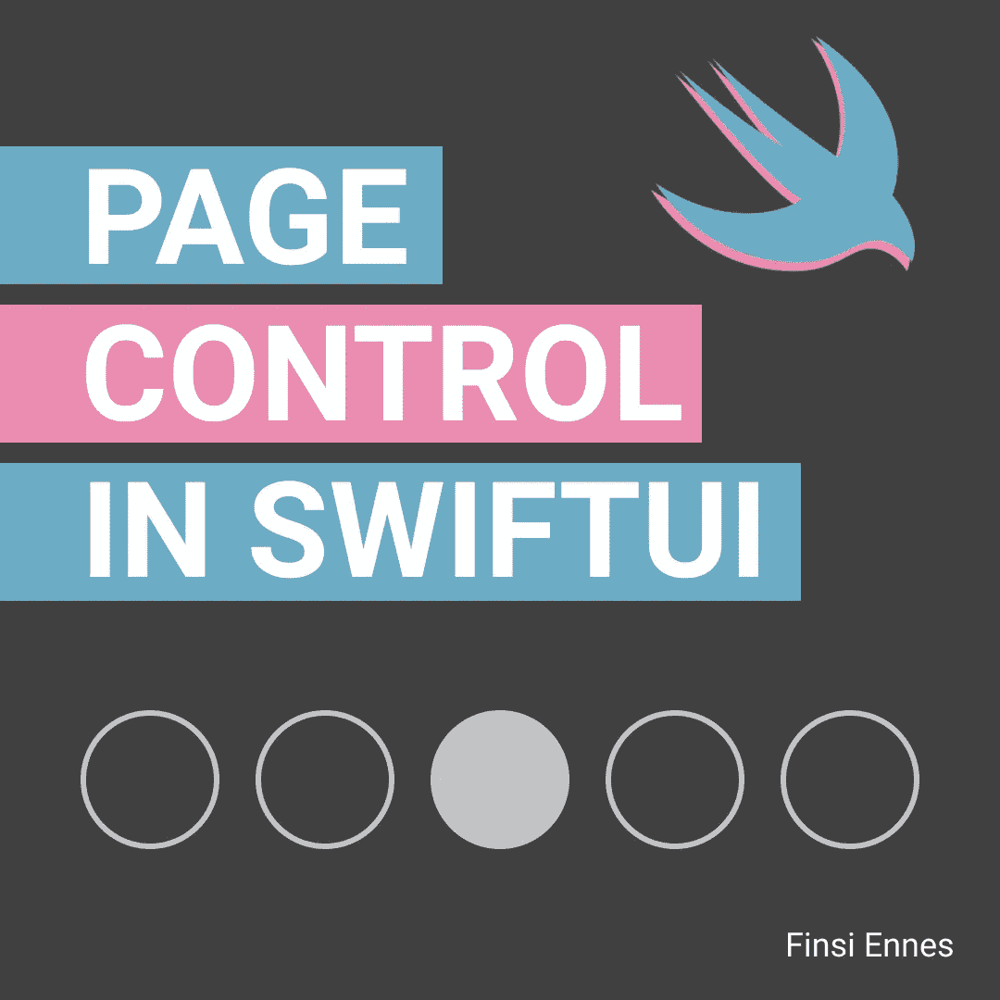
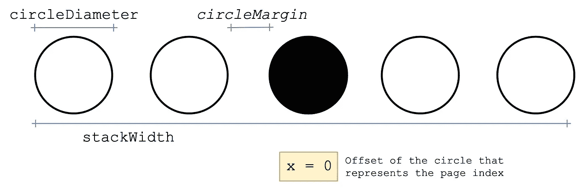
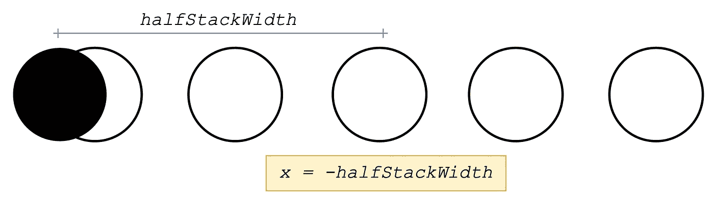
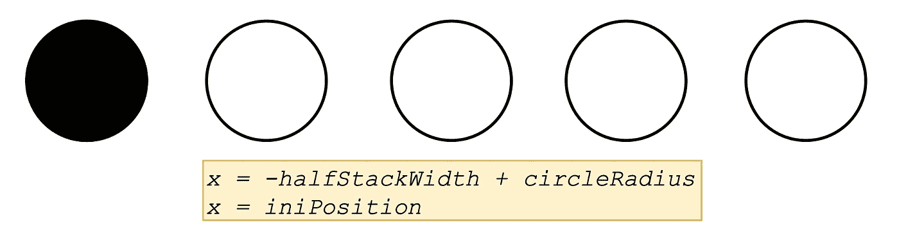
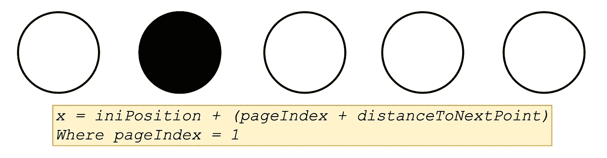
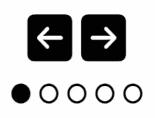

# 使用 SwiftUI 构建页面控件

> 原文：<https://levelup.gitconnected.com/build-a-page-control-using-swiftui-7e87c7be3028>

## 将 SwiftUI 与 Maths 结合起来，用几行代码构建一个页面控件



在本文中，您将学习构建一个非常常见的应用程序组件:页面控件。这将通过 SwiftUI 来实现。此外，我们将使用数学来提供一个简洁明了的解决方案。

让我们首先创建一个名为`PageControl`的新 SwiftUI 视图。我们希望组件尽可能具有动态性和可配置性，因此我们使用以下参数来定义视图方面:

当前选择的页面(`selectedPage`)将随着用户在页面中前进而改变。出于这个原因，我们用`@Binding`来包装它。请注意，总页数(`pages`)、圆直径和边距不应改变，因此我们在这些情况下不包括包装纸。

如果您不确定为什么这里需要这个包装器，我建议您查看以下关于 SwiftUI 中数据流的文章:

[](https://medium.com/swlh/data-flow-in-swiftui-getting-started-with-state-and-binding-da3ba97fb144) [## SwiftUI 中的数据流—状态和绑定入门

### 从头开始学习如何在 SwiftUI 中连接数据

medium.com](https://medium.com/swlh/data-flow-in-swiftui-getting-started-with-state-and-binding-da3ba97fb144) 

继续查看。我们可以很容易地创建一个页面控件组件，只需使用如下的`Circle`形状:

正如你所看到的，我们使用`circleDiameter`来设置圆圈的框架。填充的那个代表当前页面索引。为了显示这组页面，我们使用了一个带有笔画圆的`ForEach`循环。

现在，我们预览此视图，如下所示:

结果将如下所示:


页面控制预览

此时，代表当前页面索引的圆居中。如果我们想要一个页面控制功能，那么我们就必须改变它的位置。为此，我们将使用数学。

基本上，我们要计算第一个圆的位置和它们之间的距离。知道了这一点，我们就可以很容易地使用以下方法获得页面索引位置:

*   *索引位置=初始位置+(距离下一点* ✕ *页面索引)*

为了计算初始位置，首先我们需要堆栈的总宽度。为此，我们将使用圆圈的数据，如:



```
**let** stackWidth = circleDiameter * CGFloat(pages) 
                 + circleMargin * CGFloat(pages - 1)
```

我们之前说过，当前页面索引居中。所以如果我们把它的位置延迟一段相当于一半`stackWidth`的距离，那么它就会被放在栈的开头。类似于:



现在，使用圆的半径，我们可以把它放在想要的位置。因此，我们可以将其定义为初始点位置。这是:



```
**let** halfStackWidth = stackWidth / 2**let** iniPosition = -halfStackWidth + circleRadius
```

注意 d*istancenext point*是直径和边缘圆的总和；

```
**let** distanceToNextPoint = circleDiameter + circleMargin
```

有了所有这些信息和`pageIndex`，我们可以得到当前圆的位置:



我们将把所有这些计算设置为私有计算属性:

回到视图，我们只需要给页面索引圈添加一些修饰符。它将根据那个`currentPosition`属性改变它的`x`位置。此外，我们将添加一个动画块:

```
.offset(x: currentPosition).animation(.linear(duration: 0.3))
```

综上所述，最终结果如下:



你可以在我的[库](https://github.com/KeatoonMask/SwiftUI-Animation/blob/master/SwiftUI-Animation/Animations/PageControl/PageControl.swift)上找到完整的代码。

如果您对这些内容感兴趣，并希望看到更多内容，您可以开始该项目或在 Instagram 中关注我:

*   【https://github.com/KeatoonMask/SwiftUI-Animation 
*   [https://www.instagram.com/finsi.code](https://www.instagram.com/finsi.code)

感谢您的阅读，下次再见😁