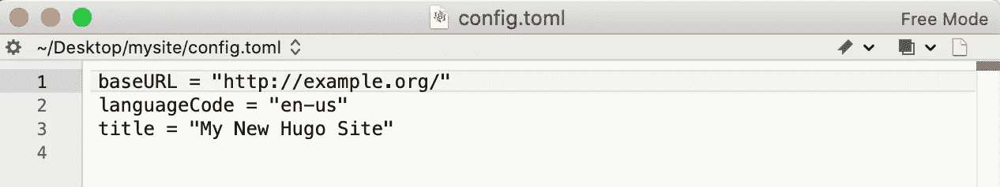

# 用 Github Pages 和 Hugo 建立一个个人网站

> 原文：<https://levelup.gitconnected.com/build-a-personal-website-with-github-pages-and-hugo-6c68592204c7>


个人网页是一个让世界了解你和展示你过去成就的完美地方。把你的简历，你的项目，你的博客放入一个个性化的主题，让人们知道你有很好的品味:一体化！这是你在网上展示的作品集，一个小而酷的项目，你可以毫不费力地完成，为什么不呢？

有了 Github Pages，我们可以托管一个个人网页，而不用费心去找域名，有了 Hugo，我们有了各种各样的主题可以选择。本教程使用 Mac OS，并将在终端中运行几个命令行:别担心，这绝对是初学者的教程！现在，让我们开始这个一步一步的教程来设置你的个人网页吧！

# 雨果和吉佩吉简介

Hugo 是最流行的开源静态站点生成器之一，是用 go 编写的。它简单、高效、易于扩展且部署快速。只需用 brew 安装，从 Github 或官网 [HUGO](https://gohugo.io/) 克隆你喜欢的主题，在配置文件中做一些修改并部署，你的页面就上线了。

[Github Pages](https://pages.github.com/) 是 Github 提供的静态 web 托管服务，提供 1GB 的免费空间，直接通过 Github 库提供便捷的部署。

该站点使用 Hugo 和 Github 页面来创建和部署。下面简单介绍一下部署流程。

# 第一步。装置

**安装 Hugo**

打开您的终端，逐一运行以下命令行:

```
brew install hugo
```

要检查您是否成功安装了 Hugo，请在您的终端中输入以下内容

```
hugo version
```

而当显示的版本如这张截图所示，成功！


**安装 Git**

Hugo 还建议安装 Git，要检查您的计算机上是否安装了 Git，请运行:

```
git --version
```

如果你已经安装了它，它会显示你的 git 版本，如果没有，它会提示你自动安装。

完成？让我们进入下一步！

# 第二步。在本地建立你的网站

现在，让我们首先在您的计算机上本地构建一个站点。

**设置站点**

第一步是转到您想要保存网站的目录，我想在我的桌面上创建我的网站，所以在终端中运行以下命令:

```
cd /Users/geyuanyuan1/Desktop
hugo new site mysite
```

然后，你会看到如下截图，一个名为“mysite”的文件夹已经在你的桌面上了！


文件夹结构将如下所示:


这些文件/文件夹是做什么用的？

我们将与之合作的是:

*   配置文件，我们稍后需要编辑它。
*   内容:存储网站的所有内容，包括你所有的博客帖子、简历等等，可以包括文件夹，但通常是所有的`.md`文件。
*   静态:存储静态文件，如你的背景图片，标志，css，js 等。该目录下的文件将被直接复制到该目录下`/public`。该文件夹的优先级高于主题下的`/static`文件夹。
*   主题:现在它是空的，但是以后会保存你选择的主题。

其他的，但是我们不会在本教程中使用它们:

*   原型:存储的`.md`模板文件，其优先级高于主题下的`/archetypes`文件夹。
*   数据:存储模板调用的数据文件
*   布局:存储`.html`模板，该文件夹比主题下的`/layouts`文件夹优先级高

此外，当您想要部署网站时，会创建一个“公共”文件夹:

*   public:执行`hugo`命令后，保存生成的静态文件

**选择一个主题**

从官网 [Hugo themes](https://themes.gohugo.io/) 或者从 Github(可以从人人库找到源主题)挑一个你喜欢的主题！

这里我使用了基于“casper”主题并由@ [vjeantet](https://github.com/vjeantet/hugo-theme-casper/commits?author=vjeantet) 编辑的主题。

在终端中运行以下命令行:

```
cd mysite
cd themes
git clone [https://github.com/vjeantet/hugo-theme-casper](https://github.com/vjeantet/hugo-theme-casper)
```

或者，一个简单的方法是下载整个存储库并替换“themes”文件夹！

**编辑配置文件**

现在让我们设置一些配置，打开“mysite”文件夹，用文本编辑器打开“config.toml”。

它现在只有以下三行:



别急，去你找到主题的地方找一些样本库，在这里我回到@ [vjeantet](https://github.com/vjeantet/hugo-theme-casper/commits?author=vjeantet) 的 sire 库 [vjeantet.fr](https://github.com/vjeantet/vjeantet.fr) 找到他的“config.toml”，把所有内容复制到我们的本地文件，做一些定制的编辑。

配置示例如下:

```
baseurl = "https://[your github username].github.io/"
languageCode = "en-us"
title = "the website title shown on the tab"
theme = "the same as theme name (exactly the folder name) in your themes folder"
paginate = 2
Copyright = "© Yuanyuan GE 2020"
canonifyurls = true[params]
description = "Enter your personal description"
authorlocation = "authorlocation"
cover = "images/cover.png"
## save the image you want to use as background picture in directory "./static/images"author = "author name"(delete this line when editing)
logo = "images/logo.png"
## save the image you want to use as website logo in directory "./static/images"(delete this line when editing)githubName = "your github name"
linkedinName = "your linkedin name"
email = "your email"
instagramName = "your ins name"
hideHUGOSupport = false[[menu.main]]  # here are the buttons on the menu
name = "Home" # Button will display as "Home"
weight = 100 # the weight decides the position of the button (higher or lower)
identifier = "home"
pre = "<br />"
url = "/"[[menu.main]]
name = "Contact"
weight = 0
identifier = "contact" # this button will refer to a markdown file named "contact" in the content folder
pre = "<br />"
url = "/contact"[[menu.main]]
name = "Blog"
identifier = "blog" # this page will refer to a markdown file named "blog" in the content folder
pre = "<br />"
url = "/post"
weight = 40[permalinks]
post = "/:slug/"​[sitemap]
ChangeFreq = ""
Filename = "sitemap.xml"
Priority = "-1"
```

请注意，图片目录和配置可能会因主题而异，请务必阅读您选择的主题的说明。

创建你的第一个博客

然后，您可以通过运行以下命令在内容文件夹中创建您的第一个降价文件:

```
cd mysite
hugo new about.md
```

或者，您可以在文本编辑器中编辑 markdown 文件，并将其保存到内容文件夹中！

您需要删除“draft=true”行，使其显示在您的网站上。

`about.md`的内容将在`http://localhost:1313/about` [可用。](http://localhost:1313/about.)

**本地测试站点**

运行命令:

```
cd mysite
hugo server
```

终端将显示如下指令:


在您的网络浏览器中进入 [http://localhost:1313/](http://localhost:1313/) ，页面就会显示出来！


(这里我没有把背景图片放入`./static/images`文件夹，所以全黑)

# 第三步。部署到 Git 页面

**获取** `**public**` **文件夹**中渲染的网站

在您的终端中，运行以下命令:

```
cd mysite #(note: here should be 'cd' + the full path to mysite)
hugo
```

然后你会看到一个`public`文件夹出现在`mysite`文件夹中，它包含了网页文件(可能包括。HTML，。css，。js 等。)是 Hugo 自动生成的。

创建你的 Github 库

为了发布带有链接`yourusername.github.io`的站点，您需要创建一个名为`<USERNAME>.github.io`的存储库。

1.  转到你的 Github 网页，点击“新建”创建一个新的资源库，包含你的 Hugo 网站的完整渲染版本。


2.然后不要用 README.md 启动，点击“创建存储库”。


**返回终端并提交**

1.  在终端中，转到`public`文件夹的目录，然后运行命令:

```
cd public
git init
git add .
git remote add origin [https://github.com/username/username.github.io.git](https://github.com/username/username.github.io.git)
git commit -m “first commit”
git push origin master
```

终端将显示屏幕截图所示的内容:


(可以直接添加`public`文件夹中的所有文件(只是文件而不是整个公共文件夹！)也通过 github 发送到存储库。)

去看看你的网站吧！

1.  成功提交后，转到您的存储库，点击右上角的“设置”，然后向下滚动到 Github 页面部分。

2.当您看到绿色框时，单击已发布的链接。


现在网站发布成功了！你也可以自定义你的背景图片，并在以后发布新的博客！


# 结束了

本教程到此为止，博客快乐！

如果你想了解更多关于 Hugo 或者 Github 的信息，可以参考官方网站: [HUGO](https://gohugo.io/) ， [Github Pages](https://pages.github.com/) 。

通过在 [Github](https://github.com/Yuanyuan229) 、 [Linkedin](https://www.linkedin.com/in/yyge/) 、 [Medium](https://medium.com/@yyge) 上关注我来了解我或我的项目，或者访问我的网站:https://Yuanyuan 229 . Github . io。