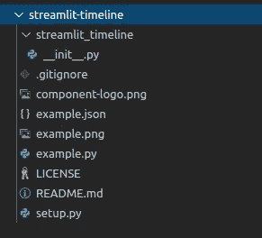
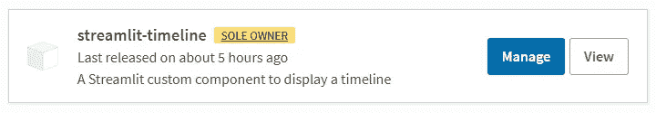
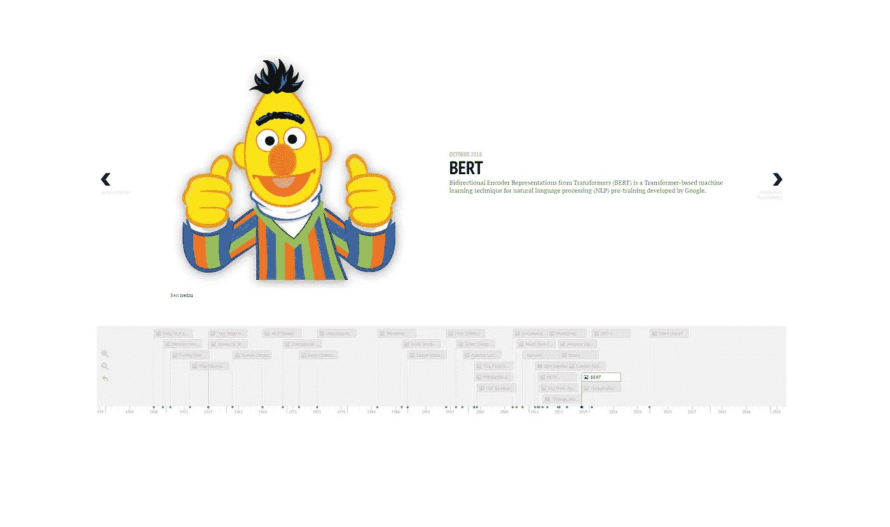

# 简化 it 的实用时间表

> 原文：<https://levelup.gitconnected.com/build-a-practical-timeline-in-streamlit-5b3603ade11c>

为 Streamlit 组件创建包所需的详细信息。一个时间线可视化的例子！

时间轴可视化预览

[Streamlit](https://www.streamlit.io/) 是一个 Python 库，让您可以快速构建和共享数据应用。您可以将数据脚本转换为可共享的 web 应用程序，无需任何前端体验。

[TimelineJS](https://timeline.knightlab.com/) 是一个开源的 JavaScript 工具，让任何人都可以构建视觉丰富的交互式时间线。这是西北大学奈特实验室的一个项目。

## 为什么？

通过将一个包装到另一个中，很容易为每个人创建一个时间表。Streamlit 为此专门开发了组件结构。JavaScript 和 HTML 代码可以打包成一个 Python
包，可以在任何 Streamlit 应用程序中轻松呈现。

## 了解时间线

TimelineJS 可以选择输入谷歌电子表格。为了能够编写动态创建或更新时间轴的代码，我们将把 JSON 加载到时间轴工具中。你必须遵循 [JSON 格式](https://timeline.knightlab.com/docs/json-format.html)。下面举个例子:

嵌入时间线需要包含的内容:

1.  加载时间轴 CSS 的链接标签。
2.  加载时间轴 javascript 的脚本标签。
3.  创建时间线的第二个脚本标记。这里包括了上面的 JSON 数据。还有一些额外的[配置选项](https://timeline.knightlab.com/docs/options.html)可供您使用。例如， *start_at_end* 来设置可视化的初始状态。

产生的 HTML 代码:

## 创建 Streamlit 组件

开发 Streamlit 组件[的第一步是决定是创建一个静态组件(即渲染一次，由 Python 控制)还是创建一个可以在 Python 和 JavaScript 之间来回通信的双向组件。](https://docs.streamlit.io/en/stable/develop_streamlit_components.html)

在这种情况下，它将是一个静态组件，从上面呈现 HTML 代码

## 构建 Python 包

首先整理你的文件。您可以查看[时间线包](https://github.com/innerdoc/streamlit-timeline)了解更多详情。你还必须在[pypi.org](https://pypi.org/)上创建一个账户。这是 Python 包索引(PyPi ),你可以在这里上传、管理、查找和安装你的包。

包文件夹结构

现在您已经准备好构建您的 python 包并将其上传到 PyPi:

PyPi 上的包

## 创建时间线

该软件包现已在 PyPi 上公开发布，任何人都可以安装:

您可以在您的 Streamlit-app 中使用该软件包:

您可以运行时间线应用程序:

[自然语言处理历史的演示时间线](https://www.innerdoc.com/nlp-timeline/)

参观[演示](https://www.innerdoc.com/nlp-timeline/)！

## 宣传你的作品

欢迎在 [LinkedIn](https://www.linkedin.com/in/robvanzoest/) 、 [Twitter/innerdoc_nlp](https://twitter.com/innerdoc_nlp) 上与我联系，或者在 Medium 上关注我。