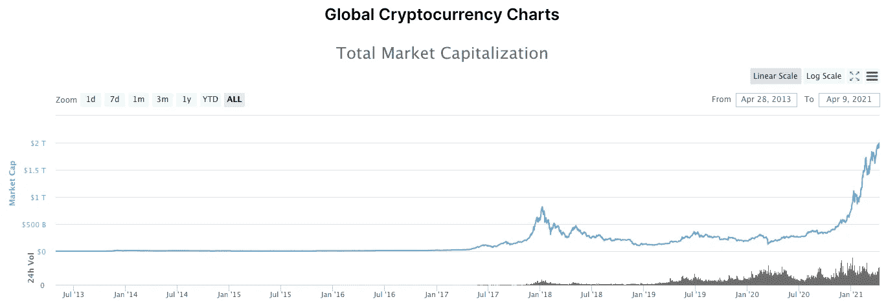
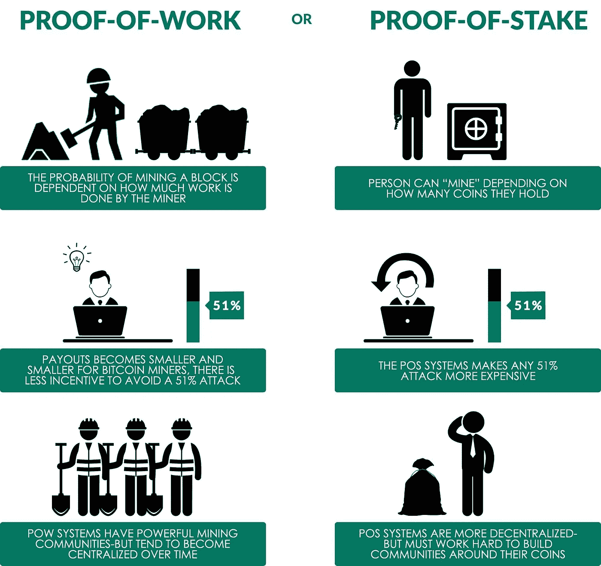
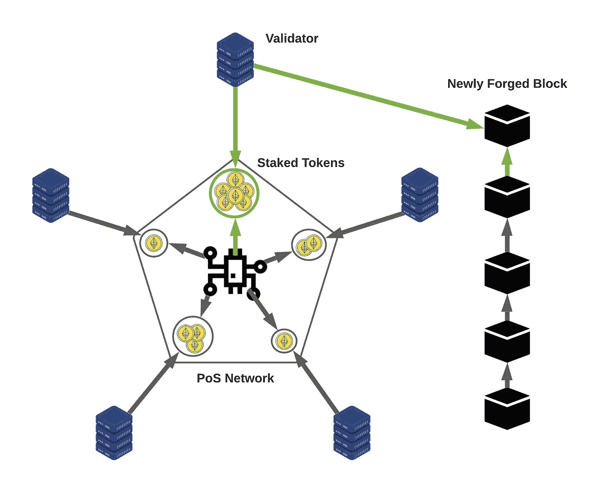
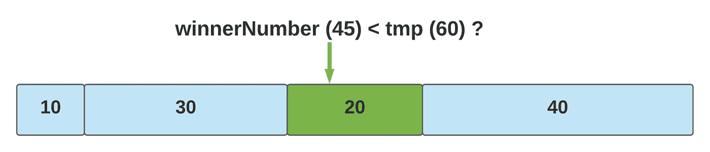

# 在 Go 中构建一个股权证明区块链

> 原文：<https://levelup.gitconnected.com/build-a-proof-of-stake-blockchain-in-go-a765cb217d35>

## 一项正在兴起的区块链技术。


到 2021 年，区块链的领域将继续爆发。加密货币的指数级增长只有在私人和公共应用中采用区块链解决方案才能与之匹敌。市场分析预测**全球区块链市场规模将从 2020 年的 30 亿美元激增至 2025 年的 397 亿美元**，2020–2025 年期间的有效复合年增长率(CAGR)为 **67.3%。**

提醒你一下，这个增长率是包含整个市场的平均值。想象一下这个领域的真正赢家会有怎样的表现。

此外，67%的 CAGR 不考虑**加密货币** **空间**的巨大收益，全球市值**2 万亿美元，并且还在增长。**



来自 [CoinMarketCap](https://coinmarketcap.com/charts/)

想象一下，如果你在 2020 年 1 月至 7 月的交易量增加期间买入。问题是，这显然是可能的，但你需要了解市场和它的发展方向。

> *随着区块链给世界市场带来的变革，* ***在做出未来预测之前，了解基本面是至关重要的。*** *在本文中，我们将探讨 Stake Proof 的基本原理，这是一种区块链协议，类似于在区块链中锻造新区块的抽奖方法。*

本文的主要目标如下:

1.  了解区块链领域的当前绩效趋势(完成)。
2.  通过 GoLang 中的一个工作示例了解利害关系的证明。
3.  提高你的计算机科学和编程技能。

这对霍德勒和地鼠来说都是一个有趣的游戏，让我们来编码吧！

# 理解利害关系的证据

我们将保持这一部分的简短，因为利益证明(PoS)的基本原理实际上相当简单。当然，这个系统的核心部分是区块链本身。简单地说，**区块链**是一个**不可变的分类帐**，其中**每个单独的块都是从它之前的块加密构建的。你永远不能改变区块链的任何部分，因为每个连接到网络的人都会很容易看到这些变化，并反驳你的区块链版本。**

创建新块的过程是由你的区块链协议定义的 T2。比特币建立在工作证明(PoW)协议的基础上，需要越来越多的计算能力来通过数学过程验证之前的交易。每次你验证一个区块内包含的交易列表，你就会获得比特币形式的奖励。

因此，你交易历史的证据就是你投入的工作量——完成这项工作的人被称为“矿工”。随着时间的推移，解决这些数学难题需要巨大的计算能力,这是 PoW 日益增长的一个**问题。不仅如此，如果任何一个实体获得了超过 51%的计算能力，他们理论上可以将区块链发散为他们想要的任何形式(这被称为 **51%攻击**)。**

**股权证明是根本不同的。**不是验证和扩展区块链的计算能力，而是在区块链网络上“下注”一定数量的代币(不一定是加密货币)。这通常是通过创建你自己的“节点”来实现的，这有助于你加入区块链生态系统。节点可以是您自己的计算机，也可以是计算机网络。



功率与位置

这里细节并不重要，核心思想是，如果你的节点在做**诚实的工作**，你将有**更高的机会**在区块链**铸造一个新的区块**并且**除了你原来的股份之外还会得到奖励**。被选中伪造下一个区块的概率也随着你在网络上下注的代币数量成比例增加。



用 LucidChart 做的

然而，如果你做了**不诚实的行为**，你的股份可能会被**处罚**甚至完全收回。这种**奖励**和**惩罚**的方法意在**促进区块链的诚实工作**而没有与工作证明相关的计算可伸缩性瓶颈。

现在我们已经有了 PoS 与 power 的概念，让我们继续在 Go 中编写一个工作的 PoS 示例。

# 围棋股份证明

让我们面对它，如果我已经建立了一个生产级的股权区块链证明，我不认为一个博客帖子足以解释它。这将是一个**简单**但**功能**的扩展示例，我希望你会像我在构建它时一样喜欢它。也就是说，这里仍然有相当多的复杂性，所以我们要一点一点来。如果你成功了，我相信你能创造出你自己的 PoS 区块链的新版本，可能比我的更好！:-)

## 导入“区块链”

首先，除了定义我们的自定义对象类型之外，我们需要在项目中包含一些 Go 包。这里是你需要的包——我们将使用`math/rand`、`crypto/sha256`和`encoding/hex`来实现我们的加密区块链方法。当然，`errors`是围棋里的标配！

接下来是我们的定制数据类型。Go 通过使用`structs`让这变得超级简单。这里我们有三个自定义的`types`，第一个是`PoSNetwork`，这里我们有一个`Blockchain`字段，它是一个*引用*到`Block` `struct`实例的数组。我们将通过`BlockchainHead`字段跟踪最近添加的块，我们还将有一个数组*引用*到`Node` `struct`来充当`Validators`。

`Node`结构将有一个 Stake 字段，表示它添加到网络中的令牌数量。该地址将是一个随机生成的字符串，以便我们可以跟踪哪个节点成功验证了下一个块。

最后，`Block` `struct`将包含我们需要的信息，以便**跟踪我们的区块链**。我们将有一个`Timestamp`用于表示块何时被创建，一个来自前一个块的前一个散列，`Hash`表示它自己，以及验证这个块的`Node`的地址——都是类型`string`。

## 一砖一瓦地建造区块链

这是我们建立区块链的第一个方法——让我们来分解它。首先在我们的函数签名中，我们将该方法附加到`PoSNetwork` `struct`上，并将该结构引用为`n`。然后，我们把对一个`Node`的引用作为唯一的参数。我们将返回一个新的`Block`引用数组来表示新的`Blockchain`，一个对成为新的`BlockchainHead`的`Block`的引用，以及一个可能的`error`(如果事情变得棘手的话)。

你会注意到，在我们试图添加任何东西之前，我们立即调用了方法`ValidateBlockchain()`。我们稍后将进行验证，但只要知道如果我们发现我们的区块链被更改，**有处罚一个** `Node` **的逻辑。**

在检查我们的`Blockchain`是否完好后，我们得到系统的当前时间，并在实例化一个新的`Block`时将其存储为`Timestamp`。我们还附上了之前散列的`Hash`，由于有了`BlockchainHead`，我们可以很容易地访问它。然后我们将调用`BlockchainHead`上的方法`NewBlockHash()`，并将输入`Node`的地址指定为我们的验证器地址。

一旦新`Block`的字段被填充，我们就调用新`Block`上的`ValidateBlockCandidate()`并查看是否有任何`errors`。如果有，我们惩罚罪犯`Node`并返回一个`error`。如果一切顺利，我们将新的块添加到我们的`Blockchain`中。如果我们没有捕捉到一个`error`，那么第 22 行的 return 语句就是一个默认值。

但是你会问`NewBlockHash()`是如何工作的？谢天谢地，这里没发生什么事情。我们有两个函数来完成为每个`Block`创建一个唯一的`Hash`的任务。函数`NewBlockHash()`简单地获取`Block`的所有信息，并将其连接成一个字符串传递给`newHash()`。

接下来，`newHash()`将利用`crypto/sha256`包创建一个新的 SHA256 对象，存储为`h`。然后，我们将输入字符串`s`转换成一个字节数组，并将其写入`h`。最后，我们调用`h.Sum()`将`h`转换成我们可以调用`hex.EncodeToString()`的格式，这样我们就有一个`string`作为我们的最终输出。

还在跟踪我？很好！

## 验证我们的区块链

如果你不能证实，区块链是没有用的。这里我们将`ValidateBlockchain()`方法附加到我们的`PoSNetwork` `struct`并返回一个可能的`error`。如果区块链是空的或者只有一个块，我们没有办法确保它是正确的，所以我们只为`error`返回`nil`。

接下来，我们评估区块链中每对积木之间的**三个独立条件**。首先检查前一个`Block`的`Hash`是否等于当前`Block`为其前一个`Hash`存储的数据。

我们还检查在任何一点上先前的`Block’s` `Timestamp`是否比当前的`Block`新。如果现在的`Block`是 2020 年做的，而之前的`Block`是 2021 年做的，你就知道不对劲了。

最后我们检查一下，如果我们直接计算前一个`Block`的`Hash`，我们仍然得到当前`Block`的`Hash`。如果这些条件中的任何一个成立，那么我们返回一个`error`，因为我们的区块链处于被篡改的状态。

既然我们已经验证了整个区块链，**我们需要确保下一个要添加的块也是有效的**。这遵循与上面相同的条件检查，只是针对要添加的单个新块。

## 获胜者，象征性晚餐

好了，现在我们已经完成了向区块链添加新块以及验证其正确性的步骤。那么，我们如何决定何时添加新块呢？这就是我们的验证器发挥作用的地方。对于在网络中有股份的每个节点，我们将通过抽奖方法随机选择一个节点来伪造我们的区块链中的下一个块并获得奖励。

但是首先，我们首先需要一个`Node`。为了给我们的`PoSNetwork`添加一个新的`Node`，我们调用`NewNode()`，它接受`Node`的初始股份并返回一个新的`Node`引用数组。这里没有什么特别的，我们只是添加到我们的`n.Validators`数组，并调用`randAddress()`为新的`Node`生成一个唯一的地址。

那么，我们实际上如何挑选一个赢家呢？**用一点概率统计！**在`SelectWinner()`方法中，我们首先通过在`n.Validators`范围内进行测距，找到网络内持有的总股份。我们还将任何 stake 大于零的节点添加到数组`winnerPool`中以供选择。

如果我们发现`winnerPool`是空的，我们返回一个`error`。没有人喜欢一个破产的赌徒。然后，我们使用`Intn()`方法选择一个中奖号码，该方法将在 0 和我们的总赌注之间选择一个随机数。

最后一部分是概率发挥作用的地方。为了保持每个节点都有与其在网络中的总`Stake`成比例的获胜机会，我们递增地将当前`Node`的`Stake`添加到`tmp`变量中。如果在任何时候中奖号码小于`tmp`，则`Node`将被选为我们的赢家。

那是怎么回事？嗯，也不是太复杂。假设中奖号码是 45，我们有四个节点，分别标有 10、30、20 和 40 个代币。如果我们跟踪节点的累积值，并比较中奖号码是否小于该累积值，我们将会把中奖概率分配到成比例的“桶”中。



用 LucidChart 做的

看上面的图片，随机中奖号码落在前 10 个令牌桶中的概率有多大？嗯，10/(10+30+20+40) = 10/100 = 10%。是成比例的！具有累加和`tmp`的 for 循环只允许每个节点的赌注分散到桶中。你的赌注越大，你的桶就越大，因此你赢得和铸造新积木的几率就越大。

## 将这一切结合在一起

我们现在所需要的是将我们的函数和数据类型结合在一起。我们在我们的`main()`函数中做了所有好的事情。第一步是设置一个随机种子，将当前时间作为我们的输入。不要使用时间作为随机种子的输入，因为它实际上会在解码您的哈希输出时引入安全漏洞。在本例中，我们需要用 Genesis 区块(也称为区块链的第一个区块)实例化一个新的股权证明网络。一旦我们这样做了，我们也设置网络的 BlockchainHead 等于第一个块。

然后，我们向网络中添加两个`Nodes`作为验证器，用 60 和 40 个令牌作为它们的初始`Stake`。在五次迭代中，我们将为我们的`Blockchain`选择一个新的获胜者，如果有任何错误，我们的程序就会崩溃——因为原型制作。我们通过新选择的获胜者来生成一个新的`Block`，并打印出每一轮每一个`Node`的总数`Stake`。

想知道为什么我有所有这些函数的返回类型，而不是直接把它们添加到 PoSNetwork 结构中吗？好吧，Go 不喜欢你这样做——所以你实际上必须将新构造的数组或对象返回到初始函数调用中。我希望有更好的解决办法。

在这一切结束时，我们将打印出我们新制作的区块链。下面是一个运行示例:

```
$ go run main.go 
Round  0
        Address: f8d44bb083078de97b8428f4f9548130 -Stake: 70
        Address: de6ae18584f02b3388569191a04a4b4a -Stake: 40
Round  1
        Address: f8d44bb083078de97b8428f4f9548130 -Stake: 70
        Address: de6ae18584f02b3388569191a04a4b4a -Stake: 50
Round  2
        Address: f8d44bb083078de97b8428f4f9548130 -Stake: 80
        Address: de6ae18584f02b3388569191a04a4b4a -Stake: 50
Round  3
        Address: f8d44bb083078de97b8428f4f9548130 -Stake: 90
        Address: de6ae18584f02b3388569191a04a4b4a -Stake: 50
Round  4
        Address: f8d44bb083078de97b8428f4f9548130 -Stake: 100
        Address: de6ae18584f02b3388569191a04a4b4a -Stake: 50
Block 0 Info:
        Timestamp: 2021-04-12 MDT m=+0.000120025
        Previous Hash: 
        Hash: c5d04de14efed52ce84889c6382f9d307d5b98093d93a84b419478
        Validator Address: 
Block 1 Info:
        Timestamp: 2021-04-12 MDT m=+0.000277288
        Previous Hash: c5d04de14efed52ce84889c6382f9d307d5b98093d93a
        Hash: d58e90a75b71ac62ef938fc0148314a7f864ad50bd702f959e2d27
        Validator Address: f8d44bb083078de97b8428f4f9548130
Block 2 Info:
        Timestamp: 2021-04-12 MDT m=+0.000306562
        Previous Hash: d58e90a75b71ac62ef938fc0148314a7f864ad50bd702
        Hash: e6bfdd6c2c869607e2d9a81b84ddf4478756fedff78a03746cde11
        Validator Address: de6ae18584f02b3388569191a04a4b4a
Block 3 Info:
        Timestamp: 2021-04-12 MDT m=+0.000321755
        Previous Hash: e6bfdd6c2c869607e2d9a81b84ddf4478756fedff78a0
        Hash: 8e3dbacc4a610b1665658bc9e7238963eda0d5bbbf3ce809e8fa6e
        Validator Address: f8d44bb083078de97b8428f4f9548130
Block 4 Info:
        Timestamp: 2021-04-12 MDT m=+0.000333024
        Previous Hash: 8e3dbacc4a610b1665658bc9e7238963eda0d5bbbf3ce
        Hash: 22760f8deb96c354a4050a3c48741be062bccfa9c51571c170065a
        Validator Address: f8d44bb083078de97b8428f4f9548130
Block 5 Info:
        Timestamp: 2021-04-12 MDT m=+0.000347521
        Previous Hash: 22760f8deb96c354a4050a3c48741be062bccfa9c5157
        Hash: d2a5047f7d8a7696c1d0fb9ec49b56d2e71bbcedaaebc83a18b7a5
        Validator Address: f8d44bb083078de97b8428f4f9548130
```

# 下一步是什么

我已经听出来了，你的例子不是分散的！这是弱验证！什么事都要自己做！等等等等。听着，如果你在这个例子中看到你认为可以做得更好的东西——就去做。当你建立了一个比现在更好更酷的区块链，写一篇文章告诉我吧！如果你能找到改进这个例子的方法，同时将知识分享给社区，我认为这是一件好事。

如果你想知道在这个例子的基础上下一步可以做什么，我有消息告诉你。以下是一些想法的简短列表:

*   测试——你会注意到我没有包括任何测试，这在现代软件工程中是一种亵渎！编写一些基本的单元测试，并确保我的例子至少通过其中的一些测试。
*   并发性(Concurrency)—这些都在一个线程中运行，这在现实世界中永远不会发生。尝试为主线程托管单个 TCP 服务器，并让连接节点同时尝试添加到区块链。
*   **去中心化**——你能制造一个不在单台计算机上运行的 PoS 机，并推广为网络所有吗？
*   **重构** —这段代码可以简单地进行一些清理，使其更加高效、优雅和简洁。试着做一个比我的更容易理解的例子吧！
*   **加权** —如果单个节点开始以巨大的股份控制网络会怎样？你能指数平均权重吗，或者有更好的选择吗？
*   **令牌化** —如何让交易在这个网络上运行？新积木的象征性奖励如何随时间减少以防止通货膨胀？

无论你做什么，我希望这篇文章教会你一些新的东西，无论是关于区块链、围棋，还是只是一些编程的乐趣。无论你对这篇文章有什么想法，我都希望在下面的评论中听到它们！感谢阅读。