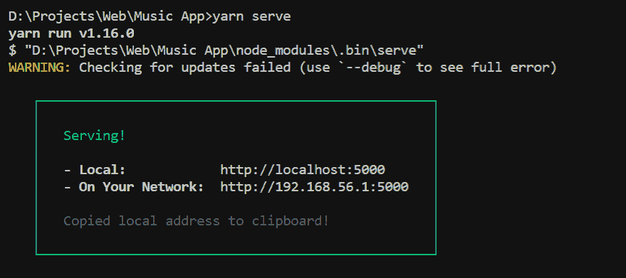

# 仅使用普通 JavaScript 构建 PWA

> 原文：<https://levelup.gitconnected.com/build-a-pwa-using-only-vanilla-javascript-bdf1eee6f37a>


# 渐进式网络应用程序(PWA)

“渐进式 web 应用程序(PWA)是一种使用现代 web 功能向用户提供类似本地应用程序的体验的 Web 应用程序。这些应用程序满足某些要求(见下文)，部署到服务器上，可通过网址访问，并被搜索引擎编入索引。”

渐进式网络应用程序(PWA)的工作方式与任何其他普通应用程序一样，但增加了许多功能，减少了许多麻烦。它们快速、可靠，并且可以在离线环境下完美地工作。


# 为什么要用？

渐进式网络应用程序(PWAs)为用户创造了丰富的体验，因为他们:

*   **反应灵敏**

PWA 可以安装在桌面浏览器、移动电话或电视屏幕上——任何支持互联网连接和浏览器支持的产品。

*   **可靠**

它使用了一种叫做**服务工作者**的技术，使用户能够在他们的环境中立即加载 PWAs。PWA 可以为应用程序提供离线支持，用户不会面临网络相关的问题。

*   **没有应用商店/游戏商店**

用户不需要访问应用程序商店来下载这些渐进式网络应用程序。它们可以立即直接从浏览器安装。不需要等待时间，因为他们非常快，并给一个像模拟本地应用程序。

*   **吸引开发者和用户**

开发人员还可以在清单文件中添加大量功能。最广为人知的功能之一是通过 PWA 启用的推送通知重新吸引用户。

*   **轻松分享**

渐进式网络应用程序非常容易与你的朋友或同事分享。用户需要分享的只是网站/应用程序的 URL。用户不需要共享一个可安装的 apk，也不需要经历验证过程，然后下载大量文件。用户所需要的只是简单的点击。

*要了解更多关于渐进式网络应用的信息，请访问谷歌开发者的* [*链接*](https://developers.google.com/web/progressive-web-apps/)


# 创建基本 PWA

在本教程中，我们将只使用普通的 JavaScript 来构建一个 PWA，但要做到这一点，我们需要先创建一个普通的 Web 应用程序。

在继续下一步之前，让我们看看我们最终的用户界面会是什么样子，以及我们试图实现的功能。

# 最终项目用户界面


最终项目用户界面概述

UI 中间会显示彩色的方框，点击方框会播放音乐短片。

同样，每个盒子产生不同的音乐片段。这个网站的概念是混合不同的音乐，并创造你自己的音乐。

# GitHub 知识库

所有与这个项目相关的文件都在这里:【https://github.com/S-ayanide/MixCentro】

*在本教程中，您需要下载 GitHub repo 中提供的某些资源。如果你想创建、更改或修改某个东西，我建议你在完成本教程后就这么做。*

# *Web 应用程序 HTML*

*这个项目的 HTML 将非常简单。我们将需要显示的个人彩色垫和每一个音频部门。*

*让我们来看看这段代码:*

*我们在这里所做的就是将我们的标题和页眉命名为 MixCentro，因为这是我们为这个网站选择的名称(你可以随意选择)。*

*你将需要声音来完成这个项目，从上面提到的包含所有声音文件的 [GitHub 库](https://github.com/S-ayanide/MixCentro)下载。*

*我们已经创建了一个主分区“ **pads** ”，它包含“ **pad-top** ”和“ **pad-bottom** ”，这两个分区除了创建我们在 UI 中看到的 pads 之外什么也不做，被分成两个部分，每个部分包含 3 个 pads。*

*顶部焊盘称为“ **pad-top** ”，有三个焊盘组成不同的音频。类似地，底部焊盘划分被称为“焊盘底部”，也由三个焊盘组成。*

*虽然已经导入了 **style.css** 和 **index.js** ，但是我们现在还没有使用它们。*

# *Web 应用 CSS*

*现在我们可以在目录的根目录下构建一个样式表。我把它叫做`style.css`。*

*默认情况下，我们在屏幕的两边有空白和填充，在我们的例子中，我们不希望发生这种情况。因此，让我们手动删除默认情况下添加的任何填充和边距。*

*由于我们已经在 HTML 文件中添加了标题，而且它也没有背景，我们需要使我们的网站看起来有吸引力和微妙的。要做到这一点，让我们升级字体的样式，通过添加一个与主题相匹配的背景来使它看起来更好。*

*在上面提到的 GitHub 库中，你可以在路径`images/bg/background.jpg`中找到已经存在的图像，这与 UI 预览中使用的图像相同。*

# *导入 Google 字体*

*为了更进一步，我们需要为我们的网站选择一个漂亮和微妙的字体。为了从各种各样的字体中进行选择，我们将使用[谷歌字体](https://fonts.google.com/)。*

*这可能需要一段时间，因为每个人的选择和口味都不同。选择一种字体，然后单击所选字体右上角的“+”按钮。*

**

*一旦你点击它，你会发现屏幕上出现一个黑色的条，上面写着“ **1 家族被选中**”，点击该条，它会展开并让你看到类似这样的内容。*

*细节可能会有一点不同，因为这取决于你选择的字体，但其余的保持不变。我们将在这里使用导入字体的标准方式，所以让我们继续复制灰色框中提供的整个`**<link href … >**`。*

*要使用有效的字体，打开你的`index.html`文件，将这个链接粘贴到`<head>`标签之间的任何地方。*

*添加字体*

# *更多造型*

*导入我们的字体后，是时候在主浏览器上也反映出来了*

*CSS 样式*

*在我的例子中，我使用了字体系列“Lexend Exa ”,还添加了前面提到的背景图片。为了保持一个连续的、均匀间隔的布局，我们使用了一个 flexbox，其内容与属性之间的空间对齐。*

*我们还保留了一个名为“pads”的类，它的宽度为 60%,所以它只占屏幕的一半多一点，这使得它不会太大，同时也保持了紧凑和柔和的外观。*

*“顶部焊盘”和“底部焊盘”类中的分割已经被定位，以便它们增长到其潜在的宽度和高度，并且还保持 flex 属性等于 1，以便它们突出到前面。*

*我们最后为所有的面板分配不同的十六进制颜色。*

# *添加媒体查询*

*最后，我们添加了媒体查询来控制应用程序的响应特性。*

*在这个简单的代码中，我们只控制字体的大小，如果屏幕尺寸下降到 480 像素以下，我们会缩小字体的大小，并且在底部添加一些边距以使它看起来更好。*

**

*构建移动兼容的 it*

**

# *添加普通的 JavaScript 功能*

*在这一点上，我们已经设置好了很棒的 UI，但是当点击它们时，pad 不会发出任何声音。这是为什么呢？*

*我们的部门在这一点上已经有了音频，但是为了在用户点击时播放特定的声音，我们调用了一个`play()`函数。这就是 JavaScript 的用武之地。*

*我们的基本 JavaScript 代码非常简单，只有 11 行代码。*

*收集声音和衬垫*

*In‌ ‌the‌ ‌beginning，我们通过存储整个查询来收集声音和衬垫，查询的目标分别是 HTML 类`**.sounds**`和`**.pads**`，并将它们存储到变量中。*

*但是我们希望在窗口首次加载时执行这个操作，因此我们将所有内容都包装在一个`**window.addEventListener(‘load’)**`中。*

*接下来，我们添加一个`forEach`，它循环遍历所有的 pad 分区。它有两个参数:一个是 pad，每次循环时它都将自己初始化为每个单独的 pad，另一个是 index，播放特定 pad 的声音时需要它。*

*在`play()`功能的帮助下，我们利用上述声音变量中的声音来播放与单个面板相关的文件。*

*我们使用类似于`currentTime = 0`的东西。我们这样做的原因是，每次播放一个面板时，我们都会将时间重新初始化为零，这样我们就可以在多次点击同一个面板时多次播放一个面板。*

****祝贺你，你已经用普通的 JavaScript 构建了一个 Web 应用。您可以试用它，甚至将其部署到网上供他人使用。但是等等！我们仍然需要将这个 Web 应用程序转换成一个渐进式的应用程序。让我们开始吧。****

**

# *什么是 Web 应用程序清单？*

*Web 应用清单是一个简单的 JSON 文件，它包含渐进式 Web 应用的详细信息，并告诉浏览器当它安装在用户的设备上时应该如何运行。*

*清单可以包含应用程序名称(全称和简称)、应用程序图标、应用程序启动后将打开的 URL、控制主题颜色等信息。*

# *构建清单文件*

*创建渐进式 Web 应用程序清单文件是必不可少的，因为它在用户设备上安装时控制浏览器的行为。*

**

*清单文件*

*要创建您自己的 Web 应用程序清单，您可以创建一个新文件，将其命名为`manifest.json`，并以 JSON 格式添加更多细节。然而，有一种更好的方法，那就是使用已经在网上提供给我们的工具。*

# *在线生成清单*

*在这个时代，互联网已经为我们提供了许多节省时间的选项，当我们创建一个`manifest.json`文件时，这些选项又一次派上了用场。*

*不用以 JSON 格式键入整个键值对，只需导航到这个网站:[https://app-manifest.firebaseapp.com/](https://app-manifest.firebaseapp.com/)*

*这是一个 Web 应用程序清单生成器，它只需要您填写某些输入字段，它会自动为您生成清单。*

*填写输入字段时需要考虑的事项:*

*   *给你的应用程序起一个全名和一个短名。*
*   *主题颜色和背景颜色很重要，因为它可以修改普通 Web 应用程序的浏览器版本，并为其提供更多活力。*
*   *将显示模式更改为`‘standalone’`。*
*   *暂时去掉“应用范围”。*
*   *将起始 URL 的值设为`‘.’`,因为我们想要在根目录下创建 PWA。*
*   *在右手边，你会看到一个名为“图标”的按钮。选择一张图片作为你的应用图标，然后简单地拖放/上传到这里。*

****注意:请确保您的图标大小不超过 512x512 分辨率，因为图标经过缩放以适应不同的设备。****

*所有这些工作完成后，点击**生成。将 ZIP 文件的所有内容解压到你的项目文件夹中。***

*此时，您已经在项目中添加了清单文件，但是没有使用它。为了在您的项目中真实地反映清单文件，在`**<head>**`标记之间的`**index.html**`文件中添加一个到它的链接。*

```
*<head>
   <link rel=”manifest” href=”manifest.json”>
</head>*
```

**！现在，项目中已经有了现成的清单文件。**

****

**现在我们将使用 Yarn 添加新的依赖项。**

# **什么是纱线？**

**Yarn 是一个新的包管理器，它取代了 NPM 客户端或其他包管理器的现有工作流，同时与 NPM 注册中心保持兼容。软件包管理器的作用是安装一些为特定目的服务的软件包。**

# **使用纱线的优势**

**当然，还有其他的包管理器，但是对于这个项目，我们将使用 Yarn，原因如下:**

*   **包下载只发生一次，即不需要第二次下载。**
*   **这样更安全。**
*   **使用锁定依赖项的锁定格式，确保两个系统在相同的包/依赖项上工作。**

# **在系统中安装纱线**

**在你的系统中安装 yarn 非常简单。您只需访问[https://yarnpkg.com/lang/en/](https://yarnpkg.com/lang/en/)，点击**安装纱线**、**、**，下载将自动开始。**

****

**只需遵循正常的设置程序，Yarn 安装将在您的系统中开始，并且路径也将在您的环境变量中自动修改。**

**此方法的另一种替代方法是使用 **npm** ，这也很简单。如果您已经在使用 **npm** ，那么只需打开一个终端并键入:**

****

**要检查 yarn 安装在您的系统中是否成功，请打开终端并键入:**

****

**如果您得到类似于 **1.16.0** 或任何类似的响应，这意味着 Yarn 已经成功安装，您可以开始工作了。**

# **初始化纱线项目**

**要创建一个新的 yarn 项目，第一步是在终端中导航到您的项目文件夹，并键入以下命令:**

****

**一旦你在终端中输入`**yarn init**`，你会收到很多问题。当您回答这些问题时，响应将存储在一个保存所有信息的`**package.json**`文件中。**

**首先，会问你一个名字。在这里输入你想要保留的项目名称。至于其他字段，如果您愿意，可以保留为空或键入您自己的规范。**

**不应该跳过的一个非常重要的问题是**入口点**。它决定了我们项目的入口点应该在哪里。将其初始化为我们之前创建的 **index.js** 。**

**一旦你完成这一步，你会发现你的项目中填充了许多新的文件夹和文件。如果是这样的话，拍拍你的背，因为你已经成功初始化了你的第一个 yarn 项目。**

*****注意:yarn init 应该在导航到项目文件夹后完成，以便 index.js 可以作为入口点*****

# **安装名为 Serve 的软件包**

**因为渐进式 Web 应用程序(PWA)需要一个活动的服务器来运行，所以我们至少需要一个本地主机来测试我们的应用程序。所以，我们需要安装一个名为`**serve**`的包。**

**`**serve**`当我们想使用服务器测试静态站点时，效果最好。我们可以检查它在 localhost 中是如何运行的，然后再将其推入部署中。**

**要在你的项目中安装`**serve**`,我们只需在终端中输入以下内容(导航到你的项目文件夹后):**

****

**这将把依赖项添加到您的项目中，您可以在`**package.json**`文件中查看它。**

**为了在本地服务器上运行您的静态页面，我们需要首先使用这个依赖项来启动服务器。要启动服务器，在您的终端中键入`**yarn serve**` 。**

****

**在您的案例中，您将会看到类似的内容，为您提供关于本地主机和网络地址的详细信息。您可以打开它们中的任何一个来查看在本地服务器上运行的静态网站。**

****

# **什么是服务人员？**

***一种* [*服务工作者*](https://developer.mozilla.org/en-US/docs/Web/API/Service_Worker_API) *是一种* [*网络工作者*](https://developer.mozilla.org/en-US/docs/Web/API/Web_Workers_API) *。它本质上是一个 JavaScript 文件，独立于主浏览器线程运行，拦截网络请求，缓存或从缓存中检索资源，并传递推送消息。”***

**基本上，服务工作者独立于主线程运行，并且完全独立于他们当前关联的应用程序。**

**服务工作者可以控制网络请求，可以处理缓存，还可以通过缓存提供离线资源支持。**

**服务人员的生命周期包括三个步骤:**

*   **登记**
*   **装置**
*   **激活**

# **首先注册服务人员**

**为了**安装**我们的服务人员，我们需要**首先将**注册到我们的主 JavaScript 文件中，在我们的例子中是 **index.js** 。在继续之前，让我们创建一个服务工作者文件，并将其命名为`**serviceWorker.js**`。**

**服务人员生命周期的第一步是注册:**

**注册服务人员**

**首先检查浏览器支持，因此我们需要将它添加到我们的`**window.addEventListener()**`中。服务工作者然后向`**navigator.serviceWorker.register**`注册，当服务工作者成功注册时，它返回一个解决的承诺。**

**服务人员的**范围**非常重要，因为它决定了服务人员控制哪些文件。换句话说，服务人员将从哪条路径拦截请求。**

**因此，我们总是倾向于在根目录中使用服务工作者，这样它就可以控制来自这个域中所有文件的请求。**

# **使用 Vanilla JS 创建 serviceWorker.js**

**现在我们已经在浏览器中创建和注册了 s `erviceWorker.js`文件，我们可以通过打开 inspect element 选项卡并在**开发工具**中导航到**应用**菜单来确认它。**

****

**你会发现你的服务人员注册成功，并已写入你的控制台的消息日志。**

**为了使您的所有资产在我们的本地缓存中可用，我们需要动态地提及所有静态资产的路径。**

**静态资产**

**由于服务人员完全是事件驱动的，我们需要为其添加 install 和 fetch 等事件，以便在浏览器端执行它们。**

# **安装**

**每次浏览器检测到新的服务工作人员时，Install 事件都会调用自身。我们的目标是调用缓存 API 来检索我们所有的静态资产，并保存它们以备后用。**

**安装维修工人**

**In‌ ‌this‌ ‌case，我们用名字`‘**static-cache**’`来称呼我们的缓存。您可以使用任何想要的名称，但是为了简单起见，最好使用“静态缓存”。**

**由于服务工作者是一个低级 API，我们总是需要告诉它做什么。如果此时你回到浏览器中的**应用**菜单，模拟一个离线环境，你仍然会发现什么也没发生。**

**让我们在**获取** API 的帮助下解决这个问题。**

# **取得**

**在服务人员中，我们可以决定如何对给定的事件做出响应。为此，我们使用一种叫做`**respondWith()**`的方法。**

**在我们的例子中，我们首先要检查缓存中是否有东西，如果没有，我们将从网络中获取它。**

**静态或网络缓存**

**为了创建我们的缓存优先方法，我们创建了一个函数，该函数将请求与缓存本身中存在的文件进行匹配。因此，请求充当了一个键。**

**现在，如果缓存中没有任何内容，则返回 undefined，或者返回缓存响应本身。**

**先缓存**

**为了创建网络优先的方法，我们希望创建一个动态缓存，所有网络资产 if‌ ‌required 都将被提取到该缓存中。如果它不能，它将退回到静态缓存。**

**网络优先**

**如果我们的浏览器需要，这将在线获取任何请求，并使用`**put()**`方法添加到我们的动态缓存中**

**现在，当我们访问我们的**应用**菜单时，我们会发现两个缓存存储，一个是静态的**和另一个是我们刚刚创建的动态的**。**

****

**现在，如果我们回到我们的服务人员那里，通过单击“offline”复选框来模拟一个离线环境，我们将不会遇到任何互联网问题，并且由于所有的缓存存储，应用程序将会顺利运行。**

****

****非常祝贺你在这里成功，你现在有了自己的渐进式网络应用程序，可以在所有平台上使用/安装。****

**要安装 PWA，只需将项目部署在在线服务器上(免费托管也可以)。一旦你的网站完全加载，你会在地址栏的右边发现一个小的`**+**`标志。**

****

****点击它，查看您在本地系统中安装和运行的精彩 PWA。****

**[](https://gitconnected.com/learn/javascript) [## 学习 JavaScript -最佳 JavaScript 教程(2019) | gitconnected

### JavaScript 是世界上最流行的编程语言之一——它随处可见。JavaScript 是一种…

gitconnected.com](https://gitconnected.com/learn/javascript)**