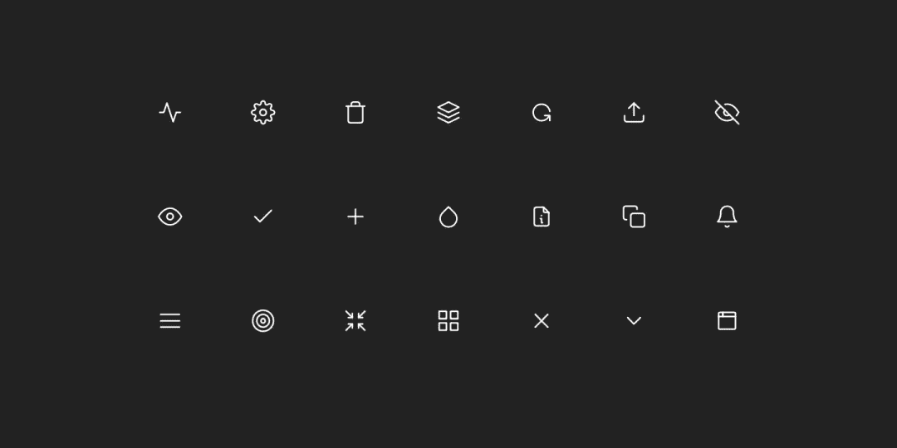

# 用 React 和 TypeScript 构建一个可重用的 SVG 图标库。

> 原文：<https://levelup.gitconnected.com/build-a-re-usable-svg-icon-library-with-react-and-typescript-4ab62e534905>



7 x 3 网格上的图标库表示。

可缩放矢量图形(SVG)通常用于 web 应用程序，因为它们天生具有在创建后进行扩充的能力。矢量图形以 XML 格式编写，与传统的光栅图像格式如`.png` 或`.jpg`相比，在质量、比例和压缩方面具有巨大优势。此外，我们可以用 CSS 和 JavaScript 以编程方式更改参数，以增加灵活性。你可以改变背景、线条颜色、线条粗细等属性，甚至可以定义连接方式和应用过渡。

此外，SVG 可以很容易地编码为数据 URIs，放在 HTML `img`标签中或与 CSS `url()`属性一起使用。当为了避免单独的 HTTP 请求而对 SVG 进行编码时，您将失去前面提到的所有好处。这种实现并不常见，但是，理解 SVG 可以在不同的环境中使用是很重要的。

谷歌的材料设计团队提供了一个设计一致、维护良好的图标库。它很容易使用，并且可以在 React 的`npm`库上找到。

```
$ npm i material-design-icons
```

根据应用程序的特殊性，库的覆盖范围可能是有限的。你可以添加另一个库，插入你从外部找到的图标——也许让你的设计团队创建一个，然后你从 figma 导入它。不可避免的是，你的应用程序将需要更多的图标…

# 要求

在创建可重用组件之前，我们需要分析三个关键的工程方面。

1.  **Props** —将通过我们所有图标传播的多个属性可以被提取为可选或必需的参数。这些参数应该在应用程序的上下文中提供一致的外观和感觉。
2.  **扩展** —在我们的库中进一步添加图标应该不费力，不需要对相关代码进行必要的更新。
3.  **开发者体验** —导入单个组件应该根据参数处理特定图标的包含。我们还可以引入自动完成功能来实现更快的定义。

通过很好地定义我们的需求，我们可以开始开发一个健壮的图标库。

# 履行

> 下面的实现不包括树摇动图标。如果你对这样的话题感兴趣，请联系或留言。

我们可以从定义全球通用的核心 CSS 样式开始。建议您将颜色和描边值存储在 CSS 中，以便清楚地分离关注点。

`stroke-linecap`和`stroke-linejoin`应该匹配，使视觉语言更加一致。

我们的 SVG 图标的内容将存储在一个函数对象中。每个函数都有一个唯一的名称，作为呈现目的的关键标识符。使用 TypeScript，我们可以使用`keyof typeof`操作符提取一个对象的所有键，并将它们定义为单个的`type`。

让我们构造一个容器元素来存放我们所有的孩子。

我们已经确定了几个广泛用于 SVG 图标的属性。值得注意的是，`width`和`height`属性使用同一个`size`属性。这是一个有意的设计选择，因为我们的库包含具有相同垂直和水平尺寸的正方形图标。你可以根据你的规格改变尺寸。

最后，我们添加了一个`name`属性，它控制要呈现的等值。由于`name`具有`IconNames`的类型，所以在编写代码时我们拥有完美的自动完成功能。

# 结论

您的项目可能需要我们定义的实现的不同需求或改进。您可以找到本项目中使用的参考资料的链接，以及下面几个令人惊叹的开源库。

希望这篇文章对你自己的 React 项目有所帮助！

# 参考

*   [优化 URIs 数据中的 SVGs】](https://codepen.io/tigt/post/optimizing-svgs-in-data-uris)
*   [材料-设计-图标-npm](https://www.npmjs.com/package/material-design-icons)
*   [材料图标指南-谷歌设计](https://google.github.io/material-design-icons/)
*   [stroke-linecap — SVG:可缩放矢量图形| MDN](https://developer.mozilla.org/en-US/docs/Web/SVG/Attribute/stroke-linecap)
*   [stroke-linejoin — SVG:可缩放矢量图形| MDN](https://developer.mozilla.org/en-US/docs/Web/SVG/Attribute/stroke-linejoin)

# 开源图标库

*   [Tabler 图标— 800+高度可定制的免费 SVG 图标](https://tablericons.com)
*   [Lucide——简单漂亮的开源图标](https://lucide.dev)

# 如果你觉得这篇文章有用👍🏻，请与他人分享，并给予一些掌声👏🏻在下面。

通过鼓掌，你可以帮助他人发现这些内容，并激发更多关于可访问性、设计、反应、JavaScript 和 TypeScript 的文章的写作！